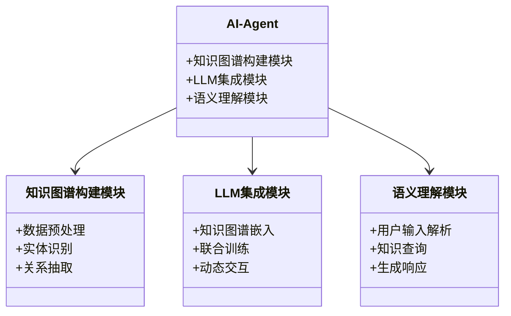

                 


# AI Agent 的知识图谱集成：增强 LLM 的结构化知识

## 关键词：AI Agent，知识图谱，LLM，结构化知识，增强学习

## 摘要：本文探讨如何将知识图谱集成到AI Agent中，以增强大型语言模型的结构化知识。通过背景介绍、核心概念分析、算法原理讲解、系统架构设计和项目实战，详细阐述知识图谱与LLM的结合方式及其在AI Agent中的应用，最终实现更智能、更高效的AI系统。

---

# 第一部分: AI Agent 的知识图谱集成概述

## 第1章: AI Agent 的基础知识

### 1.1 AI Agent 的定义与特点

#### 1.1.1 AI Agent 的定义
AI Agent（人工智能代理）是一种智能系统，能够感知环境、自主决策并执行任务，以实现特定目标。AI Agent 可以是软件程序、机器人或其他智能设备。

#### 1.1.2 AI Agent 的核心特点
- **自主性**：能够自主决策，无需外部干预。
- **反应性**：能够实时感知环境并做出响应。
- **目标导向**：所有行为都以实现特定目标为导向。
- **学习能力**：通过学习和经验提升性能。

#### 1.1.3 AI Agent 与传统AI的区别
AI Agent 是一种更通用的人工智能形式，能够适应多种任务和环境，而传统AI通常针对特定任务设计，缺乏灵活性和自主性。

### 1.2 知识图谱的基本概念

#### 1.2.1 知识图谱的定义
知识图谱是一种结构化的数据表示方式，由实体（节点）和关系（边）组成，描述了现实世界中的各种概念及其关联。

#### 1.2.2 知识图谱的构建过程
知识图谱的构建通常包括数据收集与预处理、实体识别与关系抽取、知识表示与存储三个阶段。

#### 1.2.3 知识图谱的应用场景
- **搜索引擎优化**：提升搜索结果的相关性和准确性。
- **智能推荐系统**：基于用户行为和物品属性进行推荐。
- **语义理解**：帮助模型理解上下文和实体关系。

### 1.3 LLM 的基本原理

#### 1.3.1 LLM 的定义
LLM（Large Language Model）是一种基于深度学习的自然语言处理模型，具有大规模参数和强大的语言理解能力。

#### 1.3.2 LLM 的核心算法
LLM 通常基于Transformer架构，通过自注意力机制和前馈网络处理输入文本，生成相关输出。

#### 1.3.3 LLM 的优势与挑战
优势：强大的语言理解和生成能力；挑战：训练成本高、需要大量数据、难以处理实时推理。

---

## 第2章: AI Agent 与知识图谱的结合

### 2.1 知识图谱在 AI Agent 中的作用

#### 2.1.1 知识图谱为 AI Agent 提供结构化知识
知识图谱为 AI Agent 提供结构化的实体和关系信息，帮助其更好地理解上下文。

#### 2.1.2 知识图谱增强 AI Agent 的推理能力
通过知识图谱的推理能力，AI Agent 可以进行更复杂的逻辑推理。

#### 2.1.3 知识图谱提升 AI Agent 的语义理解能力
知识图谱提供丰富的语义信息，帮助 AI Agent 更准确地理解用户意图。

### 2.2 LLM 与知识图谱的结合方式

#### 2.2.1 知识图谱作为 LLM 的外部知识库
知识图谱可以作为 LLM 的外部知识库，帮助其回答更具体的问题。

#### 2.2.2 知识图谱与 LLM 的联合训练
将知识图谱嵌入到 LLM 的训练过程中，提升模型的结构化知识理解能力。

#### 2.2.3 知识图谱与 LLM 的动态交互
通过实时查询知识图谱，LLM 可以动态获取最新知识，提升回答的准确性。

---

## 第3章: 知识图谱的构建与管理

### 3.1 知识图谱的构建流程

#### 3.1.1 数据收集与预处理
从多种数据源收集数据，并进行清洗和预处理。

#### 3.1.2 实体识别与关系抽取
使用自然语言处理技术识别实体和关系。

#### 3.1.3 知识图谱的存储与管理
将构建好的知识图谱存储在图数据库中，并进行版本控制和更新。

### 3.2 知识图谱的表示方法

#### 3.2.1 图表示学习的基本概念
图表示学习是将图结构数据转换为低维向量表示的方法。

#### 3.2.2 常见的图表示学习算法
- **TransE**：通过嵌入表示节点和边的关系。
- **TransH**：改进版的TransE，支持不同的关系类型。
- **GraphSAGE**：基于聚合的图表示学习方法。

#### 3.2.3 知识图谱的嵌入表示
通过嵌入技术将实体和关系表示为低维向量，便于模型处理。

### 3.3 知识图谱的可扩展性与灵活性

#### 3.3.1 知识图谱的可扩展性设计
设计灵活的知识图谱结构，便于后续扩展和维护。

#### 3.3.2 知识图谱的灵活性优化
通过模块化设计，提升知识图谱的灵活性和适应性。

#### 3.3.3 知识图谱的版本控制
采用版本控制技术，记录知识图谱的修改历史，便于回溯和管理。

---

# 第二部分: 知识图谱集成的算法原理

## 第4章: 知识图谱与 LLM 的联合训练

### 4.1 知识图谱与 LLM 的联合训练方法

#### 4.1.1 知识图谱嵌入表示
将知识图谱中的实体和关系表示为向量。

#### 4.1.2 LLM 的训练目标
通过联合训练，使 LLM 学习知识图谱中的结构化知识。

#### 4.1.3 联合训练的数学模型
$$\text{Loss} = \text{CE}(X, Y) + \lambda \cdot \text{KL}(P, Q)$$
其中，CE 是交叉熵损失，KL 是知识图谱嵌入的KL散度，$\lambda$ 是调节参数。

### 4.2 知识图谱与 LLM 的动态交互

#### 4.2.1 动态交互的机制
通过实时查询知识图谱，更新 LLM 的知识库。

#### 4.2.2 动态交互的实现
使用API接口，将知识图谱中的实体和关系信息动态注入到 LLM 中。

### 4.3 算法流程图


---

## 第5章: 知识图谱驱动的AI Agent 系统架构

### 5.1 系统架构设计

#### 5.1.1 系统模块划分
- **知识图谱构建模块**：负责知识图谱的构建和管理。
- **LLM 集成模块**：将知识图谱与 LLM 集成。
- **语义理解模块**：负责理解用户的输入并生成响应。

#### 5.1.2 系统功能设计



#### 5.1.3 系统架构图


---

## 第6章: 项目实战

### 6.1 环境安装

```bash
pip install py2neo
pip install transformers
pip install numpy
```

### 6.2 核心代码实现

#### 6.2.1 知识图谱构建代码

```python
from py2neo import Graph, Node, Relationship

# 连接知识图谱数据库
graph = Graph("http://localhost:7474", auth=("neo4j", "password"))

# 创建节点和关系
node1 = Node("Person", name="Alice")
node2 = Node("Person", name="Bob")
relationship = Relationship(node1, "knows", node2)

graph.create(node1)
graph.create(node2)
graph.create(relationship)
```

#### 6.2.2 LLM 集成代码

```python
from transformers import AutoTokenizer, AutoModelForCausalLM

# 加载预训练模型
tokenizer = AutoTokenizer.from_pretrained("gpt2")
model = AutoModelForCausalLM.from_pretrained("gpt2")

# 将知识图谱嵌入到模型中
def embed_knowledge_graph():
    pass

# 联合训练
def train():
    pass

# 动态交互
def dynamic_interaction():
    pass
```

### 6.3 实际案例分析

#### 6.3.1 案例背景
假设我们有一个医疗领域的知识图谱，包含疾病、症状、治疗方法等信息。

#### 6.3.2 代码实现与分析
通过查询知识图谱，LLM 可以生成更准确的医疗建议。

---

## 第三部分: 最佳实践

### 7.1 小结

### 7.2 注意事项
- 确保知识图谱的质量和准确性。
- 在联合训练过程中，注意模型的收敛性和训练效率。
- 动态交互时，确保系统的实时性和响应速度。

### 7.3 拓展阅读
- 知识图谱相关的论文和书籍。
- 最新的LLM研究和应用。

---

# 作者

作者：AI天才研究院/AI Genius Institute & 禅与计算机程序设计艺术 /Zen And The Art of Computer Programming

