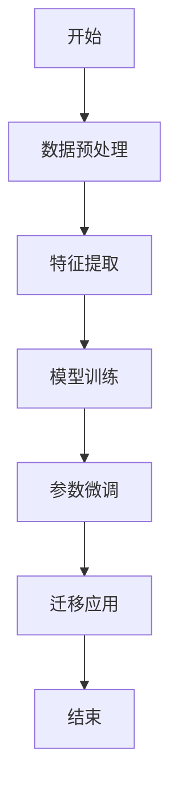
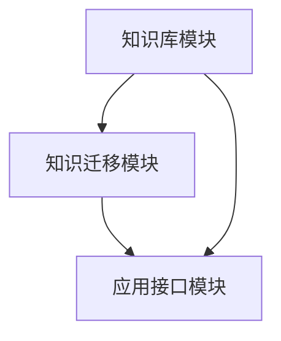
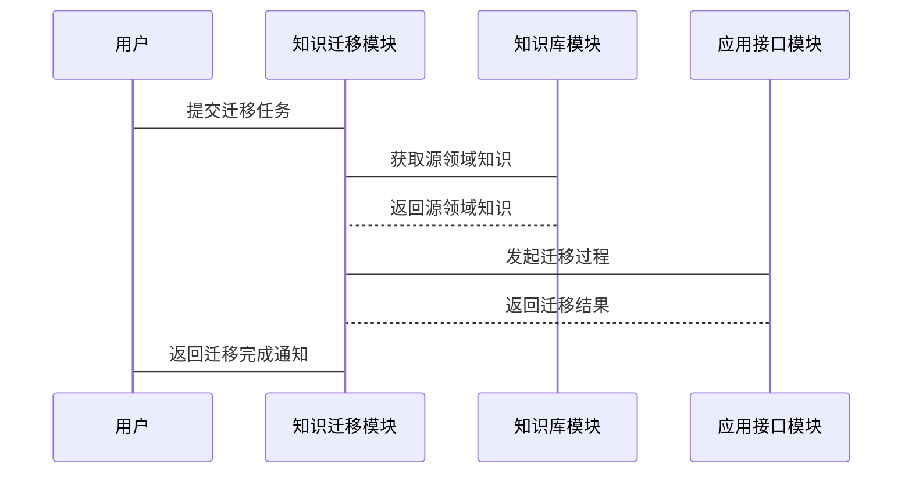

                 


# AI Agent 的知识迁移：跨领域应用 LLM 的能力

> 关键词：AI Agent, 知识迁移, 大语言模型, 跨领域应用, 机器学习

> 摘要：本文详细探讨了AI Agent在跨领域应用大语言模型（LLM）知识迁移的能力，从理论基础到算法实现，再到实际应用场景，全面分析了知识迁移的核心概念、算法原理、系统架构设计以及项目实战。通过具体案例分析，展示了如何利用LLM实现跨领域知识迁移，并提出了在实际应用中的最佳实践和优化建议。

---

## 第一部分: AI Agent与知识迁移概述

### 第1章: AI Agent与知识迁移的背景

#### 1.1 AI Agent的基本概念
- 1.1.1 AI Agent的定义与特点  
AI Agent（人工智能代理）是指能够感知环境、自主决策并执行任务的智能实体。其特点包括自主性、反应性、目标导向和社会能力。  

- 1.1.2 知识迁移的基本概念  
知识迁移是指将知识从一个领域或任务转移到另一个领域或任务的过程。它是实现AI Agent跨领域应用的核心能力。  

- 1.1.3 LLM在知识迁移中的作用  
大语言模型（LLM）通过强大的语言理解和生成能力，能够有效地支持知识迁移，为AI Agent提供跨领域的知识支持。

#### 1.2 知识迁移的背景与挑战
- 1.2.1 知识迁移的背景介绍  
随着AI技术的发展，跨领域应用的需求日益增长，知识迁移成为实现通用AI代理的关键技术。  

- 1.2.2 知识迁移的核心问题  
知识迁移的核心问题是如何将源领域的知识有效地应用于目标领域，同时克服领域间差异带来的挑战。  

- 1.2.3 LLM在知识迁移中的优势与劣势  
优势：LLM具有强大的语言理解和生成能力，能够处理复杂的知识表示和推理。劣势：LLM的知识迁移能力依赖于训练数据的质量和多样性。

#### 1.3 AI Agent与LLM的结合
- 1.3.1 AI Agent的核心能力  
AI Agent的核心能力包括感知能力、决策能力、执行能力和知识管理能力。  

- 1.3.2 LLM在AI Agent中的应用  
LLM为AI Agent提供了强大的自然语言处理能力，能够支持其在多种任务中的应用，如问答、对话生成和知识检索。  

- 1.3.3 知识迁移在AI Agent中的重要性  
知识迁移能够帮助AI Agent在不同领域之间灵活切换，实现通用化和智能化。

---

## 第二部分: 知识迁移的核心概念与理论

### 第2章: 知识迁移的核心概念与理论

#### 2.1 知识迁移的理论基础
- 2.1.1 迁移学习的基本原理  
迁移学习是指将从源任务学到的知识应用到目标任务的过程。其核心在于找到源任务和目标任务之间的共同特征。  

- 2.1.2 知识表示与推理  
知识表示是将知识以某种形式编码的过程，知识推理则是基于知识表示进行逻辑推理的能力。  

- 2.1.3 知识图谱与语义网络  
知识图谱是一种结构化的知识表示形式，语义网络则是通过语义关系连接节点的知识表示方式。

#### 2.2 LLM的知识表示与迁移能力
- 2.2.1 LLM的知识表示方式  
LLM通过大规模语言数据的训练，能够学习到丰富的语义表示和上下文信息。  

- 2.2.2 知识迁移的实现机制  
知识迁移的实现机制包括特征提取、领域适应和模型微调等方法。  

- 2.2.3 知识迁移的评估指标  
评估指标包括迁移准确率、迁移效率和迁移稳定性等。

#### 2.3 AI Agent中的知识迁移模型
- 2.3.1 知识迁移模型的分类  
知识迁移模型可以分为基于特征的迁移、基于参数的迁移和基于图的迁移等类型。  

- 2.3.2 知识迁移模型的优缺点  
优点：能够提高模型的泛化能力；缺点：迁移效果依赖于领域相似性和数据质量。  

- 2.3.3 知识迁移模型的实现流程  
实现流程包括数据预处理、特征提取、模型训练和迁移应用等步骤。

---

## 第三部分: LLM的知识迁移算法原理

### 第3章: LLM的知识迁移算法原理

#### 3.1 知识迁移的算法框架
- 3.1.1 知识迁移的通用算法框架  
通用算法框架包括数据预处理、模型训练和迁移应用三个阶段。  

- 3.1.2 基于LLM的知识迁移算法  
基于LLM的知识迁移算法包括预训练-微调（PreTRAIN-FINETUNE）和参数高效微调（Prompt-based Fine-Tuning）等方法。  

- 3.1.3 知识迁移算法的数学模型  
数学模型包括参数更新公式和损失函数优化等。

#### 3.2 知识迁移的实现细节
- 3.2.1 知识表示与编码  
知识表示与编码是将知识转化为模型可理解的形式，常用的方法包括词嵌入和句嵌入。  

- 3.2.2 知识匹配与对齐  
知识匹配与对齐是将源领域和目标领域的知识进行对应的过程，常用的方法包括基于相似度的匹配和基于图的匹配。  

- 3.2.3 知识融合与更新  
知识融合与更新是将源领域和目标领域的知识进行整合和优化的过程。

#### 3.3 算法流程图
- 3.3.1 知识迁移算法的流程图  


- 3.3.2 算法的步骤分解  
1. 数据预处理：对源领域和目标领域的数据进行清洗和标注。  
2. 特征提取：提取数据的关键特征并进行编码。  
3. 模型训练：基于源领域数据训练初始模型。  
4. 参数微调：在目标领域数据上进行参数微调。  
5. 迁移应用：将微调后的模型应用于目标领域任务。

- 3.3.3 算法的实现代码  
```python
import torch
from torch import nn
from torch.utils.data import DataLoader

# 定义模型
class迁移学习模型(nn.Module):
    def __init__(self, 预训练模型):
        super(迁移学习模型, self).__init__()
        self.bert = 预训练模型
        self.classifier = nn.Linear(bert.config.hidden_size, num_classes)

    def forward(self, input_ids, attention_mask):
        outputs = self.bert(input_ids=input_ids, attention_mask=attention_mask)
        pooled_output = outputs.last_hidden_state[:, 0, :]
        return self.classifier(pooled_output)

# 数据加载
train_loader = DataLoader(train_dataset, batch_size=32, shuffle=True)
val_loader = DataLoader(val_dataset, batch_size=32)

# 模型微调
model = 迁移学习模型(pretrained_model)
optimizer = torch.optim.AdamW(model.parameters(), lr=1e-5)
criterion = nn.CrossEntropyLoss()

# 训练循环
for epoch in range(num_epochs):
    model.train()
    for batch in train_loader:
        optimizer.zero_grad()
        outputs = model(batch['input_ids'], batch['attention_mask'])
        loss = criterion(outputs, batch['labels'])
        loss.backward()
        optimizer.step()
```

---

## 第四部分: 知识迁移的系统架构设计

### 第4章: 知识迁移的系统架构设计

#### 4.1 系统架构概述
- 4.1.1 系统功能模块划分  
系统功能模块包括知识库模块、知识迁移模块和应用接口模块。  

- 4.1.2 系统架构的优缺点  
优点：模块化设计，便于维护和扩展；缺点：需要协调多个模块的交互。  

- 4.1.3 系统架构的实现方式  
采用分层架构，包括数据层、逻辑层和应用层。

#### 4.2 系统功能设计
- 4.2.1 知识库  
知识库模块负责存储和管理知识表示，支持多种知识表示形式。  

- 4.2.2 知识迁移模块  
知识迁移模块负责实现知识的迁移和适应，支持多种迁移学习方法。  

- 4.2.3 应用接口模块  
应用接口模块负责与外部系统的交互，提供API服务。

#### 4.3 系统架构设计mermaid架构图


#### 4.4 系统接口设计
- 4.4.1 知识库接口  
提供知识存储、检索和更新的接口。  

- 4.4.2 知识迁移接口  
提供知识迁移的配置和执行接口。  

- 4.4.3 应用接口  
提供与外部系统的交互接口，支持API调用。

#### 4.5 系统交互mermaid序列图


---

## 第五部分: 项目实战

### 第5章: 项目实战

#### 5.1 环境配置
- 安装必要的库和工具，如PyTorch、Hugging Face库等。  

#### 5.2 系统核心实现源代码
```python
from transformers import AutoTokenizer, AutoModelForMaskedLM

# 初始化tokenizer和模型
tokenizer = AutoTokenizer.from_pretrained("bert-base-chinese")
model = AutoModelForMaskedLM.from_pretrained("bert-base-chinese")

# 定义知识迁移任务
class 知识迁移任务:
    def __init__(self, tokenizer, model):
        self.tokenizer = tokenizer
        self.model = model

    def preprocess(self, input_text):
        # 对输入文本进行预处理
        inputs = self.tokenizer.encode_plus(input_text, add_special_tokens=True, return_tensors='pt')
        return inputs

    def train(self, inputs, labels):
        # 微调模型
        outputs = self.model(**inputs, labels=labels)
        return outputs

# 示例应用
task = 知识迁移任务(tokenizer, model)
input_text = "这是一个[masked]句子。"
inputs = task.preprocess(input_text)
labels = torch.tensor([1], dtype=torch.long)  # 假设标签为1
outputs = task.train(inputs, labels)
print(outputs.loss.item())
```

#### 5.3 代码应用解读与分析
- 代码解读：上述代码实现了基于预训练模型的知识迁移任务，包括预处理和微调两个步骤。  
- 代码分析：通过预处理输入文本并微调模型，能够实现特定领域的知识迁移。

#### 5.4 实际案例分析和详细讲解剖析
- 案例分析：假设我们有一个法律咨询领域的知识迁移任务，可以通过上述代码实现从法律文本到医疗文本的知识迁移。  
- 详细讲解：通过对模型进行微调，能够使其适应新的领域，并提高其在目标领域的表现。

#### 5.5 项目小结
- 知识迁移的关键在于数据预处理和模型微调。  
- 在实际应用中，需要根据具体任务选择合适的迁移策略。

---

## 第六部分: 总结与展望

### 第6章: 总结与展望

#### 6.1 总结
- 本文详细探讨了AI Agent在跨领域应用大语言模型知识迁移的能力，从理论到实践进行了全面分析。  
- 知识迁移是实现AI Agent通用化和智能化的核心技术，具有广阔的应用前景。

#### 6.2 展望
- 未来的研究方向包括更高效的迁移学习算法、更智能的知识表示方法以及更广泛的应用场景。  
- 随着大语言模型的不断发展，知识迁移技术将在更多领域中发挥重要作用。

---

## 作者：AI天才研究院/AI Genius Institute & 禅与计算机程序设计艺术 /Zen And The Art of Computer Programming

