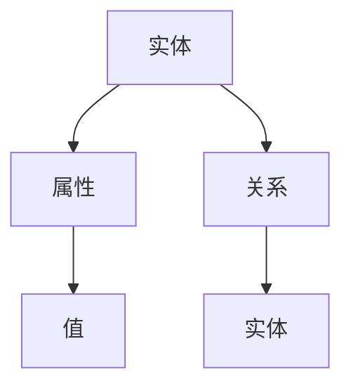
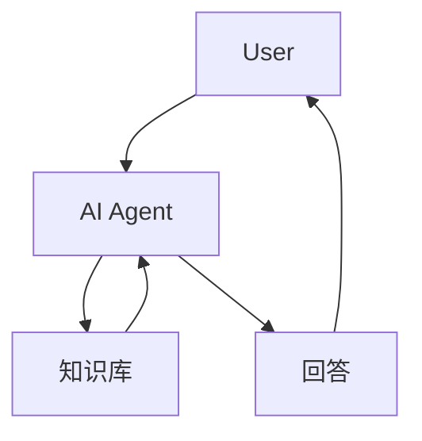
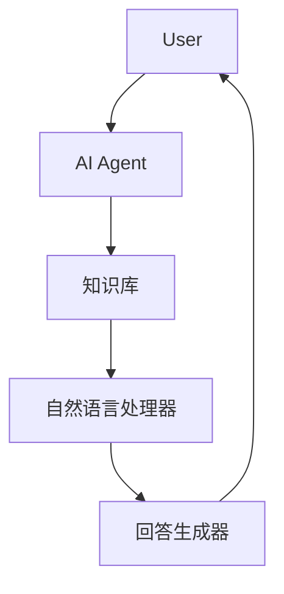
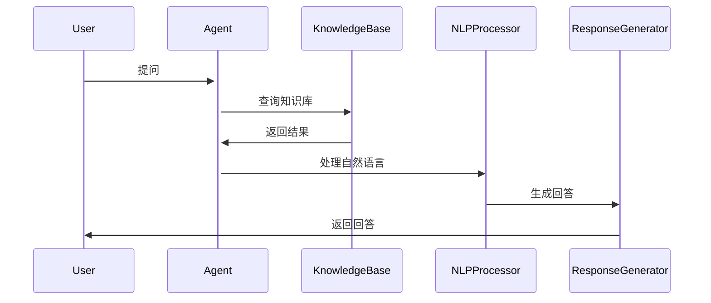

                 


# AI Agent 的知识问答：构建基于 LLM 的智能问答系统

> 关键词：AI Agent，LLM，知识问答系统，智能问答，大语言模型

> 摘要：本文详细探讨了AI Agent与知识问答系统结合构建基于大语言模型（LLM）的智能问答系统。首先介绍了AI Agent和LLM的基本概念、原理和应用场景，接着分析了知识问答系统的构建过程，包括算法原理、系统架构设计和项目实战。通过具体案例展示了如何使用Python代码实现智能问答系统，并提供了系统优化和扩展建议。最后总结了构建基于LLM的智能问答系统的最佳实践和未来发展方向。

---

## 第一部分: AI Agent 的知识问答系统背景介绍

### 第1章: AI Agent 的基本概念

#### 1.1 AI Agent 的定义与特点

##### 1.1.1 AI Agent 的定义
AI Agent（人工智能代理）是指能够感知环境、自主决策并执行任务的智能实体。它通过与环境交互，利用传感器获取信息，并通过执行器采取行动，以实现特定目标。

##### 1.1.2 AI Agent 的核心特点
1. **自主性**：AI Agent能够自主决策，无需外部干预。
2. **反应性**：能够实时感知环境变化并做出反应。
3. **目标导向性**：基于目标进行决策和行动。
4. **社会性**：能够与其他AI Agent或人类进行交互协作。

##### 1.1.3 AI Agent 的分类与应用场景
1. **简单反射型AI Agent**：基于规则的简单决策，如自动回复机器人。
2. **基于模型的AI Agent**：使用内部模型进行决策，如自动驾驶汽车。
3. **目标驱动型AI Agent**：以目标为导向，如智能客服系统。

#### 1.2 AI Agent 的应用场景
- 智能客服：提供24/7的客户支持。
- 自动交易：在金融市场上进行自动化的交易决策。
- 智能家居：控制家庭设备，提供便捷的生活体验。

### 第2章: 大语言模型（LLM）的背景

#### 2.1 大语言模型的定义与特点
1. **定义**：大语言模型是一种基于深度学习的自然语言处理模型，能够理解和生成人类语言。
2. **特点**：
   - 大规模训练数据：通常使用海量数据进行训练。
   - 自然语言理解与生成：具备强大的理解和生成能力。
   - 模型可扩展性：支持多种任务和应用场景。

#### 2.2 大语言模型与传统NLP模型的区别
| 特性           | 传统NLP模型           | 大语言模型（LLM）         |
|----------------|----------------------|--------------------------|
| 数据量         | 较小，通常百万级别     | 极大，可达万亿级别       |
| 任务支持       | 专注于单一任务         | 支持多种任务和场景       |
| 模型复杂度     | 较低                  | 极高，通常使用Transformer架构 |

#### 2.3 LLM 的应用场景
- 智能问答系统：提供自然语言理解与生成服务。
- 机器翻译：支持多种语言之间的实时翻译。
- 文本生成：用于生成新闻、文章等。

### 第3章: 知识问答系统的定义与应用场景

#### 3.1 知识问答系统的定义
知识问答系统是一种基于知识库的问答系统，能够根据用户的问题，从知识库中检索相关信息并生成回答。

#### 3.2 知识问答系统的应用场景
- 智能客服：提供基于知识库的问答服务。
- 教育辅助：帮助学生解答学习中的疑问。
- 企业内部问答：提供内部政策、流程的问答服务。

#### 3.3 知识问答系统的核心挑战
- 知识库构建：需要高质量的知识库，涵盖广泛领域。
- 精准检索：如何高效准确地检索相关信息。
- 自然语言理解：如何理解用户的意图并生成自然的回答。

---

## 第二部分: AI Agent 与知识问答系统的核心概念与联系

### 第4章: AI Agent 与知识问答系统的概念原理

#### 4.1 AI Agent 的知识表

##### 4.1.1 知识表的定义
知识表是一种结构化的知识表示方式，通常以表格形式存储，包含实体及其属性和关系。

##### 4.1.2 知识表的作用
1. **数据存储**：存储结构化的知识数据。
2. **数据检索**：支持基于关键词或条件的快速检索。
3. **数据管理**：支持数据的增删改查操作。

#### 4.2 AI Agent 与知识问答系统的关系

##### 4.2.1 知识问答系统的知识表结构


##### 4.2.2 AI Agent 与知识问答系统的交互流程


---

## 第三部分: AI Agent 知识问答系统的算法原理

### 第5章: 大语言模型的知识问答系统算法原理

#### 5.1 大语言模型的训练过程

##### 5.1.1 监督微调
- **定义**：在预训练好的大语言模型基础上，使用特定任务的数据进行微调。
- **流程**：
  1. 数据准备：收集并标注问答数据。
  2. 模型加载：加载预训练好的模型。
  3. 微调训练：使用问答数据进行微调训练。

##### 5.1.2 强化学习
- **定义**：通过强化学习策略，进一步优化模型的问答能力。
- **流程**：
  1. 定义奖励函数：根据回答的准确性和相关性给予奖励。
  2. 模型训练：通过与环境交互，不断优化回答策略。

#### 5.2 对话生成机制

##### 5.2.1 基于概率的生成方法
- **定义**：基于概率模型生成回答，通常使用贪心算法或采样方法。
- **公式**：
  $$ P(y|x) = \frac{P(y_1,y_2,...,y_n|x)}{P(y_{n-1}|y_1,y_2,...,y_{n-2},x)} $$

---

## 第四部分: AI Agent 知识问答系统的系统分析与架构设计

### 第6章: 系统分析与架构设计

#### 6.1 系统功能模块

##### 6.1.1 知识库构建模块
- **功能**：负责知识库的创建、更新和管理。
- **流程**：
  1. 数据采集：从多种来源收集数据。
  2. 数据清洗：去除冗余和错误数据。
  3. 数据标注：对数据进行分类和标注。
  4. 数据存储：将数据存储到知识库中。

##### 6.1.2 对话管理模块
- **功能**：管理用户与AI Agent之间的对话流程。
- **流程**：
  1. 用户输入：接收用户的提问。
  2. 意图识别：识别用户的意图和需求。
  3. 知识检索：从知识库中检索相关信息。
  4. 对话生成：生成自然的回复。

#### 6.2 系统架构设计

##### 6.2.1 系统架构图


##### 6.2.2 系统交互流程


---

## 第五部分: AI Agent 知识问答系统的项目实战

### 第7章: 项目实战

#### 7.1 环境安装

##### 7.1.1 安装Python
- 使用Anaconda或虚拟环境管理Python版本。

##### 7.1.2 安装依赖库
```bash
pip install transformers torch numpy
```

#### 7.2 系统核心实现源代码

##### 7.2.1 知识库构建
```python
import json

class KnowledgeBase:
    def __init__(self):
        self.data = {}

    def add_entry(self, key, value):
        self.data[key] = value

    def get_entry(self, key):
        return self.data.get(key, "")
```

##### 7.2.2 对话管理模块
```python
from transformers import AutoModelForSeq2SeqLM, AutoTokenizer

class DialogManager:
    def __init__(self, model_name):
        self.tokenizer = AutoTokenizer.from_pretrained(model_name)
        self.model = AutoModelForSeq2SeqLM.from_pretrained(model_name)

    def generate_response(self, input_text):
        inputs = self.tokenizer(input_text, return_tensors="pt")
        outputs = self.model.generate(inputs.input_ids, max_length=50)
        return self.tokenizer.decode(outputs[0], skip_special_tokens=True)
```

#### 7.3 代码应用解读与分析

##### 7.3.1 知识库构建模块
- **功能**：将结构化的知识存储到知识库中，支持快速查询。
- **优势**：数据结构化存储，便于后续的检索和分析。

##### 7.3.2 对话生成模块
- **功能**：根据用户输入生成自然的回复。
- **优势**：使用预训练的大语言模型，生成高质量的回答。

#### 7.4 实际案例分析

##### 7.4.1 案例介绍
- **案例名称**：智能医疗问答系统
- **案例目标**：为用户提供医疗相关的问答服务。
- **案例实现**：构建医疗知识库，集成对话管理模块，提供智能问答服务。

#### 7.5 项目小结

##### 7.5.1 项目总结
- **成功经验**：通过模块化设计，实现了高效的问答系统。
- **不足之处**：知识库的构建需要持续更新和优化。

##### 7.5.2 项目优化建议
- **知识库优化**：引入外部知识图谱，丰富知识内容。
- **模型优化**：使用更先进的大语言模型，提升回答质量。

---

## 第六部分: AI Agent 知识问答系统的最佳实践

### 第8章: 最佳实践

#### 8.1 系统优化建议

##### 8.1.1 知识库优化
- **数据清洗**：定期清理无效数据。
- **数据扩展**：引入多源数据，丰富知识内容。

##### 8.1.2 对话优化
- **模型微调**：针对特定领域进行模型微调。
- **对话历史记录**：记录对话历史，提升回答的相关性。

#### 8.2 注意事项

##### 8.2.1 数据隐私
- **数据加密**：保护用户隐私，防止数据泄露。
- **合规性检查**：确保数据使用符合相关法律法规。

##### 8.2.2 系统稳定性
- **容错设计**：设计完善的错误处理机制。
- **负载均衡**：确保系统在高并发情况下的稳定性。

#### 8.3 拓展阅读

##### 8.3.1 推荐书籍
- 《深度学习》——Ian Goodfellow
- 《自然语言处理入门》——Nalabari

##### 8.3.2 推荐博客
- [Hugging Face 人工智能博客](https://huggingface.co/blog)
- [Towards Data Science](https://towardsdatascience.com)

---

## 第七部分: 总结

### 9. 总结

通过本文的详细讲解，我们了解了AI Agent与知识问答系统结合构建基于大语言模型（LLM）的智能问答系统的整个过程。从背景介绍到算法原理，从系统设计到项目实战，我们逐步深入探讨了智能问答系统的构建方法。未来，随着大语言模型技术的不断进步，智能问答系统将更加智能化和个性化，为人类带来更高效便捷的服务。

---

## 作者信息

作者：AI天才研究院/AI Genius Institute & 禅与计算机程序设计艺术 /Zen And The Art of Computer Programming

---

**注**：由于篇幅限制，上述内容为简要示例，实际文章需要进一步扩展每个章节的内容，加入更多细节和案例分析。

