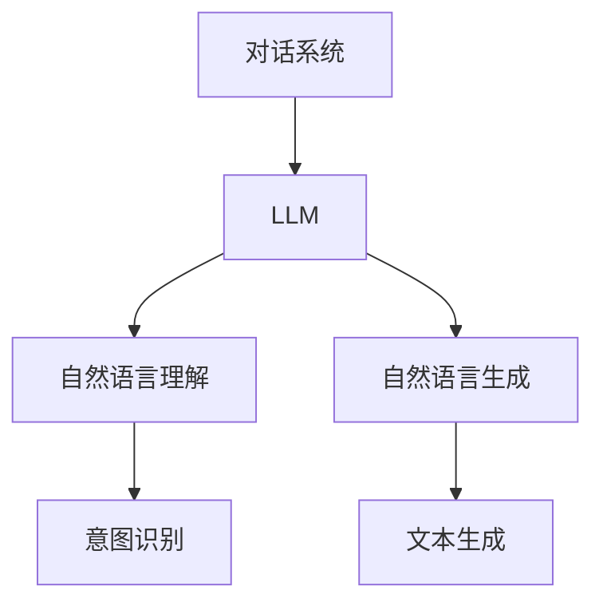
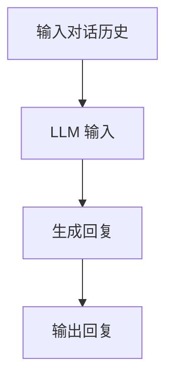
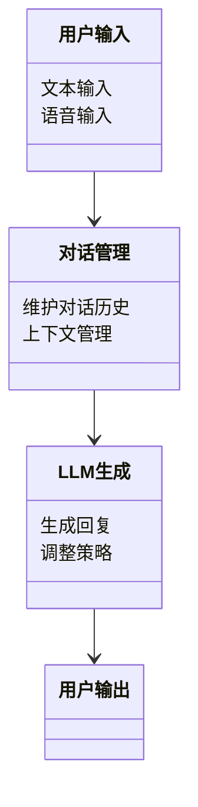
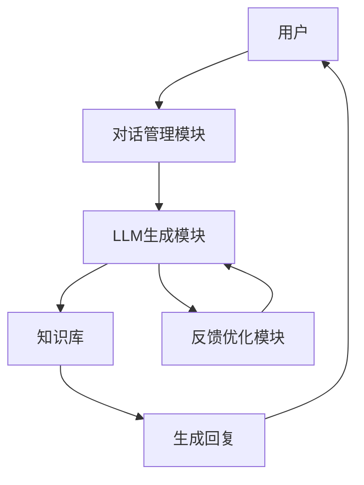
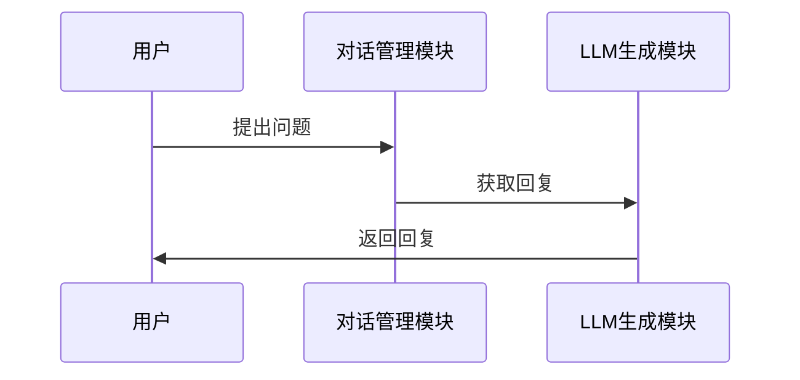

                 


# AI Agent 的自然语言交互：LLM 对话系统设计

## 关键词：AI Agent, 自然语言交互, LLM, 对话系统, 生成模型

## 摘要：本文深入探讨了AI Agent在自然语言交互中的应用，重点分析了基于大语言模型（LLM）的对话系统设计。文章从背景介绍、核心概念、算法原理、系统架构到项目实战，全面解析了LLM对话系统的实现细节，旨在为读者提供从理论到实践的完整指导。

---

# 第一部分: AI Agent 的自然语言交互基础

# 第1章: AI Agent 与自然语言交互概述

## 1.1 问题背景与问题描述
### 1.1.1 AI Agent 的定义与特点
AI Agent（智能代理）是指能够感知环境、自主决策并执行任务的智能体。其特点包括主动性、反应性、社会性和目标导向性。在自然语言交互中，AI Agent需要能够理解用户意图并生成自然流畅的回复。

### 1.1.2 自然语言交互的核心问题
自然语言交互的核心问题在于如何实现语义理解与生成。LLM（大语言模型）通过大规模数据训练，能够捕捉语言的上下文信息，从而在对话中生成连贯且合理的回复。

### 1.1.3 LLM 对话系统的应用场景
LLM对话系统广泛应用于客服、教育、医疗、金融等领域。例如，在客服场景中，AI Agent可以自动响应用户的咨询，提高服务效率。

## 1.2 问题解决与边界定义
### 1.2.1 自然语言交互的核心挑战
- 语义理解的准确性：如何准确识别用户的意图。
- 对话连贯性：如何保持上下文的一致性。
- 多轮对话的复杂性：如何处理长对话中的信息积累。

### 1.2.2 LLM 对话系统的边界与外延
- 边界：对话系统仅处理语言交互，不涉及非语言信息（如图像、视频）。
- 外延：结合其他技术（如语音识别、情感分析）可以扩展对话系统的功能。

### 1.2.3 AI Agent 的功能与能力结构
AI Agent的功能包括意图识别、信息检索、对话生成和反馈优化。能力结构则涉及语言理解、知识库管理、推理能力和学习能力。

## 1.3 概念结构与核心要素
### 1.3.1 对话系统的核心要素
- 用户输入：对话的起点，包括文本、语音等。
- 系统响应：基于LLM生成的回复。
- 上下文管理：维护对话的历史信息，确保连贯性。

### 1.3.2 LLM 在对话系统中的角色
LLM作为对话生成的核心模块，负责理解和生成自然语言文本。其作用包括语义分析、回复生成和对话优化。

### 1.3.3 自然语言交互的流程与机制
1. 用户输入：用户提出问题或需求。
2. 语义理解：系统解析用户意图。
3. 对话生成：LLM基于上下文生成回复。
4. 反馈优化：根据用户反馈调整生成策略。

## 1.4 本章小结
本章介绍了AI Agent和自然语言交互的基本概念，分析了LLM对话系统的核心问题和应用场景。通过明确边界和外延，为后续章节奠定了理论基础。

---

# 第二部分: LLM 对话系统的核心概念与联系

# 第2章: LLM 对话系统的原理与机制

## 2.1 核心概念原理
### 2.1.1 大语言模型的训练与推理
LLM通过监督学习和强化学习训练，掌握语言的规律和语义信息。推理过程基于概率分布，生成最可能的回复。

### 2.1.2 对话系统的生成机制
对话生成基于概率模型，通过解码器生成回复文本。生成过程考虑上下文和用户意图，确保回复的合理性和连贯性。

### 2.1.3 自然语言理解与生成的结合
NLU（自然语言理解）负责解析用户意图，NLG（自然语言生成）负责生成回复。两者的结合使对话系统能够实现有效的交互。

## 2.2 核心概念对比分析
### 2.2.1 对话系统与传统NLP 的对比
| 特性       | 对话系统                   | 传统NLP                 |
|------------|---------------------------|-------------------------|
| 任务类型   | 实时交互                   | 离线处理                |
| 数据需求   | 需要对话历史               | 单独文本                |
| 响应速度   | 快速响应                   | 延迟较高                |

### 2.2.2 LLM 与其他生成模型的对比
| 模型       | GPT                        | Transformer             | RNN                     |
|------------|---------------------------|-------------------------|-------------------------|
| 结构特点   | 基于栈式解码               | 基于自注意力机制         | 基于序列解码            |
| 生成效果   | 高质量生成                 | 平衡性能与质量           | 生成速度较快           |

### 2.2.3 不同对话系统架构的对比
| 架构       | 基于规则的对话系统         | 基于生成模型的对话系统   |
|------------|---------------------------|-------------------------|
| 优势       | 实现简单，易于控制         | 高灵活性，生成多样回复   |
| 劣势       | 对复杂场景处理能力有限     | 生成质量不稳定           |

## 2.3 实体关系图


## 2.4 本章小结
本章通过对比分析，详细阐述了LLM对话系统的核心概念和原理。通过概念对比和实体关系图，帮助读者理解不同技术之间的联系和区别。

---

# 第三部分: LLM 对话系统的算法原理

# 第3章: 对话系统的算法原理

## 3.1 模型结构与训练过程
### 3.1.1 LLM 的基本结构
LLM通常采用Transformer架构，包含编码器和解码器。编码器处理输入文本，解码器生成回复。

### 3.1.2 对话系统的训练目标
训练目标包括优化损失函数和生成概率最大化。损失函数通常采用交叉熵损失，公式如下：
$$ \mathcal{L} = -\sum_{i=1}^{n} \log p(y_i|x) $$

### 3.1.3 基于LLM 的对话生成算法
生成算法包括贪心搜索和采样方法。贪心搜索选择概率最高的词，采样方法生成多样回复。

## 3.2 对话系统的推理机制
### 3.2.1 基于概率的生成方法
生成回复基于概率分布，公式为：
$$ P(y|x) = \frac{p(y|x)}{\sum_{y'} p(y'|x)} $$

### 3.2.2 基于规则的生成方法
通过预定义规则筛选生成内容，确保回复符合语义和语法规范。

### 3.2.3 基于强化学习的生成方法
使用强化学习优化生成策略，通过奖励机制提升生成质量。

## 3.3 算法流程图


## 3.4 本章小结
本章详细讲解了LLM对话系统的算法原理，从模型结构到训练过程，再到推理机制，帮助读者理解对话生成的数学模型和实现细节。

---

# 第四部分: 系统分析与架构设计方案

# 第4章: 系统分析与架构设计

## 4.1 问题场景介绍
假设我们设计一个智能客服对话系统，用户通过自然语言提问，AI Agent通过LLM生成回复，解决用户的问题。

## 4.2 系统功能设计
### 4.2.1 领域模型


### 4.2.2 系统架构设计


### 4.2.3 系统接口设计
- 输入接口：用户输入文本或语音。
- 输出接口：生成回复文本或语音。

### 4.2.4 系统交互流程


## 4.3 本章小结
本章通过系统分析和架构设计，展示了LLM对话系统的实现细节。从问题场景到系统设计，为后续的项目实战奠定了基础。

---

# 第五部分: 项目实战

# 第5章: 项目实战

## 5.1 环境安装
安装Python、TensorFlow和Hugging Face库：
```bash
pip install python tensorflow transformers
```

## 5.2 核心代码实现
### 5.2.1 对话管理模块
```python
class DialogManager:
    def __init__(self):
        self.history = []
    
    def add_to_history(self, text):
        self.history.append(text)
    
    def get_context(self):
        return self.history
```

### 5.2.2 LLM生成模块
```python
from transformers import GPT2LMHeadModel, GPT2Tokenizer

class LLMGenerator:
    def __init__(self, model_name):
        self.tokenizer = GPT2Tokenizer.from_pretrained(model_name)
        self.model = GPT2LMHeadModel.from_pretrained(model_name)
    
    def generate_response(self, context):
        inputs = self.tokenizer(context, return_tensors="pt")
        outputs = self.model.generate(inputs.input_ids, max_length=50)
        response = self.tokenizer.decode(outputs[0], skip_special_tokens=True)
        return response
```

## 5.3 案例分析
案例：用户询问“如何解决Python中的内存泄漏问题？”
系统回复：“可以使用调试工具如memory_profiler来检测和修复内存泄漏。”

## 5.4 项目小结
通过项目实战，我们实现了基于LLM的对话系统，验证了理论设计的可行性。代码实现了对话管理与生成模块，展示了系统的实际应用。

---

# 第六部分: 最佳实践与总结

## 6.1 小结
本文从背景介绍到项目实战，全面解析了AI Agent的自然语言交互设计。通过理论与实践结合，帮助读者理解LLM对话系统的实现细节。

## 6.2 注意事项
- 数据隐私：确保用户数据的安全性。
- 系统优化：提升生成速度和回复质量。
- 模型调优：通过微调优化LLM性能。

## 6.3 拓展阅读
- 《Deep Learning》—— Ian Goodfellow
- 《Transformers: A Tutorial》—— Francois Chollet

---

# 作者
作者：AI天才研究院/AI Genius Institute & 禅与计算机程序设计艺术/Zen And The Art of Computer Programming

---

以上是文章的完整目录和内容框架，涵盖了从基础理论到实践应用的各个方面，帮助读者全面理解AI Agent的自然语言交互设计。

