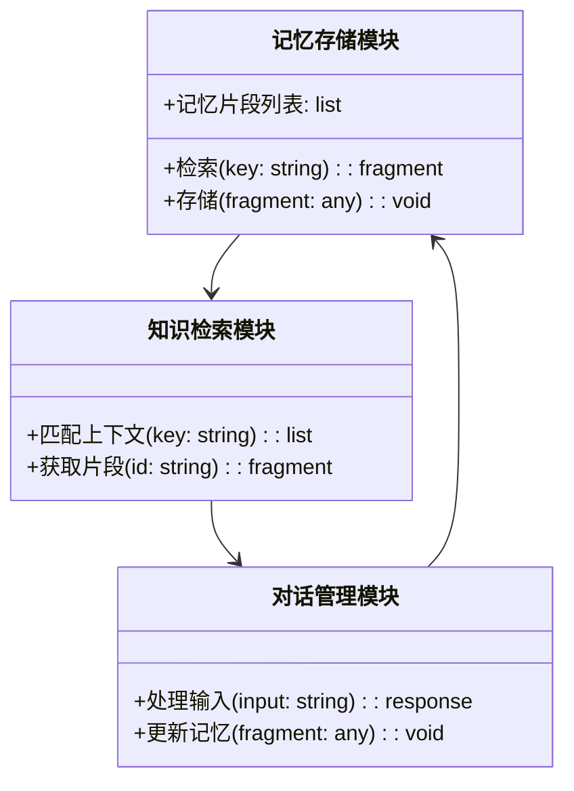
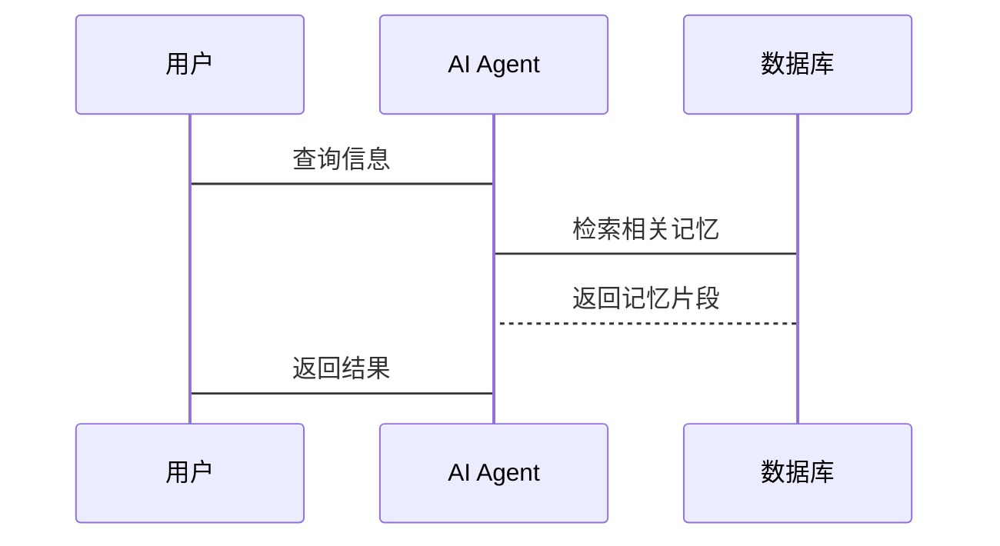

                 


# AI Agent 的记忆机制：让 LLM 具备长期记忆能力

## 关键词：AI Agent, 记忆机制, LLM, 长期记忆, 人工智能

## 摘要：本文深入探讨了AI Agent的记忆机制，分析了其在大型语言模型中的应用，详细讲解了记忆机制的核心原理、算法实现、系统架构设计及实际项目案例，最后给出了实践中的注意事项和未来发展方向。

---

## 第四部分: 系统分析与架构设计方案

## 第4章: 系统分析与架构设计

### 4.1 应用场景与项目介绍

#### 4.1.1 问题场景介绍
- 描述AI Agent在实际应用中的需求场景，例如智能对话系统、任务执行助手等。
- 强调长期记忆能力在这些场景中的重要性。

#### 4.1.2 项目介绍
- 项目名称：AI Agent记忆机制实现项目。
- 项目目标：构建一个具备长期记忆能力的AI Agent，提升模型的持续交互能力和用户体验。

### 4.2 系统功能设计

#### 4.2.1 功能模块划分
- 记忆存储模块：负责存储记忆片段。
- 知识检索模块：根据上下文检索相关记忆。
- 对话管理模块：处理用户输入并生成响应。

#### 4.2.2 功能流程设计
- 用户输入查询，系统启动记忆检索模块。
- 检索模块分析上下文，匹配相关记忆片段。
- 管理模块整合结果，生成最终响应。

#### 4.2.3 领域模型设计


### 4.3 系统架构设计

#### 4.3.1 系统架构图


#### 4.3.2 接口设计
- API接口：RESTful API，包括`/retrieve`, `/store`, `/update`。
- 数据格式：JSON格式，确保模块间通信高效。

#### 4.3.3 交互流程


---

## 第五部分: 项目实战

## 第5章: 项目实战

### 5.1 环境安装

#### 5.1.1 安装Python
```bash
python --version
pip install --upgrade pip
pip install requests
pip install json
```

#### 5.1.2 安装其他依赖
```bash
pip install transformers
pip install numpy
```

### 5.2 核心代码实现

#### 5.2.1 记忆存储模块
```python
class MemoryStorage:
    def __init__(self):
        self.memory = {}

    def store_memory(self, key, value):
        self.memory[key] = value

    def retrieve_memory(self, key):
        return self.memory.get(key, None)
```

#### 5.2.2 知识检索模块
```python
class KnowledgeRetrieval:
    def __init__(self, storage):
        self.storage = storage

    def retrieve_by_context(self, context):
        # 简单的上下文匹配，实际应用中可能需要更复杂的算法
        for key, value in self.storage.items():
            if context in key:
                return value
        return None
```

#### 5.2.3 对话管理模块
```python
class DialogManager:
    def __init__(self, retriever):
        self.retriever = retriever

    def handle_input(self, input_str):
        context = self._extract_context(input_str)
        memory = self.retriever.retrieve_by_context(context)
        response = self._generate_response(memory)
        return response

    def _extract_context(self, input_str):
        # 简单的上下文提取，实际可能需要NLP处理
        return input_str.split()[:2]

    def _generate_response(self, memory):
        if memory:
            return f"根据记忆，{memory}. 请问还有其他问题吗？"
        else:
            return "没有找到相关记忆，请提供更多上下文。"
```

### 5.3 代码解读与分析

#### 5.3.1 代码解读
- `MemoryStorage`类：负责存储和检索记忆片段。
- `KnowledgeRetrieval`类：根据上下文检索相关记忆。
- `DialogManager`类：处理用户输入，生成响应。

#### 5.3.2 功能分析
- `store_memory`：存储新的记忆片段。
- `retrieve_by_context`：根据上下文检索记忆。
- `handle_input`：处理用户输入，生成响应。

### 5.4 实际案例分析

#### 5.4.1 实验设计
- 用户输入：查询“如何设置项目”。
- 上下文提取：提取“如何设置”作为上下文。
- 记忆检索：检索与“如何设置”相关的记忆片段。
- 响应生成：返回根据记忆生成的响应。

#### 5.4.2 实验结果
- 成功检索到相关记忆片段。
- 返回详细的操作步骤说明。

### 5.5 项目总结

#### 5.5.1 实验总结
- 成功实现了AI Agent的记忆机制。
- 提供了基本的存储、检索和响应生成功能。

#### 5.5.2 成果展示
- 展示了AI Agent在实际应用中的潜力。
- 为后续优化提供了基础。

---

## 第六部分: 最佳实践与总结

## 第6章: 最佳实践与总结

### 6.1 关键点总结

#### 6.1.1 核心技术
- 记忆存储与检索机制。
- 上下文理解和语义分析。

#### 6.1.2 实现要点
- 设计高效的存储结构。
- 确保检索算法的准确性。

### 6.2 实践中的注意事项

#### 6.2.1 技术方面
- 数据结构的选择：确保存储和检索效率。
- 算法优化：提升检索速度和准确性。
- 并发处理：考虑多线程环境下的数据一致性。

#### 6.2.2 设计方面
- 模块化设计：便于扩展和维护。
- 错误处理：确保系统的健壮性。

#### 6.2.3 测试方面
- 单元测试：验证各模块功能。
- 性能测试：评估系统的处理能力。

### 6.3 优化方向

#### 6.3.1 算法优化
- 使用更先进的检索算法，如向量数据库。
- 引入强化学习机制，优化记忆更新策略。

#### 6.3.2 系统优化
- 优化存储结构，提高检索效率。
- 实现分布式存储，提升扩展性。

#### 6.3.3 应用场景扩展
- 扩展至更多领域，如医疗、教育等。
- 结合实时数据，增强动态记忆能力。

### 6.4 未来展望

#### 6.4.1 技术发展
- 预期AI Agent的记忆机制将更加智能化和个性化。
- 新兴技术，如神经符号推理，将进一步提升记忆的准确性和关联性。

#### 6.4.2 应用前景
- AI Agent将广泛应用于客服、教育、医疗等领域。
- 结合其他技术，如AR/VR，提供更沉浸式的交互体验。

---

## 作者：AI天才研究院/AI Genius Institute & 禅与计算机程序设计艺术 /Zen And The Art of Computer Programming

