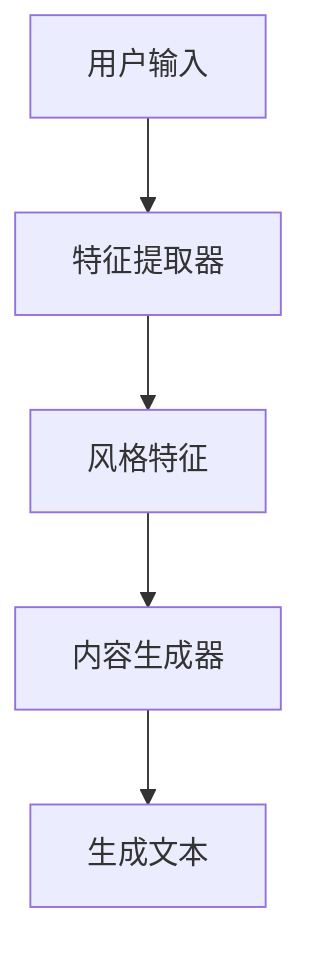
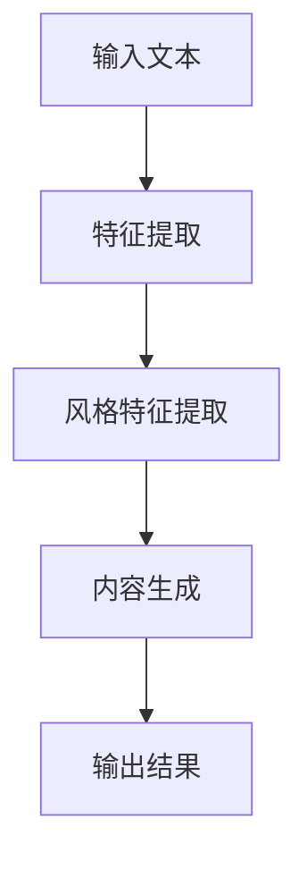

                 


# AI Agent 的风格迁移：让 LLM 模仿不同的写作风格

## 关键词：AI Agent, LLM, 风格迁移, 写作风格, 语言模型, 模仿写作, 生成式AI

## 摘要：  
本文深入探讨了AI Agent如何通过风格迁移技术让大语言模型（LLM）模仿不同的写作风格。我们从AI Agent与风格迁移的基本概念入手，分析了风格迁移的核心原理，详细讲解了基于Transformer的算法流程，并通过系统架构设计和实际案例展示了如何实现风格迁移。本文还提供了丰富的代码示例和数学模型，帮助读者全面理解AI Agent在风格迁移中的应用。

---

## 第一部分: AI Agent与风格迁移概述

### 第1章: AI Agent与风格迁移的背景介绍

#### 1.1 AI Agent的基本概念
- **1.1.1 AI Agent的定义与特点**  
  AI Agent（人工智能代理）是指能够感知环境、执行任务并做出决策的智能实体。它具备自主性、反应性、目标导向性和社会性等特点，能够通过学习和推理完成复杂任务。

- **1.1.2 AI Agent的核心功能与应用场景**  
  AI Agent的核心功能包括信息处理、决策制定和任务执行。它广泛应用于自然语言处理、智能推荐、自动驾驶等领域。

- **1.1.3 AI Agent与人类写作的对比**  
  人类写作依赖主观创意和情感表达，而AI Agent则通过算法生成内容，注重逻辑性和结构化。

#### 1.2 风格迁移的核心概念
- **1.2.1 风格迁移的定义与实现原理**  
  风格迁移是指将一种写作风格迁移到另一种风格的过程，通常通过特征提取和内容生成实现。

- **1.2.2 风格迁移的关键技术与挑战**  
  风格迁移的关键技术包括特征提取、风格匹配和内容生成。挑战在于保持内容连贯性的同时实现风格转换。

- **1.2.3 风格迁移的分类与应用场景**  
  风格迁移可以分为文本风格迁移、视觉风格迁移等。应用场景包括文学创作、广告文案生成等。

#### 1.3 LLM与风格迁移的结合
- **1.3.1 LLM的基本原理与优势**  
  LLM（大语言模型）通过大量数据训练，具备强大的文本生成能力，能够捕捉复杂的语言模式。

- **1.3.2 LLM在风格迁移中的独特价值**  
  LLM能够通过参数调整实现风格迁移，同时保持生成内容的连贯性和逻辑性。

- **1.3.3 LLM风格迁移的现状与未来**  
  当前，LLM风格迁移已在文学创作和商业文案中得到广泛应用，未来将更加智能化和个性化。

#### 1.4 本章小结  
本章从AI Agent和风格迁移的基本概念入手，分析了它们的核心功能和应用场景，为后续内容奠定了基础。

---

## 第二部分: 风格迁移的核心概念与原理

### 第2章: 风格迁移的核心概念与联系

#### 2.1 风格迁移的核心概念
- **2.1.1 风格迁移的特征提取过程**  
  特征提取是风格迁移的关键步骤，通过提取目标风格的特征，实现风格转换。

- **2.1.2 风格迁移的生成机制**  
  生成机制包括内容生成和风格融合，确保生成内容符合目标风格。

- **2.1.3 风格迁移的评估标准**  
  评估标准包括相似性、连贯性和创新性，确保生成内容的质量。

#### 2.2 风格迁移的核心原理
- **2.2.1 风格迁移的数学模型**  
  风格迁移的数学模型基于概率分布和损失函数，确保生成内容符合目标风格。

- **2.2.2 风格迁移的特征空间分析**  
  特征空间分析帮助我们理解不同风格之间的差异和联系。

- **2.2.3 风格迁移的对比分析**  
  对比分析不同风格迁移算法的优缺点，为实际应用提供参考。

#### 2.3 风格迁移的ER实体关系图


#### 2.4 本章小结  
本章详细讲解了风格迁移的核心概念和原理，通过ER图展示了风格迁移的流程，为后续实现提供了理论基础。

---

## 第三部分: 风格迁移的算法原理与实现

### 第3章: 风格迁移的算法原理

#### 3.1 风格迁移的算法概述
- **3.1.1 风格迁移的主流算法**  
  主流算法包括基于Transformer的风格迁移算法，具备高效性和准确性。

- **3.1.2 基于Transformer的风格迁移算法**  
  Transformer模型通过自注意力机制，能够捕捉长距离依赖关系，实现更自然的风格迁移。

- **3.1.3 风格迁移算法的优缺点对比**  
  对比不同算法的优缺点，帮助读者选择适合的应用场景。

#### 3.2 风格迁移的详细算法流程
- **3.2.1 输入处理与特征提取**  
  对输入文本进行预处理，提取内容特征和风格特征。

- **3.2.2 风格特征提取与融合**  
  提取目标风格的特征，与内容特征进行融合。

- **3.2.3 内容生成与输出**  
  基于融合后的特征，生成符合目标风格的内容。

#### 3.3 风格迁移的数学模型与公式
- **3.3.1 风格迁移的概率分布模型**  
  $$P(y|x) = \text{模型输出概率}$$

- **3.3.2 风格迁移的损失函数**  
  $$L = L_{\text{content}} + \lambda L_{\text{style}}$$

#### 3.4 风格迁移的算法流程图


#### 3.5 本章小结  
本章详细讲解了风格迁移的算法原理，通过流程图和数学公式展示了实现过程。

---

## 第四部分: 系统分析与架构设计

### 第4章: 风格迁移系统的分析与设计

#### 4.1 系统分析
- **4.1.1 问题场景介绍**  
  描述风格迁移的实际应用场景，如文学创作和商业文案生成。

- **4.1.2 项目介绍**  
  简要介绍风格迁移系统的开发背景和目标。

- **4.1.3 系统功能设计（领域模型）**  
  通过类图展示系统功能模块及其交互关系。

#### 4.2 系统架构设计
- **4.2.1 系统架构图**  
  使用Mermaid图展示系统的整体架构。

- **4.2.2 系统接口设计**  
  描述系统接口的设计和交互流程。

- **4.2.3 系统交互图**  
  使用Mermaid序列图展示系统交互过程。

#### 4.3 本章小结  
本章通过系统分析与架构设计，展示了风格迁移系统的实现方案。

---

## 第五部分: 项目实战

### 第5章: 风格迁移的项目实战

#### 5.1 项目实战环境安装
- **5.1.1 环境要求**  
  需要安装Python、TensorFlow、Keras等工具。

- **5.1.2 代码安装依赖**  
  使用pip安装必要的库，如`transformers`和`tensorflow`.

#### 5.2 系统核心实现源代码
```python
import tensorflow as tf
from transformers import *

# 定义模型结构
class StyleTransferModel(tf.keras.Model):
    def __init__(self, style_model, content_model):
        super(StyleTransferModel, self).__init__()
        self.style_model = style_model
        self.content_model = content_model

    def call(self, inputs):
        style_features = self.style_model(inputs)
        content_features = self.content_model(inputs)
        return style_features + content_features

# 编译模型
model = StyleTransferModel(style_model, content_model)
model.compile(optimizer='adam', loss='mse')
```

#### 5.3 代码应用解读与分析
- **5.3.1 代码功能解读**  
  代码定义了风格迁移模型的结构和编译过程，展示了如何将风格特征和内容特征融合。

- **5.3.2 代码实现细节**  
  解读代码中的模型结构和优化器选择，分析其对风格迁移效果的影响。

#### 5.4 实际案例分析
- **5.4.1 案例描述**  
  通过具体案例展示风格迁移的实现过程和效果。

- **5.4.2 案例分析与解读**  
  分析案例中的关键步骤和结果，总结经验教训。

#### 5.5 本章小结  
本章通过实际案例展示了风格迁移的实现过程，帮助读者理解理论与实践的结合。

---

## 第六部分: 总结与展望

### 第6章: 总结与展望

#### 6.1 本章总结
- **6.1.1 核心内容回顾**  
  回顾本文的主要内容，总结AI Agent在风格迁移中的应用价值。

- **6.1.2 重要结论与发现**  
  总结风格迁移的关键技术与实现方法，指出其在实际应用中的优势。

#### 6.2 未来展望
- **6.2.1 风格迁移技术的发展方向**  
  探讨风格迁移技术的未来发展方向，如多模态风格迁移和个性化风格迁移。

- **6.2.2 风格迁移的应用前景**  
  展望风格迁移技术在文学、教育和商业等领域的广泛应用前景。

#### 6.3 本章小结  
本章总结了本文的核心内容，并展望了风格迁移技术的未来发展。

---

## 附录: 风格迁移的工具与资源

### 附录A: 风格迁移的工具推荐
- **A.1 常用工具与库**  
  推荐使用`transformers`和`tensorflow`等库进行风格迁移的实现。

- **A.2 开发资源与文献**  
  提供相关文献和开发资源，帮助读者深入学习风格迁移技术。

---

## 作者：AI天才研究院/AI Genius Institute & 禅与计算机程序设计艺术 /Zen And The Art of Computer Programming

