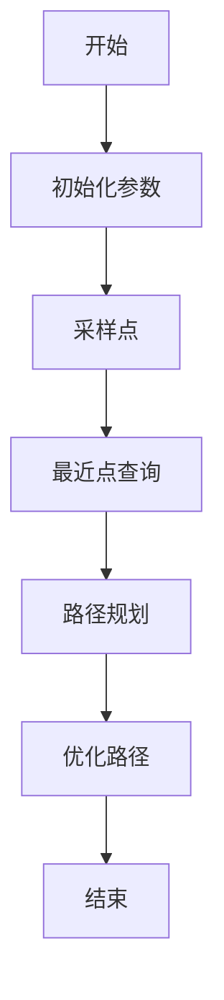
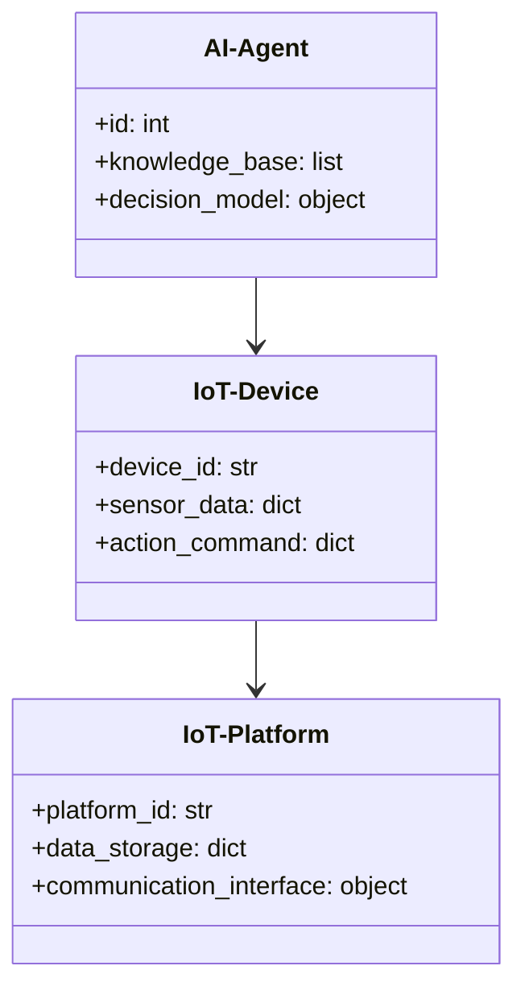
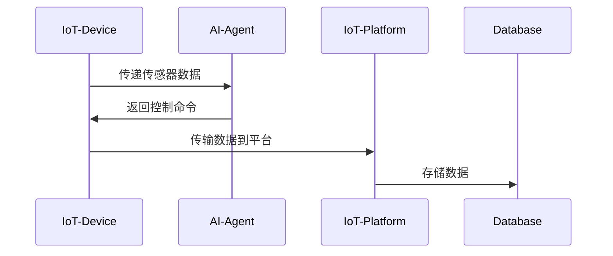

                 


# AI Agent与物联网的结合应用

> 关键词：AI Agent, 物联网, 边缘计算, 智能决策, 数据处理

> 摘要：本文探讨AI Agent与物联网的结合应用，分析其核心概念、算法原理、系统架构，并通过案例展示其实现过程。旨在揭示AI Agent如何提升物联网系统的智能化和决策能力，推动智能物联网的发展。

---

## 第一部分: AI Agent与物联网的背景与概念

### 第1章: AI Agent与物联网的背景与概念

#### 1.1 AI Agent的基本概念

##### 1.1.1 AI Agent的定义与分类

AI Agent（人工智能代理）是指能够感知环境并采取行动以实现目标的智能实体。AI Agent可分为简单反射型、基于模型的反应型、目标驱动型和效用驱动型。

##### 1.1.2 AI Agent的核心特征

- **自主性**：无需外部干预，自主决策。
- **反应性**：实时感知环境变化并做出反应。
- **目标导向性**：行为驱动目标的实现。

##### 1.1.3 AI Agent与传统AI的区别

AI Agent强调与环境的交互，而传统AI主要专注于数据处理和分析。

#### 1.2 物联网的基本概念

##### 1.2.1 物联网的定义与组成

物联网由传感器、网络和应用层组成，实现物理世界与数字世界的互联。

##### 1.2.2 物联网的关键技术

- **感知层**：利用传感器采集数据。
- **网络层**：通过通信技术传输数据。
- **处理层**：进行数据存储和计算。

##### 1.2.3 物联网的应用场景

智能家居、智慧城市、工业物联网等领域。

#### 1.3 AI Agent与物联网的结合意义

##### 1.3.1 结合的必要性

物联网数据繁多，AI Agent可提升数据处理和决策能力。

##### 1.3.2 结合的优势与挑战

优势：增强智能性；挑战：计算资源受限、隐私问题。

##### 1.3.3 结合的未来发展趋势

边缘计算的兴起推动AI Agent在物联网中的应用。

---

### 第2章: AI Agent与物联网的核心概念与联系

#### 2.1 AI Agent的核心原理

##### 2.1.1 知识表示与推理

使用逻辑推理和知识图谱进行信息处理。

##### 2.1.2 行为决策机制

基于状态和目标，选择最优行动。

##### 2.1.3 与环境的交互方式

通过传感器和执行器与环境互动。

#### 2.2 物联网的核心原理

##### 2.2.1 感知层：传感器与数据采集

采集环境数据，如温湿度传感器。

##### 2.2.2 网络层：数据传输与通信

使用Wi-Fi、蓝牙等技术传输数据。

##### 2.2.3 处理层：数据存储与计算

进行数据存储、分析和处理。

#### 2.3 AI Agent与物联网的实体关系图

```mermaid
er
actor(AI Agent) {
  id
  knowledge_base
  decision_model
}
actor(IoT Device) {
  device_id
  sensor_data
  action_command
}
actor(IoT Platform) {
  platform_id
  data_storage
  communication_interface
}
```

---

### 第3章: AI Agent与物联网的算法原理

#### 3.1 AI Agent的核心算法

##### 3.1.1 知识表示与推理算法

使用逻辑推理和知识图谱进行信息处理。

##### 3.1.2 行为决策算法

基于状态和目标，选择最优行动。

##### 3.1.3 与环境交互的强化学习算法

使用强化学习优化决策策略。

#### 3.2 物联网中的关键算法

##### 3.2.1 数据采集与处理算法

采集、预处理和存储数据。

##### 3.2.2 数据通信与网络优化算法

优化数据传输效率。

##### 3.2.3 数据分析与预测算法

利用机器学习进行数据预测。

#### 3.3 AI Agent与物联网结合的算法实现

##### 3.3.1 RRT*路径规划算法



代码实现：

```python
import numpy as np

def rrt_star(start, goal, obstacles):
    tree = {start: start}
    parent = {}
    cost = {}
    while True:
        # 采样点
        if start == goal:
            break
        # 最近点查询
        nearest = None
        min_dist = float('inf')
        for node in tree:
            dist = np.linalg.norm(node - start)
            if dist < min_dist:
                min_dist = dist
                nearest = node
        # 路径优化
        # ...
        # 连接点
        # ...
    return path
```

---

### 第4章: 系统分析与架构设计方案

#### 4.1 问题场景介绍

智能家居环境监测系统。

#### 4.2 系统功能设计

##### 4.2.1 领域模型



##### 4.2.2 系统架构设计


##### 4.2.3 系统接口设计

API接口定义：

- `/api/sensor_data`: 接收传感器数据
- `/api/agent_command`: 发送控制命令

##### 4.2.4 系统交互流程



---

### 第5章: 项目实战

#### 5.1 环境安装

安装Python、必要的库和物联网开发板。

#### 5.2 系统核心实现

##### 5.2.1 核心代码实现

```python
class AI-Agent:
    def __init__(self):
        self.knowledge_base = {}
    
    def perceive(self, data):
        # 处理感知数据
        pass
    
    def decide(self):
        # 制定决策
        pass

class IoT-Device:
    def __init__(self, device_id):
        self.device_id = device_id
        self.sensor_data = {}
    
    def read_sensor(self):
        # 读取传感器数据
        pass
    
    def send_command(self, command):
        # 发送控制命令
        pass
```

##### 5.2.2 代码应用解读与分析

AI-Agent处理数据并制定决策，IoT-Device执行命令。

#### 5.3 实际案例分析

智能家居系统中，AI-Agent根据传感器数据调整室内温度。

#### 5.4 项目小结

实现了一个基本的AI Agent与物联网结合系统，具备实时感知和决策能力。

---

### 第6章: 最佳实践与总结

#### 6.1 小结

AI Agent提升物联网系统的智能化，但需解决计算资源和隐私问题。

#### 6.2 注意事项

- 安全性：防止数据泄露。
- 可扩展性：确保系统可扩展。
- 可靠性：保证系统的稳定性。

#### 6.3 拓展阅读

建议阅读《强化学习入门》和《物联网技术详解》。

---

作者：AI天才研究院/AI Genius Institute & 禅与计算机程序设计艺术 /Zen And The Art of Computer Programming

