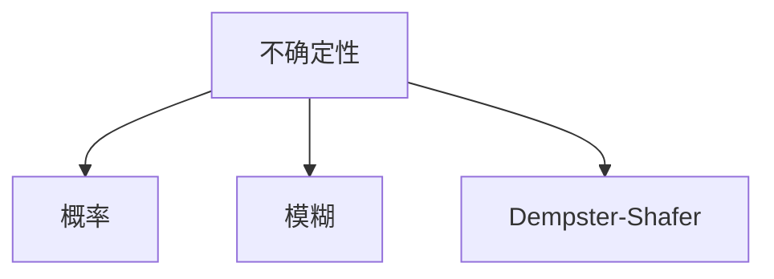
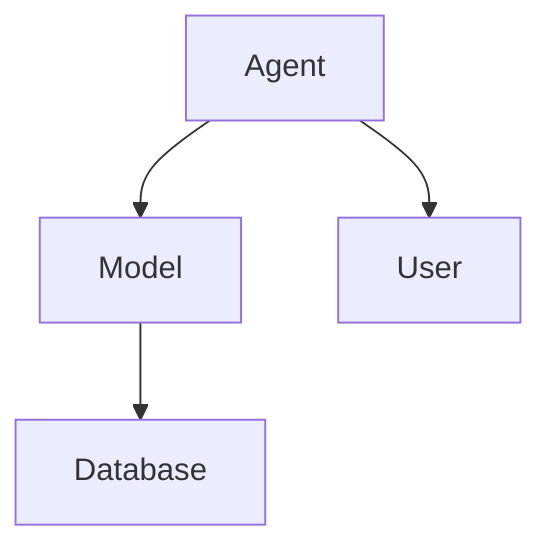

                 


# AI Agent中的不确定性推理与决策

---

## 关键词：
AI Agent, 不确定性推理, 决策算法, 概率推理, 模糊推理, Dempster-Shafer理论, 贝叶斯网络

---

## 摘要：
本文深入探讨AI Agent在处理不确定性环境中的推理与决策问题。从不确定性推理的基本概念出发，分析其在AI Agent中的应用，结合概率推理、模糊推理和Dempster-Shafer理论等方法，详细讲解贝叶斯网络、马尔可夫决策过程等算法的原理与实现。通过系统架构设计和项目实战，展示如何在实际场景中应用这些方法，解决AI Agent面临的不确定性问题。

---

## 第一部分: AI Agent中的不确定性推理基础

### 第1章: 不确定性推理的基本概念

#### 1.1 不确定性推理的背景与问题背景
##### 1.1.1 不确定性推理的定义
不确定性推理是指在信息不完全、不一致或模糊的情况下，通过某种方法推导出结论的过程。AI Agent在与环境交互时，经常面临不确定性问题，例如传感器噪声、信息缺失或动态变化的环境。

##### 1.1.2 AI Agent中的不确定性问题
AI Agent需要在不确定性环境中做出决策，例如自动驾驶汽车需要处理交通中的不确定性，医疗诊断系统需要处理症状的不确定性。

##### 1.1.3 不确定性推理的必要性
不确定性推理是AI Agent实现智能决策的核心能力，能够帮助Agent在复杂环境中做出合理选择。

#### 1.2 不确定性推理的核心概念
##### 1.2.1 不确定性的来源
不确定性主要来源于环境的动态变化、信息的不完全性和 Agent 的认知能力限制。

##### 1.2.2 不确定性推理的基本问题
- **不完备性**：信息不完整或缺失。
- **不一致性**：信息冲突或矛盾。
- **模糊性**：信息边界不清晰。

##### 1.2.3 不确定性推理的目标与边界
目标是通过推理方法，将不确定性信息转化为可操作的决策；边界包括推理的范围和精度。

### 第2章: 不确定性推理的核心概念与联系

#### 2.1 不确定性推理的原理
##### 2.1.1 概率推理
概率推理通过概率分布描述事件的可能性，例如贝叶斯网络。

##### 2.1.2 模糊推理
模糊推理处理模糊信息，例如使用模糊逻辑。

##### 2.1.3 Dempster-Shafer理论
Dempster-Shafer理论用于处理证据的不确定性，提供组合证据的方法。

#### 2.2 不确定性推理方法的对比分析
##### 2.2.1 不同不确定性推理方法的特征对比

| 方法          | 描述                              | 适用场景               |
|---------------|-----------------------------------|-----------------------|
| 概率推理       | 基于概率分布，适用于随机事件     | 风险评估、医疗诊断     |
| 模糊推理       | 处理模糊信息，适用于语言学问题   | 自然语言处理、控制理论 |
| Dempster-Shafer | 组合证据，适用于多源信息         | 传感器融合、故障诊断   |

##### 2.2.2 不同方法的适用场景



---

## 第二部分: 不确定性推理的算法原理

### 第3章: 概率推理算法

#### 3.1 贝叶斯网络的基本原理
##### 3.1.1 贝叶斯网络的定义
贝叶斯网络是一种有向无环图，节点表示随机变量，边表示条件依赖关系。

##### 3.1.2 贝叶斯网络的构建过程
- 确定变量和关系。
- 学习概率参数。

##### 3.1.3 贝叶斯网络的推理方法
- 变量消除法。
- 概率传播。

#### 3.2 贝叶斯网络的数学模型
##### 3.2.1 联合概率分布公式
$$P(x_1, x_2, ..., x_n) = \prod_{i=1}^{n} P(x_i | \text{父节点})$$

##### 3.2.2 条件概率公式
$$P(A|B) = \frac{P(B|A)P(A)}{P(B)}$$

#### 3.3 贝叶斯网络的实现
使用Python的`networkx`库构建贝叶斯网络，`scipy`进行概率计算。

### 第4章: 马尔可夫决策过程

#### 4.1 马尔可夫决策过程的基本原理
##### 4.1.1 定义与结构
状态、动作、转移概率、奖励函数。

##### 4.1.2 动作选择策略
- 随机策略。
- 策略梯度方法。

#### 4.2 马尔可夫决策过程的数学模型
##### 4.2.1 状态转移方程
$$P(s' | s, a)$$

##### 4.2.2 奖励函数
$$R(s, a, s')$$

#### 4.3 马尔可夫决策过程的实现
使用强化学习算法，如Q-learning，实现状态-动作价值函数。

---

## 第三部分: 不确定性推理的系统架构设计

### 第5章: 智能助手的设计与实现

#### 5.1 问题场景介绍
设计一个智能助手，处理用户请求时的不确定性。

#### 5.2 系统功能设计
##### 5.2.1 领域模型类图
```mermaid
classDiagram
    class User
    class Request
    class Response
    class Agent
        <<has>>
    class Model
        <<uses>>
```

##### 5.2.2 系统架构设计


#### 5.3 系统接口设计
定义REST API接口，处理请求和响应。

#### 5.4 系统交互流程
使用mermaid序列图展示用户与Agent的交互过程。

---

## 第四部分: 项目实战

### 第6章: 不确定性推理的实现与案例分析

#### 6.1 环境安装
安装必要的Python库，如TensorFlow、NumPy。

#### 6.2 核心代码实现
实现贝叶斯网络和马尔可夫决策过程的代码示例。

#### 6.3 案例分析
分析实际案例，如自动驾驶中的路径规划。

---

## 第五部分: 总结与展望

### 第7章: 总结与展望

#### 7.1 总结
回顾文章内容，强调不确定性推理的重要性。

#### 7.2 最佳实践
- 使用贝叶斯网络处理概率问题。
- 应用马尔可夫决策过程处理动态环境。

#### 7.3 注意事项
- 确保数据质量。
- 选择合适的方法。

#### 7.4 拓展阅读
推荐相关书籍和论文。

---

## 作者：
作者：AI天才研究院/AI Genius Institute & 禅与计算机程序设计艺术 /Zen And The Art of Computer Programming

