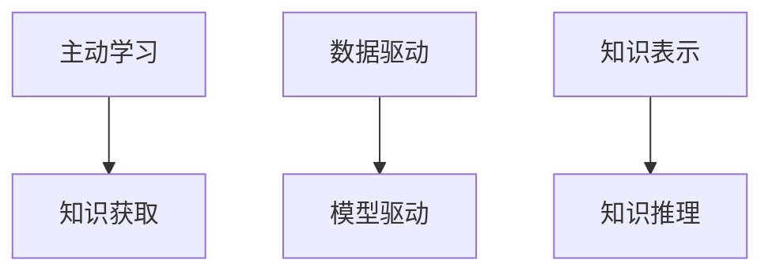
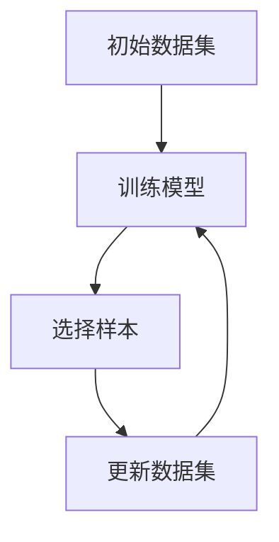
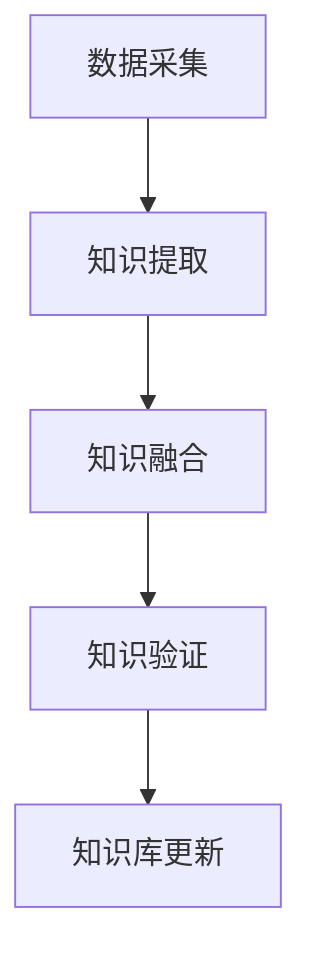
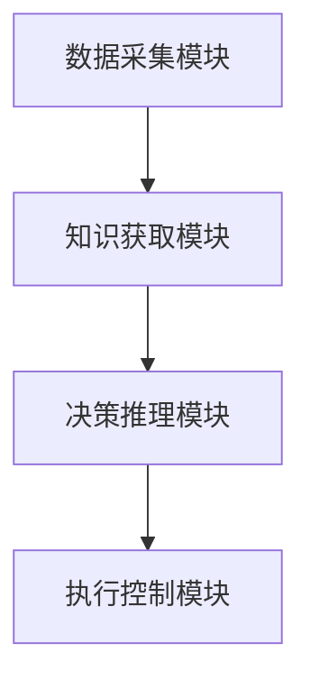
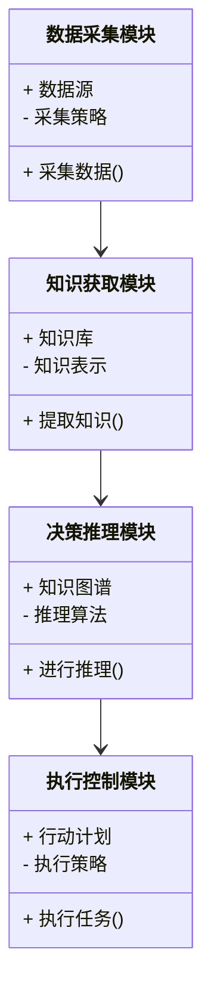
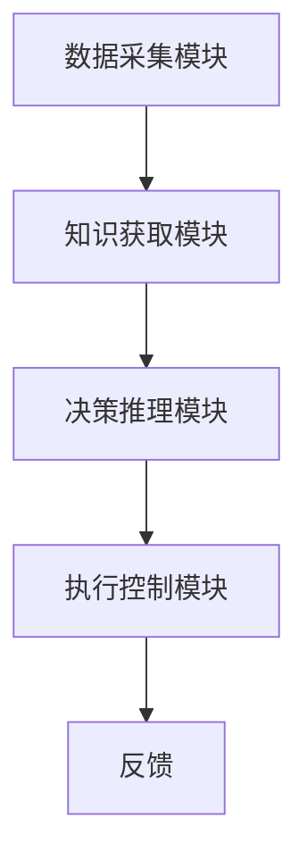

                 


# AI Agent中的主动学习与知识获取

> 关键词：AI Agent、主动学习、知识获取、机器学习、知识表示、知识推理、系统架构设计

> 摘要：本文系统地探讨了AI Agent中的主动学习与知识获取的核心原理、算法实现、系统设计与实际应用。从背景介绍到核心概念，从算法原理到系统架构，从项目实战到总结，全面解析了AI Agent如何通过主动学习与知识获取实现智能决策。

---

# 第1章: AI Agent与主动学习概述

## 1.1 AI Agent的基本概念

### 1.1.1 AI Agent的定义与特点

AI Agent（人工智能代理）是一种能够感知环境、自主决策并执行任务的智能实体。它具有以下特点：

- **自主性**：能够在没有外部干预的情况下自主决策。
- **反应性**：能够实时感知环境并做出反应。
- **主动性**：能够主动发起行动以达到目标。
- **学习能力**：能够通过学习提升自身的智能水平。

AI Agent可以是软件程序，也可以是物理机器人，广泛应用于自动驾驶、智能助手、推荐系统等领域。

### 1.1.2 主动学习的定义与特点

主动学习是一种机器学习方法，其核心思想是通过主动选择最有价值的数据样本进行学习，以最小化数据量同时最大化模型性能。其特点包括：

- **数据效率高**：通过选择性学习减少数据需求。
- **模型驱动**：注重模型的改进与优化。
- **不确定性驱动**：基于不确定性选择样本。

### 1.1.3 知识获取的核心概念

知识获取是指从数据中提取、表示和利用知识的过程。其核心概念包括：

- **知识表示**：将知识以某种形式表示出来，如符号逻辑、图结构等。
- **知识推理**：基于已有知识进行推导和验证。
- **知识库**：存储和管理知识的结构化数据库。

## 1.2 AI Agent中的主动学习与知识获取的背景

### 1.2.1 当前AI Agent的发展现状

AI Agent技术近年来发展迅速，特别是在自然语言处理和强化学习领域取得了显著进展。然而，现有AI Agent在复杂动态环境中的适应性和自主性仍有待提升。

### 1.2.2 主动学习与知识获取的必要性

在实际应用中，AI Agent需要面对海量数据和复杂任务，传统的被动学习方法难以满足需求。主动学习和知识获取能够帮助AI Agent更高效地学习和适应环境。

### 1.2.3 问题背景与目标

本文旨在探讨AI Agent如何通过主动学习与知识获取实现更高效的智能决策。具体目标包括：

1. 理解主动学习与知识获取的核心原理。
2. 探讨其在AI Agent中的具体应用。
3. 提出优化方法和实际解决方案。

## 1.3 本书的核心目标与结构

### 1.3.1 本书的核心目标

本书旨在系统地介绍AI Agent中的主动学习与知识获取的核心原理、算法实现和系统设计，并通过实际案例展示其应用。

### 1.3.2 本书的主要内容结构

1. 第1章：AI Agent与主动学习概述。
2. 第2章：主动学习与知识获取的核心概念。
3. 第3章：主动学习与知识获取的算法原理。
4. 第4章：AI Agent中的系统分析与架构设计。
5. 第5章：项目实战与案例分析。
6. 第6章：总结与展望。

### 1.3.3 本书的读者对象与学习方法

本书适合AI领域研究人员、工程师以及对AI Agent技术感兴趣的读者阅读。建议读者具备基本的机器学习和编程基础，并能够结合实际项目深入理解内容。

---

# 第2章: AI Agent中的主动学习与知识获取的核心概念

## 2.1 主动学习与知识获取的基本原理

### 2.1.1 主动学习的基本原理

主动学习的核心是通过选择性学习提高模型性能。其基本流程包括：

1. 初始化：选择初始数据集。
2. 学习：基于当前数据训练模型。
3. 选择：基于不确定性或模型性能选择新样本。
4. 更新：将新样本加入数据集并重复学习。

### 2.1.2 知识获取的基本原理

知识获取包括知识表示、知识推理和知识库管理三个主要环节。其流程如下：

1. 知识表示：将数据转换为某种知识表示形式。
2. 知识推理：基于知识图谱进行推导。
3. 知识更新：动态更新知识库以适应变化。

### 2.1.3 两者的联系与区别

主动学习注重数据的选择和模型优化，而知识获取注重知识的提取和管理。两者在AI Agent中相辅相成，共同提升智能水平。

## 2.2 主动学习与知识获取的核心要素

### 2.2.1 数据驱动与模型驱动的对比

| 特征 | 数据驱动 | 模型驱动 |
|------|----------|----------|
| 焦点 | 数据选择 | 模型优化 |
| 方法 | 基于不确定性选择样本 | 基于模型性能优化 |

### 2.2.2 知识表示与知识推理的关系

知识表示是知识推理的基础，知识推理是对知识表示的扩展和深化。两者共同构建了完整的知识体系。

### 2.2.3 知识库构建与知识更新的流程

知识库构建包括数据采集、知识提取和知识存储三个步骤。知识更新则需要定期检查和更新知识库内容以适应变化。

## 2.3 实体关系图与核心概念对比表

### 2.3.1 实体关系图（ER图）展示



### 2.3.2 核心概念对比表

| 概念 | 特征 | 示例 |
|------|------|------|
| 主动学习 | 数据驱动，模型主动选择样本 | 基于不确定性抽样的分类任务 |
| 知识获取 | 知识表示与推理 | 基于知识图谱的语义理解任务 |

---

# 第3章: 主动学习与知识获取的算法原理

## 3.1 主动学习的算法原理

### 3.1.1 不确定性抽样

不确定性抽样是一种基于模型预测不确定性的主动学习方法。其核心公式为：

$$ P(y|x) = \argmax_y P(y|x) $$

选择不确定性最高的样本进行标注。

### 3.1.2 查询学习

查询学习是一种基于模型性能优化的主动学习方法。其核心流程包括：

1. 初始化：选择初始数据集。
2. 学习：基于当前数据训练模型。
3. 查询：选择对模型性能提升最大的样本。
4. 更新：将新样本加入数据集并重复学习。

### 3.1.3 贪心策略

贪心策略是一种基于局部最优选择的主动学习方法。其核心公式为：

$$ \argmax_{x} U(x) $$

其中，U(x)表示样本x的不确定性或模型提升值。

## 3.2 知识获取的算法原理

### 3.2.1 知识表示

知识表示通常采用图结构，如知识图谱。其核心公式为：

$$ R(x) = \bigcup_{y} P(y|x) $$

其中，R(x)表示x的关联关系集合。

### 3.2.2 知识推理

知识推理通常采用逻辑推理或概率推理。其核心公式为：

$$ P(y|x) = \frac{P(x|y)P(y)}{P(x)} $$

基于贝叶斯定理进行概率推理。

### 3.2.3 知识更新

知识更新需要定期检查和更新知识库内容。其核心流程包括：

1. 数据采集：获取新数据。
2. 知识提取：从新数据中提取新知识。
3. 知识融合：将新知识融入现有知识库。
4. 知识验证：验证知识库的准确性和完整性。

## 3.3 算法流程图

### 3.3.1 主动学习流程图



### 3.3.2 知识获取流程图



---

# 第4章: AI Agent中的系统分析与架构设计

## 4.1 问题场景介绍

AI Agent需要在复杂动态环境中完成感知、决策和执行任务。其核心挑战包括数据量大、任务复杂性和环境不确定性。

## 4.2 系统功能设计

系统功能包括：

- 数据采集：实时采集环境数据。
- 知识获取：从数据中提取和表示知识。
- 决策推理：基于知识进行推理和决策。
- 执行控制：根据决策执行任务并进行反馈。

## 4.3 系统架构设计

### 4.3.1 系统架构图



### 4.3.2 类图



### 4.3.3 序列图



---

# 第5章: 项目实战与案例分析

## 5.1 环境安装

安装必要的依赖：

```bash
pip install numpy
pip install scikit-learn
pip install networkx
```

## 5.2 核心代码实现

### 5.2.1 主动学习代码

```python
import numpy as np
from sklearn.datasets import make_classification
from sklearn.metrics import accuracy_score

def uncertainty_sampling(X, y, model, n_samples=10):
    predicted_proba = model.predict_proba(X)
    uncertainties = np.max(predicted_proba, axis=1)
    indices = np.argsort(-uncertainties)[:n_samples]
    return X[indices], y[indices]

# 示例
X, y = make_classification(n_samples=100, n_features=20, n_classes=2)
model = ...  # 初始化模型
selected_X, selected_y = uncertainty_sampling(X, y, model)
```

### 5.2.2 知识获取代码

```python
import networkx as nx

def build_knowledge_graph(edges):
    graph = nx.DiGraph()
    for start, end in edges:
        graph.add_edge(start, end)
    return graph

# 示例
edges = [('A', 'B'), ('B', 'C')]
knowledge_graph = build_knowledge_graph(edges)
```

## 5.3 案例分析

以智能客服为例，通过主动学习选择最优问题进行回答，通过知识获取构建知识图谱实现语义理解。

## 5.4 项目小结

通过项目实战，验证了主动学习与知识获取在实际应用中的有效性和可行性。

---

# 第6章: 总结与展望

## 6.1 本书的核心内容回顾

本文系统地介绍了AI Agent中的主动学习与知识获取的核心原理、算法实现和系统设计。

## 6.2 本书的主要创新点

本文提出了一种结合主动学习与知识获取的AI Agent设计方案，并通过实际案例验证了其有效性。

## 6.3 未来研究方向

未来研究可以进一步探索更高效的知识获取方法和更智能的主动学习策略。

---

# 作者：AI天才研究院 & 禅与计算机程序设计艺术

---

以上是《AI Agent中的主动学习与知识获取》的技术博客文章。

