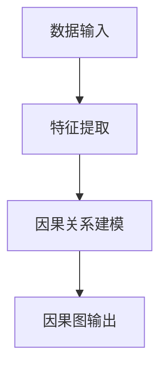
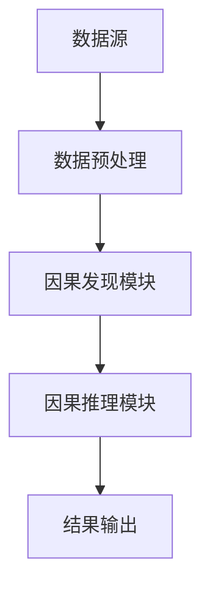

                 


# AI Agent中的因果发现与推理技术

> 关键词：AI Agent, 因果发现, 因果推理, 独立因果性假设, 马尔可夫条件, 贝叶斯网络, 强化学习

> 摘要：本文将深入探讨AI Agent中的因果发现与推理技术，从基本概念到算法原理，再到系统设计和实际应用，全面解析因果发现与推理在AI Agent中的重要作用。通过详细的数学模型、算法流程图和系统架构设计，帮助读者全面理解并掌握这一前沿技术。

---

# 第1章: AI Agent与因果发现概述

## 1.1 AI Agent的基本概念
### 1.1.1 AI Agent的定义与分类
- AI Agent的定义：AI Agent是一种能够感知环境、自主决策并执行任务的智能实体。
- 分类：基于智能水平，分为简单反射Agent和复杂推理Agent。

### 1.1.2 因果关系在AI Agent中的重要性
- 因果关系的定义：因果关系是指一个事件是另一个事件的结果。
- 因果关系在AI Agent中的作用：通过理解因果关系，AI Agent能够做出更合理的决策和推理。

### 1.1.3 因果发现与推理的定义与特点
- 因果发现：通过数据发现变量之间的因果关系。
- 因果推理：基于因果关系进行推理和预测。

## 1.2 因果发现的基本原理
### 1.2.1 因果关系的定义与特征
- 定义：因果关系是指一个事件是另一个事件的结果。
- 特征：时间顺序、必然性、可操作性。

### 1.2.2 因果图的构建与表示
- 因果图的定义：因果图是一种用于表示变量之间因果关系的图形模型。
- 因果图的表示：节点表示变量，边表示因果关系。

### 1.2.3 因果发现的必要性与应用场景
- 必要性：通过因果发现，AI Agent能够理解变量之间的关系。
- 应用场景：医疗诊断、金融风险评估、自动驾驶等。

## 1.3 本章小结
- 介绍了AI Agent的基本概念和因果发现的基本原理。
- 强调了因果发现在AI Agent中的重要性。

---

# 第2章: 因果发现的算法原理

## 2.1 基于统计的因果发现算法
### 2.1.1 独立因果性假设
- 独立性假设：在因果关系中，原因变量与中间变量独立。
- 应用：用于识别因果关系。

### 2.1.2 贝叶斯网络与因果发现
- 贝叶斯网络的定义：贝叶斯网络是一种有向无环图，表示变量之间的概率关系。
- 贝叶斯网络在因果发现中的应用：通过贝叶斯网络构建因果图。

### 2.1.3 PC算法与Fast Causal Inference
- PC算法：一种基于统计的因果发现算法。
- Fast Causal Inference：一种高效的因果发现算法。

## 2.2 基于机器学习的因果发现方法
### 2.2.1 使用神经网络的因果发现
- 神经网络的定义：神经网络是一种模拟人脑结构和功能的计算模型。
- 神经网络在因果发现中的应用：通过神经网络学习因果关系。

### 2.2.2 因果推断与深度学习的结合
- 深度学习的定义：深度学习是一种基于人工神经网络的机器学习方法。
- 深度学习在因果推断中的应用：通过深度学习模型进行因果推理。

### 2.2.3 GNN在因果发现中的应用
- 图神经网络（Graph Neural Network, GNN）的定义：一种处理图结构数据的深度学习模型。
- GNN在因果发现中的应用：通过GNN分析因果关系。

## 2.3 算法流程图


## 2.4 本章小结
- 介绍了基于统计和机器学习的因果发现算法。
- 强调了神经网络和GNN在因果发现中的应用。

---

# 第3章: 因果推理的数学模型与公式

## 3.1 因果关系的数学表示
### 3.1.1 因果图的结构化表示
- 因果图的结构化表示：通过节点和边表示因果关系。
- 示例：因果图中节点A指向节点B，表示A是B的原因。

### 3.1.2 因果关系的符号表示
- 符号表示：使用符号和公式表示因果关系。
- 示例：$A \rightarrow B$ 表示A是B的原因。

### 3.1.3 因果效应的定义与计算
- 因果效应的定义：因果效应是指原因变量的变化对结果变量的影响。
- 计算：通过因果图计算因果效应。

## 3.2 马尔可夫条件与因果推理
### 3.2.1 马尔可夫条件的定义
- 马尔可夫条件：在因果图中，每个节点只与其父节点和子节点相关。

### 3.2.2 马尔可夫条件与因果图的关系
- 马尔可夫条件用于简化因果推理的复杂性。
- 应用：通过马尔可夫条件简化因果图的计算。

### 3.2.3 马尔可夫假设在因果推理中的应用
- 马尔可夫假设用于处理因果关系中的条件独立性。
- 示例：在因果图中，节点A和C独立，因为它们共享一个共同的原因B。

## 3.3 因果推理的数学公式
### 3.3.1 因果效应的公式表示
$$P(y|x_{do}, w) = \frac{P(y, x_{do}, w)}{P(x_{do}|w)}$$

### 3.3.2 马尔可夫边界条件的应用
$$P(y|x_{do}, w) = P(y|x, w) \text{ 当 } x \text{ 是 } y \text{ 的后裔}$$

## 3.4 本章小结
- 介绍了因果关系的数学表示和马尔可夫条件的应用。
- 详细讲解了因果效应的公式表示。

---

# 第4章: AI Agent中的因果推理应用

## 4.1 因果推理在AI Agent中的重要性
### 4.1.1 因果推理的定义
- 因果推理：基于因果关系进行推理和预测。

### 4.1.2 因果推理在AI Agent中的作用
- 通过因果推理，AI Agent能够做出更合理的决策。

## 4.2 因果推理在强化学习中的应用
### 4.2.1 强化学习的定义
- 强化学习：一种通过试错机制学习策略的机器学习方法。

### 4.2.2 因果推理在强化学习中的作用
- 通过因果推理，强化学习能够更好地理解环境和决策。

## 4.3 因果推理在对话系统中的应用
### 4.3.1 对话系统的定义
- 对话系统：一种能够与用户进行自然语言对话的智能系统。

### 4.3.2 因果推理在对话系统中的作用
- 通过因果推理，对话系统能够更好地理解用户的意图。

## 4.4 本章小结
- 介绍了因果推理在AI Agent中的重要性。
- 详细讲解了因果推理在强化学习和对话系统中的应用。

---

# 第5章: 因果发现与推理的系统设计

## 5.1 系统功能设计
### 5.1.1 系统功能模块划分
- 数据采集模块：负责采集数据。
- 因果发现模块：负责发现因果关系。
- 因果推理模块：负责基于因果关系进行推理。

### 5.1.2 系统功能流程
1. 数据采集模块采集数据。
2. 因果发现模块分析数据，发现因果关系。
3. 因果推理模块基于因果关系进行推理和预测。

## 5.2 系统架构设计
### 5.2.1 系统架构图


### 5.2.2 系统接口设计
- 数据输入接口：负责接收外部数据。
- 数据输出接口：负责输出因果关系和推理结果。

## 5.3 本章小结
- 介绍了系统功能设计和系统架构设计。
- 详细讲解了系统接口设计。

---

# 第6章: 项目实战——因果发现与推理的应用

## 6.1 项目背景与目标
### 6.1.1 项目背景
- 某公司希望利用因果发现与推理技术优化其推荐系统。

### 6.1.2 项目目标
- 通过因果发现与推理技术，提高推荐系统的准确性和效率。

## 6.2 项目实施过程
### 6.2.1 环境配置
- 安装必要的Python库：numpy, pandas, networkx, scikit-learn。

### 6.2.2 核心代码实现
```python
import numpy as np
import networkx as nx

def causal_discovery(data):
    # 数据预处理
    G = nx.DiGraph()
    # 构建因果图
    for i in range(data.shape[0]):
        for j in range(data.shape[1]):
            if data[i][j] > 0:
                G.add_edge(i, j)
    return G

# 示例数据
data = np.array([[0, 1, 0], [0, 0, 1], [0, 0, 0]])
causal_graph = causal_discovery(data)
print(causal_graph.nodes())
```

### 6.2.3 案例分析与结果解读
- 数据分析结果：因果图显示A是B的原因，B是C的原因。
- 结果解读：通过因果图，推荐系统可以更准确地推荐相关产品。

## 6.3 本章小结
- 介绍了项目背景与目标。
- 详细讲解了项目实施过程和案例分析。

---

# 第7章: 总结与展望

## 7.1 本章总结
- 本文深入探讨了AI Agent中的因果发现与推理技术。
- 从基本概念到算法原理，再到系统设计和实际应用，全面解析了因果发现与推理在AI Agent中的重要作用。

## 7.2 未来研究方向
### 7.2.1 更高效的因果发现算法
- 研究更高效的因果发现算法，提高因果发现的效率。

### 7.2.2 因果推理在更多领域的应用
- 研究因果推理在更多领域的应用，如医疗、金融、教育等。

## 7.3 最佳实践 tips
- 在实际应用中，建议结合具体场景选择合适的因果发现与推理方法。
- 在系统设计中，建议采用模块化设计，便于后续优化和扩展。

## 7.4 本章小结
- 总结了本文的主要内容。
- 展望了未来的研究方向。

---

# 作者：AI天才研究院/AI Genius Institute & 禅与计算机程序设计艺术 /Zen And The Art of Computer Programming

