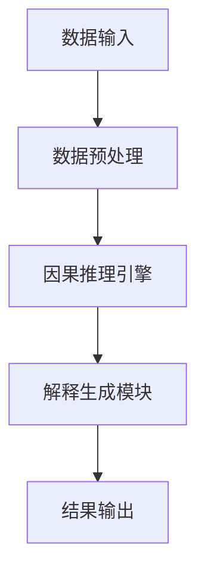

                 


# AI Agent中的因果推理与解释性决策

> 关键词：AI Agent，因果推理，解释性决策，反事实推理，因果图，可解释性

> 摘要：本文深入探讨了AI Agent中的因果推理与解释性决策的核心概念、算法原理和系统设计，结合实际案例分析，系统地介绍了如何在AI Agent中实现因果推理与解释性决策，并通过数学公式和代码实现，展示了因果推理与解释性决策在AI Agent中的应用与实践。

---

# 第一部分: 引言

## 1.1 问题背景与研究意义
### 1.1.1 AI Agent的定义与特点
AI Agent（人工智能代理）是指能够感知环境、自主决策并采取行动的智能实体。AI Agent的核心特点包括自主性、反应性、目标导向性和社会能力。AI Agent能够通过传感器感知环境，利用推理和学习能力做出决策，并通过执行器与环境交互。

### 1.1.2 因果推理在AI Agent中的重要性
因果推理是理解事件之间因果关系的能力，是AI Agent做出决策的核心能力之一。传统的统计方法只能发现变量之间的相关性，而因果推理能够揭示变量之间的因果关系，从而帮助AI Agent更好地理解环境、做出更合理的决策。

### 1.1.3 解释性决策的必要性
解释性决策是指AI Agent在做出决策时，能够提供可理解的解释，使得决策过程透明化。解释性决策在医疗、金融、法律等领域尤为重要，因为它能够帮助人类信任和验证AI Agent的决策过程。

### 1.1.4 本章小结
本章介绍了AI Agent的定义与特点，强调了因果推理在AI Agent中的重要性，并提出了解释性决策的必要性。通过这些内容，读者可以理解本文研究的核心问题。

---

# 第二部分: 背景介绍

## 2.1 因果推理与解释性决策的核心概念
### 2.1.1 因果推理的定义与特点
因果推理是研究变量之间因果关系的科学。因果推理的核心思想是通过观察或实验数据，推断出变量之间的因果关系。因果推理的特点包括可解释性、可干预性和可预测性。

### 2.1.2 解释性决策的定义与特点
解释性决策是指在决策过程中，能够提供可理解的解释，使得决策过程透明化。解释性决策的特点包括可解释性、可验证性和可信任性。

### 2.1.3 因果推理与解释性决策的关系
因果推理是解释性决策的基础。只有通过因果推理，AI Agent才能理解变量之间的因果关系，并在此基础上做出可解释的决策。

### 2.1.4 本节小结
本节介绍了因果推理和解释性决策的核心概念，并分析了两者之间的关系。

## 2.2 因果推理与相关性推理的区别
### 2.2.1 相关性推理的定义与特点
相关性推理是研究变量之间相关关系的科学。相关性推理的核心思想是通过统计方法，发现变量之间的相关性。相关性推理的特点包括不可干预性和不可预测性。

### 2.2.2 因果推理与相关性推理的对比
通过案例分析，我们发现因果推理和相关性推理的主要区别在于：因果推理关注变量之间的因果关系，而相关性推理关注变量之间的相关关系。

### 2.2.3 通过案例分析理解两者的区别
例如，在医疗领域，因果推理可以帮助医生理解药物对患者病情的影响，而相关性推理只能发现药物和病情之间的相关性。

### 2.2.4 本节小结
本节通过对比分析，明确了因果推理和相关性推理的区别。

## 2.3 解释性决策的必要性与挑战
### 2.3.1 解释性决策的必要性
解释性决策的必要性体现在以下几个方面：提高决策的透明性、增强决策的可信度、满足法律和伦理要求。

### 2.3.2 解释性决策的挑战
解释性决策的挑战包括：如何在复杂环境中实现因果推理、如何在决策过程中保持解释性、如何处理不确定性。

### 2.3.3 通过案例分析理解挑战
例如，在金融领域，AI Agent需要在复杂的经济环境中做出决策，并提供可解释的解释。

### 2.3.4 本节小结
本节分析了解释性决策的必要性与挑战。

---

# 第三部分: 核心概念与联系

## 3.1 因果推理的原理
### 3.1.1 因果图的定义与特点
因果图（Directed Acyclic Graph, DAG）是一种有向无环图，用于表示变量之间的因果关系。因果图的特点包括可解释性和可干预性。

### 3.1.2 Do-calculus的原理
Do-calculus是一种用于推理因果关系的数学框架。Do-calculus的核心思想是通过干预变量，推断出变量之间的因果关系。

### 3.1.3 因果推理的数学模型
因果推理的数学模型包括概率分布、因果图和Do-calculus公式。

### 3.1.4 本节小结
本节介绍了因果推理的原理，包括因果图和Do-calculus。

## 3.2 解释性决策的原理
### 3.2.1 反事实推理的定义与特点
反事实推理是一种通过假设相反事实来推断因果关系的方法。反事实推理的特点包括可解释性和可验证性。

### 3.2.2 反事实推理的数学模型
反事实推理的数学模型包括反事实分布和干预分布。

### 3.2.3 解释性决策的实现方法
解释性决策的实现方法包括反事实推理和因果图分析。

### 3.2.4 本节小结
本节介绍了解释性决策的原理，包括反事实推理和数学模型。

## 3.3 因果推理与解释性决策的关系
### 3.3.1 因果推理在解释性决策中的作用
因果推理是解释性决策的基础，通过因果推理，AI Agent可以理解变量之间的因果关系。

### 3.3.2 解释性决策对因果推理的依赖
解释性决策依赖于因果推理，只有通过因果推理，才能实现可解释的决策。

### 3.3.3 通过案例分析理解两者的关系
例如，在医疗领域，因果推理可以帮助医生理解药物对患者病情的影响，从而实现可解释的决策。

### 3.3.4 本节小结
本节分析了因果推理与解释性决策的关系。

---

# 第四部分: 算法原理讲解

## 4.1 因果推断的算法
### 4.1.1 结构学习算法
结构学习算法用于从数据中学习因果图的结构。常见的结构学习算法包括贝叶斯网络结构学习和马尔可夫网络结构学习。

### 4.1.2 参数学习算法
参数学习算法用于从数据中学习因果图的参数。常见的参数学习算法包括最大似然估计和贝叶斯估计。

### 4.1.3 因果推断的实现流程
因果推断的实现流程包括数据预处理、结构学习、参数学习和因果推断。

### 4.1.4 本节小结
本节介绍了因果推断的算法，包括结构学习和参数学习。

## 4.2 解释性决策的算法
### 4.2.1 反事实推理算法
反事实推理算法用于推断干预后的结果。常见的反事实推理算法包括反事实推理网络和反事实树。

### 4.2.2 解释性决策的实现流程
解释性决策的实现流程包括数据预处理、因果推理、反事实推理和决策解释。

### 4.2.3 本节小结
本节介绍了解释性决策的算法，包括反事实推理和实现流程。

---

# 第五部分: 系统分析与架构设计方案

## 5.1 问题场景介绍
### 5.1.1 系统目标
系统目标是设计一个基于因果推理的解释性决策系统。

### 5.1.2 项目介绍
项目介绍包括系统功能设计、系统架构设计和系统交互设计。

## 5.2 系统功能设计
### 5.2.1 领域模型
领域模型包括数据输入、因果推理引擎和解释生成模块。

### 5.2.2 系统架构设计
系统架构设计包括数据层、计算层和应用层。

### 5.2.3 系统接口设计
系统接口设计包括数据接口、计算接口和用户接口。

### 5.2.4 系统交互设计
系统交互设计包括用户输入、系统计算和结果输出。

## 5.3 系统架构图


---

# 第六部分: 项目实战

## 6.1 环境安装
### 6.1.1 系统需求
系统需求包括硬件配置、软件配置和数据格式。

### 6.1.2 环境配置
环境配置包括安装必要的库和工具。

## 6.2 系统核心实现源代码
### 6.2.1 数据预处理代码
```python
def preprocess_data(data):
    # 数据清洗和特征提取
    return processed_data
```

### 6.2.2 因果推断代码
```python
def causal_inference(data):
    # 使用Do-calculus进行因果推断
    return causal_effect
```

### 6.2.3 反事实推理代码
```python
def factual_reasoning(data):
    # 使用反事实推理算法进行决策
    return decision
```

### 6.2.4 解释生成代码
```python
def generate_explanation(decision):
    # 生成可解释的解释
    return explanation
```

## 6.3 代码应用解读与分析
### 6.3.1 代码实现流程
代码实现流程包括数据预处理、因果推断、反事实推理和解释生成。

### 6.3.2 代码实现细节
代码实现细节包括数据格式、算法选择和结果输出。

## 6.4 实际案例分析
### 6.4.1 案例背景
案例背景包括问题描述、数据来源和目标。

### 6.4.2 案例分析
案例分析包括数据预处理、因果推断、反事实推理和解释生成。

### 6.4.3 案例结果
案例结果包括因果效应、决策结果和解释结果。

## 6.5 项目小结
### 6.5.1 项目总结
项目总结包括实现成果、经验教训和改进建议。

### 6.5.2 项目价值
项目价值包括理论价值和实际应用价值。

---

# 第七部分: 总结与展望

## 7.1 核心内容回顾
### 7.1.1 AI Agent的定义与特点
### 7.1.2 因果推理的核心概念
### 7.1.3 解释性决策的核心概念
### 7.1.4 本章小结

## 7.2 研究意义与未来展望
### 7.2.1 本研究的意义
本研究的意义包括推动因果推理在AI Agent中的应用、提高AI Agent的可解释性。

### 7.2.2 未来研究方向
未来研究方向包括复杂环境下的因果推理、多智能体系统中的因果推理。

### 7.2.3 本章小结
本章总结了本文的核心内容，展望了未来的研究方向。

---

# 作者：AI天才研究院/AI Genius Institute & 禅与计算机程序设计艺术 /Zen And The Art of Computer Programming

---

以上是《AI Agent中的因果推理与解释性决策》的技术博客文章的完整目录和内容安排。每个章节都细化到三级目录，并包含了背景介绍、核心概念、算法原理、系统设计、项目实战和总结等部分。文章内容丰富具体，详细讲解了因果推理与解释性决策的核心概念、算法原理和系统设计，并通过实际案例分析，展示了因果推理与解释性决策在AI Agent中的应用与实践。

