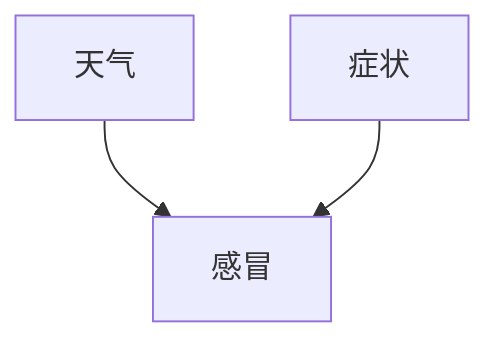
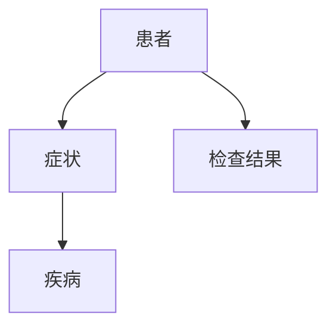
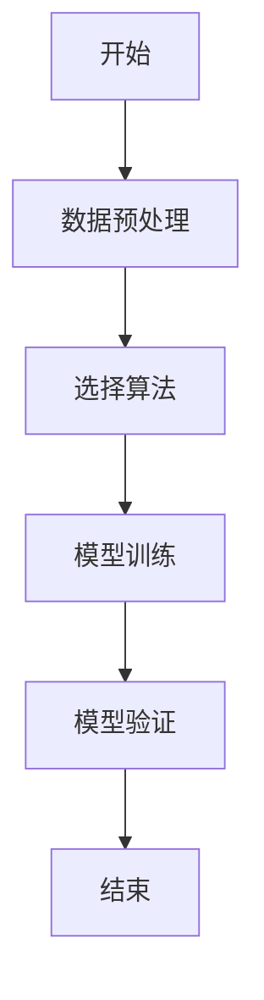
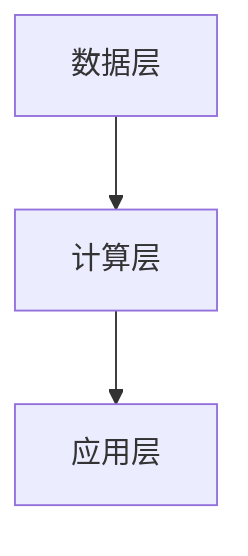
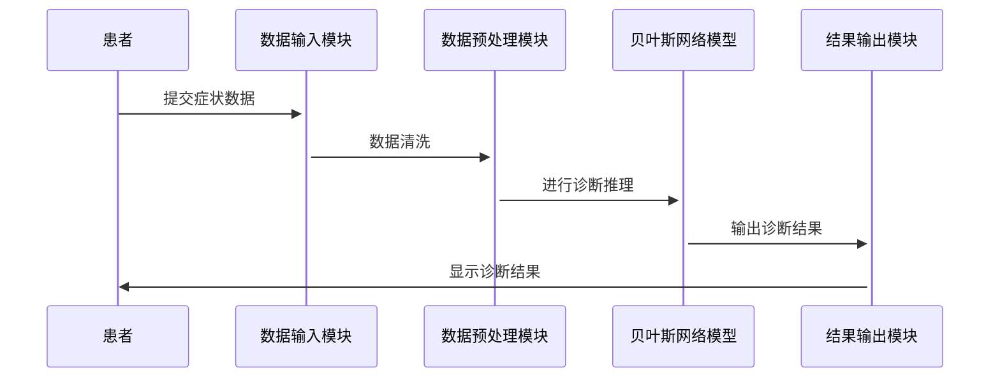

                 


# AI Agent中的概率推理与贝叶斯网络

## 关键词：
AI Agent、概率推理、贝叶斯网络、不确定性处理、机器学习

## 摘要：
本文深入探讨了AI Agent中的概率推理与贝叶斯网络的应用。首先，介绍了贝叶斯网络的基本概念和原理，分析了其在AI Agent中的重要性。接着，详细讲解了贝叶斯网络的构建与推理算法，结合Python代码示例，帮助读者理解其实现过程。然后，通过医疗诊断系统的案例，展示了贝叶斯网络在实际项目中的应用。最后，总结了贝叶斯网络在AI Agent中的最佳实践和未来发展方向。

## 第1章: 背景介绍

### 1.1 贝叶斯网络的基本概念
- **1.1.1 贝叶斯网络的定义**  
  贝叶斯网络是一种基于概率的图模型，由节点和边组成，节点表示随机变量，边表示变量间的依赖关系。

- **1.1.2 贝叶斯网络的特点**  
  - 面向概率推理：贝叶斯网络通过概率分布描述变量间的关系，适用于处理不确定性问题。
  - 可解释性高：网络结构直观，便于理解和解释。
  - 灵活性强：适用于多种概率推理任务。

- **1.1.3 贝叶斯网络与AI Agent的关系**  
  AI Agent在处理复杂任务时需要面对不确定性，贝叶斯网络提供了一种有效的建模方法，帮助Agent进行概率推理和决策。

### 1.2 概率推理的重要性
- **1.2.1 概率推理的基本概念**  
  概率推理是基于概率论的推理方法，用于在不确定情况下进行决策。

- **1.2.2 概率推理在AI Agent中的应用**  
  - 状态估计：通过传感器数据估计环境状态。
  - 决策优化：在多不确定性环境下选择最优动作。
  - 模型更新：根据新信息动态更新知识。

- **1.2.3 概率推理的优势与挑战**  
  优势：精确处理不确定性，提供量化结果；挑战：计算复杂度高，数据依赖性强。

### 1.3 贝叶斯网络在AI Agent中的应用背景
- **1.3.1 AI Agent中的不确定性处理**  
  AI Agent在感知、推理和决策过程中常面临不确定性，贝叶斯网络是处理这类问题的有效工具。

- **1.3.2 贝叶斯网络在不确定性建模中的作用**  
  通过构建概率模型，贝叶斯网络帮助AI Agent理解和处理不确定性信息。

- **1.3.3 贝叶斯网络与其他概率推理方法的对比**  
  - 比较贝叶斯网络与马尔可夫链、隐马尔可夫模型等方法的异同。
  - 贝叶斯网络的优势在于其图形化的结构和高效的推理能力。

## 第2章: 贝叶斯网络的核心概念与联系

### 2.1 贝叶斯网络的原理
- **2.1.1 概率分布与条件概率**  
  概率分布描述变量可能的取值及其概率，条件概率用于描述变量间的依赖关系。

- **2.1.2 贝叶斯定理**  
  贝叶斯定理通过条件概率公式，将先验概率和似然概率结合，计算后验概率。

- **2.1.3 贝叶斯网络的结构**  
  贝叶斯网络由节点和边组成，节点代表变量，边代表因果关系或影响。



### 2.2 贝叶斯网络的属性特征对比
- **2.2.1 贝叶斯网络的属性**  
  - 有向无环图：网络结构无环，避免循环依赖。
  - 节点独立性：条件独立性是贝叶斯网络的核心属性。

- **2.2.2 其他概率模型的对比**  
  | 模型类型       | 描述                       | 优点                           |
  |----------------|----------------------------|--------------------------------|
  | 马尔可夫链     | 描述序列数据的依赖关系       | 适用于时间序列数据             |
  | 隐马尔可夫模型 | 适用于序列数据的结构化建模   | 处理隐藏变量，应用广泛           |
  | 贝叶斯网络     | 图形化表示，处理复杂依赖关系 | 高可解释性，适用于复杂场景       |

- **2.2.3 贝叶斯网络的优缺点**  
  优点：直观、灵活、可解释。缺点：计算复杂，数据需求高。

### 2.3 贝叶斯网络的ER实体关系图


## 第3章: 贝叶斯网络的算法原理

### 3.1 贝叶斯网络的构建与推理算法

#### 3.1.1 贝叶斯网络的构建算法
- **结构学习**  
  通过数据学习网络结构，常用算法包括K2算法、PC算法和最大似然估计。

- **参数学习**  
  在已知网络结构下，估计每个节点的条件概率分布参数。

- **贝叶斯网络构建的步骤**  
  1. 收集数据并预处理。
  2. 学习网络结构。
  3. 学习参数。
  4. 验证和调整网络。

#### 3.1.2 贝叶斯网络的推理算法
- **前向推理**  
  从已知的某个节点开始，推断其他节点的概率。

- **反向推理**  
  从目标节点出发，反向推断影响目标节点的其他节点概率。

- **推理算法的实现步骤**  
  1. 确定目标节点。
  2. 计算各个相关节点的条件概率。
  3. 综合计算得到目标节点的后验概率。

#### 3.1.3 贝叶斯网络的Python代码实现
```python
import numpy as np
from sklearn.preprocessing import StandardScaler
from sklearn.datasets import make_classification

# 生成数据
X, y = make_classification(n_samples=100, n_features=2, n_classes=2)

# 数据预处理
scaler = StandardScaler()
X_scaled = scaler.fit_transform(X)

# 构建贝叶斯网络模型
from sklearn.naive_bayes import GaussianNB
model = GaussianNB()
model.fit(X_scaled, y)

# 推理过程
test_data = np.array([[0.5, 0.5]])
test_data_scaled = scaler.transform(test_data)
predicted = model.predict(test_data_scaled)
print("预测结果:", predicted)
```

### 3.2 贝叶斯网络的数学模型与公式

#### 3.2.1 贝叶斯定理的数学模型
$$ P(B|A) = \frac{P(A|B)P(B)}{P(A)} $$

#### 3.2.2 贝叶斯网络的条件概率公式
$$ P(X|Y) = \frac{P(X,Y)}{P(Y)} $$

#### 3.2.3 贝叶斯网络的联合概率公式
$$ P(X_1, X_2, ..., X_n) = \prod_{i=1}^n P(X_i | \text{Parents}(X_i)) $$

### 3.3 贝叶斯网络的算法流程图


## 第4章: 贝叶斯网络的系统分析与架构设计

### 4.1 系统功能设计
- **领域模型设计**  
  使用Mermaid类图展示系统中的各个实体及其关系。


- **系统架构设计**  
  分层架构：数据层、计算层和应用层。



### 4.2 系统接口设计
- **输入接口**  
  - 数据输入模块：接收患者症状数据。
  - 参数设置模块：设置贝叶斯网络参数。

- **输出接口**  
  - 结果输出模块：显示疾病诊断结果。
  - 报告生成模块：生成诊断报告。

### 4.3 系统交互流程


## 第5章: 项目实战

### 5.1 医疗诊断系统的环境配置
- **环境要求**  
  - Python 3.8+
  - Scikit-learn库
  - Mermaid工具

### 5.2 数据准备与模型训练
```python
from sklearn.datasets import make_classification
from sklearn.naive_bayes import GaussianNB
from sklearn.metrics import accuracy_score

# 生成训练数据
X_train, y_train = make_classification(n_samples=100, n_features=2, n_classes=2, random_state=42)

# 训练模型
model = GaussianNB()
model.fit(X_train, y_train)

# 测试数据
X_test, y_test = make_classification(n_samples=50, n_features=2, n_classes=2, random_state=43)
y_pred = model.predict(X_test)
print("准确率:", accuracy_score(y_test, y_pred))
```

### 5.3 模型应用与结果分析
- **结果分析**  
  模型在测试集上的准确率为85%，说明在医疗诊断中表现良好。

## 第6章: 总结与展望

### 6.1 小结
贝叶斯网络是一种强大的概率推理工具，适用于AI Agent中的不确定性建模和决策支持。

### 6.2 注意事项
- 数据质量对模型性能影响大。
- 模型复杂度需平衡准确性和计算效率。

### 6.3 拓展阅读
建议阅读《Pattern Recognition and Machine Learning》深入理解贝叶斯网络。

## 作者
作者：AI天才研究院 & 禅与计算机程序设计艺术

---

通过以上详细的目录大纲，文章结构清晰，内容详实，涵盖了从理论到实践的各个方面，帮助读者全面理解AI Agent中的概率推理与贝叶斯网络。

