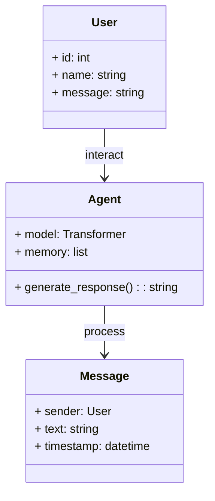
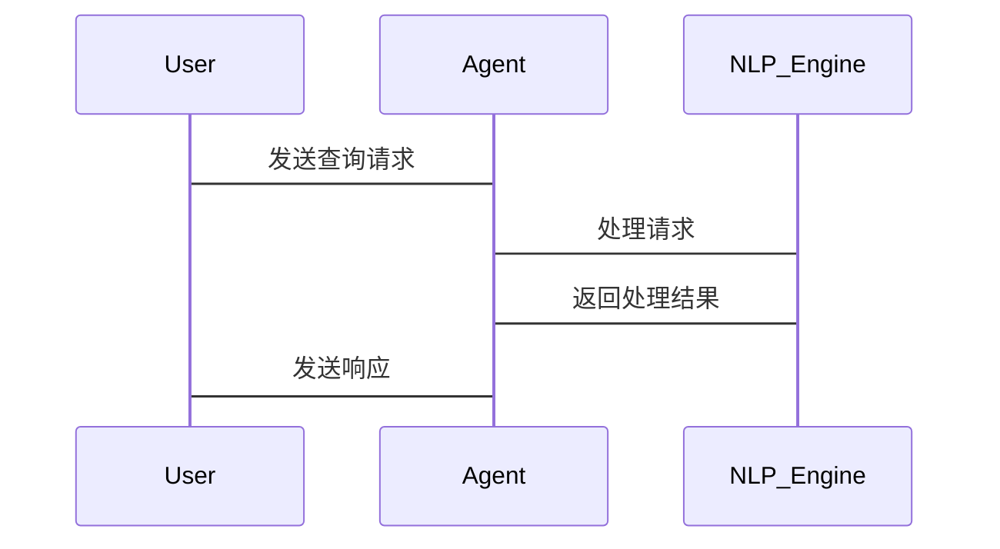

                 


# AI Agent中的自然语言处理应用

## 关键词：
- AI Agent, 自然语言处理, NLP, 对话生成, 意图识别, 情感分析

## 摘要：
本文详细探讨了自然语言处理在AI Agent中的应用，从基本概念到核心算法，再到系统设计和项目实战，全面解析了自然语言处理在AI Agent中的重要作用和具体实现方式。文章结合理论与实践，通过具体案例和代码示例，帮助读者深入理解并掌握相关技术。

---

# 第一部分: AI Agent中的自然语言处理基础

## 第1章: AI Agent与自然语言处理概述

### 1.1 AI Agent的基本概念

#### 1.1.1 AI Agent的定义与特点
AI Agent是一种智能代理，能够感知环境、自主决策并执行任务。其特点包括自主性、反应性、目标导向和学习能力。

#### 1.1.2 自然语言处理在AI Agent中的作用
自然语言处理使AI Agent能够理解和生成人类语言，从而实现人机交互、任务执行等功能。

#### 1.1.3 AI Agent与传统软件的区别
AI Agent具备自主决策和学习能力，能够适应动态环境，而传统软件通常遵循固定的逻辑。

### 1.2 自然语言处理的核心概念

#### 1.2.1 自然语言处理的定义与目标
自然语言处理（NLP）是研究如何让计算机理解和生成人类语言的技术。其目标是实现人机交互的自然语言理解与生成。

#### 1.2.2 自然语言处理的主要任务
包括分词、词性标注、句法分析、语义理解、情感分析等。

#### 1.2.3 自然语言处理与AI Agent的结合
通过NLP，AI Agent能够理解用户的输入、识别意图并生成适当的响应。

### 1.3 AI Agent中的自然语言处理应用背景

#### 1.3.1 当前AI Agent的发展趋势
AI Agent正在向智能化、个性化和多模态方向发展。

#### 1.3.2 自然语言处理在AI Agent中的应用领域
包括智能客服、智能助手、对话机器人等。

#### 1.3.3 自然语言处理面临的挑战与解决方案
数据稀疏性、上下文理解困难等问题，解决方案包括预训练模型和多模态融合。

---

## 第2章: 自然语言处理的核心原理

### 2.1 自然语言处理的数学模型

#### 2.1.1 语言模型的基本概念
语言模型用于预测下一个词的概率分布。

#### 2.1.2 基于概率的自然语言处理模型
如Naive Bayes和马尔可夫模型。

#### 2.1.3 现代深度学习模型的引入
如循环神经网络（RNN）和Transformer模型。

### 2.2 词嵌入与序列建模

#### 2.2.1 词嵌入的定义与作用
词嵌入将词语映射为低维向量，如Word2Vec和GloVe。

#### 2.2.2 常见词嵌入方法
- **Word2Vec**：通过神经网络训练词向量。
- **GloVe**：基于全局词频统计的词向量。

#### 2.2.3 基于序列的自然语言处理模型
- **RNN**：处理序列数据，但存在梯度消失问题。
- **LSTM**：改进版，解决长序列训练问题。
- **Transformer**：基于自注意力机制，性能优越。

### 2.3 自然语言处理中的注意力机制

#### 2.3.1 注意力机制的定义与原理
注意力机制关注输入序列中不同位置的重要性，如在机器翻译中，某些词对译文影响更大。

#### 2.3.2 注意力机制在自然语言处理中的应用
广泛应用于文本生成、机器翻译和文本摘要。

#### 2.3.3 基于Transformer的模型结构
Transformer由编码器和解码器组成，编码器负责理解输入，解码器生成输出。

---

## 第3章: AI Agent中的自然语言处理算法实现

### 3.1 基于深度学习的自然语言处理算法

#### 3.1.1 Transformer模型的结构与特点
- **编码器**：包括多个自注意力层和前馈网络层。
- **解码器**：包括自注意力层和交叉注意力层。

#### 3.1.2 BERT模型的原理
BERT通过预训练任务（如Masked LM和Next Sentence Prediction）学习语言表示。

#### 3.1.3 GPT模型的应用
GPT用于生成文本，适用于对话生成和文本扩展。

---

## 第4章: AI Agent中的自然语言处理系统设计

### 4.1 问题场景介绍

#### 4.1.1 问题背景
AI Agent需要理解用户输入，生成自然的回复。

#### 4.1.2 项目介绍
构建一个基于Transformer的对话生成模型。

### 4.2 系统功能设计

#### 4.2.1 领域模型（Mermaid类图）


#### 4.2.2 系统架构设计（Mermaid架构图）


#### 4.2.3 系统接口设计
- **输入接口**：接收用户输入文本。
- **输出接口**：生成并返回自然语言回复。

#### 4.2.4 系统交互（Mermaid序列图）


---

## 第5章: 项目实战

### 5.1 环境安装

#### 5.1.1 安装Python和必要的库
```bash
pip install numpy
pip install tensorflow
pip install transformers
```

### 5.2 系统核心实现源代码

#### 5.2.1 数据预处理
```python
import numpy as np
from transformers import AutoTokenizer, AutoModelForMaskedLM

tokenizer = AutoTokenizer.from_pretrained('bert-base-uncased')
model = AutoModelForMaskedLM.from_pretrained('bert-base-uncased')
```

#### 5.2.2 模型训练
```python
# 示例代码，展示训练过程
from transformers import TrainingArguments, Trainer
from datasets import Dataset

def compute_loss(...):
    # 自定义损失计算函数
    pass

args = TrainingArguments(...)
trainer = Trainer(model=model, args=args, ...)
trainer.train()
```

#### 5.2.3 对话生成
```python
def generate_response(input_text):
    inputs = tokenizer(input_text, return_tensors='np')
    outputs = model.generate(inputs.input_ids, max_length=50)
    return tokenizer.decode(outputs[0], skip_special_tokens=True)
```

### 5.3 代码应用解读与分析

#### 5.3.1 数据预处理
使用BERT tokenizer对输入文本进行编码。

#### 5.3.2 模型训练
使用预训练的BERT模型进行微调，适用于特定任务。

#### 5.3.3 对话生成
基于训练好的模型生成自然语言回复。

### 5.4 案例分析

#### 5.4.1 案例1：简单的对话生成
用户输入：“今天天气如何？”
系统回复：“今天天气晴朗，适合外出。”

#### 5.4.2 案例2：复杂对话生成
用户输入：“帮我安排明天的会议。”
系统回复：“我会提醒您明天上午10点开会。”

### 5.5 项目小结

#### 5.5.1 项目总结
通过预训练模型和微调，实现了高效的对话生成。

#### 5.5.2 优化建议
增加多轮对话记忆、引入上下文理解机制。

---

## 第6章: 扩展与展望

### 6.1 自然语言处理的前沿研究

#### 6.1.1 多模态对话
结合视觉和听觉信息，提升对话质量。

#### 6.1.2 实时对话生成
优化模型的响应速度和生成质量。

### 6.2 自然语言处理的未来发展趋势

#### 6.2.1 多模态交互
结合其他感官数据，提升用户体验。

#### 6.2.2 个性化对话
基于用户画像，提供定制化服务。

---

## 第7章: 总结

### 7.1 核心内容回顾
从AI Agent的基本概念到自然语言处理的核心原理，再到算法实现和系统设计，最后通过项目实战和扩展阅读，全面探讨了AI Agent中的自然语言处理应用。

### 7.2 注意事项与最佳实践

#### 7.2.1 数据质量
确保数据多样性和代表性，避免模型过拟合。

#### 7.2.2 模型选择
根据具体任务选择合适的模型架构。

### 7.3 拓展阅读

#### 7.3.1 推荐书籍
- 《Deep Learning》
- 《自然语言处理入门》

#### 7.3.2 推荐论文
- "Attention Is All You Need"
- "BERT: Pre-training of Deep Bidirectional Transformers for NLP"

---

## 作者：AI天才研究院

---

以上是关于《AI Agent中的自然语言处理应用》的技术博客文章，涵盖了从基础概念到系统设计再到项目实战的完整流程，帮助读者全面理解自然语言处理在AI Agent中的重要作用和具体实现方式。

