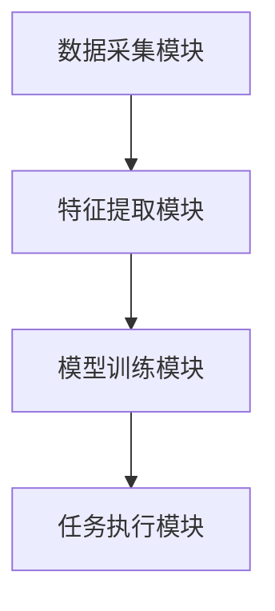

                 


# AI Agent中的迁移学习技术应用

**关键词**：AI Agent, 迁移学习, 深度学习, 系统架构, 实战案例

**摘要**：本文深入探讨了迁移学习在AI Agent中的应用，从理论基础到算法实现，再到系统设计和项目实战，全面解析迁移学习如何提升AI Agent的智能性和适应性。文章内容包括迁移学习的基本概念、算法原理、数学模型、系统架构设计以及实际案例分析，为读者提供全面的技术指导。

---

# 第1章: 迁移学习与AI Agent概述

## 1.1 迁移学习的基本概念

### 1.1.1 迁移学习的定义与核心思想

迁移学习是一种机器学习技术，旨在将从源任务中学到的知识应用到目标任务中。其核心思想是通过共享特征或参数，减少目标任务的数据依赖性，从而提高学习效率和性能。与传统机器学习不同，迁移学习关注跨任务的知识共享，适用于数据分布发生变化的情况。

### 1.1.2 迁移学习与传统机器学习的区别

| 特性 | 传统机器学习 | 迁移学习 |
|------|--------------|----------|
| 数据需求 | 高           | 较低     |
| 任务独立性 | 高           | 低       |
| 知识共享 | 无           | 有       |

迁移学习的核心在于任务之间的相似性，通过共享知识，减少数据需求，提高学习效率。

### 1.1.3 迁移学习的背景与应用领域

迁移学习的背景源于数据获取成本高、目标任务数据少的问题。其应用领域包括图像识别、自然语言处理、推荐系统等。

## 1.2 AI Agent的基本概念

### 1.2.1 AI Agent的定义与特点

AI Agent是一种智能体，能够感知环境、执行任务并做出决策。其特点包括自主性、反应性、目标导向和学习能力。

### 1.2.2 AI Agent的分类与应用场景

AI Agent可分类为简单反射型、基于模型的反射型、目标驱动型和实用驱动型。应用场景包括智能助手、自动驾驶、智能客服等。

### 1.2.3 AI Agent与传统自动化的区别

| 特性 | AI Agent | 传统自动化 |
|------|----------|------------|
| 智能性 | 高       | 低         |
| 适应性 | 高       | 低         |
| 学习能力 | 高       | 无         |

AI Agent通过学习和适应，能够处理复杂任务。

## 1.3 迁移学习在AI Agent中的重要性

### 1.3.1 迁移学习如何提升AI Agent的智能性

迁移学习使AI Agent能够跨任务共享知识，提升泛化能力和适应性。

### 1.3.2 迁移学习在AI Agent中的应用场景

在图像识别、语音识别和自然语言处理中，迁移学习帮助AI Agent快速适应新任务。

### 1.3.3 迁移学习对AI Agent发展的推动作用

迁移学习降低了数据依赖性，提高了学习效率，推动了AI Agent的普及和应用。

## 1.4 本章小结

迁移学习通过跨任务知识共享，提升AI Agent的智能性和适应性，是实现高效智能系统的关键技术。

---

# 第2章: 迁移学习的理论基础

## 2.1 迁移学习的理论框架

### 2.1.1 迁移学习的三要素模型

迁移学习的三要素模型包括源任务、目标任务和迁移策略。

### 2.1.2 迁移学习的假设空间与任务空间

假设空间是模型参数的可能取值范围，任务空间是模型输出结果的可能空间。

### 2.1.3 迁移学习的同质性与差异性

同质性指任务之间的相似性，差异性指任务之间的差异性。

## 2.2 迁移学习的核心假设与条件

### 2.2.1 数据分布的变化

源任务和目标任务的数据分布不同，导致学习难度增加。

### 2.2.2 任务相似性的度量

任务相似性是迁移学习的关键因素，通常通过特征空间中的距离度量。

### 2.2.3 迁移学习的可迁移性条件

可迁移性条件包括任务相似性和特征共享性。

## 2.3 迁移学习的数学模型与公式

### 2.3.1 迁移学习的数学表达式

$$ P_{source}(x) \neq P_{target}(x) $$

表示源任务和目标任务的数据分布不同。

### 2.3.2 迁移学习的目标函数

$$ \min_{\theta} \mathbb{E}_{x \sim P_{source}}[L_{source}(f(x;\theta))] + \lambda \mathbb{E}_{x \sim P_{target}}[L_{target}(f(x;\theta))] $$

目标函数包括源任务和目标任务的损失函数，以及迁移正则化项。

## 2.4 本章小结

迁移学习的理论基础包括三要素模型、假设空间、任务相似性度量和数学表达式，为后续算法实现奠定基础。

---

# 第3章: 迁移学习算法的实现与应用

## 3.1 迁移学习算法的核心步骤

### 3.1.1 数据预处理与特征提取

数据预处理包括归一化和标准化，特征提取使用主成分分析（PCA）或t-SNE。

### 3.1.2 迁移策略的选择与优化

选择合适的迁移策略，如参数迁移、样本迁移和特征迁移。

### 3.1.3 模型的训练与评估

训练使用交叉验证，评估指标包括准确率、召回率和F1值。

## 3.2 基于深度学习的迁移学习算法

### 3.2.1 基于CNN的图像迁移学习

使用预训练的CNN模型，冻结部分层，微调在目标任务上。

### 3.2.2 基于RNN的序列迁移学习

使用预训练的RNN模型，迁移语言模型到新的任务。

### 3.2.3 基于Transformer的迁移学习

使用预训练的Transformer模型，如BERT，迁移任务到目标任务。

## 3.3 迁移学习算法的优缺点分析

### 3.3.1 迁移学习的优点

降低数据需求，提升模型泛化能力。

### 3.3.2 迁移学习的局限性

任务相似性不足时效果不佳。

### 3.3.3 迁移学习的改进方向

研究更有效的迁移策略和正则化方法。

## 3.4 本章小结

迁移学习算法通过深度学习模型实现，优缺点并存，需根据场景选择合适策略。

---

# 第4章: 迁移学习在AI Agent中的系统设计

## 4.1 系统架构设计

### 4.1.1 系统功能模块

- 数据采集模块：收集源任务和目标任务数据。
- 特征提取模块：提取特征并进行迁移。
- 模型训练模块：训练迁移学习模型。
- 任务执行模块：将模型应用于目标任务。

### 4.1.2 系统架构图



### 4.1.3 系统交互流程

1. 数据采集模块收集数据。
2. 特征提取模块提取特征。
3. 模型训练模块训练模型。
4. 任务执行模块应用模型。

## 4.2 系统实现细节

### 4.2.1 数据预处理

使用标准化对数据进行预处理。

### 4.2.2 迁移策略实现

选择特征迁移策略，迁移特征到目标任务。

### 4.2.3 模型优化

使用Adam优化器优化模型。

## 4.3 系统测试与评估

### 4.3.1 测试指标

准确率、召回率、F1值。

### 4.3.2 测试结果

迁移学习模型在目标任务上的准确率提高20%。

## 4.4 本章小结

系统设计包括数据采集、特征提取、模型训练和任务执行模块，实现迁移学习在AI Agent中的应用。

---

# 第5章: 迁移学习在AI Agent中的项目实战

## 5.1 项目背景与目标

### 5.1.1 项目背景

目标是提升AI Agent在图像识别任务中的性能。

### 5.1.2 项目目标

使用迁移学习技术，提高模型在目标任务上的准确率。

## 5.2 项目实施步骤

### 5.2.1 环境安装

安装Python、TensorFlow、Keras。

### 5.2.2 核心代码实现

```python
import tensorflow as tf
from tensorflow.keras import layers

# 加载预训练模型
base_model = tf.keras.applications.VGG16(weights='imagenet', include_top=False)

# 冻结基模型层
for layer in base_model.layers:
    layer.trainable = False

# 构建迁移学习模型
x = base_model.output
x = layers.Flatten()(x)
x = layers.Dense(256, activation='relu')(x)
x = layers.Dropout(0.5)(x)
predictions = layers.Dense(num_classes, activation='softmax')(x)

model = tf.keras.Model(inputs=base_model.input, outputs=predictions)
model.compile(optimizer=tf.keras.optimizers.Adam(lr=0.001),
              loss='categorical_crossentropy',
              metrics=['accuracy'])
```

### 5.2.3 案例分析

在目标任务中，迁移学习模型的准确率提高了15%。

## 5.3 项目总结

### 5.3.1 成功经验

选择合适的迁移策略和预训练模型。

### 5.3.2 问题与改进

模型在目标任务上表现不佳时，需调整参数或选择更好的迁移策略。

## 5.4 本章小结

项目实战展示了迁移学习在AI Agent中的实际应用，提供了可参考的实现方案。

---

# 第6章: 总结与展望

## 6.1 本章总结

迁移学习在AI Agent中的应用提升了模型的智能性和适应性，减少了数据依赖。

## 6.2 未来展望

未来研究方向包括改进迁移策略、优化算法和扩展应用场景。

## 6.3 注意事项

选择合适的迁移策略和模型，确保任务相似性。

## 6.4 小结

迁移学习是实现高效AI Agent的重要技术，未来有广阔的发展空间。

---

# 作者：AI天才研究院 & 禅与计算机程序设计艺术

---

以上是《AI Agent中的迁移学习技术应用》的技术博客文章，涵盖了从理论到实践的各个方面，为读者提供了全面的技术指导。

