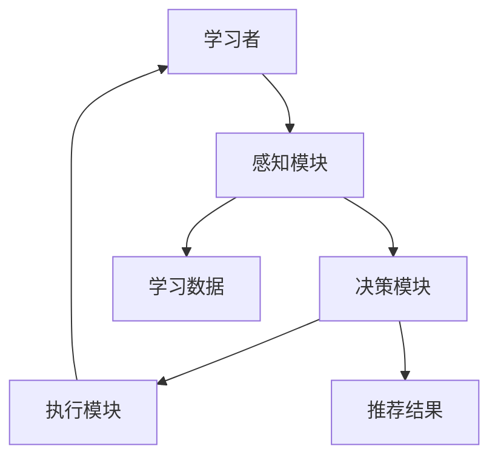

                 


# AI Agent在个性化学习系统中的角色

**关键词：** AI Agent, 个性化学习, 教育技术, 机器学习, 人工智能

**摘要：** 本文探讨AI Agent在个性化学习系统中的角色，分析其感知、决策和执行模块，结合具体算法和系统架构，展示如何通过AI Agent提升学习效果，实现智能化的个性化学习体验。

---

## 第1章: AI Agent的基本概念与个性化学习的背景

### 1.1 AI Agent的定义与特点
#### 1.1.1 AI Agent的定义
AI Agent是一种能够感知环境、自主决策并执行任务的智能体，具备学习、推理和自适应能力。

#### 1.1.2 AI Agent的核心特点
- **自主性**：无需外部干预，自主完成任务。
- **反应性**：实时感知环境并做出反应。
- **学习能力**：通过数据优化决策模型。
- **社交能力**：与用户和其他系统交互协作。

#### 1.1.3 AI Agent与传统软件的区别
| 特性       | AI Agent                     | 传统软件               |
|------------|------------------------------|------------------------|
| 智能性     | 高                           | 低                     |
| 自主性     | 高                           | 低                     |
| 学习能力   | 强                           | 无                     |
| 适应性     | 强                           | 低                     |

### 1.2 个性化学习的背景与需求
#### 1.2.1 个性化学习的定义
个性化学习指根据学习者的特性（兴趣、能力、学习风格）提供定制化学习方案。

#### 1.2.2 当前教育中的个性化学习挑战
- **学习者差异大**：不同学生的学习需求和能力差异显著。
- **资源有限**：教师难以手动为每个学生制定个性化计划。
- **数据孤岛**：学习数据分散，难以有效整合。

#### 1.2.3 AI Agent在个性化学习中的应用潜力
AI Agent能够实时分析学习者的行为和数据，提供即时反馈和个性化建议，优化学习路径。

### 1.3 AI Agent在个性化学习中的角色
#### 1.3.1 AI Agent在个性化学习中的功能定位
AI Agent作为个性化学习系统的中枢，负责数据收集、分析和执行。

#### 1.3.2 AI Agent如何实现个性化学习目标
通过感知学习者的行为和反馈，AI Agent利用机器学习模型推荐合适的学习资源和策略。

#### 1.3.3 AI Agent在个性化学习系统中的边界与外延
AI Agent的边界包括数据收集范围和决策权限，外延则涉及与其他系统的集成。

### 1.4 本章小结
本章介绍了AI Agent的基本概念和个性化学习的背景，强调了AI Agent在个性化学习中的重要性及其核心角色。

---

## 第2章: AI Agent的核心概念与原理

### 2.1 AI Agent的感知模块
#### 2.1.1 感知模块的定义与功能
感知模块负责收集学习者的行为数据，如点击率、完成时间等。

#### 2.1.2 常见的感知技术与方法
- **数据采集**：通过日志记录学习者的操作。
- **自然语言处理**：分析学习者的反馈文本。

#### 2.1.3 感知模块在个性化学习中的应用
实时监测学习者的参与度，识别学习障碍。

### 2.2 AI Agent的决策模块
#### 2.2.1 决策模块的定义与功能
基于感知数据，利用机器学习模型生成推荐。

#### 2.2.2 常见的决策算法与模型
- **协同过滤**：基于用户相似性推荐内容。
- **深度学习**：使用神经网络预测学习效果。

#### 2.2.3 决策模块在个性化学习中的应用
推荐适合的学习材料和路径，优化学习效率。

### 2.3 AI Agent的执行模块
#### 2.3.1 执行模块的定义与功能
将决策结果转化为具体行动，如调整学习计划。

#### 2.3.2 常见的执行策略与方法
- **自动化推荐**：实时推送学习资源。
- **动态调整**：根据反馈优化执行策略。

#### 2.3.3 执行模块在个性化学习中的应用
动态调整学习内容和节奏，提升学习效果。

### 2.4 AI Agent各模块之间的关系与协作
AI Agent的感知、决策和执行模块协同工作，确保个性化学习系统的高效运作。

---

## 第3章: AI Agent在个性化学习中的算法原理

### 3.1 算法选择与流程
#### 3.1.1 算法选择
基于知识图谱的推荐算法结合协同过滤，实现精准推荐。

#### 3.1.2 算法流程
1. 数据预处理：清洗和标注数据。
2. 知识图谱构建：建立学习内容的语义网络。
3. 推荐计算：计算内容相似度，生成推荐列表。

### 3.2 算法实现
```python
def calculate_cosine_similarity(vector1, vector2):
    dot_product = sum(v1 * v2 for v1, v2 in zip(vector1, vector2))
    magnitude1 = sum(v1**2 for v1 in vector1) ** 0.5
    magnitude2 = sum(v2**2 for v2 in vector2) ** 0.5
    if magnitude1 == 0 or magnitude2 == 0:
        return 0.0
    return dot_product / (magnitude1 * magnitude2)
```

### 3.3 算法优化
使用深度学习模型如BERT进行内容理解和推荐，提升推荐精度。

---

## 第4章: 系统分析与架构设计

### 4.1 系统架构图


### 4.2 系统功能模块
- **用户画像**：构建学习者档案。
- **内容推荐**：基于算法推荐资源。
- **学习路径优化**：动态调整学习计划。

### 4.3 接口设计
- **数据接口**：与学习管理系统集成。
- **用户接口**：提供个性化推荐界面。

---

## 第5章: 项目实战

### 5.1 环境安装
安装Python和必要的库（如numpy、pandas、scikit-learn）。

### 5.2 核心代码实现
```python
import numpy as np
from sklearn.metrics.pairwise import cosine_similarity

def main():
    user_profiles = load_user_profiles()
    content_features = extract_content_features()
    similarities = cosine_similarity(user_profiles, content_features)
    recommend(similarities)

if __name__ == "__main__":
    main()
```

### 5.3 代码解读与实际案例分析
通过案例分析，展示如何利用AI Agent优化学习路径，提升学习效果。

### 5.4 项目小结
总结项目成果，强调AI Agent在个性化学习中的实际应用价值。

---

## 第6章: 最佳实践与注意事项

### 6.1 实践小结
AI Agent的应用提升了学习效果，但需要考虑数据质量和隐私保护。

### 6.2 注意事项
- 数据隐私保护
- 模型调优与优化
- 多模态数据的处理

### 6.3 拓展阅读
推荐相关书籍和资源，供读者深入学习。

---

## 结语

AI Agent在个性化学习中的应用前景广阔，通过不断优化算法和系统架构，未来将实现更智能、更高效的个性化学习体验。

---

**作者：AI天才研究院/AI Genius Institute & 禅与计算机程序设计艺术 /Zen And The Art of Computer Programming**

---

本文通过系统地分析AI Agent在个性化学习中的角色，结合理论与实践，展示了如何利用AI技术提升学习效果，为教育技术的发展提供了新的思路。

