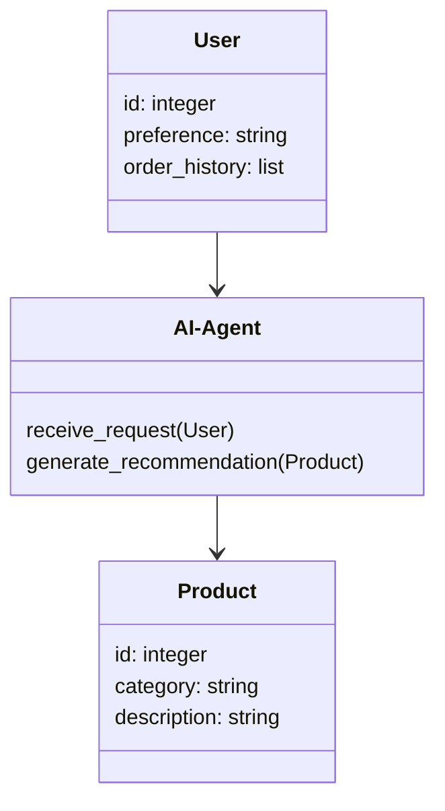
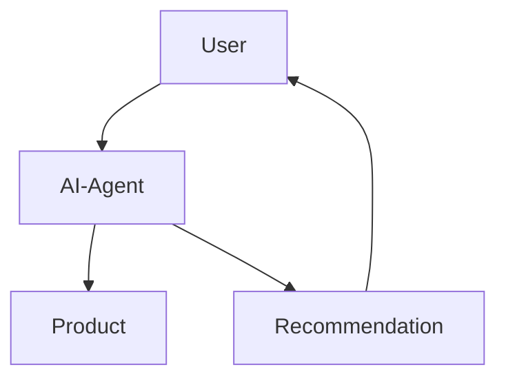
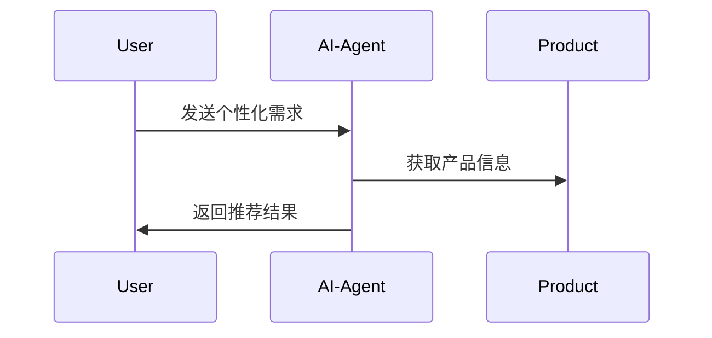

                 


# AI Agent在产品个性化定制中的创新应用

## 关键词：AI Agent, 产品个性化定制, 强化学习, 算法原理, 系统架构设计

## 摘要：AI Agent作为人工智能技术的重要组成部分，正在逐步改变产品个性化定制的方式。本文通过分析AI Agent的核心概念、算法原理、系统架构设计以及实际应用案例，详细探讨了AI Agent在产品个性化定制中的创新应用，为读者提供了一套完整的理论与实践框架。

---

## 第1章: AI Agent与产品个性化定制概述

### 1.1 AI Agent的基本概念与背景

#### 1.1.1 什么是AI Agent
AI Agent（人工智能代理）是一种能够感知环境、自主决策并执行任务的智能实体。它通过接收输入数据，分析理解用户需求，并输出相应的定制化结果。AI Agent的核心在于其智能化和自动化能力，能够根据实时数据动态调整行为。

#### 1.1.2 AI Agent的核心特点
- **自主性**：AI Agent能够在没有外部干预的情况下自主运行。
- **反应性**：能够实时感知环境变化并做出反应。
- **学习能力**：通过数据和反馈不断优化自身行为。
- **协作性**：能够与其他系统或用户协同工作。

#### 1.1.3 产品个性化定制的定义与目标
产品个性化定制是指根据用户的特定需求，定制化生成符合用户期望的产品或服务。其目标是提高用户体验，降低试错成本，提升产品竞争力。

### 1.2 AI Agent在产品定制中的应用背景

#### 1.2.1 当前产品定制化的需求趋势
随着市场竞争的加剧，用户对个性化产品的需求日益增长。传统的产品定制方式效率低、成本高，难以满足用户的实时需求。

#### 1.2.2 AI技术在产品定制中的优势
AI技术能够通过数据分析、模式识别和自动化决策，快速生成符合用户需求的产品方案。

#### 1.2.3 AI Agent在个性化定制中的创新价值
AI Agent通过实时分析用户需求和市场数据，能够动态调整产品设计方案，实现高效、精准的个性化定制。

---

## 第2章: AI Agent的核心概念与原理

### 2.1 AI Agent的基本原理

#### 2.1.1 AI Agent的感知与决策机制
AI Agent通过传感器或数据接口获取环境信息，利用算法进行分析，生成决策并执行操作。

#### 2.1.2 基于强化学习的AI Agent行为模型
强化学习是一种通过试错机制优化决策的算法。AI Agent通过与环境的交互，不断优化自身行为策略。

#### 2.1.3 AI Agent的自适应能力与进化特性
AI Agent能够根据环境变化和用户反馈，不断优化自身的决策模型，实现自适应进化。

### 2.2 AI Agent与产品个性化定制的关系

#### 2.2.1 AI Agent在产品定制中的角色定位
AI Agent作为个性化定制的核心驱动力，负责需求分析、方案生成和优化调整。

#### 2.2.2 个性化需求的动态捕捉与分析
AI Agent能够实时捕捉用户的个性化需求，并通过数据分析和模式识别，生成定制化方案。

#### 2.2.3 AI Agent驱动的产品定制流程优化
通过AI Agent的智能化决策，产品定制流程得以简化，效率和精准度显著提升。

### 2.3 AI Agent的核心算法与数学模型

#### 2.3.1 强化学习算法在AI Agent中的应用
强化学习通过试错机制优化AI Agent的行为策略，常用算法包括Q-learning、Deep Q-Network（DQN）等。

#### 2.3.2 Q-learning算法的数学公式与实现
$$ Q(s,a) = r + \gamma \max Q(s',a') $$

#### 2.3.3 贝叶斯网络在个性化定制中的应用
贝叶斯网络通过概率推理，帮助AI Agent进行不确定性分析和决策优化。

---

## 第3章: AI Agent在产品个性化定制中的核心算法

### 3.1 基于强化学习的个性化推荐算法

#### 3.1.1 DQN算法在产品推荐中的应用
DQN（Deep Q-Network）算法通过深度神经网络近似Q值函数，实现高效的决策优化。

#### 3.1.2 算法实现与代码示例
```python
class DQN:
    def __init__(self, state_space, action_space):
        self.state_space = state_space
        self.action_space = action_space
        self.q_table = np.zeros((state_space, action_space))
```

### 3.2 基于协同过滤的个性化定制算法

#### 3.2.1 协同过滤的基本原理
协同过滤通过分析用户行为数据，找到相似用户的偏好，推荐相似产品。

#### 3.2.2 算法实现与数学公式
$$ sim(i,j) = \frac{\sum_{k=1}^n (r_{ik} - \bar{r_i})(r_{jk} - \bar{r_j})}{\sqrt{\sum_{k=1}^n (r_{ik} - \bar{r_i})^2} \sqrt{\sum_{k=1}^n (r_{jk} - \bar{r_j})^2}}} $$

---

## 第4章: 系统分析与架构设计

### 4.1 问题场景介绍
以电商平台的产品推荐为例，用户希望根据自身偏好，快速获取个性化产品推荐。

### 4.2 系统功能设计

#### 4.2.1 领域模型设计


### 4.3 系统架构设计

#### 4.3.1 系统架构图


### 4.4 系统交互设计

#### 4.4.1 系统交互流程图


---

## 第5章: 项目实战

### 5.1 环境安装

#### 5.1.1 安装Python环境
```bash
python --version
pip install numpy
pip install gym
```

### 5.2 系统核心实现源代码

#### 5.2.1 DQN算法实现
```python
import numpy as np

class DQN:
    def __init__(self, state_space, action_space):
        self.state_space = state_space
        self.action_space = action_space
        self.q_table = np.zeros((state_space, action_space))
        self.learning_rate = 0.1
        self.gamma = 0.9

    def act(self, state):
        return np.argmax(self.q_table[state])

    def remember(self, state, action, reward, next_state):
        self.q_table[state][action] += self.learning_rate * (reward + self.gamma * np.max(self.q_table[next_state]))

    def get_action(self, state):
        return self.act(state)
```

### 5.3 案例分析与详细解读

#### 5.3.1 案例分析
以电商平台为例，AI Agent根据用户的浏览记录和偏好，实时推荐个性化产品。

#### 5.3.2 代码应用解读
通过DQN算法，AI Agent不断优化推荐策略，提高推荐精准度。

---

## 第6章: 总结与展望

### 6.1 本章小结
本文详细探讨了AI Agent在产品个性化定制中的创新应用，从理论到实践，为读者提供了完整的解决方案。

### 6.2 未来展望
随着AI技术的不断发展，AI Agent在产品个性化定制中的应用将更加广泛和深入。

### 6.3 注意事项
在实际应用中，需注意数据隐私、算法优化和用户体验等问题。

### 6.4 最佳实践 Tips
- 定期更新模型参数，确保推荐的精准度。
- 结合用户反馈，动态优化推荐策略。

---

## 作者：AI天才研究院/AI Genius Institute & 禅与计算机程序设计艺术 /Zen And The Art of Computer Programming

