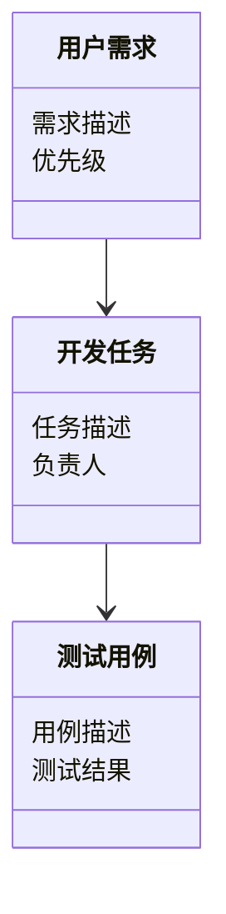
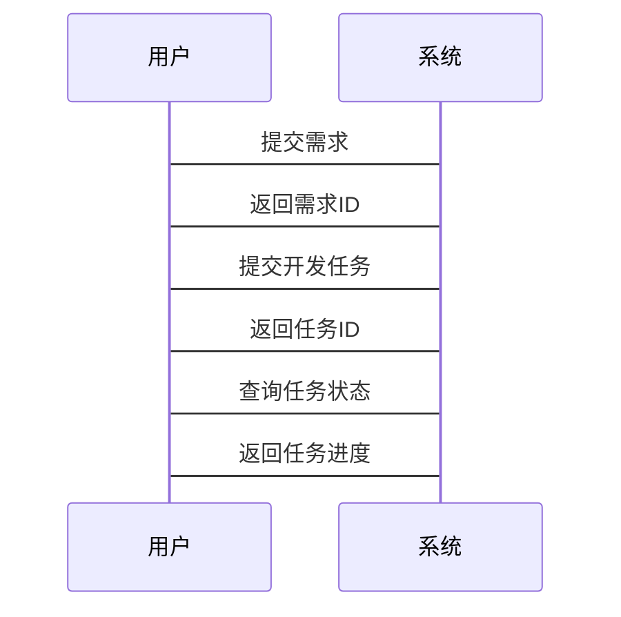

                 


# AI Agent在产品生命周期管理中的全面应用

## 关键词：AI Agent、产品生命周期管理、人工智能、自动化工具、系统架构、机器学习、强化学习

## 摘要：  
本文深入探讨AI Agent在产品生命周期管理中的全面应用，从理论到实践，系统地分析了AI Agent的核心原理、技术实现及其在产品设计、开发、发布和维护等各阶段的具体应用场景。通过详细的技术分析、系统架构设计和项目实战案例，本文展示了如何利用AI Agent优化产品生命周期管理的效率和质量。  

---

## 第1章: AI Agent与产品生命周期管理概述

### 1.1 AI Agent的基本概念  
#### 1.1.1 AI Agent的定义与特点  
AI Agent（人工智能代理）是指能够感知环境、自主决策并执行任务的智能实体。其特点包括：  
- **自主性**：能够独立执行任务，无需人工干预。  
- **反应性**：能够实时感知环境变化并做出响应。  
- **目标导向**：基于目标进行决策和行动。  

#### 1.1.2 AI Agent的核心原理  
AI Agent的核心原理包括：  
1. **感知**：通过传感器或数据输入感知环境状态。  
2. **决策**：基于感知信息，利用算法（如机器学习、强化学习）做出决策。  
3. **执行**：根据决策结果执行动作。  

#### 1.1.3 AI Agent与传统自动化工具的区别  
AI Agent与传统自动化工具的主要区别在于其智能化和适应性。传统工具基于固定的规则执行任务，而AI Agent能够学习和适应环境变化。  

### 1.2 产品生命周期管理的概述  
#### 1.2.1 产品生命周期的定义与阶段划分  
产品生命周期包括以下阶段：  
1. **设计阶段**：需求分析、原型设计、方案评审。  
2. **开发阶段**：编码实现、单元测试、集成测试。  
3. **发布阶段**：产品上线、市场推广、用户反馈。  
4. **维护阶段**：bug修复、功能优化、版本迭代。  

#### 1.2.2 产品生命周期管理的重要性  
产品生命周期管理的重要性体现在：  
- **提高效率**：通过系统化管理减少重复工作。  
- **提升质量**：通过自动化测试和优化确保产品质量。  
- **降低成本**：通过资源优化和风险控制降低开发成本。  

#### 1.2.3 传统产品生命周期管理的挑战  
传统产品生命周期管理的挑战包括：  
- **效率低下**：人工操作繁琐，容易出错。  
- **信息孤岛**：各部门间数据不通，协作困难。  
- **决策延迟**：缺乏实时数据支持，决策滞后。  

### 1.3 AI Agent在产品生命周期管理中的应用价值  
#### 1.3.1 提高效率与准确性  
AI Agent能够自动化处理重复性任务，减少人工干预，提高效率和准确性。  

#### 1.3.2 实现智能化决策  
AI Agent能够基于实时数据和历史经验，提供智能化的决策支持。  

#### 1.3.3 优化资源分配与协同  
AI Agent能够协调各部门资源，优化任务分配，提升协作效率。  

---

## 第2章: AI Agent的核心原理与技术  

### 2.1 AI Agent的核心原理  
#### 2.1.1 感知与理解  
AI Agent通过自然语言处理技术（如NLP）感知环境信息，例如从用户反馈中提取情感倾向。  

#### 2.1.2 决策与规划  
AI Agent利用强化学习算法（如Q-learning）进行决策优化，例如在产品设计阶段选择最优的开发路径。  

#### 2.1.3 执行与反馈  
AI Agent通过执行动作（如生成代码）并根据反馈结果（如测试结果）调整策略。  

### 2.2 AI Agent的关键技术  
#### 2.2.1 自然语言处理  
自然语言处理（NLP）技术用于理解用户的输入并生成自然语言回复。例如，使用BERT模型进行文本分类。  

#### 2.2.2 机器学习与深度学习  
机器学习（如监督学习、无监督学习）用于模式识别和分类，深度学习（如神经网络）用于复杂模式的学习。  

#### 2.2.3 强化学习与决策优化  
强化学习用于在复杂环境中做出最优决策，例如在产品开发阶段优化资源分配。  

### 2.3 AI Agent的实现框架  
#### 2.3.1 模块化设计  
AI Agent通常采用模块化设计，例如感知模块、决策模块、执行模块。  

#### 2.3.2 事件驱动机制  
AI Agent通过事件驱动机制响应环境变化，例如收到用户反馈后触发优化任务。  

#### 2.3.3 知识库与规则引擎  
AI Agent依赖知识库（如知识图谱）和规则引擎（如专家系统）进行推理和决策。  

---

## 第3章: AI Agent在产品生命周期各阶段的应用  

### 3.1 产品设计阶段  
#### 3.1.1 设计辅助工具  
AI Agent可以作为设计辅助工具，提供实时反馈和优化建议。例如，使用AI生成设计原型。  

#### 3.1.2 需求分析与优化  
AI Agent能够分析用户需求并生成优化方案，例如通过NLP技术提取关键词并生成需求文档。  

#### 3.1.3 设计验证与测试  
AI Agent可以自动进行设计验证和测试，例如通过模拟用户行为测试系统稳定性。  

### 3.2 产品开发阶段  
#### 3.2.1 开发进度监控  
AI Agent可以实时监控开发进度并预测潜在风险，例如通过机器学习模型预测任务完成时间。  

#### 3.2.2 质量控制与优化  
AI Agent能够自动进行代码审查和测试，例如使用静态分析工具检测潜在缺陷。  

#### 3.2.3 资源分配与协同  
AI Agent可以协调开发资源，优化任务分配，例如通过优化算法分配开发任务。  

### 3.3 产品发布阶段  
#### 3.3.1 市场预测与策略制定  
AI Agent可以基于市场数据制定发布策略，例如通过强化学习优化市场推广策略。  

#### 3.3.2 用户行为分析与反馈  
AI Agent可以分析用户行为并生成反馈报告，例如通过数据分析工具生成用户满意度报告。  

#### 3.3.3 售后服务优化  
AI Agent可以优化售后服务流程，例如通过智能客服系统提供实时支持。  

### 3.4 产品维护与退市阶段  
#### 3.4.1 维护策略优化  
AI Agent可以制定维护策略，例如通过机器学习模型预测潜在故障。  

#### 3.4.2 数据分析与总结  
AI Agent可以分析产品表现并生成总结报告，例如通过数据挖掘技术提取关键指标。  

#### 3.4.3 资源释放与优化  
AI Agent可以优化资源释放，例如通过自动化工具清理不再需要的资源。  

---

## 第4章: 系统架构与设计实现  

### 4.1 问题场景介绍  
本章以智能音箱开发为例，介绍AI Agent在产品生命周期管理中的系统架构与设计实现。  

### 4.2 系统功能设计  
#### 4.2.1 领域模型设计  
领域模型包括用户需求、开发任务、测试用例等核心要素，通过mermaid类图展示如下：  



#### 4.2.2 系统架构设计  
系统架构设计采用分层架构，包括数据层、服务层和应用层，通过mermaid架构图展示如下：  


#### 4.2.3 系统接口设计  
系统接口设计采用RESTful API，例如：  
- GET /api/users：获取用户信息  
- POST /api/tasks：提交开发任务  

#### 4.2.4 系统交互设计  
系统交互流程通过mermaid序列图展示如下：  



---

## 第5章: 项目实战  

### 5.1 环境安装  
项目实战基于Python 3.8及以上版本，需要安装以下库：  
- `numpy`：版本>=1.20  
- `pandas`：版本>=1.3  
- `scikit-learn`：版本>=0.24  

### 5.2 系统核心实现  
#### 5.2.1 AI Agent实现  
以下是AI Agent的核心代码实现：  

```python
import numpy as np
from sklearn import linear_model

# 示例：需求优先级预测
def predict_priority(features):
    model = linear_model.LinearRegression()
    model.fit(features, labels)  # 假设labels已训练好
    return model.predict(features)
```

#### 5.2.2 产品开发阶段实现  
以下是产品开发阶段的实现代码：  

```python
# 示例：任务分配
def assign_task(devices, tasks):
    # 假设devices是开发人员列表，tasks是任务列表
    return {device: task for device, task in zip(devices, tasks)}
```

### 5.3 代码应用解读与分析  
上述代码展示了AI Agent在需求优先级预测和任务分配中的具体实现，通过机器学习算法优化资源分配。  

### 5.4 案例分析与详细讲解  
以智能音箱开发为例，AI Agent可以优化需求分析、任务分配和测试用例生成流程，显著提高开发效率。  

---

## 第6章: 最佳实践与总结  

### 6.1 应用价值总结  
AI Agent在产品生命周期管理中的应用价值包括：  
- **提高效率**：自动化处理重复性任务。  
- **提升质量**：智能化决策和优化。  
- **降低成本**：资源优化和风险控制。  

### 6.2 实施中的注意事项  
- **数据质量**：确保输入数据的准确性和完整性。  
- **算法选择**：根据具体场景选择合适的算法。  
- **系统集成**：确保AI Agent与现有系统的兼容性。  

### 6.3 拓展阅读  
推荐阅读以下书籍和资料：  
- 《机器学习实战》  
- 《深度学习》  
- 《软件工程：实践者篇》  

---

## 作者：AI天才研究院/AI Genius Institute & 禅与计算机程序设计艺术 /Zen And The Art of Computer Programming

