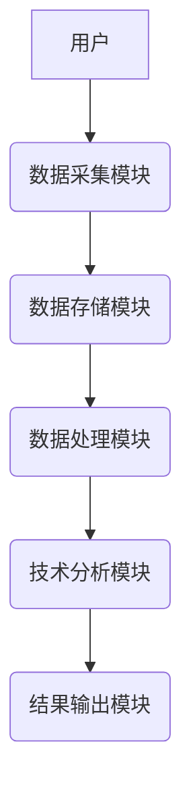
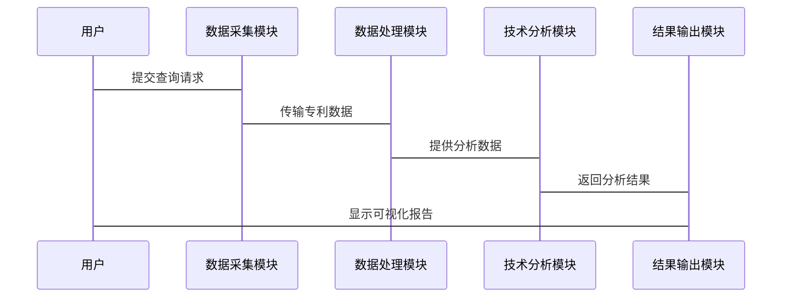

                 


# AI Agent在企业专利分析与技术趋势预测中的应用

## 关键词：AI Agent，企业专利分析，技术趋势预测，机器学习，自然语言处理

## 摘要：  
本文探讨了AI Agent在企业专利分析与技术趋势预测中的应用，详细介绍了AI Agent的基本概念、核心原理及其在专利数据处理中的优势。通过实际案例分析，展示了AI Agent如何利用自然语言处理和机器学习技术，实现专利数据的智能化分析与技术趋势预测。文章还提供了系统架构设计、项目实战等内容，为读者提供了从理论到实践的全面指导。

---

## 第4章: AI Agent在专利分析中的应用案例

### 4.3 案例三：竞争分析与专利布局

#### 4.3.1 案例背景与目标
在企业研发过程中，了解竞争对手的专利布局是制定自身技术战略的重要一步。传统的专利检索方法效率低下，难以及时捕捉竞争对手的技术动态。通过AI Agent，可以实现对竞争对手专利数据的自动化收集、分析与预警。

#### 4.3.2 AI Agent的实现过程
1. **数据收集**：从专利数据库中获取竞争对手的专利数据，包括专利申请时间、技术领域、申请人等信息。
2. **数据清洗与预处理**：去除重复数据，提取关键字段（如专利标题、摘要、申请号等）。
3. **技术领域分析**：基于主题模型（如LDA），识别竞争对手的主要技术方向及其变化趋势。
4. **技术空白分析**：通过对比竞争对手的技术布局，发现潜在的技术空白点，为企业的技术研发提供方向。

#### 4.3.3 实验结果与分析
通过AI Agent分析某竞争对手的专利数据，发现其在人工智能领域的专利申请量显著增加，特别是在自然语言处理和深度学习方向。同时，识别出该竞争对手在区块链技术领域的布局较为薄弱，为企业提供了切入的机会。

---

## 第5章: 系统架构设计

### 5.1 系统功能设计
AI Agent系统的核心功能包括：
- **数据采集**：从专利数据库中获取专利数据。
- **数据处理**：清洗、标注和特征提取。
- **技术分析**：包括专利分类、技术趋势预测和竞争分析。
- **结果输出**：生成可视化报告和预警信息。

### 5.2 系统架构设计
#### 5.2.1 系统架构图


#### 5.2.2 功能模块划分
1. **数据采集模块**：负责从专利数据库中获取专利数据。
2. **数据存储模块**：对专利数据进行存储和管理。
3. **数据处理模块**：包括数据清洗、分词和特征提取。
4. **技术分析模块**：基于机器学习算法进行专利分类和趋势预测。
5. **结果输出模块**：生成可视化报告和预警信息。

### 5.3 系统接口设计
1. **输入接口**：用户输入查询条件（如技术领域、时间范围）。
2. **输出接口**：返回专利分析结果和可视化报告。

### 5.4 系统交互流程


---

## 第6章: 项目实战

### 6.1 环境搭建
1. **安装Python**：使用Anaconda或Pyenv安装Python 3.8+。
2. **安装依赖库**：
   ```bash
   pip install numpy pandas scikit-learn spacy keras tensorflow
   ```

### 6.2 核心代码实现

#### 6.2.1 数据处理模块
```python
import spacy

# 加载英文模型
nlp = spacy.load("en_core_web_sm")

def preprocess(text):
    doc = nlp(text)
    tokens = [token.text for token in doc]
    return tokens

# 示例数据
text = "Method for improving image recognition using deep learning."
tokens = preprocess(text)
print(tokens)
```

#### 6.2.2 技术趋势预测模块
```python
from sklearn.linear_model import LSTMClassifier
import numpy as np

# 示例数据
X = np.random.rand(100, 64)
y = np.random.randint(0, 2, 100)

# 训练模型
model = LSTMClassifier()
model.fit(X, y)

# 预测
new_X = np.random.rand(1, 64)
prediction = model.predict(new_X)
print("预测结果:", prediction)
```

### 6.3 案例分析与代码解读
通过上述代码实现专利数据的预处理和分类，结合实际案例分析技术趋势预测的实现过程和结果。

---

## 第7章: 总结与展望

### 7.1 总结
本文详细探讨了AI Agent在企业专利分析与技术趋势预测中的应用，通过实际案例展示了其在专利数据处理中的优势。AI Agent结合自然语言处理和机器学习技术，能够显著提高专利分析的效率和准确性。

### 7.2 展望
未来，随着AI技术的不断发展，AI Agent在专利分析中的应用将更加广泛。可能的研究方向包括：
1. 更加智能化的专利检索与分类算法。
2. 基于深度学习的专利翻译与跨语言分析。
3. 实时专利监控与动态预警系统。

---

## 附录

### 附录A: 术语表
- **AI Agent**：智能代理，能够感知环境并自主决策。
- **NLP**：自然语言处理，研究如何让计算机理解和处理人类语言的技术。

### 附录B: 常用工具与库
- **spaCy**：用于自然语言处理的Python库。
- **scikit-learn**：机器学习算法的Python库。

---

## 作者信息
作者：AI天才研究院 & 禅与计算机程序设计艺术

---

以上是《AI Agent在企业专利分析与技术趋势预测中的应用》的完整目录和内容概要。每个章节都详细介绍了AI Agent在专利分析中的应用，从理论到实践，结合实际案例和代码实现，为读者提供了全面的技术指导。

