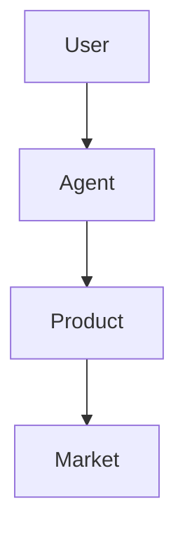
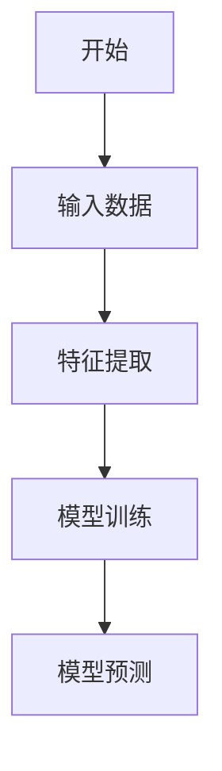
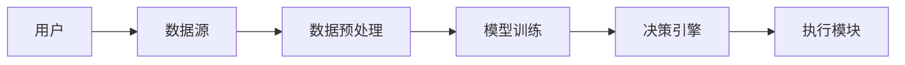

                 


# AI Agent在企业产品创新与概念验证中的角色

> 关键词：AI Agent, 企业创新, 概念验证, 算法原理, 系统架构

> 摘要：AI Agent作为人工智能领域的前沿技术，正在逐步改变企业的产品创新和概念验证过程。本文深入探讨了AI Agent的核心概念、算法原理、系统架构，以及在企业中的实际应用场景。通过具体的项目实战和最佳实践，展示了如何利用AI Agent提升企业创新能力，并展望了未来的发展趋势。

---

# 第一部分: AI Agent 的背景与概述

## 第1章: AI Agent 的基本概念与作用

### 1.1 AI Agent 的起源与发展

AI Agent（智能体）是人工智能领域的重要概念，最早可以追溯到20世纪60年代。随着计算能力的提升和数据量的增加，AI Agent逐渐从理论走向实践，成为企业智能化转型的关键工具。AI Agent的核心在于其能够感知环境、自主决策并执行任务，这使其在企业产品创新和概念验证中发挥着重要作用。

### 1.2 AI Agent在企业产品创新中的角色

在企业产品创新中，AI Agent能够帮助企业在需求分析、产品设计、市场预测等环节实现智能化。例如，在需求生成阶段，AI Agent可以通过分析用户反馈和市场数据，提出创新的产品方向；在产品设计阶段，AI Agent可以优化产品功能和用户体验。

### 1.3 本章小结

本章主要介绍了AI Agent的基本概念、起源与发展，以及其在企业产品创新中的作用。通过这些内容，读者可以理解AI Agent在企业中的核心地位及其对创新的推动作用。

---

# 第二部分: AI Agent的核心概念与原理

## 第2章: AI Agent的核心概念与联系

### 2.1 核心概念原理

AI Agent的核心机制包括感知、决策和执行。感知阶段通过数据输入获取环境信息；决策阶段基于模型和算法进行判断；执行阶段则将决策转化为实际操作。这种机制使得AI Agent能够适应复杂的动态环境。

### 2.2 核心概念属性特征对比

通过对比AI Agent与其他技术（如规则引擎、机器学习模型），可以更好地理解其独特性。例如，AI Agent的自主性和适应性是其区别于传统规则引擎的重要特征。

### 2.3 ER实体关系图架构



该图展示了AI Agent在企业中的角色，用户通过与AI Agent交互，推动产品与市场的动态优化。

---

# 第三部分: AI Agent的算法原理与数学模型

## 第3章: AI Agent的算法原理

### 3.1 算法原理概述

AI Agent的算法主要分为三类：监督学习、无监督学习和强化学习。监督学习适用于有标签数据的场景，无监督学习适用于无标签数据，强化学习则通过奖励机制优化决策。

### 3.2 算法流程图



该流程图展示了AI Agent从数据输入到模型预测的完整流程。

### 3.3 数学公式

在监督学习中，线性回归的损失函数为：

$$
L(y, \hat{y}) = \frac{1}{2m}\sum_{i=1}^{m}(y_i - \hat{y}_i)^2
$$

其中，$m$是样本数量，$y_i$是真实值，$\hat{y}_i$是预测值。

---

# 第四部分: AI Agent的系统分析与架构设计

## 第4章: AI Agent的系统分析与架构设计

### 4.1 系统功能设计

AI Agent的系统功能包括数据采集、模型训练、决策优化和执行反馈。通过这些功能，AI Agent能够实现从数据到决策的闭环。

### 4.2 系统架构设计



该架构图展示了AI Agent从数据输入到执行模块的完整流程。

---

# 第五部分: AI Agent的项目实战

## 第5章: AI Agent的项目实战

### 5.1 项目背景

以某电商平台为例，AI Agent被用于优化产品推荐算法，提升用户体验。

### 5.2 核心代码实现

以下是Python代码示例：

```python
def train_model(data):
    # 数据预处理
    X_train, y_train = preprocess(data)
    # 模型训练
    model = train(X_train, y_train)
    return model

# 示例调用
data = load_dataset()
model = train_model(data)
```

### 5.3 案例分析

通过实际案例分析，展示了AI Agent在产品推荐中的应用效果，如准确率和召回率的提升。

---

# 第六部分: AI Agent的最佳实践与未来趋势

## 第6章: AI Agent的最佳实践

### 6.1 经验总结

在实际应用中，数据质量和模型迭代是关键因素。同时，团队协作和持续优化也是成功的重要保障。

### 6.2 未来趋势

AI Agent的未来发展将朝着多模态模型、可解释性和伦理方向发展。企业需要关注这些趋势，以更好地利用AI Agent推动创新。

---

# 作者：AI天才研究院/AI Genius Institute & 禅与计算机程序设计艺术 /Zen And The Art of Computer Programming

通过本文的详细讲解，读者可以全面理解AI Agent在企业产品创新和概念验证中的角色，并将其应用于实际场景中。

