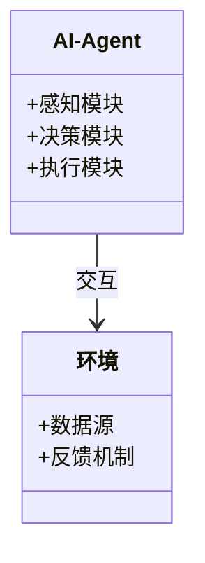
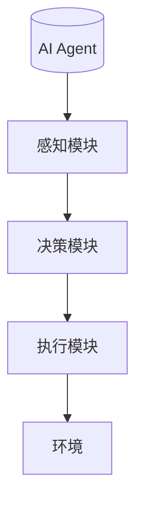

                 


# AI Agent在企业产品创新与概念验证中的角色定位

> 关键词：AI Agent, 企业创新, 概念验证, 系统架构, 算法原理

> 摘要：本文探讨AI Agent在企业产品创新与概念验证中的角色定位，分析其核心概念、工作原理、算法基础、系统架构以及实际应用案例。通过详细讲解，帮助读者理解AI Agent如何助力企业创新，并提供实际的项目指导。

---

# 第1章 引言与背景

## 1.1 AI Agent的基本概念

AI Agent（人工智能代理）是指具备感知环境、做出决策并执行动作的智能实体。它能够根据输入的信息，通过内部算法处理，输出相应的决策或行动。与传统的AI系统相比，AI Agent更加注重动态环境中的自主决策能力。

### 1.1.1 AI Agent的特点
- **自主性**：能够在没有外部干预的情况下独立运作。
- **反应性**：能够实时感知环境变化并做出响应。
- **目标导向**：具备明确的目标，所有行为围绕目标展开。
- **学习能力**：通过数据和经验不断优化自身的决策能力。

### 1.1.2 AI Agent与传统AI的区别
传统的AI系统通常专注于特定任务，如语音识别或图像分类，而AI Agent则是一个动态的、能够适应环境变化的实体，具备更强的自主性和目标导向性。

## 1.2 企业产品创新与概念验证的背景

### 1.2.1 企业产品创新的挑战
企业在产品创新过程中面临诸多挑战，包括市场需求变化快、竞争激烈、用户需求多样化等。传统的产品开发方式往往耗时长、成本高，难以快速响应市场变化。

### 1.2.2 概念验证的重要性
概念验证（Proof of Concept，PoC）是企业在新产品开发初期进行的一种验证性测试，旨在通过最小化的产品原型验证核心功能和价值主张。AI Agent在这一阶段能够提供高效的支持，帮助企业在早期阶段快速验证和调整。

## 1.3 AI Agent在企业中的潜在价值
AI Agent能够通过自动化数据分析、实时反馈和优化建议，显著提升企业产品创新的效率和成功率。同时，在概念验证阶段，AI Agent能够帮助企业在短时间内验证多个假设，降低开发风险。

---

# 第2章 AI Agent的核心概念与原理

## 2.1 AI Agent的核心概念

### 2.1.1 感知模块
感知模块负责从环境中获取信息，包括数据采集、特征提取和状态识别。例如，AI Agent可以通过传感器获取环境数据，或者通过API接口接收系统反馈。

### 2.1.2 决策模块
决策模块是AI Agent的核心，负责根据感知到的信息，结合内部算法和知识库，生成决策方案。常用的决策算法包括强化学习（Reinforcement Learning）和监督学习（Supervised Learning）。

### 2.1.3 执行模块
执行模块负责将决策模块生成的指令转化为实际操作。这可能涉及调用外部API、控制物理设备或触发预定义的流程。

## 2.2 AI Agent的工作原理

### 2.2.1 数据输入与处理
AI Agent首先通过感知模块获取数据，对其进行清洗、转换和特征提取，为后续的分析和决策提供基础。

### 2.2.2 感知与理解
通过自然语言处理（NLP）或计算机视觉（CV）等技术，AI Agent能够理解输入数据的含义，并将其转化为有意义的信息。

### 2.2.3 决策与规划
基于感知的信息，决策模块会评估多个可能的选项，选择最优的决策方案。这一过程通常涉及复杂的数学模型和优化算法。

### 2.2.4 执行与反馈
AI Agent根据决策模块的指令执行操作，并通过反馈机制不断优化自身的决策过程。这种闭环机制使得AI Agent能够持续改进，适应动态变化的环境。

---

# 第3章 AI Agent的算法原理

## 3.1 强化学习

### 3.1.1 强化学习的基本原理
强化学习是一种通过试错机制来优化决策策略的算法。AI Agent通过与环境的交互，学习如何采取最优动作以获得最大奖励。

#### 3.1.1.1 Q-learning算法
Q-learning是一种经典的强化学习算法，其核心思想是通过更新Q值表来学习最优策略。公式表示为：

$$ Q(s, a) = Q(s, a) + \alpha [r + \gamma \max Q(s', a') - Q(s, a)] $$

其中：
- \( Q(s, a) \) 表示状态 \( s \) 下采取动作 \( a \) 的价值。
- \( \alpha \) 是学习率。
- \( r \) 是奖励。
- \( \gamma \) 是折扣因子。
- \( s' \) 是下一个状态。

### 3.1.2 实现强化学习的Python代码示例

```python
import numpy as np

class QLearningAgent:
    def __init__(self, state_space_size, action_space_size):
        self.state_space_size = state_space_size
        self.action_space_size = action_space_size
        self.Q = np.zeros((state_space_size, action_space_size))
    
    def take_action(self, state):
        return np.argmax(self.Q[state])
    
    def update_Q(self, state, action, reward, next_state, alpha=0.1, gamma=0.9):
        target = reward + gamma * np.max(self.Q[next_state])
        self.Q[state, action] += alpha * (target - self.Q[state, action])
```

---

## 3.2 监督学习

### 3.2.1 监督学习的基本原理
监督学习是一种通过标注数据训练模型的算法。AI Agent可以通过监督学习来预测未来状态或分类问题。

### 3.2.2 监督学习的数学模型

$$ y = f(x) + \epsilon $$

其中：
- \( y \) 是目标输出。
- \( x \) 是输入数据。
- \( f(x) \) 是模型的预测函数。
- \( \epsilon \) 是误差项。

### 3.2.3 监督学习的Python代码示例

```python
from sklearn.linear_model import LinearRegression

model = LinearRegression()
model.fit(X_train, y_train)
predictions = model.predict(X_test)
```

---

# 第4章 AI Agent的系统架构设计

## 4.1 企业创新场景分析

### 4.1.1 产品创新需求
企业在产品创新过程中需要快速验证多个假设，优化产品功能，以满足市场需求。

### 4.1.2 概念验证需求
企业在概念验证阶段需要通过最小化的产品原型验证核心功能，降低开发风险。

## 4.2 系统架构设计

### 4.2.1 领域模型设计



### 4.2.2 系统架构设计



---

# 第5章 项目实战：构建AI Agent系统

## 5.1 环境安装

```bash
pip install numpy scikit-learn matplotlib
```

## 5.2 核心代码实现

### 5.2.1 强化学习实现

```python
import numpy as np

class AI-Agent:
    def __init__(self, state_space_size, action_space_size):
        self.Q = np.zeros((state_space_size, action_space_size))
    
    def take_action(self, state):
        return np.argmax(self.Q[state])
    
    def update_Q(self, state, action, reward, next_state, alpha=0.1, gamma=0.9):
        target = reward + gamma * np.max(self.Q[next_state])
        self.Q[state, action] += alpha * (target - self.Q[state, action])
```

### 5.2.2 监督学习实现

```python
from sklearn.linear_model import LinearRegression

class AI-Agent:
    def __init__(self):
        self.model = LinearRegression()
    
    def train(self, X, y):
        self.model.fit(X, y)
    
    def predict(self, X):
        return self.model.predict(X)
```

## 5.3 案例分析

### 5.3.1 案例背景
某企业希望开发一款智能客服系统，通过AI Agent实现自动响应客户需求。

### 5.3.2 系统功能实现
AI Agent通过自然语言处理技术理解客户需求，根据预设的规则生成响应，并通过强化学习优化回复策略。

---

# 第6章 总结与展望

## 6.1 本文总结
本文详细探讨了AI Agent在企业产品创新与概念验证中的角色定位，分析了其核心概念、算法原理和系统架构，并通过实际案例展示了AI Agent的应用价值。

## 6.2 未来展望
随着AI技术的不断发展，AI Agent将在企业创新中发挥越来越重要的作用。未来的研究方向包括更高效的算法设计、多Agent协作、以及与区块链等新兴技术的结合。

---

作者：AI天才研究院 & 禅与计算机程序设计艺术

