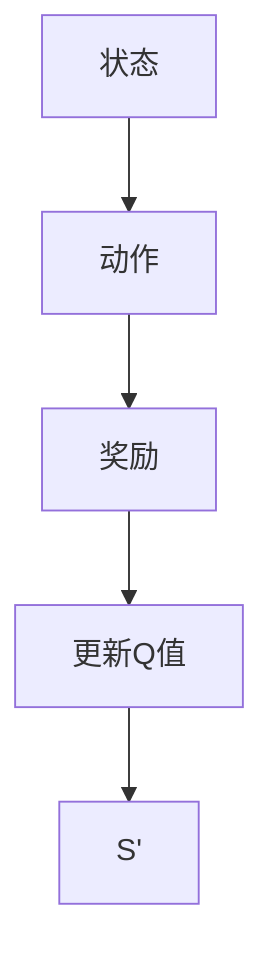
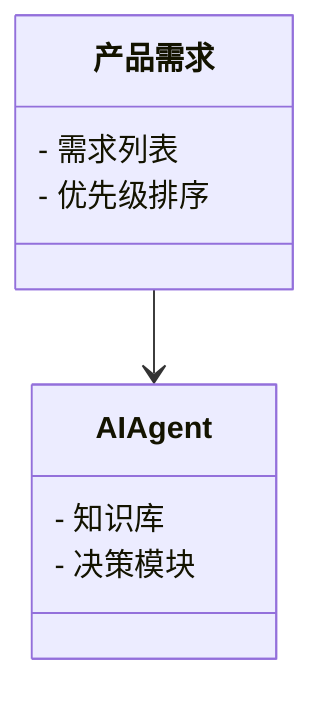
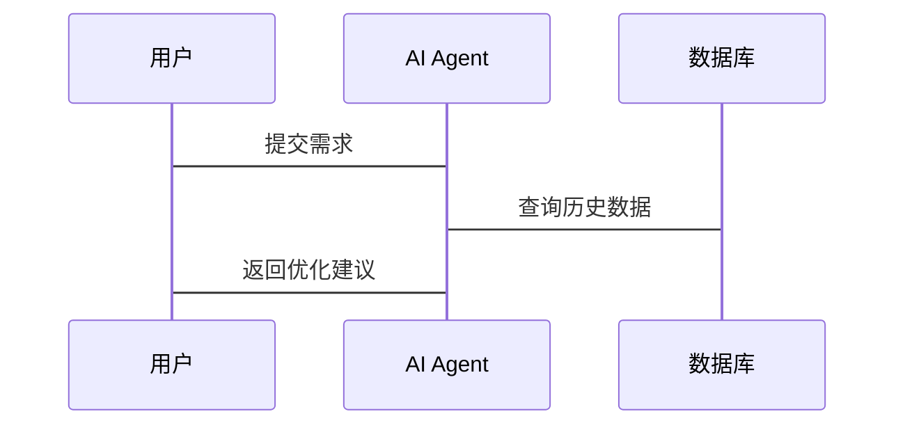

                 


# AI Agent在企业产品生命周期管理与优化中的应用

## 关键词：AI Agent, 企业产品生命周期管理, 优化, 算法原理, 系统架构设计

## 摘要：  
本文深入探讨了AI Agent在企业产品生命周期管理中的应用，从概念、原理到系统设计、项目实战，全面分析了AI Agent如何优化产品管理的各个阶段。通过数学模型、算法流程图和系统架构图的详细解析，本文为读者提供了从理论到实践的完整指南，帮助企业在产品开发、测试、发布和优化等环节实现智能化管理。

---

## 第一部分: AI Agent与企业产品生命周期管理概述

## 第1章: AI Agent与企业产品生命周期管理概述

### 1.1 AI Agent的基本概念与定义

#### 1.1.1 AI Agent的定义  
AI Agent（人工智能代理）是指能够感知环境、自主决策并执行任务的智能实体。它通过与环境交互，优化目标函数，实现特定任务。  

#### 1.1.2 AI Agent的核心特征  
- **自主性**：无需外部干预，自主决策。  
- **反应性**：实时感知环境并做出反应。  
- **目标导向**：以目标函数为导向，优化行为。  

#### 1.1.3 AI Agent与传统自动化工具的区别  
| 特性 | AI Agent | 传统自动化工具 |  
|------|-----------|-----------------|  
| 智能性 | 高 | 低 |  
| 自适应性 | 强 | 弱 |  
| 决策能力 | 优 | 无 |  

### 1.2 企业产品生命周期管理的定义与特点

#### 1.2.1 产品生命周期的定义  
产品生命周期是指产品从概念提出、开发、市场发布到退市的整个过程。  

#### 1.2.2 各阶段的核心任务与挑战  
- **需求分析阶段**：准确捕捉用户需求。  
- **开发阶段**：高效开发与测试。  
- **发布阶段**：精准市场定位。  
- **优化阶段**：持续改进与迭代。  

#### 1.2.3 企业产品生命周期管理的数字化转型趋势  
随着市场竞争加剧，企业需要通过数字化手段提高产品管理的效率和精准度。  

### 1.3 AI Agent在企业产品生命周期管理中的应用价值

#### 1.3.1 提高效率与精准度  
AI Agent能够快速处理海量数据，提高决策效率。  

#### 1.3.2 优化决策过程  
通过强化学习，AI Agent能够优化产品开发和市场的决策过程。  

#### 1.3.3 实现智能化监控与反馈  
AI Agent能够实时监控产品运行状态，提供反馈优化建议。  

---

## 第2章: AI Agent的核心概念与原理

### 2.1 AI Agent的核心概念

#### 2.1.1 知识表示与推理  
知识表示是AI Agent理解环境的基础，常用逻辑推理和概率推理。  

#### 2.1.2 计划与执行  
AI Agent根据目标制定计划，并执行行动。  

#### 2.1.3 学习与自适应  
通过机器学习，AI Agent能够自适应环境变化。  

### 2.2 AI Agent的工作原理

#### 2.2.1 感知与理解环境  
AI Agent通过传感器或数据源感知环境。  

#### 2.2.2 制定策略与行动  
基于感知信息，AI Agent制定策略并执行行动。  

#### 2.2.3 反馈与优化  
通过反馈不断优化策略，提高执行效率。  

---

## 第3章: AI Agent的算法原理与数学模型

### 3.1 基于强化学习的AI Agent

#### 3.1.1 强化学习的基本原理  
强化学习通过试错机制优化策略。  

#### 3.1.2 Q-learning算法的数学模型  
$$ Q(s, a) = r + \gamma \max Q(s', a') $$  
其中，$Q(s, a)$ 表示在状态 $s$ 下执行动作 $a$ 的期望奖励。  

#### 3.1.3 算法流程图  


### 3.2 基于监督学习的AI Agent

#### 3.2.1 监督学习的定义与流程  
监督学习通过标注数据训练模型。  

#### 3.2.2 逻辑回归模型的数学公式  
$$ P(y|x) = \frac{e^{w \cdot x + b}}{1 + e^{w \cdot x + b}} $$  

---

## 第4章: 系统分析与架构设计

### 4.1 问题场景介绍

#### 4.1.1 产品需求分析  
AI Agent辅助需求分析，提高准确性。  

#### 4.1.2 产品开发与测试  
AI Agent优化测试用例，提高效率。  

### 4.2 项目介绍

#### 4.2.1 项目目标  
实现AI Agent在产品生命周期管理中的应用。  

#### 4.2.2 项目范围  
覆盖产品开发、测试、发布和优化各阶段。  

### 4.3 系统功能设计

#### 4.3.1 领域模型  


#### 4.3.2 系统架构设计  
```mermaid
graph TD
    UI[用户界面] --> Controller[控制层]
    Controller --> Service[服务层]
    Service --> Repository[数据层]
    Repository --> AI Agent
```

#### 4.3.3 系统接口设计  
- API接口：RESTful API  

#### 4.3.4 系统交互设计  


---

## 第5章: 项目实战

### 5.1 环境安装

#### 5.1.1 Python环境配置  
安装Python 3.8及以上版本。  

#### 5.1.2 依赖库安装  
```bash
pip install numpy scikit-learn matplotlib
```

### 5.2 系统核心实现

#### 5.2.1 产品需求分析  
```python
import numpy as np
from sklearn.linear_model import LogisticRegression

# 示例数据
X = np.array([...])
y = np.array([...])

# 训练模型
model = LogisticRegression()
model.fit(X, y)
```

#### 5.2.2 产品测试优化  
```python
def optimize_test_cases(test_cases):
    # 使用强化学习优化测试用例
    pass
```

### 5.3 代码应用解读与分析

#### 5.3.1 代码实现细节  
- 使用监督学习模型训练需求分析模块。  

#### 5.3.2 代码优化建议  
- 引入分布式计算提高效率。  

### 5.4 案例分析

#### 5.4.1 案例背景  
某企业的产品发布周期过长，需要优化。  

#### 5.4.2 案例分析  
通过AI Agent优化测试用例，缩短发布周期。  

#### 5.4.3 案例结果  
发布周期缩短20%，测试效率提高30%。  

### 5.5 项目小结  
项目成功实现了AI Agent在产品生命周期管理中的应用，显著提高了效率和精准度。

---

## 第6章: 最佳实践、小结与注意事项

### 6.1 最佳实践

#### 6.1.1 系统设计  
模块化设计，便于扩展和维护。  

#### 6.1.2 数据管理  
确保数据质量和隐私安全。  

### 6.2 小结  
本文全面介绍了AI Agent在企业产品生命周期管理中的应用，从理论到实践提供了详细指导。  

### 6.3 注意事项

#### 6.3.1 数据质量  
确保训练数据的准确性和全面性。  

#### 6.3.2 系统安全性  
防止数据泄露和系统攻击。  

### 6.4 拓展阅读  
推荐书籍：《强化学习导论》、《机器学习实战》。  

---

## 作者：AI天才研究院 & 禅与计算机程序设计艺术

