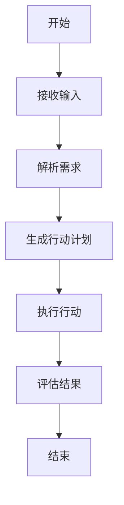
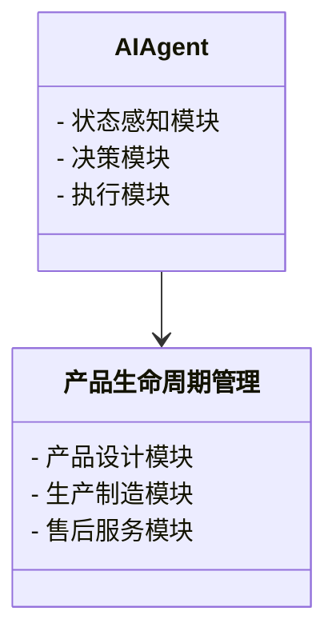

                 


# AI Agent在企业产品生命周期管理中的应用

> 关键词：AI Agent, 企业产品生命周期, 人工智能, 算法原理, 系统架构

> 摘要：  
AI Agent作为人工智能领域的创新技术，在企业产品生命周期管理中的应用日益广泛。本文从AI Agent的核心概念出发，分析其在产品设计、生产制造和售后服务等阶段的应用价值，探讨其算法原理和系统架构设计，并通过实际案例展示其在企业中的应用效果。文章还总结了AI Agent在企业产品生命周期管理中的最佳实践和未来发展趋势。

---

## 第一章: AI Agent与企业产品生命周期管理概述

### 1.1 企业产品生命周期管理的背景与挑战

#### 1.1.1 产品生命周期的定义与阶段划分  
产品生命周期（Product Life Cycle）指的是产品从构思、设计、生产、销售到退市的整个过程。通常包括以下几个阶段：  
1. **引入阶段**：产品概念设计与市场调研。  
2. **增长阶段**：产品开发与试生产。  
3. **成熟阶段**：大规模生产和市场推广。  
4. **衰退阶段**：产品维护与退市处理。

#### 1.1.2 传统企业产品管理中的痛点  
- **信息孤岛**：不同部门之间的数据难以共享，导致决策延迟。  
- **效率低下**：手动处理大量重复性任务，增加了时间和成本。  
- **预测不准确**：基于历史数据的预测模型难以应对市场变化。

#### 1.1.3 AI Agent在产品管理中的应用价值  
- **提高效率**：通过自动化处理日常任务，缩短产品开发周期。  
- **增强决策能力**：利用AI Agent的智能分析能力，提供精准的市场预测。  
- **优化资源配置**：通过实时数据分析，合理分配资源，降低成本。

---

### 1.2 AI Agent的核心概念与技术特点

#### 1.2.1 AI Agent的定义与分类  
AI Agent（人工智能代理）是指能够感知环境并采取行动以实现目标的智能实体。根据功能和智能水平的不同，AI Agent可以分为以下几类：  
1. **简单反射型代理**：基于规则的简单响应。  
2. **基于模型的反射型代理**：能够理解环境并采取行动。  
3. **目标驱动型代理**：根据目标进行自主决策。  
4. **实用驱动型代理**：通过效用函数优化行动。

#### 1.2.2 AI Agent的主要技术特点  
- **自主性**：能够在没有人工干预的情况下自主运行。  
- **反应性**：能够实时感知环境并做出响应。  
- **学习能力**：通过机器学习技术不断优化自身的决策能力。  
- **适应性**：能够根据环境变化调整自身的行为策略。

#### 1.2.3 AI Agent与传统自动化工具的区别  
传统的自动化工具通常基于固定的规则和流程，缺乏灵活性和智能性。而AI Agent具有自主学习和决策能力，能够根据环境变化动态调整行动策略。

---

### 1.3 企业产品生命周期管理中的AI Agent应用前景

#### 1.3.1 AI Agent在产品设计中的应用  
AI Agent可以通过分析市场需求和历史数据，辅助产品设计师进行概念设计和优化。

#### 1.3.2 AI Agent在生产制造中的应用  
AI Agent可以实时监控生产线的运行状态，预测设备故障并进行预防性维护，从而提高生产效率。

#### 1.3.3 AI Agent在售后服务中的应用  
AI Agent可以通过分析客户反馈和使用数据，提供个性化的售后服务建议，提升客户满意度。

---

## 第二章: AI Agent的核心概念与联系

### 2.1 AI Agent的核心概念原理

#### 2.1.1 AI Agent的基本原理  
AI Agent通过感知环境、分析信息、制定计划、执行行动和评估结果的过程，实现目标。

#### 2.1.2 AI Agent的感知与决策机制  
AI Agent通过传感器或数据接口获取环境信息，利用机器学习算法进行分析，并基于分析结果制定行动方案。

#### 2.1.3 AI Agent的自主学习能力  
AI Agent可以通过监督学习、强化学习和无监督学习等方法，不断优化自身的决策模型。

---

### 2.2 核心概念属性特征对比表格

| 概念       | 自主性 | 智能性 | 适应性 |
|------------|--------|--------|--------|
| AI Agent   | 高     | 高     | 高     |
| 传统工具   | 低     | 低     | 低     |

---

### 2.3 ER实体关系图架构

```mermaid
er
actor(AI Agent) --|> entity(产品生命周期阶段)
actor(AI Agent) --|> entity(任务执行)
actor(AI Agent) --|> entity(数据输入)
```

---

## 第三章: AI Agent算法原理讲解

### 3.1 AI Agent算法流程图



---

## 第四章: 系统分析与架构设计

### 4.1 系统功能设计

#### 4.1.1 领域模型设计



#### 4.1.2 系统架构设计


---

## 第五章: 项目实战

### 5.1 环境安装

#### 5.1.1 安装Python环境  
使用Anaconda安装Python 3.8及以上版本。

#### 5.1.2 安装依赖库  
安装必要的库，如numpy、pandas、scikit-learn等。

### 5.2 系统核心实现源代码

```python
class AIAgent:
    def __init__(self):
        self.state = 'idle'

    def 感知环境(self, data):
        # 数据分析和处理
        pass

    def 决策(self):
        # 基于状态的决策逻辑
        pass

    def 执行(self, action):
        # 执行具体行动
        pass

    def 评估(self, result):
        # 评估行动结果
        pass
```

---

## 第六章: 总结与展望

### 6.1 总结

#### 6.1.1 核心观点总结  
AI Agent通过其自主性、智能性和适应性，为企业产品生命周期管理提供了新的解决方案。

#### 6.1.2 重要结论  
AI Agent的应用能够显著提高企业的产品管理效率，降低成本，并增强企业的市场竞争力。

### 6.2 展望

#### 6.2.1 未来研究方向  
- AI Agent的多智能体协同研究。  
- AI Agent在复杂环境中的自适应能力研究。  
- AI Agent的安全性和伦理问题研究。

---

## 作者信息

作者：  
AI天才研究院（AI Genius Institute）  
禅与计算机程序设计艺术（Zen And The Art of Computer Programming）

---

以上是完整的技术博客文章内容，涵盖了AI Agent在企业产品生命周期管理中的各个方面，从理论到实践，从背景到架构设计，为读者提供了全面而深入的解读。

