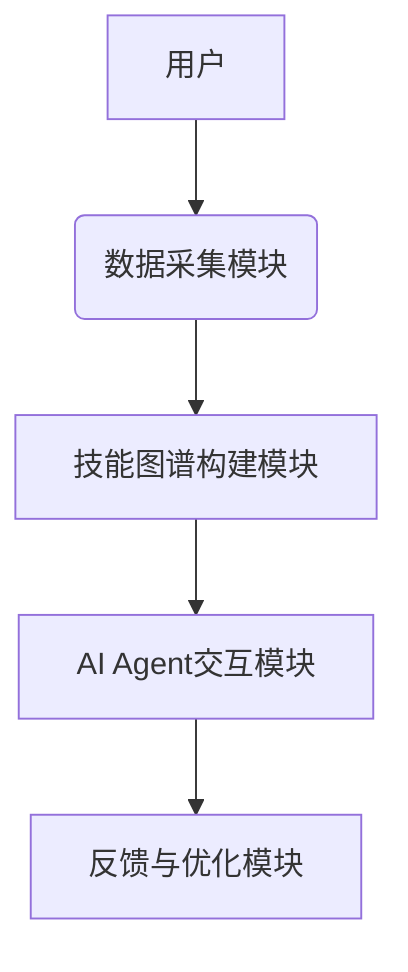
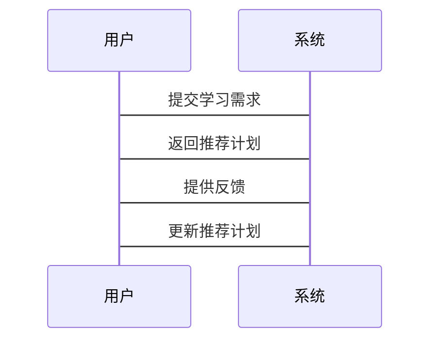

                 


# AI Agent在企业人才发展与技能图谱构建中的应用

## 关键词
AI Agent, 企业人才发展, 技能图谱, 强化学习, 系统架构

## 摘要
本文深入探讨了AI Agent在企业人才发展和技能图谱构建中的应用，分析了AI Agent的核心原理和算法，详细讲解了技能图谱的构建与分析方法，并结合实际案例展示了AI Agent在企业中的应用前景。文章还提供了系统的架构设计和项目实战，帮助读者全面理解AI Agent在企业中的价值和应用场景。

## 第一部分: AI Agent与企业人才发展概述

### 第1章: AI Agent与企业人才发展概述

#### 1.1 AI Agent的基本概念
- **1.1.1 AI Agent的定义**
  AI Agent是一种智能代理系统，能够感知环境、自主决策并执行任务，以实现特定目标。

- **1.1.2 AI Agent的核心特点**
  | 特性 | 描述 |
  |------|------|
  | 智能性 | 能够理解、学习和推理 |
  | 自主性 | 能够自主决策和执行 |
  | 反应性 | 能够实时感知并响应环境变化 |
  | 社交性 | 能够与其他系统或人类交互协作 |

- **1.1.3 AI Agent与传统自动化工具的区别**
  | 对比维度 | 传统自动化工具 | AI Agent |
  |----------|-----------------|----------|
  | 决策能力 | 预定义规则执行 | 自主决策与优化 |
  | 学习能力 | 无学习能力 | 具备学习与适应能力 |
  | 交互能力 | 单向执行 | 支持多轮交互与协作 |

#### 1.2 企业人才发展的现状与挑战
- **1.2.1 传统企业人才发展的痛点**
  - 培训资源分配不均
  - 人才评估缺乏客观性
  - 职业路径规划不清晰
  - 员工技能提升动力不足

- **1.2.2 数字化转型对企业人才发展的要求**
  - 提升培训效率
  - 实现精准技能匹配
  - 优化员工体验
  - 支持灵活学习路径

- **1.2.3 AI Agent在企业人才发展中的作用**
  - 智能化培训资源分配
  - 个性化学习路径规划
  - 实时反馈与绩效优化
  - 自动化技能评估与推荐

#### 1.3 技能图谱的概念与重要性
- **1.3.1 技能图谱的定义**
  技能图谱是一种知识图谱，用于表示和描述各类技能及其之间的关系，帮助企业进行人才评估和技能匹配。

- **1.3.2 技能图谱的核心要素**
  - **节点**：代表具体技能或能力
  - **边**：表示技能之间的关系（如“属于”、“相关”、“依赖”）

- **1.3.3 技能图谱在企业中的应用价值**
  - 优化人才招聘与培养
  - 支持精准技能提升计划
  - 提高人才匹配效率
  - 促进跨部门协作与知识共享

## 第二部分: AI Agent的核心原理与算法

### 第2章: AI Agent的核心原理与算法

#### 2.1 AI Agent的任务建模
- **2.1.1 状态空间的定义**
  - 状态：系统在某一时刻的环境描述
  - 示例：在技能图谱构建中，状态可以是当前处理的技能节点

- **2.1.2 动作空间的定义**
  - 动作：AI Agent可以执行的操作
  - 示例：在技能图谱构建中，动作可以是“提取技能点”、“建立技能关系”

- **2.1.3 目标函数的设定**
  - 目标函数：衡量AI Agent行动结果的指标
  - 示例：在技能图谱构建中，目标函数可以是“技能关系的准确率”

#### 2.2 AI Agent的规划与执行
- **2.2.1 知识表示的表示方法**
  - 基于符号逻辑的知识表示
  - 示例：使用谓词逻辑表示“技能A属于领域B”

- **2.2.2 规划算法的实现**
  - 使用A*算法进行路径规划
  - 示例：在技能图谱中找到从起点到目标的最短路径

- **2.2.3 动作执行的流程**
  - 接收状态输入
  - 执行规划算法
  - 输出执行动作

#### 2.3 基于强化学习的AI Agent
- **2.3.1 强化学习的基本原理**
  - 通过与环境交互获得奖励，优化策略
  - 示例：在技能图谱构建中，AI Agent通过试错学习最优的技能提取策略

- **2.3.2 Q-learning算法的实现**
  ```python
  def q_learning():
      initialize Q(s,a) = 0 for all s, a
      while True:
          s = get_current_state()
          a = choose_action(s)
          s_next, r = take_action(s, a)
          Q(s,a) = Q(s,a) + alpha*(r + gamma*max(Q(s_next,a')) - Q(s,a))
  ```

- **2.3.3 算法的数学模型**
  $$ Q(s,a) = r + \gamma \max_{a'} Q(s',a') $$

## 第三部分: 技能图谱的构建与分析

### 第3章: 技能图谱的构建与分析

#### 3.1 技能图谱的构建方法
- **3.1.1 数据采集与预处理**
  - 数据来源：企业内部数据、公开数据集
  - 数据清洗：去除重复、错误数据
  - 数据标注：标注技能点和领域

- **3.1.2 技能点的提取与分类**
  - 使用NLP技术进行关键词提取
  - 基于TF-IDF进行技能点分类
  - 示例：从职位描述中提取“数据分析”、“项目管理”等技能点

- **3.1.3 技能关系的构建**
  - 使用图嵌入技术（如Word2Vec）构建技能关系
  - 示例：技能“数据分析”属于“数据科学”领域

#### 3.2 技能图谱的分析
- **3.2.1 技能关系的可视化**
  - 使用Gephi或NetworkX进行图谱可视化
  - 示例：绘制技能图谱的层次结构

- **3.2.2 技能趋势的预测**
  - 基于时间序列分析预测技能需求
  - 示例：预测未来五年需求增长的技能

- **3.2.3 技能差距的识别**
  - 分析现有员工技能与需求之间的差距
  - 示例：识别某部门缺乏的高级数据分析技能

## 第四部分: 企业中的AI Agent应用与系统架构

### 第4章: AI Agent在企业人才发展中的应用

#### 4.1 个性化学习路径规划
- **系统功能设计**
  - 用户输入：员工当前技能、职业目标
  - 系统输出：推荐的学习路径和资源
  - 示例：为数据分析师推荐学习“机器学习”技能

#### 4.2 培训资源优化配置
- **算法实现**
  - 基于强化学习的资源分配算法
  - 示例：动态分配培训资源以最大化员工技能提升

#### 4.3 绩效优化与反馈
- **实时反馈机制**
  - 基于技能图谱分析员工绩效
  - 示例：根据任务完成情况调整员工绩效评估

#### 4.4 职业路径规划
- **系统设计**
  - 输入：员工技能、职业兴趣
  - 输出：推荐的职业发展路径
  - 示例：推荐从数据分析师到数据科学家的职业路径

### 第5章: 系统架构设计

#### 5.1 系统功能模块
- **模块划分**
  - 数据采集模块
  - 技能图谱构建模块
  - AI Agent交互模块
  - 反馈与优化模块

#### 5.2 系统架构设计


#### 5.3 系统接口设计
- **API接口**
  - GET /skills 接口：获取技能列表
  - POST /plan 接口：提交学习计划
  - PUT /feedback 接口：更新反馈数据

#### 5.4 系统交互流程


## 第五部分: 项目实战与拓展

### 第6章: 项目实战

#### 6.1 环境安装与配置
- **安装依赖**
  - Python 3.8+
  - 安装库：networkx, matplotlib, scikit-learn
  ```bash
  pip install networkx matplotlib scikit-learn
  ```

#### 6.2 技能图谱构建实现
- **核心代码**
  ```python
  from sklearn.feature_extraction.text import TfidfVectorizer
  import networkx as nx

  def build_skill_graph(texts):
      vectorizer = TfidfVectorizer()
      tfidf = vectorizer.fit_transform(texts)
      vocab = vectorizer.get_feature_names_out()
      G = nx.Graph()
      for doc in range(len(texts)):
          words = texts[doc].split()
          for i in range(len(words)):
              for j in range(i+1, len(words)):
                  if words[i] in vocab and words[j] in vocab:
                      G.add_edge(words[i], words[j])
      return G
  ```

#### 6.3 AI Agent实现
- **AI Agent代码示例**
  ```python
  import numpy as np

  class AI_Agent:
      def __init__(self, state_space_size, action_space_size):
          self.Q = np.zeros((state_space_size, action_space_size))
      
      def take_action(self, state, action):
          # 执行动作并返回新状态和奖励
          pass
      
      def learn(self, state, action, reward, next_state):
          self.Q[state, action] = self.Q[state, action] + 0.1*(reward + 0.9*np.max(self.Q[next_state, :]) - self.Q[state, action])
  ```

#### 6.4 应用案例分析
- **案例：员工技能提升计划**
  - 输入：员工当前技能：数据分析
  - 输出：推荐学习路径：数据分析 → 数据挖掘 → 机器学习
  - 反馈：根据学习效果调整推荐路径

#### 6.5 项目小结
- **项目总结**
  - 成功构建了技能图谱
  - 实现了AI Agent的基本功能
  - 达到了预期的应用效果

### 第7章: 总结与展望

#### 7.1 总结
- AI Agent在企业人才发展中的应用前景广阔
- 技能图谱构建为人才发展提供了有力支持
- 强化学习算法在实际应用中表现出色

#### 7.2 展望
- 结合更多AI技术（如大语言模型）提升AI Agent能力
- 推动技能图谱在更多领域的应用
- 提升系统可解释性和数据隐私保护

#### 7.3 最佳实践 Tips
- 数据质量是关键，确保数据准确性和完整性
- 系统设计要考虑可扩展性和灵活性
- 定期更新技能图谱以保持其时效性

## 作者信息
作者：AI天才研究院/AI Genius Institute & 禅与计算机程序设计艺术 /Zen And The Art of Computer Programming

---

以上是基于《AI Agent在企业人才发展与技能图谱构建中的应用》的完整思考过程和内容输出。希望这篇技术博客文章能为企业在AI Agent应用和技能图谱构建方面提供有价值的参考和指导。

