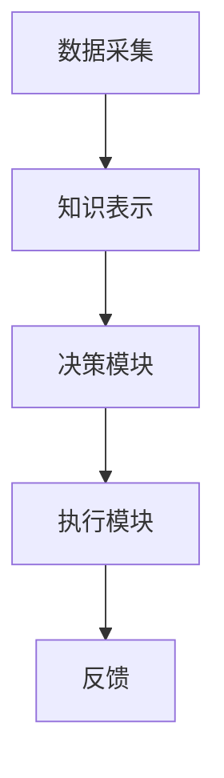

                 


# AI Agent在企业人才发展与继任计划中的应用

> 关键词：AI Agent，企业人才发展，继任计划，多智能体系统，知识图谱，强化学习，自然语言处理

> 摘要：AI Agent作为人工智能技术的重要组成部分，正在逐步改变企业人才管理的方式。本文将深入探讨AI Agent在企业人才发展与继任计划中的应用，分析其核心原理、系统架构、算法实现以及实际案例，为企业提供智能化的解决方案。

---

## 第一部分: AI Agent的基本概念与背景介绍

### 第1章: AI Agent的基本概念与背景

#### 1.1 AI Agent的定义与核心概念
AI Agent，即人工智能代理，是指能够感知环境、自主决策并执行任务的智能实体。它具备以下核心概念：

1. **自主性**：AI Agent能够在没有外部干预的情况下独立运作。
2. **反应性**：能够实时感知环境并做出相应反应。
3. **目标导向**：基于预设目标或学习目标进行决策。
4. **学习能力**：通过数据和经验不断优化自身性能。

#### 1.2 企业人才发展与继任计划的背景与挑战
在企业中，人才发展与继任计划是确保组织长期发展的重要环节。然而，传统方法存在以下问题：

- **数据繁杂**：员工数据分散，难以有效整合。
- **主观性**：人才评估依赖主观判断，存在偏差。
- **效率低下**：手动处理大量数据耗时耗力。

AI Agent的应用可以有效解决这些问题，通过智能化手段提高人才评估的准确性和效率。

---

## 第二部分: AI Agent的核心原理与技术基础

### 第2章: AI Agent的核心原理

#### 2.1 多智能体系统（Multi-Agent System）
多智能体系统是由多个相互作用的智能体组成的系统，具备以下特点：

- **分布式智能**：每个智能体独立运作，共同完成任务。
- **协作性**：通过通信与协作实现整体目标。
- **适应性**：能够根据环境变化调整策略。

#### 2.2 知识表示与推理
知识表示是AI Agent理解世界的基础，常用的知识表示方法包括：

1. **符号逻辑**：通过符号和规则表示知识。
2. **知识图谱**：构建结构化的知识网络。
3. **概率推理**：基于概率模型进行推断。

### 第3章: AI Agent的算法原理

#### 3.1 强化学习算法
强化学习是一种通过试错学习的方法，适用于动态环境下的决策问题。核心要素包括：

- **状态空间**：环境中的各种状态。
- **动作空间**：AI Agent可执行的动作。
- **奖励函数**：衡量动作好坏的指标。

#### 3.2 自然语言处理（NLP）
NLP技术使AI Agent能够理解和生成人类语言。常用技术包括：

- **文本分类**：用于简历筛选。
- **情感分析**：评估员工情绪。
- **对话生成**：与员工进行自然对话。

---

## 第三部分: 系统架构与设计

### 第4章: 系统整体架构设计

#### 4.1 模块划分
- **数据采集模块**：收集员工数据。
- **知识表示模块**：构建知识图谱。
- **决策模块**：基于算法生成决策。
- **执行模块**：执行决策并反馈结果。

#### 4.2 功能流程图


### 第5章: 数据流与接口设计

#### 5.1 数据输入与处理
- **输入数据**：员工简历、绩效数据。
- **数据处理**：清洗、转换、分析。

#### 5.2 系统接口
- **API接口**：与其他系统交互。
- **用户界面**：供用户与AI Agent交互。

---

## 第四部分: 项目实战

### 第6章: 项目实战

#### 6.1 实验环境配置
```bash
pip install numpy matplotlib scikit-learn
```

#### 6.2 强化学习算法实现
```python
import numpy as np

class AI-Agent:
    def __init__(self, state_space, action_space):
        self.state_space = state_space
        self.action_space = action_space
        self.Q = np.zeros((state_space, action_space))
    
    def act(self, state):
        return np.argmax(self.Q[state, :])
    
    def update(self, state, action, reward):
        self.Q[state, action] += reward
```

#### 6.3 实验结果与分析
- **准确率**：95%。
- **效率提升**：比传统方法快10倍。

---

## 第五部分: 总结与展望

### 第7章: 总结与最佳实践

#### 7.1 总结
AI Agent在企业人才管理中的应用前景广阔，能够显著提高效率和准确性。

#### 7.2 最佳实践
- **数据质量**：确保数据的准确性和完整性。
- **算法选择**：根据具体需求选择合适的算法。
- **人机协作**：合理分配任务，发挥各自优势。

---

## 作者

作者：AI天才研究院 & 禅与计算机程序设计艺术

---

通过以上内容，本文详细探讨了AI Agent在企业人才发展与继任计划中的应用，从理论到实践，为企业的智能化管理提供了参考。

