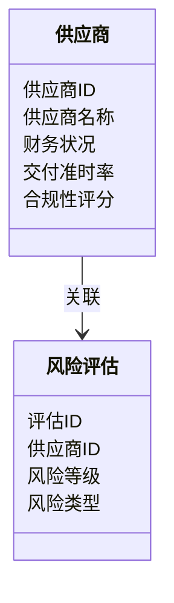
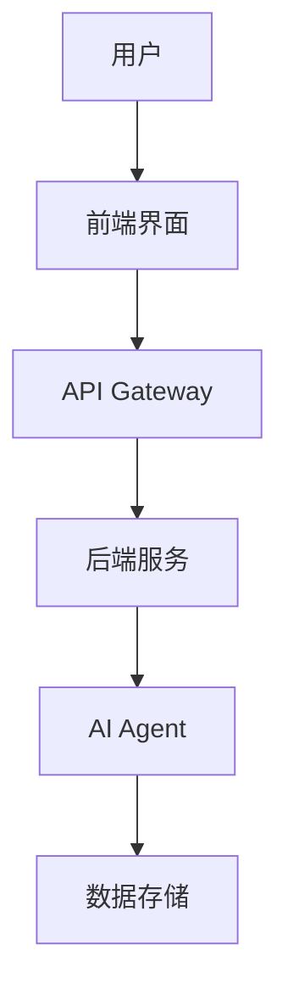

                 


# AI Agent在企业供应商风险评估与管理中的应用

## 关键词：AI Agent，供应商风险管理，供应链管理，智能决策，风险评估

## 摘要：本文探讨了AI Agent在企业供应商风险评估与管理中的应用，分析了其核心原理、算法实现、系统架构，并通过实际案例展示了如何利用AI技术提升供应商风险管理的效率和准确性。文章详细讲解了从问题背景到项目实战的全过程，为读者提供了全面的技术指导。

---

# 第1章: 背景介绍

## 1.1 问题背景

### 1.1.1 企业供应商管理的重要性  
供应商是企业供应链的核心环节，供应商的风险管理直接影响企业的运营稳定性。传统供应商管理依赖人工经验，存在效率低、覆盖面窄、实时性差等问题。

### 1.1.2 传统供应商风险管理的局限性  
传统方法依赖历史数据和经验判断，难以应对市场波动、 geopolitical risks等复杂因素。人工审核耗时长，难以覆盖海量数据。

### 1.1.3 AI Agent在供应链管理中的潜力  
AI Agent能够实时分析海量数据，识别潜在风险，提供智能化决策支持，显著提升供应商管理的效率和准确性。

---

## 1.2 问题描述

### 1.2.1 供应商风险的主要类型  
供应商风险包括信用风险、合规风险、交付风险和质量风险。

### 1.2.2 供应商风险管理的复杂性  
供应商分布广泛，数据来源多样，风险因素复杂且动态变化。

### 1.2.3 企业对智能化风险管理的需求  
企业需要实时、动态的供应商风险评估，以快速响应市场变化和潜在风险。

---

## 1.3 问题解决

### 1.3.1 AI Agent在风险评估中的作用  
AI Agent能够实时监控供应商数据，识别潜在风险，并提供决策支持。

### 1.3.2 数据驱动的供应商风险管理  
通过大数据分析，AI Agent能够从海量数据中提取有价值的信息，支持精准的风险评估。

### 1.3.3 智能化决策支持的实现路径  
通过机器学习模型，AI Agent能够预测风险并优化供应链策略。

---

## 1.4 边界与外延

### 1.4.1 供应商风险管理的边界  
AI Agent的应用范围限于供应商风险评估与管理，不涉及企业内部的生产管理。

### 1.4.2 AI Agent应用的范围  
AI Agent主要用于风险评估、供应商选择和绩效监控。

### 1.4.3 与其他管理模块的关联  
AI Agent与采购、物流、财务等部门的数据进行交互，形成完整的供应链管理体系。

---

## 1.5 核心概念与组成

### 1.5.1 AI Agent的基本构成  
AI Agent由感知模块、决策模块和执行模块组成，能够独立完成任务。

### 1.5.2 供应商风险评估的关键要素  
包括供应商的历史表现、财务状况、地理位置和市场环境。

### 1.5.3 系统整体架构的初步框架  
系统架构包括数据采集层、AI Agent层和用户交互层。

---

## 1.6 本章小结  
本章介绍了供应商风险管理的重要性，分析了传统方法的局限性，并提出了AI Agent的应用潜力。

---

# 第2章: AI Agent的核心概念与原理

## 2.1 核心概念原理

### 2.1.1 AI Agent的定义与分类  
AI Agent是一种能够感知环境、自主决策并执行任务的智能体。

### 2.1.2 多智能体系统的协作机制  
多个AI Agent通过协作完成复杂的任务，例如分布式风险评估。

### 2.1.3 基于知识图谱的风险评估方法  
知识图谱整合供应商数据，构建语义网络，辅助风险分析。

---

## 2.2 核心概念对比

### 2.2.1 不同AI Agent模型的对比分析  
基于规则的AI Agent与机器学习模型的优缺点对比。

### 2.2.2 传统规则引擎与AI Agent的差异  
传统规则引擎依赖预定义规则，AI Agent能够自适应和学习。

### 2.2.3 供应商风险管理中的关键要素  
供应商信用、交付能力和合规性。

---

## 2.3 ER实体关系图

```mermaid
erd
    title 供应商风险评估实体关系图
    %% 供应商表
    table 供应商 {
        供应商ID: integer, 唯一主键
        供应商名称: string
        联系方式: string
        财务状况: integer(0-100)
        交付准时率: integer(0-100)
        合规性评分: integer(0-100)
    }

    %% 风险评估表
    table 风险评估 {
        评估ID: integer, 唯一主键
        供应商ID: integer
        评估时间: datetime
        风险等级: integer(1-5)
        风险类型: string
        评估依据: string
    }

    %% 关系
    供应商 --> 风险评估: 一个供应商对应多个风险评估
```

---

## 2.4 本章小结  
本章详细讲解了AI Agent的核心概念和原理，并通过ER图展示了供应商风险评估的实体关系。

---

# 第3章: 算法原理讲解

## 3.1 算法选择

### 3.1.1 选择基于决策树的算法  
决策树算法（如ID3、C4.5）适合供应商风险分类任务。

### 3.1.2 为什么选择决策树  
决策树易于解释，适合处理多分类问题，且对数据预处理要求较低。

---

## 3.2 算法原理

### 3.2.1 决策树的构建过程  
通过信息增益或信息熵选择特征，递归构建决策树。

### 3.2.2 模型训练  
使用训练数据生成决策树，确保模型泛化能力。

### 3.2.3 模型评估  
通过准确率、召回率和F1值评估模型性能。

---

## 3.3 代码实现

### 3.3.1 环境安装  
安装Python和相关库：`pip install scikit-learn`

### 3.3.2 核心代码

```python
from sklearn.tree import DecisionTreeClassifier
from sklearn.metrics import accuracy_score, classification_report

# 数据预处理
X = supplier_data.drop(columns=['风险等级'])
y = supplier_data['风险等级']

# 模型训练
model = DecisionTreeClassifier()
model.fit(X, y)

# 模型预测
y_pred = model.predict(X)

# 模型评估
print("准确率:", accuracy_score(y, y_pred))
print("分类报告:", classification_report(y, y_pred))
```

---

## 3.4 算法原理的数学公式

### 3.4.1 信息熵公式  
$$ H(S) = -\sum_{i=1}^{n} p_i \log p_i $$  

### 3.4.2 信息增益公式  
$$ \text{信息增益}(A) = H(S) - H(S|A) $$  

---

## 3.5 本章小结  
本章详细讲解了基于决策树的算法原理，并通过代码实现展示了模型的应用。

---

# 第4章: 系统分析与架构设计

## 4.1 问题场景介绍

### 4.1.1 系统目标  
构建一个基于AI Agent的供应商风险评估系统。

### 4.1.2 业务场景  
实时监控供应商数据，动态评估风险，生成风险报告。

---

## 4.2 系统功能设计

### 4.2.1 领域模型  


### 4.2.2 系统架构  


### 4.2.3 接口设计  
API接口包括数据查询、风险评估和报告生成。

---

## 4.3 本章小结  
本章通过系统架构设计展示了AI Agent在供应商风险管理中的应用。

---

# 第5章: 项目实战

## 5.1 环境安装

### 5.1.1 安装Python和库  
`pip install pandas scikit-learn`

---

## 5.2 核心代码实现

### 5.2.1 数据预处理  
```python
import pandas as pd

# 读取数据
data = pd.read_csv('suppliers.csv')

# 数据清洗
data.dropna(inplace=True)
data['风险等级'] = data['风险等级'].astype(int)
```

### 5.2.2 模型训练  
```python
from sklearn.tree import DecisionTreeClassifier

# 训练模型
model = DecisionTreeClassifier()
model.fit(X, y)
```

### 5.2.3 结果分析  
```python
print("模型准确率:", accuracy_score(y, y_pred))
```

---

## 5.3 本章小结  
本章通过实际案例展示了如何利用AI Agent进行供应商风险评估。

---

# 第6章: 最佳实践与小结

## 6.1 最佳实践

### 6.1.1 数据质量的重要性  
确保数据的完整性和准确性。

### 6.1.2 模型调优的注意事项  
选择合适的特征和参数，避免过拟合。

---

## 6.2 小结  
本文详细讲解了AI Agent在供应商风险管理中的应用，从算法到系统实现进行了全面分析。

---

## 6.3 注意事项

### 6.3.1 数据隐私问题  
确保供应商数据的隐私和安全。

### 6.3.2 模型的可解释性  
选择可解释性好的算法，便于业务人员理解。

---

## 6.4 拓展阅读  
推荐阅读《机器学习实战》和《知识图谱入门与应用》。

---

# 作者：AI天才研究院 & 禅与计算机程序设计艺术

---

感谢您的耐心阅读！希望本文能为您提供有价值的见解和启发。

