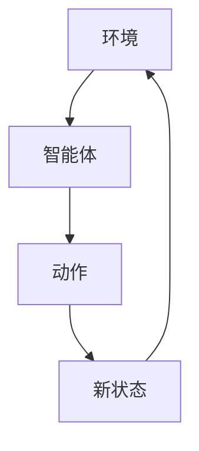
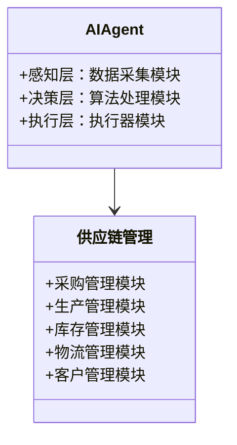
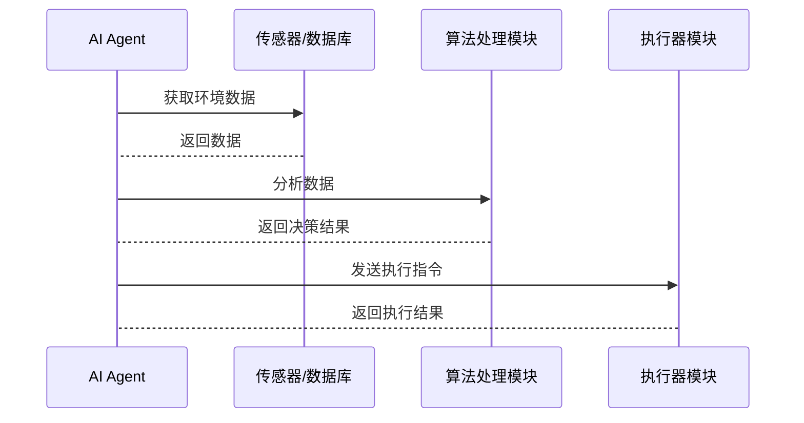

                 


# AI Agent在企业供应链管理中的应用

## 关键词：
AI Agent，企业供应链，供应链管理，人工智能，算法原理，系统架构

## 摘要：
本文深入探讨了AI Agent在企业供应链管理中的应用，从背景介绍、核心概念、算法原理到系统架构、项目实战和最佳实践，全面分析了AI Agent如何优化供应链管理。通过详细的技术解析和实际案例，展示了AI Agent在库存管理、物流优化等关键环节中的强大能力，为企业供应链管理提供了新的思路和解决方案。

---

## 第1章：AI Agent与供应链管理概述

### 1.1 AI Agent的基本概念

#### 1.1.1 AI Agent的定义
AI Agent（人工智能代理）是一种能够感知环境并采取行动以实现目标的智能实体。它通过传感器获取信息，利用算法处理数据，并通过执行器采取行动，形成一个闭环系统。

#### 1.1.2 AI Agent的核心特征
- **自主性**：能够在没有人工干预的情况下独立运行。
- **反应性**：能够实时感知环境变化并做出响应。
- **目标导向性**：所有行动均以实现特定目标为导向。

#### 1.1.3 AI Agent与传统自动化系统的区别
| 特性         | AI Agent                  | 传统自动化系统             |
|--------------|---------------------------|-----------------------------|
| 智能水平     | 高，具备学习和决策能力    | 低，基于预设规则执行         |
| 环境适应性   | 强，能适应动态变化         | 弱，依赖固定条件             |
| 可扩展性     | 强，适用于复杂场景         | 有限，适用于简单任务         |

### 1.2 供应链管理的基本概念

#### 1.2.1 供应链管理的定义
供应链管理（Supply Chain Management，SCM）是指在企业内外部，将供应商、制造商、分销商和客户等环节连接起来，进行原材料采购、生产、仓储、运输和销售的管理过程。

#### 1.2.2 供应链管理的关键环节
- **采购管理**：原材料和零部件的采购。
- **生产管理**：产品的生产计划和调度。
- **库存管理**：库存的监控和优化。
- **物流管理**：产品的运输和配送。
- **客户管理**：订单处理和客户服务。

#### 1.2.3 数字化供应链管理的发展趋势
随着人工智能和大数据技术的发展，供应链管理正在从传统的规则驱动向数据驱动转变。通过AI技术，企业能够更高效地优化库存、预测需求、协调生产和物流。

---

## 第2章：AI Agent在供应链管理中的应用场景

### 2.1 AI Agent的核心概念与原理

#### 2.1.1 AI Agent的感知与决策机制

**感知层**：AI Agent通过传感器或数据接口获取环境信息，例如库存数据、订单信息和物流状态。

**决策层**：基于感知到的信息，AI Agent利用算法进行分析和决策，例如预测需求、优化库存和调度物流。

**执行层**：根据决策结果，AI Agent通过执行器采取行动，例如调整库存水平或安排运输计划。

#### 2.1.2 AI Agent在供应链中的应用场景

**智能库存管理**：AI Agent可以根据历史销售数据和市场趋势，预测未来的需求，优化库存水平，减少库存积压和缺货现象。

**智能采购与供应商管理**：AI Agent可以分析供应商的历史表现和市场波动，优化采购计划，选择最优供应商，降低采购成本。

**智能物流与配送**：AI Agent可以根据实时交通状况和客户需求，优化配送路线，提高物流效率，降低运输成本。

#### 2.1.3 AI Agent与供应链实体的交互关系

**供应商与需求预测**：AI Agent可以根据历史销售数据和市场趋势，预测未来的需求，优化采购计划。

**客户与订单处理**：AI Agent可以根据客户订单和库存情况，优化订单处理流程，提高客户满意度。

**物流与运输优化**：AI Agent可以根据实时交通状况和订单分布，优化配送路线，提高物流效率。

---

## 第3章：AI Agent的核心算法与数学模型

### 3.1 多智能体强化学习

**多智能体强化学习**是一种用于多个智能体协作的算法，适用于复杂的供应链管理场景，例如库存管理和物流调度。

#### 3.1.1 多智能体强化学习的算法流程



#### 3.1.2 多智能体强化学习的数学模型

**状态空间**：表示环境中的所有可能状态，例如库存水平和订单需求。

$$ S = \{s_1, s_2, ..., s_n\} $$

**动作空间**：表示智能体可以执行的所有动作，例如增加订单或调整库存。

$$ A = \{a_1, a_2, ..., a_m\} $$

**奖励函数**：表示智能体在执行动作后获得的奖励，通常用于优化目标的衡量。

$$ R(s, a) = \text{max}(0, \text{目标函数} - \text{当前值}) $$

---

## 第4章：AI Agent在供应链管理中的系统架构设计

### 4.1 系统功能设计

#### 4.1.1 领域模型设计



#### 4.1.2 系统架构设计

```mermaid
graph TD
    AI Agent --> 数据采集模块
    AI Agent --> 算法处理模块
    AI Agent --> 执行器模块
    数据采集模块 --> 传感器/数据库
    执行器模块 --> 执行器/系统接口
```

#### 4.1.3 系统接口设计

- **输入接口**：接收传感器数据和用户输入。
- **输出接口**：发送决策指令和执行结果。

#### 4.1.4 系统交互流程



---

## 第5章：AI Agent在供应链管理中的项目实战

### 5.1 智能库存管理系统的实现

#### 5.1.1 环境安装与配置

```bash
pip install numpy matplotlib scikit-learn
```

#### 5.1.2 核心代码实现

```python
import numpy as np
from sklearn.linear_model import LinearRegression

# 数据预处理
data = np.array([[1, 2], [2, 3], [3, 4], [4, 5], [5, 6]])
X = data[:, 0].reshape(-1, 1)
y = data[:, 1].reshape(-1, 1)

# 模型训练
model = LinearRegression()
model.fit(X, y)

# 预测未来需求
future_X = np.array([[6]]).reshape(-1, 1)
prediction = model.predict(future_X)
print("预测未来需求为：", prediction[0][0])
```

#### 5.1.3 代码解读与功能分析

- **数据预处理**：将历史销售数据进行整理，提取出需求量和时间特征。
- **模型训练**：使用线性回归算法对数据进行训练，建立需求预测模型。
- **预测未来需求**：根据训练好的模型，预测未来的需求量，优化库存管理。

---

## 第6章：最佳实践与未来展望

### 6.1 最佳实践

- **数据质量**：确保输入数据的准确性和完整性，避免因数据问题导致的决策错误。
- **算法选择**：根据具体场景选择合适的算法，例如时间序列分析用于需求预测，强化学习用于物流优化。
- **系统集成**：将AI Agent与企业现有的供应链管理系统进行无缝集成，确保系统的高效运行。

### 6.2 小结

AI Agent通过智能化的感知、决策和执行，显著提升了企业供应链管理的效率和效果。它不仅能够优化库存、采购和物流，还能够通过实时数据处理和预测分析，帮助企业在复杂多变的市场环境中保持竞争优势。

### 6.3 注意事项

- AI Agent的应用需要结合企业的实际情况，不能盲目追求技术先进性，而忽视实际需求。
- 在实施过程中，需要注意数据隐私和安全问题，确保系统的合规性。
- 定期对系统进行维护和优化，适应业务发展的需求。

### 6.4 拓展阅读

- 推荐阅读《人工智能：一种现代的方法》（Russell & Norvig），深入理解AI Agent的基本原理。
- 参考《供应链管理：流程、战略与应用》（Cooper et al.），了解供应链管理的最新发展。

---

## 作者：AI天才研究院/AI Genius Institute & 禅与计算机程序设计艺术 /Zen And The Art of Computer Programming

---

**文章标题：AI Agent在企业供应链管理中的应用**

**关键词：AI Agent，企业供应链，供应链管理，人工智能，算法原理，系统架构**

**摘要：**  
本文深入探讨了AI Agent在企业供应链管理中的应用，从背景介绍、核心概念、算法原理到系统架构、项目实战和最佳实践，全面分析了AI Agent如何优化供应链管理。通过详细的技术解析和实际案例，展示了AI Agent在库存管理、物流优化等关键环节中的强大能力，为企业供应链管理提供了新的思路和解决方案。

