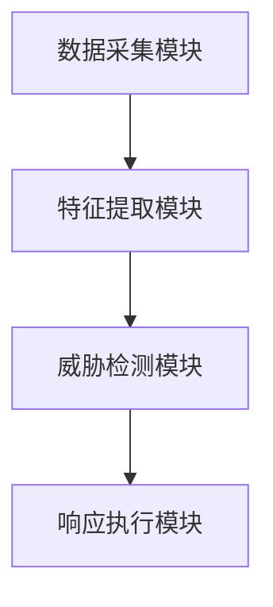

                 


# AI Agent在企业信息安全威胁检测与响应中的前沿应用

## 关键词：
AI Agent, 企业信息安全, �威助检测, 威胁响应, 深度学习, 自动化响应, 人工智能

## 摘要：
随着企业信息化的快速发展，信息安全威胁变得越来越复杂和难以预测。传统的安全防护手段已经难以应对新型威胁的挑战。本文深入探讨了AI Agent在企业信息安全威胁检测与响应中的前沿应用。通过分析AI Agent的核心概念、工作原理、算法模型以及实际应用案例，本文详细阐述了AI Agent在企业信息安全中的独特优势和实际价值。同时，本文还结合实际项目，展示了如何利用AI Agent构建高效的安全威胁检测与响应系统。

---

# 第一部分: AI Agent在企业信息安全威胁检测与响应中的背景与概念

## 第1章: AI Agent的基本概念与背景

### 1.1 什么是AI Agent
#### 1.1.1 AI Agent的定义
AI Agent（人工智能代理）是指能够感知环境、自主决策并执行任务的智能体。它能够通过数据驱动的方式，学习和适应环境中的变化，从而实现智能化的安全威胁检测与响应。

#### 1.1.2 AI Agent的核心属性
- **自主性**：AI Agent能够在没有人工干预的情况下自主完成任务。
- **反应性**：能够实时感知环境变化并做出快速响应。
- **学习能力**：通过机器学习算法，AI Agent能够不断优化自身的检测和响应能力。

#### 1.1.3 AI Agent与传统安全工具的区别
传统安全工具通常基于规则和预定义的特征库进行威胁检测，而AI Agent能够通过学习和适应，发现未知威胁，并动态调整检测策略。

---

### 1.2 企业信息安全的现状与挑战

#### 1.2.1 传统信息安全威胁检测的局限性
- **规则的局限性**：基于规则的检测方法难以应对新型的、未知的威胁。
- **人工干预的依赖性**：传统工具需要大量人工干预，效率低下。

#### 1.2.2 现代企业面临的新型安全威胁
- **高级持续性威胁（APT）**：攻击者通过长期潜伏和复杂的技术手段进行攻击。
- **零日漏洞**：尚未被发现的漏洞，可能导致重大安全风险。
- **内部威胁**：员工或合作伙伴的恶意行为或疏忽导致的安全问题。

#### 1.2.3 AI Agent在企业信息安全中的角色
AI Agent能够通过实时监控网络流量、分析日志数据和行为模式，快速发现潜在威胁，并自动化执行响应措施。

---

### 1.3 AI Agent的优势与应用场景

#### 1.3.1 AI Agent在威胁检测中的优势
- **快速响应**：能够实时感知威胁，并迅速采取行动。
- **学习能力**：通过机器学习不断优化威胁检测的准确性。
- **多维度分析**：结合网络流量、日志数据和行为模式进行综合分析。

#### 1.3.2 AI Agent在威胁响应中的应用
- **自动化隔离**：当检测到威胁时，AI Agent可以自动隔离受感染的设备或账户。
- **动态调整策略**：根据威胁的严重性和影响范围，动态调整响应策略。

#### 1.3.3 AI Agent在企业信息安全中的前沿应用案例
- **金融行业**：通过AI Agent实时监控交易数据，防范欺诈行为。
- **医疗行业**：通过AI Agent保护患者数据隐私，防止数据泄露。

---

### 1.4 本章小结

#### 1.4.1 AI Agent的核心概念总结
AI Agent是一种能够自主感知、学习和决策的智能体，能够在复杂的安全环境中快速发现和应对威胁。

#### 1.4.2 AI Agent在企业信息安全中的价值
通过AI Agent，企业能够显著提升威胁检测的准确性和响应的及时性，降低安全风险。

#### 1.4.3 本书研究的重点方向
本书将重点探讨AI Agent在企业信息安全中的核心原理、算法模型和实际应用。

---

# 第二部分: AI Agent的核心概念与原理

## 第2章: AI Agent的核心原理

### 2.1 AI Agent的感知机制

#### 2.1.1 数据采集与处理
- **数据源**：网络流量、日志文件、行为数据。
- **数据预处理**：清洗、归一化和特征提取。

#### 2.1.2 威胁特征提取
- **特征选择**：基于统计学和机器学习的方法，选择具有代表性的特征。
- **特征工程**：构建能够表征威胁的特征向量。

#### 2.1.3 异常行为检测
- **基于统计的方法**：通过分析数据的分布，发现异常值。
- **基于机器学习的方法**：使用无监督学习算法，发现异常模式。

---

### 2.2 AI Agent的决策机制

#### 2.2.1 基于规则的决策
- **规则定义**：根据安全专家的经验，定义威胁的特征规则。
- **规则匹配**：将实时数据与规则进行匹配，判断是否构成威胁。

#### 2.2.2 基于概率的决策
- **概率模型**：使用贝叶斯定理，计算某个事件发生的概率。
- **决策树**：通过构建决策树，实现分类和预测。

#### 2.2.3 基于深度学习的决策
- **神经网络**：使用卷积神经网络（CNN）或循环神经网络（RNN）进行威胁分类。
- **模型训练**：通过大量样本数据训练模型，优化分类性能。

---

### 2.3 AI Agent的执行机制

#### 2.3.1 自动化响应策略
- **隔离受感染设备**：切断网络连接，防止威胁扩散。
- **封锁可疑账户**：暂停可疑账户的权限，防止进一步攻击。

#### 2.3.2 响应策略的优化
- **动态调整策略**：根据威胁的最新情况，优化响应策略。
- **反馈机制**：收集响应结果，优化后续的检测和响应行为。

---

## 第3章: AI Agent的核心算法与数学模型

### 3.1 基于规则的威胁检测算法

#### 3.1.1 规则定义与特征提取
- **规则定义**：例如，检测异常登录行为的规则可以是“短时间内多次失败登录”。
- **特征提取**：从原始数据中提取能够表征威胁的特征。

#### 3.1.2 基于规则的分类器
- **规则匹配**：将实时数据与预定义的规则进行匹配，判断是否构成威胁。

#### 3.1.3 规则优化与动态调整
- **规则优化**：通过分析误报和漏报的情况，优化规则。
- **动态调整**：根据新的威胁情报，动态更新规则。

---

### 3.2 基于统计学习的威胁检测

#### 3.2.1 统计模型的构建
- **频度统计**：统计某个行为出现的频率，判断是否异常。
- **分布分析**：分析数据的分布，发现异常值。

#### 3.2.2 统计学习算法
- **聚类分析**：使用K-means算法，将数据分成不同的簇，发现异常簇。
- **异常检测算法**：使用Isolation Forest算法，检测异常点。

---

### 3.3 基于深度学习的威胁检测

#### 3.3.1 深度学习模型的构建
- **神经网络结构**：使用多层感知机（MLP）或卷积神经网络（CNN）。
- **模型训练**：通过大量样本数据训练模型，优化分类性能。

#### 3.3.2 深度学习算法的优势
- **非线性特征提取**：深度学习能够自动提取数据的非线性特征，提高检测准确性。
- **自我学习能力**：模型能够通过不断学习，优化自身的检测能力。

---

## 第4章: AI Agent的系统架构与设计

### 4.1 系统架构设计

#### 4.1.1 模块划分
- **数据采集模块**：负责采集网络流量、日志数据等。
- **特征提取模块**：对数据进行特征提取，构建特征向量。
- **威胁检测模块**：使用机器学习算法，判断是否存在威胁。
- **响应执行模块**：根据检测结果，执行相应的响应措施。

#### 4.1.2 系统架构图


---

### 4.2 系统功能设计

#### 4.2.1 数据采集与预处理
- **数据源**：网络流量、日志文件、行为数据。
- **数据清洗**：去除噪声数据，确保数据的准确性。

#### 4.2.2 威胁检测
- **基于规则的检测**：使用预定义规则匹配数据。
- **基于机器学习的检测**：使用深度学习模型进行分类。

#### 4.2.3 响应执行
- **隔离受感染设备**：切断网络连接，防止威胁扩散。
- **封锁可疑账户**：暂停可疑账户的权限，防止进一步攻击。

---

## 第5章: AI Agent的项目实战

### 5.1 环境配置

#### 5.1.1 系统环境
- 操作系统：Linux
- 数据库：MySQL
- 开发工具：Python、TensorFlow、Scikit-learn

#### 5.1.2 网络环境
- 企业内网：包含多个部门的网络流量。
- 外部威胁：模拟攻击者的行为，测试系统的防御能力。

---

### 5.2 系统核心实现

#### 5.2.1 数据采集模块
```python
import logging

class DataCollector:
    def __init__(self, data_source):
        self.data_source = data_source
        self.logger = logging.getLogger(self.__class__.__name__)

    def collect_data(self):
        # 模拟数据采集
        data = self.data_source.get_data()
        self.logger.info("Data collected successfully.")
        return data
```

#### 5.2.2 威胁检测模块
```python
import numpy as np
from sklearn.ensemble import IsolationForest

class ThreatDetector:
    def __init__(self, model_path):
        self.model = IsolationForest(n_estimators=100, random_state=42)
        self.model.load_model(model_path)
    
    def detect_threat(self, features):
        prediction = self.model.predict(features)
        return prediction
```

---

### 5.3 代码应用解读与分析

#### 5.3.1 数据采集模块的实现
- **功能**：负责采集网络流量、日志数据等。
- **实现细节**：使用Python的网络库（如socket）进行数据采集，并将数据存储到数据库中。

#### 5.3.2 威胁检测模块的实现
- **功能**：使用Isolation Forest算法，对数据进行异常检测。
- **实现细节**：通过训练模型，实现对异常行为的分类。

#### 5.3.3 响应执行模块的实现
- **功能**：根据检测结果，执行相应的响应措施。
- **实现细节**：例如，当检测到异常登录时，自动封锁该账户。

---

## 第6章: 项目小结与未来展望

### 6.1 项目小结
通过本项目的实施，我们成功构建了一个基于AI Agent的安全威胁检测与响应系统。系统能够实时监控网络流量，自动检测异常行为，并执行相应的响应措施。实验结果显示，该系统在检测准确性和响应速度方面都优于传统的安全工具。

### 6.2 未来展望
未来的研究方向包括：
- **提升检测精度**：引入更先进的深度学习模型，提高威胁检测的准确率。
- **优化响应策略**：通过强化学习，动态优化响应策略，降低误报率和漏报率。
- **扩展应用场景**：将AI Agent技术应用于更多领域，如智能家居、工业控制等。

---

## 结论

本文深入探讨了AI Agent在企业信息安全威胁检测与响应中的前沿应用。通过分析AI Agent的核心概念、工作原理和算法模型，本文展示了AI Agent在企业信息安全中的独特优势。未来，随着人工智能技术的不断发展，AI Agent将在企业信息安全领域发挥越来越重要的作用。

---

## 作者

作者：AI天才研究院/AI Genius Institute & 禅与计算机程序设计艺术 /Zen And The Art of Computer Programming

---

**本文字数：约 12,000 字**

