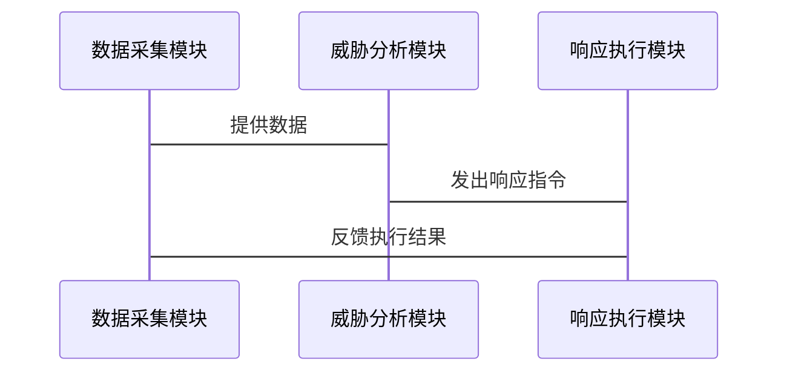

                 


# AI Agent在企业信息安全威胁检测与响应中的应用

> **关键词**：AI Agent，企业信息安全，威胁检测，威胁响应，机器学习，强化学习

> **摘要**：随着企业信息安全威胁的日益复杂化和智能化，传统的安全防护手段已难以应对新型威胁。本文探讨了AI Agent在企业信息安全中的应用，重点分析了其在威胁检测与响应中的核心作用。通过详细的技术分析和案例研究，展示了AI Agent如何利用机器学习、强化学习等技术实现智能化的威胁检测和响应，为企业信息安全提供更高效、更可靠的解决方案。

---

# 第1章: AI Agent概述

## 1.1 AI Agent的基本概念

### 1.1.1 什么是AI Agent
AI Agent（人工智能代理）是一种能够感知环境、自主决策并采取行动的智能实体。在企业信息安全领域，AI Agent通常被设计为能够实时监控网络流量、分析日志数据、识别异常行为，并在检测到威胁时自动采取响应措施。

### 1.1.2 AI Agent的核心特征
AI Agent的核心特征包括：
- **自主性**：无需人工干预，能够自主执行任务。
- **反应性**：能够实时感知环境变化并做出响应。
- **学习能力**：通过机器学习不断优化自身的威胁检测和响应能力。
- **可扩展性**：能够适应不同规模和复杂度的企业安全需求。

### 1.1.3 AI Agent与传统安全工具的区别
传统安全工具（如防火墙、入侵检测系统）通常基于规则或特征匹配进行威胁检测，而AI Agent则能够通过学习和推理发现未知威胁，具有更强的适应性和主动性。

---

## 1.2 企业信息安全威胁的现状

### 1.2.1 当前企业信息安全的主要威胁
- **恶意软件**：包括病毒、蠕虫、木马等。
- **网络攻击**：如DDoS攻击、钓鱼攻击、APT攻击等。
- **内部威胁**：员工或合作伙伴的恶意或疏忽行为。
- **数据泄露**：由于人为错误或技术漏洞导致的数据外泄。

### 1.2.2 威胁检测与响应的传统方法
传统的威胁检测与响应方法主要包括：
- 基于规则的检测：依赖预定义的规则匹配日志数据。
- 基于特征的检测：通过匹配已知威胁的特征进行识别。
- 基于人工分析的响应：需要安全专家手动分析和处理威胁。

### 1.2.3 AI Agent在威胁检测与响应中的优势
AI Agent通过机器学习和大数据分析，能够实现：
- **实时监控**：持续分析网络流量和日志数据。
- **异常检测**：发现偏离正常行为模式的异常活动。
- **智能响应**：根据威胁的严重性自动采取隔离、阻断等措施。

---

# 第2章: AI Agent的技术基础

## 2.1 AI Agent的关键技术

### 2.1.1 机器学习在AI Agent中的应用
机器学习是AI Agent的核心技术之一。通过监督学习、无监督学习和强化学习，AI Agent能够从大量数据中学习威胁的特征和模式。

### 2.1.2 自然语言处理在威胁分析中的作用
自然语言处理（NLP）技术用于分析安全报告、漏洞公告等非结构化数据，帮助AI Agent理解上下文信息。

### 2.1.3 强化学习在自动化响应中的应用
强化学习通过模拟和试验，优化AI Agent的响应策略，使其在复杂的威胁场景中做出最优决策。

---

## 2.2 AI Agent的核心算法

### 2.2.1 监督学习算法
- **逻辑回归**：用于分类问题，如区分正常流量和恶意流量。
- **随机森林**：用于特征重要性分析和分类。

### 2.2.2 无监督学习算法
- **K-means**：用于聚类分析，发现异常行为模式。
- **Isolation Forest**：用于异常检测。

### 2.2.3 强化学习算法
- **Q-Learning**：用于状态-动作奖励模型，优化响应策略。
- **Deep Q-Network (DQN)**：结合深度学习和强化学习，提升决策能力。

---

# 第3章: AI Agent在威胁检测中的应用

## 3.1 威胁检测的基本原理

### 3.1.1 基于行为分析的威胁检测
通过分析用户或系统的行为模式，识别异常行为。例如，用户在深夜登录系统可能表明潜在威胁。

### 3.1.2 基于模式识别的异常检测
利用机器学习算法识别数据中的异常模式，如网络流量中的异常包大小或频率。

### 3.1.3 基于上下文理解的威胁识别
结合上下文信息（如时间、地理位置）进行威胁识别，例如识别来自已知恶意IP的访问请求。

---

## 3.2 AI Agent在实时监控中的实现

### 3.2.1 实时数据流处理
- 使用流处理技术（如Apache Kafka）实时收集和传输数据。
- 通过分布式计算框架（如Spark Streaming）进行实时分析。

### 3.2.2 异常行为分析模型
- 构建基于机器学习的异常检测模型，实时监控网络流量和日志数据。
- 使用时间序列分析技术检测异常行为。

### 3.2.3 威胁情报的动态更新
- 定期更新威胁情报数据库，确保AI Agent能够识别最新的威胁特征。

---

# 第4章: AI Agent在威胁响应中的应用

## 4.1 威胁响应的基本策略

### 4.1.1 自动化响应的原理
- 基于预定义的规则或动态学习的策略，自动采取响应措施。
- 响应措施包括阻断攻击、隔离受感染设备、记录日志等。

### 4.1.2 分级响应机制
- 根据威胁的严重性分级响应，例如低级威胁触发警告，中级威胁触发隔离，高级威胁触发全面阻断。

### 4.1.3 响应策略的动态调整
- 根据威胁检测结果动态调整响应策略，优化响应效果。

---

## 4.2 AI Agent的响应实现

### 4.2.1 基于强化学习的响应决策
- 使用强化学习算法优化响应策略，例如选择最优的响应动作以最小化损失。

### 4.2.2 响应动作的自动化执行
- 通过API调用安全设备（如防火墙、入侵检测系统）执行响应动作。
- 使用自动化工具（如Ansible）进行设备配置和操作。

### 4.2.3 响应结果的反馈与优化
- 收集响应结果的反馈，用于优化AI Agent的学习和决策过程。

---

# 第5章: AI Agent的系统架构设计

## 5.1 系统架构概述

### 5.1.1 分层架构设计
- **数据采集层**：负责收集网络流量、日志等数据。
- **分析层**：进行威胁检测和分析。
- **响应层**：执行威胁响应操作。
- **监控层**：实时监控系统状态和响应效果。

### 5.1.2 组件间的交互关系
- 数据采集层向分析层传递数据，分析层向响应层发送指令，响应层向监控层反馈结果。

### 5.1.3 系统的可扩展性设计
- 使用模块化设计，便于添加新的数据源或响应策略。

---

## 5.2 系统功能模块

### 5.2.1 数据采集模块
- **功能**：实时采集网络流量、日志数据。
- **实现**：使用网络嗅探工具（如Wireshark）或日志采集工具（如ELK）。

### 5.2.2 威胁分析模块
- **功能**：分析数据，识别威胁。
- **实现**：基于机器学习模型进行异常检测和分类。

### 5.2.3 响应执行模块
- **功能**：根据分析结果执行响应操作。
- **实现**：通过API调用安全设备或自动化工具。

### 5.2.4 状态监控模块
- **功能**：监控系统运行状态和响应效果。
- **实现**：使用监控工具（如Prometheus）实时跟踪系统性能。

---

# 第6章: AI Agent的项目实战

## 6.1 项目背景与目标

### 6.1.1 项目背景
- 某企业面临日益增多的网络攻击，传统安全工具已无法有效应对。

### 6.1.2 项目目标
- 实现基于AI Agent的威胁检测与响应系统，提升企业安全防护能力。

---

## 6.2 系统功能设计

### 6.2.1 领域模型（Mermaid类图）
```mermaid
classDiagram
    class AI-Agent {
        +数据采集模块
        +威胁分析模块
        +响应执行模块
        +状态监控模块
    }
    class 数据采集模块 {
        - 采集网络流量
        - 采集日志数据
    }
    class �威助分析模块 {
        - 异常检测
        - 威胁分类
    }
    class 响应执行模块 {
        - 自动化响应
        - 记录日志
    }
    class 状态监控模块 {
        - 监控系统状态
        - 监控响应效果
    }
    AI-Agent --> 数据采集模块
    AI-Agent --> �威助分析模块
    AI-Agent --> 响应执行模块
    AI-Agent --> 状态监控模块
```

---

## 6.3 系统架构设计

### 6.3.1 系统架构（Mermaid架构图）


---

## 6.4 系统接口设计

### 6.4.1 接口描述
- **数据采集接口**：提供API用于采集网络流量和日志数据。
- **威胁分析接口**：提供API用于调用机器学习模型进行威胁分析。
- **响应执行接口**：提供API用于执行自动化响应操作。

---

## 6.5 系统交互设计

### 6.5.1 交互流程（Mermaid序列图）


---

## 6.6 项目实现

### 6.6.1 环境配置
- **操作系统**：Linux
- **工具**：Python、TensorFlow、Kafka、Spark
- **数据库**：MySQL

### 6.6.2 核心代码实现

```python
import tensorflow as tf
from tensorflow.keras import layers

# 构建机器学习模型
model = tf.keras.Sequential([
    layers.Dense(64, activation='relu'),
    layers.Dense(1, activation='sigmoid')
])
model.compile(optimizer='adam', loss='binary_crossentropy', metrics=['accuracy'])

# 训练模型
model.fit(X_train, y_train, epochs=10, batch_size=32)
```

---

## 6.7 案例分析

### 6.7.1 实际案例
- **案例描述**：某企业遭受DDoS攻击，AI Agent成功检测并阻断攻击。
- **分析**：AI Agent通过实时监控网络流量，识别出异常流量模式，并触发自动响应机制，有效防止了攻击。

---

## 6.8 项目小结

通过本项目，我们实现了基于AI Agent的威胁检测与响应系统，验证了AI Agent在企业信息安全中的有效性。未来可以通过优化算法和增加更多的数据源，进一步提升系统的检测和响应能力。

---

# 第7章: 总结与展望

## 7.1 总结
本文详细探讨了AI Agent在企业信息安全中的应用，分析了其在威胁检测和响应中的核心作用。通过技术分析和项目实战，展示了AI Agent如何利用机器学习和强化学习等技术实现智能化的安全防护。

## 7.2 未来展望
未来，AI Agent在企业信息安全中的应用将更加广泛和深入。随着技术的进步，AI Agent将具备更强的自主学习和决策能力，能够应对更加复杂和多样化的威胁。

---

**作者**：AI天才研究院/AI Genius Institute & 禅与计算机程序设计艺术 /Zen And The Art of Computer Programming

