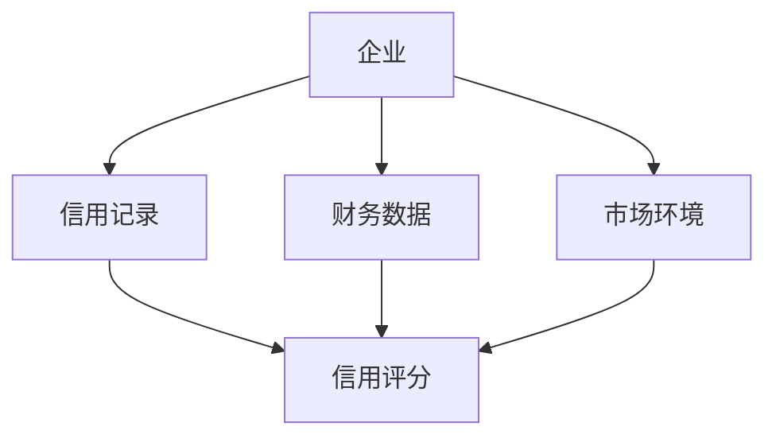
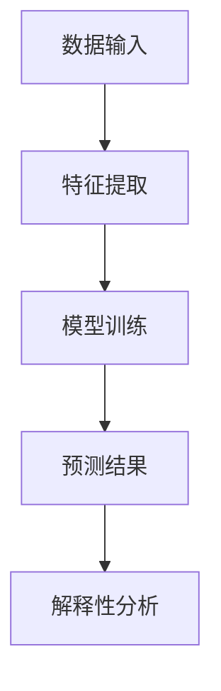
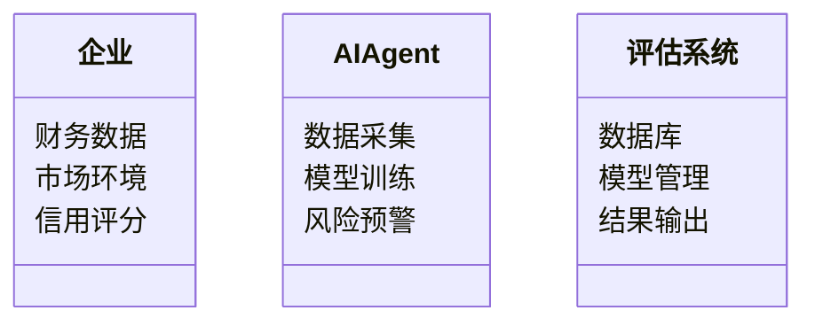
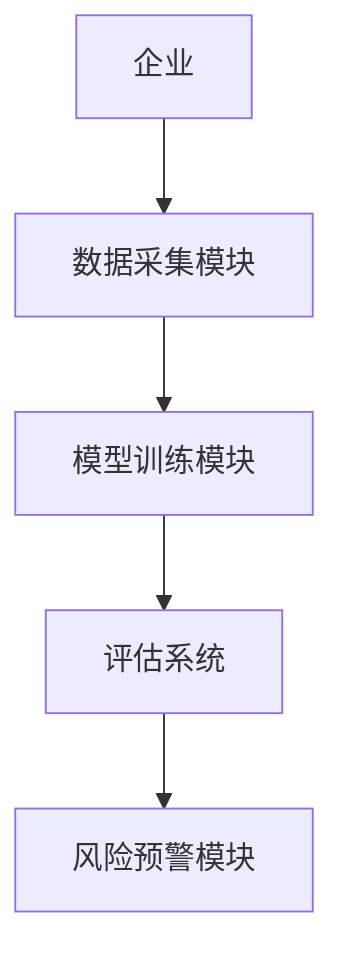
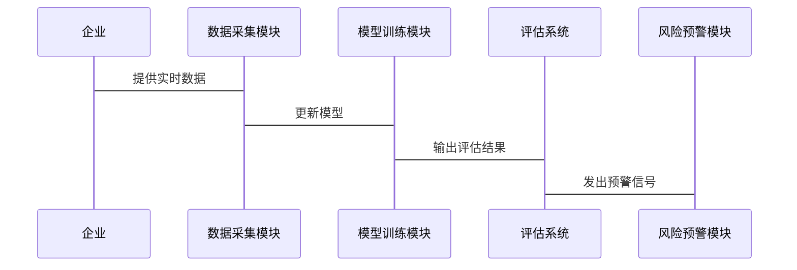

                 


# AI Agent在企业信用风险动态评估中的应用与模型可解释性

---

## 关键词：
AI Agent、企业信用风险、动态评估、可解释性、机器学习模型

---

## 摘要：
本文详细探讨了AI Agent在企业信用风险动态评估中的应用，并分析了模型的可解释性问题。文章从背景介绍、核心概念、算法原理、系统设计、项目实战等多个方面展开，结合实际案例和代码实现，深入剖析了动态信用风险评估的核心算法和模型可解释性的实现方法。通过本文的阐述，读者可以全面理解AI Agent在信用风险评估中的作用，并掌握如何构建一个高效且可解释的动态评估系统。

---

## 第1章: 背景介绍

### 1.1 问题背景
#### 1.1.1 企业信用风险的定义与重要性
企业信用风险是指企业在经营过程中由于自身或外部环境的变化，导致无法履行债务或违约的风险。信用风险的评估对企业融资、投资决策以及金融监管具有重要意义。

#### 1.1.2 动态信用风险评估的必要性
传统的信用风险评估方法通常基于静态数据，无法捕捉企业的实时变化。随着市场环境的快速变化，动态评估的需求日益迫切。

#### 1.1.3 AI Agent在信用风险评估中的作用
AI Agent（智能代理）能够实时收集和分析企业数据，动态调整评估模型，显著提升了信用风险评估的准确性和实时性。

### 1.2 问题描述
#### 1.2.1 传统信用风险评估的局限性
传统方法依赖于历史数据，难以应对突发的市场变化，且缺乏实时性。

#### 1.2.2 动态信用风险评估的需求
企业经营环境复杂多变，需要一种动态、实时的评估方法来应对不确定性。

#### 1.2.3 AI Agent在动态评估中的优势
AI Agent具备实时学习和自适应能力，能够根据最新数据动态调整评估结果。

### 1.3 问题解决
#### 1.3.1 AI Agent在信用风险评估中的应用场景
AI Agent可以实时监控企业的财务状况、市场环境和行业趋势，及时发现潜在风险。

#### 1.3.2 动态评估的核心问题
动态评估需要解决数据实时更新、模型快速调整以及结果可解释性等问题。

#### 1.3.3 可解释性的重要性
信用风险评估的决策需要透明，尤其是在金融监管和企业信贷决策中，可解释性是信任的基础。

### 1.4 边界与外延
#### 1.4.1 信用风险评估的边界条件
评估范围通常限于企业的财务数据和市场环境，不考虑企业的内部管理因素。

#### 1.4.2 动态评估的适用范围
适用于市场变化频繁、数据更新及时的企业环境。

#### 1.4.3 AI Agent的局限性与适用场景
AI Agent依赖高质量的数据输入，适用于数据充分且实时更新的场景。

### 1.5 核心概念结构与组成
#### 1.5.1 信用风险评估的要素
包括企业财务状况、市场环境、行业趋势等。

#### 1.5.2 AI Agent的核心功能
实时数据采集、动态模型调整、风险预警等。

#### 1.5.3 动态评估的系统架构
包括数据采集模块、模型调整模块、结果输出模块等。

---

## 第2章: 核心概念与联系

### 2.1 AI Agent的原理与特点
#### 2.1.1 AI Agent的基本原理
AI Agent通过感知环境、分析数据、做出决策并采取行动，实现动态调整。

#### 2.1.2 动态决策能力
AI Agent能够根据实时数据动态调整评估策略，提高评估的准确性。

#### 2.1.3 可解释性要求
AI Agent的决策过程需要透明，以便用户理解和信任。

### 2.2 信用风险评估的原理与方法
#### 2.2.1 传统信用评估方法
基于历史数据和统计模型，如逻辑回归、信用评分模型等。

#### 2.2.2 基于AI的信用评估模型
使用机器学习算法，如随机森林、神经网络等，提升评估的准确性。

#### 2.2.3 动态评估的核心算法
结合时间序列分析和在线学习算法，动态调整模型参数。

### 2.3 核心概念对比
#### 2.3.1 AI Agent与传统模型的对比
| 特性       | AI Agent          | 传统模型          |
|------------|-------------------|-------------------|
| 数据需求    | 高实时性           | 静态数据           |
| 模型复杂性   | 高                 | 低                 |
| 可解释性     | 低（取决于算法）   | 较高               |

#### 2.3.2 动态评估与静态评估的对比
| 特性       | 动态评估          | 静态评估          |
|------------|-------------------|-------------------|
| 评估频率    | 高频               | 低频               |
| 数据更新    | 实时               | 定期               |
| 适用场景    | 变化快的环境        | 稳定的环境          |

#### 2.3.3 可解释性与黑箱模型的对比
可解释性模型（如线性回归）易于理解，但准确性较低；黑箱模型（如深度学习）准确性高，但难以解释。

### 2.4 ER实体关系图


---

## 第3章: 算法原理讲解

### 3.1 动态信用评估模型
#### 3.1.1 模型构建流程
1. 数据收集：实时采集企业的财务数据、市场环境等。
2. 特征提取：提取关键特征，如收入增长率、利润率等。
3. 模型训练：使用在线学习算法动态调整模型参数。
4. 预测结果：输出企业信用评分。

#### 3.1.2 数据预处理
- 数据清洗：处理缺失值、异常值。
- 特征工程：选择与信用风险相关的特征。

#### 3.1.3 模型训练与优化
- 在线学习算法：如随机梯度下降（SGD）。
- 模型优化：使用交叉验证调整超参数。

### 3.2 可解释性分析方法
#### 3.2.1 局部可解释性方法
- 局部可解释性模型-agnostic（LIME）：通过扰动数据点，分析模型在局部的决策行为。

#### 3.2.2 全局可解释性方法
- SHAP值（SHapley Additive exPlanations）：衡量每个特征对模型预测的贡献度。

#### 3.2.3 解释性评分指标
- 重要性评分：基于特征对模型预测的影响力排序。

### 3.3 算法流程图


### 3.4 算法实现代码
```python
import numpy as np
from sklearn.linear_model import SGDClassifier
from sklearn.metrics import accuracy_score
from lime.lime_tabular import LimeTabular

# 数据预处理
X = np.array([[1, 2], [3, 4], [5, 6]])
y = np.array([0, 1, 0])

# 在线学习模型训练
model = SGDClassifier()
model.fit(X, y)

# 可解释性分析
explainer = LimeTabular()
explainer.fit(X, y, model.predict)
解释性分析结果 = explainer.explain_instance(X[0], model.predict, num_features=2)
```

### 3.5 数学公式
#### 3.5.1 在线学习算法
在线随机梯度下降（SGD）的更新公式：
$$ w_{t+1} = w_t - \eta (w_t^T x_t - y_t) x_t $$
其中，$\eta$ 是学习率，$x_t$ 是输入样本，$y_t$ 是真实标签。

#### 3.5.2 SHAP值计算
SHAP值公式：
$$ \phi_i = \sum_{S \subseteq \{i\}} \text{贡献度} $$
其中，贡献度是特征对模型预测的贡献度。

---

## 第4章: 系统分析与架构设计

### 4.1 系统功能设计
#### 4.1.1 领域模型


#### 4.1.2 系统架构设计


#### 4.1.3 系统接口设计
- 数据采集接口：接收企业实时数据。
- 模型训练接口：动态调整模型参数。
- 风险预警接口：输出风险等级。

#### 4.1.4 系统交互流程


---

## 第5章: 项目实战

### 5.1 环境安装
- 安装Python和相关库：
  ```bash
  pip install numpy scikit-learn lime
  ```

### 5.2 核心代码实现
```python
import numpy as np
from sklearn.linear_model import SGDClassifier
from sklearn.metrics import accuracy_score
from lime.lime_tabular import LimeTabular

# 数据预处理
X = np.array([[1, 2], [3, 4], [5, 6]])
y = np.array([0, 1, 0])

# 在线学习模型训练
model = SGDClassifier()
model.fit(X, y)

# 预测与评估
print("模型准确率：", accuracy_score(y, model.predict(X)))

# 可解释性分析
explainer = LimeTabular()
explainer.fit(X, y, model.predict)
解释性分析结果 = explainer.explain_instance(X[0], model.predict, num_features=2)
```

### 5.3 代码解读与分析
- 数据预处理：将企业数据转化为模型可读的格式。
- 模型训练：使用在线学习算法动态调整模型参数。
- 解释性分析：使用Lime库对模型的决策过程进行解释。

### 5.4 案例分析
案例：某企业财务数据异常，模型预测其信用风险上升，并通过可解释性分析发现，收入下降是主要风险因素。

### 5.5 项目小结
通过项目实战，验证了AI Agent在动态信用风险评估中的有效性，同时也展示了模型可解释性的实现方法。

---

## 第6章: 总结与展望

### 6.1 总结
本文详细探讨了AI Agent在企业信用风险动态评估中的应用，并分析了模型可解释性的重要性。通过算法原理、系统设计和项目实战的详细阐述，展示了如何构建一个高效且可解释的动态评估系统。

### 6.2 展望
未来的研究方向包括：
- 提升模型的可解释性，使其更易于理解和应用。
- 结合更多的实时数据源，进一步提高评估的准确性。
- 探索更高效的在线学习算法，降低计算成本。

### 6.3 最佳实践 tips
- 在选择模型时，优先考虑可解释性需求。
- 定期更新模型，确保其适应市场变化。
- 结合人工审核，确保评估结果的准确性。

### 6.4 小结
通过本文的探讨，读者可以深入了解AI Agent在信用风险评估中的应用，并掌握如何构建一个高效且可解释的动态评估系统。

---

## 作者：AI天才研究院/AI Genius Institute & 禅与计算机程序设计艺术 /Zen And The Art of Computer Programming

---

本文通过系统化的分析和详细的技术实现，全面探讨了AI Agent在企业信用风险动态评估中的应用，并深入剖析了模型可解释性的重要性。希望本文能为相关领域的研究和实践提供有价值的参考和指导。

