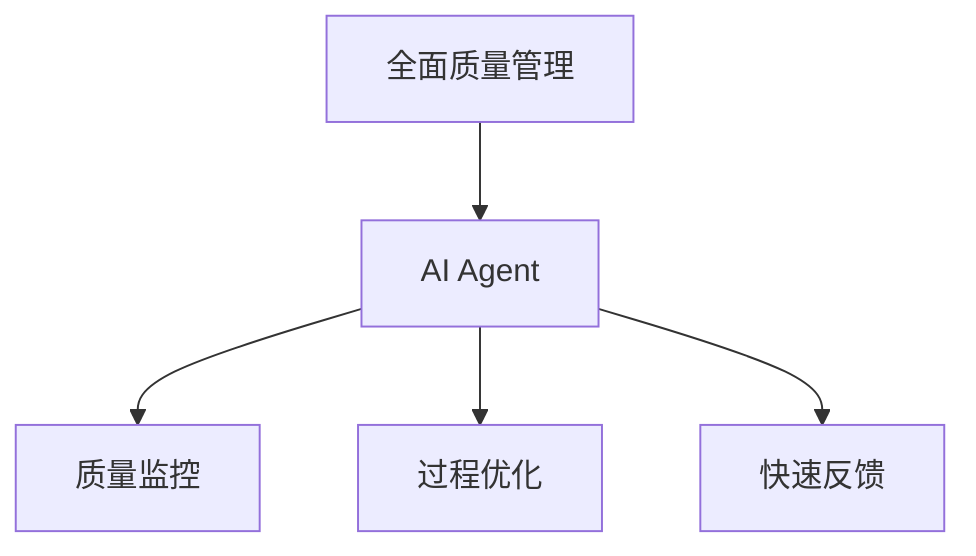
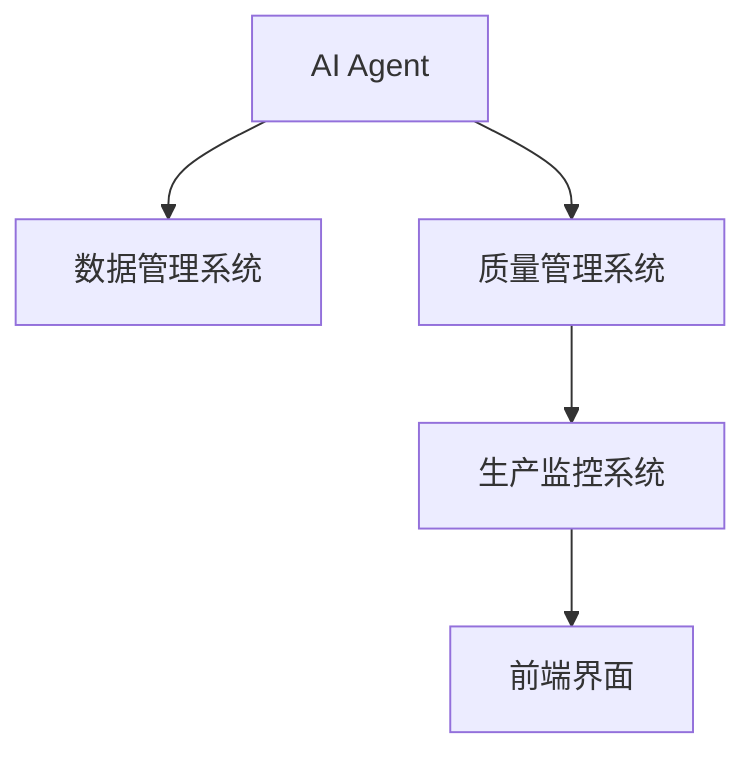

                 


# AI Agent在企业全面质量管理(TQM)中的应用

## 关键词：AI Agent, 全面质量管理, TQM, 质量管理, 人工智能, 企业应用

## 摘要：  
本文探讨了AI Agent在企业全面质量管理（TQM）中的应用，结合TQM的核心理念与AI Agent的技术优势，分析了AI Agent在质量管理中的核心原理、算法实现、系统架构及实际应用场景。文章从理论到实践，详细阐述了AI Agent如何通过智能化手段优化企业质量管理流程，提升管理效率与决策能力。通过案例分析与项目实战，展示了AI Agent在TQM中的实际价值与应用前景。

---

## 第一部分: 全面质量管理（TQM）与AI Agent概述

### 第1章: 全面质量管理（TQM）概述

#### 1.1 TQM的基本概念与核心理念  
全面质量管理（Total Quality Management，TQM）是一种以顾客为中心，通过组织全体员工参与，运用系统化的方法持续改进产品和服务质量的管理理念。其核心目标是实现零缺陷（Zero Defects），并通过PDCA（计划、执行、检查、改进）循环不断优化质量管理过程。

#### 1.2 AI Agent的基本概念与特点  
AI Agent（人工智能代理）是指具有感知环境、自主决策、执行任务能力的智能体。它能够通过传感器或数据源获取信息，利用算法进行分析和推理，并根据结果执行操作或给出建议。AI Agent的特点包括：智能性、自主性、反应性、协作性和学习性。

#### 1.3 TQM与AI Agent的结合背景  
随着企业对效率和质量要求的不断提高，传统TQM方法在数据处理能力、实时性、个性化需求等方面存在局限性。AI Agent通过智能化数据分析、自主决策和快速响应，为TQM提供了新的技术手段，能够帮助企业实现更高效的质量管理。

---

### 第2章: TQM与AI Agent的结合背景

#### 2.1 传统TQM的局限性  
传统TQM依赖人工检查和经验判断，存在以下问题：  
1. 数据处理效率低，难以应对海量数据。  
2. 缺乏实时性，无法快速响应质量问题。  
3. 质量标准难以统一，依赖人工经验。  

#### 2.2 AI Agent在企业质量管理中的应用前景  
AI Agent能够通过以下方式提升TQM：  
1. 实现实时质量监控，快速识别问题。  
2. 提供智能化决策支持，优化质量管理流程。  
3. 通过数据驱动的预测分析，预防质量问题发生。  

---

## 第二部分: AI Agent在TQM中的核心概念与原理

### 第3章: AI Agent的核心原理与算法

#### 3.1 AI Agent的基本原理  
AI Agent通过感知环境、分析数据、制定策略和执行操作来实现质量管理目标。其核心流程包括：  
1. **感知环境**：获取质量相关的数据，如生产参数、产品检测结果等。  
2. **分析数据**：利用机器学习算法对数据进行建模和分析，识别潜在问题。  
3. **制定策略**：基于分析结果，生成优化建议或行动计划。  
4. **执行操作**：通过自动化系统或反馈机制，执行优化操作。  

#### 3.2 常见AI Agent算法介绍  
AI Agent在质量管理中的常见算法包括：  
1. **基于规则的AI Agent**：通过预定义的规则进行决策，适用于简单场景。  
2. **基于机器学习的AI Agent**：利用监督学习、无监督学习或强化学习模型进行预测和优化。  
3. **基于强化学习的AI Agent**：通过与环境的交互，不断优化策略，适用于动态变化的场景。  

#### 3.3 AI Agent在质量管理中的数学模型  
AI Agent的质量管理模型通常包括以下步骤：  
1. 数据预处理：对原始数据进行清洗和特征提取。  
2. 模型训练：使用训练数据构建预测或分类模型。  
3. 模型部署：将模型应用于实际场景，实时监控和预测。  
4. 模型优化：根据反馈不断调整模型参数，提升准确率。  

---

### 第4章: TQM与AI Agent的核心概念对比与联系

#### 4.1 TQM与AI Agent的核心概念对比  
| **核心要素** | **TQM** | **AI Agent** |  
|--------------|----------|--------------|  
| 管理目标     | 提高质量 | 提高效率与精度 |  
| 数据处理     | 依赖人工 | 依赖自动化算法 |  
| 响应速度     | 较慢     | 实时响应      |  

#### 4.2 TQM与AI Agent的实体关系图  


---

## 第三部分: AI Agent在TQM中的系统分析与架构设计

### 第5章: 系统分析与架构设计方案

#### 5.1 问题场景介绍  
假设某制造企业希望利用AI Agent优化生产过程中的质量管理流程。现有系统依赖人工检查，效率低下且容易出错。引入AI Agent后，系统能够实时监控生产数据，快速识别异常，并提供优化建议。

#### 5.2 系统功能设计  
系统功能包括：  
1. **数据采集**：从生产系统获取实时数据。  
2. **质量分析**：利用AI算法对数据进行分析和预测。  
3. **问题定位**：识别质量问题的根源。  
4. **优化建议**：提供改进方案。  

#### 5.3 系统架构设计  


---

## 第四部分: 项目实战

### 第6章: 项目实战与案例分析

#### 6.1 环境安装  
安装Python、TensorFlow、Scikit-learn等工具。

#### 6.2 系统核心实现源代码  
```python
import numpy as np
from sklearn import tree

# 数据准备
X = np.array([[7, 2], [4, 3], [9, 6], [8, 5]])
y = np.array([0, 1, 1, 0])

# 训练决策树模型
model = tree.DecisionTreeClassifier()
model.fit(X, y)

# 预测新数据
new_data = np.array([[6, 2]])
print(model.predict(new_data))
```

#### 6.3 案例分析与详细讲解  
通过上述代码，AI Agent能够根据生产参数预测产品质量状态，帮助企业实现快速决策。

---

## 第五部分: 总结与展望

### 第7章: 总结与展望

#### 7.1 最佳实践 tips  
1. 结合企业的实际情况选择合适的AI Agent算法。  
2. 建立完善的数据采集与管理系统。  
3. 注重AI Agent的可解释性与安全性。  

#### 7.2 小结  
本文详细探讨了AI Agent在企业TQM中的应用，通过理论分析与实践案例展示了其巨大潜力。

#### 7.3 注意事项  
企业在引入AI Agent时，应注重数据隐私与系统稳定性。  

#### 7.4 拓展阅读  
推荐阅读《机器学习实战》与《TQM实施指南》。

---

## 作者：AI天才研究院 & 禅与计算机程序设计艺术

