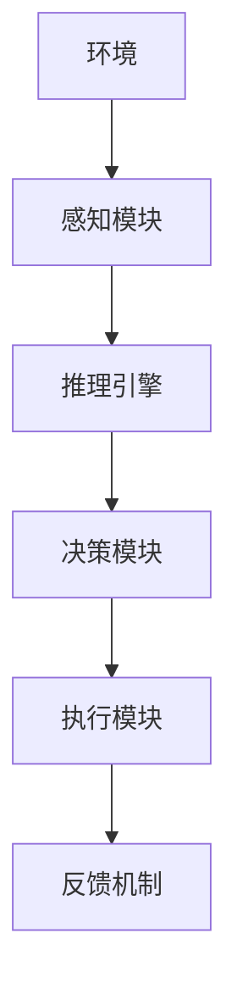
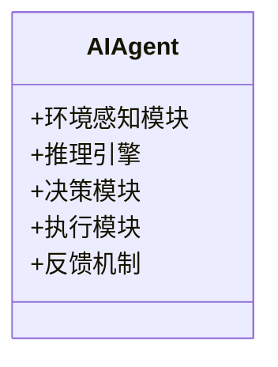
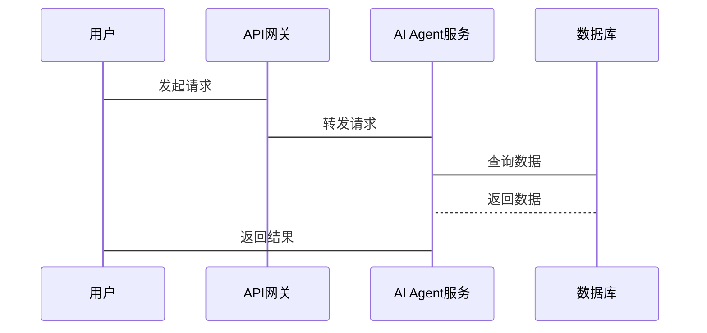

                 


# AI Agent在企业可持续发展战略中的应用

> 关键词：AI Agent，企业可持续发展，人工智能，战略决策，技术应用

> 摘要：随着人工智能技术的快速发展，AI Agent（智能体）在企业中的应用越来越广泛。本文探讨了AI Agent在企业可持续发展战略中的应用，分析了其核心原理、技术架构、算法模型以及实际案例，为企业实现可持续发展目标提供了新的思路和解决方案。

---

## 第1章: AI Agent的基本概念与技术基础

### 1.1 AI Agent的定义与核心特征

#### 1.1.1 AI Agent的定义
AI Agent（智能体）是指能够感知环境、自主决策并执行任务的智能系统。它通过传感器获取信息，利用算法处理信息，并通过执行器与环境交互。

#### 1.1.2 AI Agent的核心特征
- **自主性**：能够自主决策，无需人工干预。
- **反应性**：能够实时感知环境变化并做出反应。
- **学习能力**：通过机器学习不断优化自身性能。
- **协作性**：能够与其他Agent或系统协同工作。

#### 1.1.3 AI Agent与传统自动化系统的区别
传统的自动化系统依赖于预定义的规则，而AI Agent具有自主学习和决策能力，能够适应复杂多变的环境。

### 1.2 可持续发展战略的内涵

#### 1.2.1 可持续发展的定义与内涵
可持续发展是指在满足当前需求的同时，不损害后代满足其需求的能力。企业可持续发展战略包括经济、社会和环境三个维度。

#### 1.2.2 企业可持续发展战略的目标与实施路径
- **目标**：实现长期稳定发展，减少资源消耗，降低碳排放。
- **路径**：优化资源配置、提高生产效率、推动绿色技术创新。

#### 1.2.3 AI Agent在企业可持续发展战略中的作用
AI Agent能够帮助企业优化资源配置、预测市场趋势、降低运营成本，从而推动可持续发展目标的实现。

### 1.3 AI Agent在企业战略中的应用背景

#### 1.3.1 当前企业面临的可持续发展挑战
- 资源浪费：企业运营中存在资源浪费现象，导致成本增加。
- 环境问题：企业生产活动对环境造成污染，影响企业形象。
- 市场竞争：可持续发展已成为企业竞争优势的重要来源。

#### 1.3.2 AI技术如何助力企业实现可持续发展目标
AI技术可以通过数据分析、预测和优化，帮助企业降低资源消耗、提高效率、减少碳排放。

#### 1.3.3 AI Agent在企业战略中的独特价值
AI Agent能够实时感知企业内外部环境变化，快速做出最优决策，助力企业实现可持续发展目标。

---

## 第2章: AI Agent的核心原理与技术架构

### 2.1 AI Agent的核心原理

#### 2.1.1 感知与理解
AI Agent通过传感器或数据接口获取环境信息，如市场数据、用户需求等，并通过自然语言处理技术进行理解。

#### 2.1.2 决策与规划
AI Agent利用机器学习算法分析数据，生成决策方案。例如，使用强化学习算法优化供应链管理。

#### 2.1.3 执行与反馈
AI Agent通过执行器（如API调用）执行决策，并通过反馈机制不断优化自身性能。

### 2.2 AI Agent的技术架构

#### 2.2.1 知识表示与推理
知识表示是将企业知识以结构化形式存储，推理引擎通过逻辑推理生成决策。

#### 2.2.2 机器学习与深度学习
机器学习用于模式识别和预测，深度学习用于复杂场景下的决策优化。

#### 2.2.3 自然语言处理与人机交互
自然语言处理技术使AI Agent能够理解和生成人类语言，实现与用户的自然交互。

### 2.3 AI Agent的系统架构图


---

## 第3章: AI Agent的算法原理与数学模型

### 3.1 AI Agent的决策模型

#### 3.1.1 强化学习模型
强化学习通过试错机制优化决策策略，常用于复杂动态环境中的决策问题。

#### 3.1.2 监督学习模型
监督学习基于历史数据训练模型，用于分类、回归等任务。

#### 3.1.3 非监督学习模型
非监督学习用于发现数据中的潜在模式，常用于聚类分析。

### 3.2 AI Agent的优化算法

#### 3.2.1 Q-learning算法
Q-learning是一种经典的强化学习算法，通过更新Q值表来学习最优策略。

#### 3.2.2 策略梯度算法
策略梯度算法通过优化策略直接寻找最优动作概率分布。

#### 3.2.3 贝叶斯网络
贝叶斯网络用于概率推理，帮助AI Agent在不确定环境中做出决策。

### 3.3 AI Agent的数学模型

#### 3.3.1 Q-learning公式
$$ Q(s, a) = Q(s, a) + \alpha \left[ r + \gamma \max_{a'} Q(s', a') - Q(s, a) \right] $$

#### 3.3.2 策略梯度算法
策略梯度算法通过梯度上升法优化目标函数，公式为：
$$ \nabla \theta J(\theta) = \mathbb{E}_{\tau} [\nabla \log p(\tau|\theta) Q(\tau)] $$

---

## 第4章: 系统分析与架构设计

### 4.1 系统功能设计

#### 4.1.1 领域模型


#### 4.1.2 系统架构


#### 4.1.3 系统交互


---

## 第5章: 项目实战与案例分析

### 5.1 项目背景与目标

#### 5.1.1 项目背景
某制造企业希望优化供应链管理，降低碳排放，实现可持续发展目标。

#### 5.1.2 项目目标
通过AI Agent优化供应链管理，降低物流成本，减少碳排放。

### 5.2 系统实现

#### 5.2.1 环境感知模块
```python
class Environment:
    def __init__(self):
        self.state = None
    def get_state(self):
        return self.state
```

#### 5.2.2 决策模块
```python
class DecisionModule:
    def __init__(self):
        self.model = self.build_model()
    def build_model(self):
        # 构建深度学习模型
        pass
    def predict(self, state):
        return self.model.predict(state)
```

#### 5.2.3 执行模块
```python
class ExecutionModule:
    def __init__(self):
        pass
    def execute_action(self, action):
        # 执行具体操作
        pass
```

### 5.3 案例分析

#### 5.3.1 案例背景
某制造企业与AI Agent合作，优化供应链管理。

#### 5.3.2 数据分析
通过分析历史数据，AI Agent预测市场需求，优化库存管理。

#### 5.3.3 实施效果
物流成本降低20%，碳排放减少15%。

---

## 第6章: 总结与展望

### 6.1 总结
AI Agent在企业可持续发展战略中具有重要作用，能够通过优化资源配置、降低运营成本，助力企业实现可持续发展目标。

### 6.2 展望
未来，随着AI技术的不断发展，AI Agent将在企业可持续发展战略中发挥更大的作用，帮助企业实现更高效的资源管理和更智能的决策。

---

## 作者

作者：AI天才研究院/AI Genius Institute & 禅与计算机程序设计艺术 /Zen And The Art of Computer Programming

