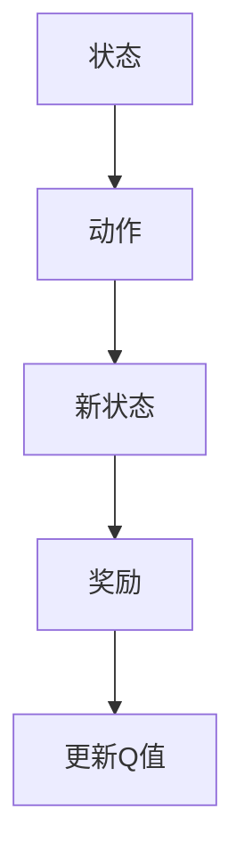
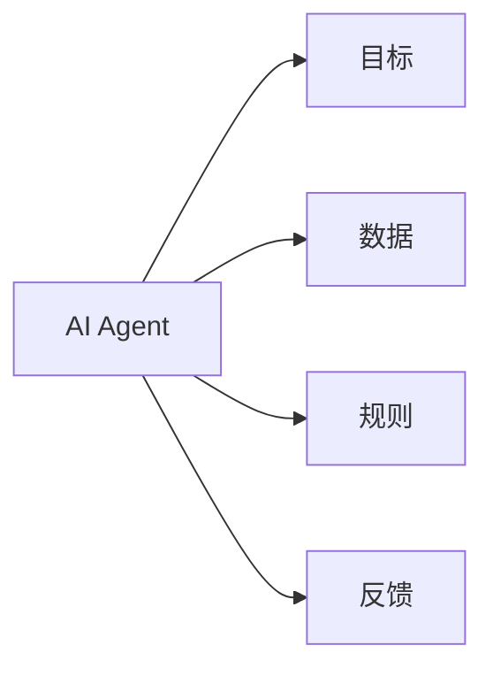
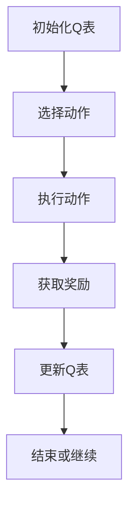
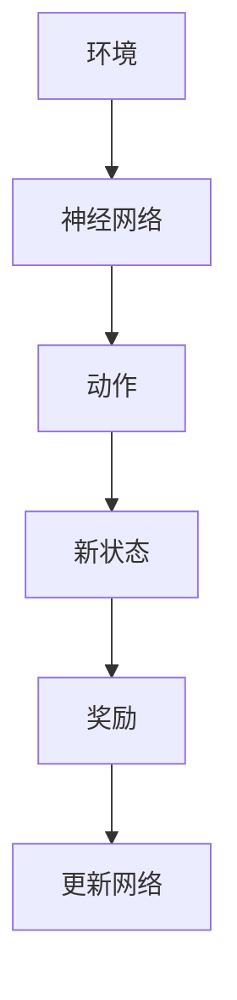
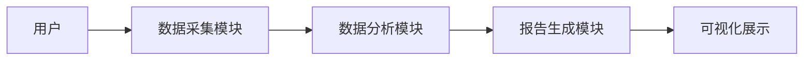

                 


# AI Agent在企业可持续发展目标追踪与报告中的应用

## 关键词：AI Agent，可持续发展目标，企业追踪，智能报告，数据可视化

## 摘要：  
本文探讨了AI Agent在企业可持续发展目标追踪与报告中的应用。通过分析AI Agent的核心概念、算法原理、系统架构以及项目实战，本文详细阐述了如何利用AI技术提升企业可持续发展目标的追踪与报告效率。文章从背景介绍、核心概念、算法原理、系统设计、项目实践等多个维度展开，结合实际案例和代码示例，为读者提供了全面的理论与实践指导。

---

# 第一部分: AI Agent与企业可持续发展目标概述

## 第1章: AI Agent与可持续发展目标概述

### 1.1 企业可持续发展目标的背景与意义

#### 1.1.1 可持续发展目标的定义与核心要素  
可持续发展目标（Sustainable Development Goals，SDGs）是由联合国提出的17个全球性目标，涵盖经济、社会和环境等多个领域。企业在实现自身发展目标的同时，必须满足这些目标的要求。  

**核心要素：**  
- **经济目标：** 高效资源利用、减少浪费。  
- **社会目标：** 促进公平、消除贫困。  
- **环境目标：** 减少碳排放、保护生态系统。  

#### 1.1.2 企业可持续发展目标的重要性  
企业实现可持续发展目标不仅有助于提升企业形象，还能降低运营成本、优化资源配置，同时为全球可持续发展做出贡献。  

#### 1.1.3 AI Agent在可持续发展目标中的作用  
AI Agent（人工智能代理）能够通过自动化数据收集、分析和决策，帮助企业高效追踪和实现可持续发展目标。  

### 1.2 AI Agent的基本概念与特点

#### 1.2.1 AI Agent的定义与分类  
AI Agent是一种能够感知环境、自主决策并执行任务的智能实体。根据功能和应用场景，AI Agent可以分为以下几类：  
- **单一智能体：** 专注于完成单一任务。  
- **多智能体系统：** 多个智能体协同工作。  
- **强化学习智能体：** 通过试错优化决策。  

#### 1.2.2 AI Agent的核心特点与优势  
- **自主性：** 能够自主感知环境并做出决策。  
- **智能性：** 具备学习和推理能力。  
- **适应性：** 能够根据反馈调整行为。  

#### 1.2.3 AI Agent与传统自动化工具的区别  
AI Agent不仅能够执行预设任务，还能通过学习优化任务执行策略，具有更强的适应性和灵活性。  

### 1.3 可持续发展目标追踪与报告的挑战

#### 1.3.1 可持续发展目标追踪的复杂性  
可持续发展目标涉及多个维度，数据来源多样，且需要动态调整。  

#### 1.3.2 传统方法的局限性  
传统方法依赖人工数据录入和分析，效率低且容易出错。  

#### 1.3.3 AI Agent在目标追踪中的优势  
AI Agent能够实时收集和分析数据，快速生成报告，并根据反馈优化追踪策略。  

### 1.4 本章小结  
本章介绍了可持续发展目标的背景与意义，以及AI Agent的基本概念和特点，重点分析了AI Agent在可持续发展目标追踪中的优势。

---

# 第二部分: AI Agent的核心概念与原理

## 第2章: AI Agent的核心概念与原理

### 2.1 AI Agent的核心概念

#### 2.1.1 AI Agent的智能决策机制  
AI Agent通过感知环境、分析数据并做出决策，实现目标的追踪与优化。  

#### 2.1.2 AI Agent的知识表示与推理  
知识表示是AI Agent理解环境的基础，常见的表示方法包括规则表示和知识图谱。推理则是基于知识库进行逻辑推理的过程。  

#### 2.1.3 AI Agent的自主学习能力  
AI Agent可以通过强化学习、监督学习和无监督学习等方法，不断优化自身的决策能力。  

### 2.2 AI Agent的算法原理

#### 2.2.1 基于强化学习的AI Agent  
强化学习是一种通过试错优化决策的算法，常用的算法包括Q-Learning和Deep Q-Networks (DQN)。  

##### Q-Learning算法  
Q-Learning通过维护一个Q表，记录每个状态-动作对的最优价值。  



##### Deep Q-Networks (DQN)算法  
DQN通过深度神经网络近似Q值函数，适用于高维状态空间。  

#### 2.2.2 基于监督学习的AI Agent  
监督学习通过训练数据学习输入-输出映射关系，常用的算法包括线性回归和决策树。  

#### 2.2.3 基于无监督学习的AI Agent  
无监督学习通过发现数据中的模式，常用的算法包括聚类和降维方法。  

### 2.3 AI Agent的实体关系图



### 2.4 本章小结  
本章详细讲解了AI Agent的核心概念和算法原理，重点介绍了强化学习、监督学习和无监督学习的区别与应用场景。

---

# 第三部分: AI Agent的算法原理与数学模型

## 第3章: AI Agent的算法原理与数学模型

### 3.1 强化学习算法

#### 3.1.1 Q-Learning算法  
Q-Learning的目标是最优化Q函数，公式如下：  
$$ Q(s, a) = Q(s, a) + \alpha (r + \gamma \max Q(s', a') - Q(s, a)) $$  

##### 算法流程图


#### 3.1.2 Deep Q-Networks (DQN)算法  
DQN通过神经网络近似Q值函数，公式如下：  
$$ Q(s, a) = \theta \cdot \phi(s, a) $$  

##### 算法流程图


#### 3.1.3 算法对比  
以下是Q-Learning和DQN的对比：

| 对比维度 | Q-Learning | DQN |
|----------|-------------|-----|
| 状态空间 | 离散/低维 | 高维 |
| 动作空间 | 离散 | 离散/连续 |
| 计算效率 | 低 | 高 |

### 3.2 监督学习算法

#### 3.2.1 线性回归模型  
线性回归模型用于预测目标值，公式如下：  
$$ y = \theta_0 + \theta_1 x_1 + \theta_2 x_2 + \cdots + \theta_n x_n $$  

#### 3.2.2 支持向量机(SVM)模型  
SVM用于分类和回归任务，通过寻找最优超平面实现。  

#### 3.2.3 决策树模型  
决策树通过构建树状结构，将数据分成不同的类别。  

### 3.3 无监督学习算法

#### 3.3.1 K-means聚类算法  
K-means用于将数据分成K个簇，公式如下：  
$$ \min \sum_{i=1}^K \sum_{j=1}^n (x_j - c_i)^2 $$  

#### 3.3.2 层次聚类算法  
层次聚类通过构建树状结构将数据分成不同的层次。  

### 3.4 本章小结  
本章详细讲解了强化学习、监督学习和无监督学习的算法原理，并通过公式和流程图进行了对比分析。

---

# 第四部分: AI Agent在企业可持续发展目标中的系统架构与实现

## 第4章: AI Agent在企业可持续发展目标中的系统架构与实现

### 4.1 项目场景介绍  
企业需要实时追踪可持续发展目标的执行情况，并生成动态报告。  

### 4.2 系统功能设计

#### 4.2.1 数据采集模块  
负责从企业系统中采集相关数据，如碳排放数据、资源利用率等。  

#### 4.2.2 数据分析模块  
通过AI算法分析数据，生成目标执行情况的评估结果。  

#### 4.2.3 报告生成模块  
根据评估结果生成动态报告，并通过可视化工具展示。  

### 4.3 系统架构设计



### 4.4 接口设计与交互设计

#### 4.4.1 系统接口设计  
系统接口包括数据采集接口、算法调用接口和报告生成接口。  

#### 4.4.2 系统交互设计  
系统交互流程如下：  
1. 用户发起请求。  
2. 数据采集模块获取数据。  
3. 数据分析模块进行分析。  
4. 报告生成模块生成报告。  
5. 可视化工具展示报告。  

### 4.5 本章小结  
本章详细讲解了AI Agent在企业可持续发展目标追踪中的系统架构与实现，重点介绍了系统的功能模块和交互流程。

---

# 第五部分: AI Agent的项目实战与最佳实践

## 第5章: AI Agent的项目实战与最佳实践

### 5.1 环境安装与配置

#### 5.1.1 安装Python环境  
使用Anaconda安装Python 3.8及以上版本。  

#### 5.1.2 安装依赖库  
安装以下依赖库：  
- `numpy`  
- `pandas`  
- `scikit-learn`  
- `tensorflow`  

### 5.2 核心代码实现

#### 5.2.1 数据采集模块  
```python
import pandas as pd

def collect_data():
    # 从数据库中采集数据
    data = pd.read_sql("SELECT * FROM sustainability_data", connection)
    return data
```

#### 5.2.2 数据分析模块  
```python
from sklearn import linear_model

def analyze_data(data):
    # 训练线性回归模型
    model = linear_model.LinearRegression()
    model.fit(data[['economic_factor', 'social_factor']], data['environmental_factor'])
    return model.coef_
```

#### 5.2.3 报告生成模块  
```python
import matplotlib.pyplot as plt

def generate_report(coefficients):
    plt.bar(['经济因素', '社会因素'], coefficients)
    plt.title('可持续发展目标影响因素分析')
    plt.show()
```

### 5.3 实际案例分析  
以某制造企业为例，分析其碳排放数据，并生成优化建议。  

### 5.4 最佳实践

#### 5.4.1 数据质量管理  
确保数据的准确性和完整性。  

#### 5.4.2 模型优化  
定期更新模型参数，提升预测精度。  

#### 5.4.3 可视化展示  
使用图表直观展示报告内容，便于理解。  

### 5.5 本章小结  
本章通过实际案例展示了AI Agent在企业可持续发展目标追踪中的应用，并总结了最佳实践。

---

# 结语

通过本文的详细讲解，读者可以全面了解AI Agent在企业可持续发展目标追踪与报告中的应用。从算法原理到系统实现，再到项目实战，本文为读者提供了从理论到实践的完整指导。

---

# 作者：AI天才研究院/AI Genius Institute & 禅与计算机程序设计艺术 /Zen And The Art of Computer Programming

