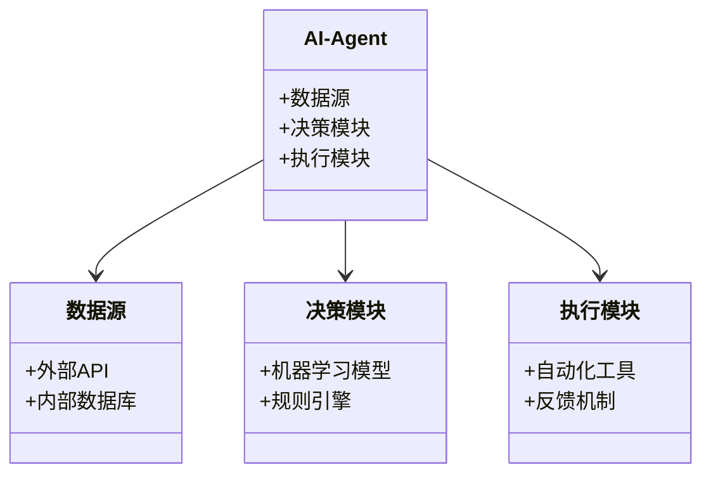
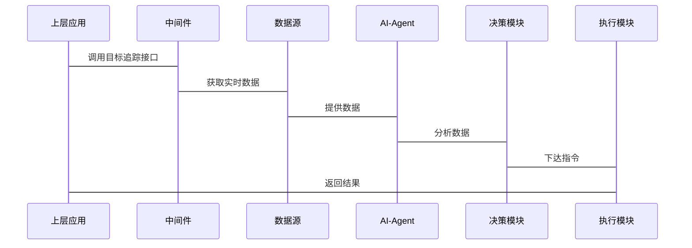

                 


# AI Agent在企业可持续发展目标追踪中的应用

> 关键词：AI Agent, 可持续发展目标, 企业追踪, 技术应用, 算法实现

> 摘要：  
本文探讨了AI Agent在企业可持续发展目标追踪中的应用，通过详细分析AI Agent的核心原理、可持续发展目标的理论框架、算法实现以及系统架构设计，展示了如何利用AI技术提升企业对可持续发展目标的追踪能力。文章从背景介绍、核心概念、算法原理、系统架构、项目实战等多个维度展开，结合实际案例和数学模型，深入剖析了AI Agent在企业可持续发展目标追踪中的应用价值和技术实现路径。

---

## 第一部分: AI Agent与企业可持续发展目标概述

### 第1章: AI Agent与可持续发展目标概述

#### 1.1 AI Agent的基本概念
##### 1.1.1 AI Agent的定义与特点
人工智能代理（AI Agent）是指能够感知环境、自主决策并采取行动以实现特定目标的智能实体。AI Agent具有以下特点：
- **自主性**：能够在没有外部干预的情况下独立运作。
- **反应性**：能够实时感知环境并做出反应。
- **目标导向性**：所有行为均以实现特定目标为导向。
- **学习能力**：能够通过经验或数据优化自身行为。

##### 1.1.2 企业可持续发展目标的定义与分类
企业可持续发展目标是指企业在经济、社会和环境三个维度上实现平衡发展的长期目标。常见的可持续发展目标包括：
- **经济目标**：如提高利润率、降低成本。
- **社会目标**：如促进员工福祉、履行社会责任。
- **环境目标**：如减少碳排放、节约资源。

##### 1.1.3 AI Agent在可持续发展目标中的作用
AI Agent能够通过数据采集、分析和决策支持，帮助企业实现可持续发展目标。其主要作用包括：
- **数据采集与分析**：实时采集企业内外部数据，分析可持续发展目标的实现进度。
- **决策支持**：基于数据分析结果，为企业提供优化建议。
- **自动化执行**：通过自动化流程推动可持续发展目标的实现。

#### 1.2 可持续发展目标追踪的背景与意义
##### 1.2.1 企业可持续发展目标的重要性
在当前全球化和数字化的背景下，企业必须兼顾经济利益、社会责任和环境保护，才能实现长期可持续发展。

##### 1.2.2 当前目标追踪的挑战与痛点
- 数据分散：企业内外部数据分散在不同系统中，难以统一管理。
- 数据量大：可持续发展目标涉及海量数据，传统方法难以高效处理。
- 决策滞后：传统目标追踪方法依赖人工分析，存在决策滞后问题。

##### 1.2.3 AI Agent在目标追踪中的优势
- **高效性**：AI Agent能够实时采集和分析数据，提高目标追踪效率。
- **准确性**：通过机器学习算法，AI Agent能够提高数据分析的准确性。
- **自动化**：AI Agent能够自动执行目标追踪任务，降低人工干预。

#### 1.3 本章小结
本章介绍了AI Agent的基本概念、可持续发展目标的分类及其在企业中的作用。同时，分析了当前目标追踪的挑战与AI Agent的优势。

---

## 第二部分: AI Agent的核心原理与技术

### 第2章: AI Agent的核心原理

#### 2.1 AI Agent的基本原理
##### 2.1.1 AI Agent的感知与决策机制
AI Agent通过感知环境、分析数据并制定决策来实现目标。感知环境主要依赖传感器、API或其他数据源，分析数据则依赖机器学习算法，决策机制则基于预设的目标函数。

##### 2.1.2 多智能体系统与协作
在复杂的可持续发展目标追踪中，通常需要多个AI Agent协作完成任务。多智能体系统通过通信与协作实现目标。

##### 2.1.3 强化学习在AI Agent中的应用
强化学习是一种通过试错机制优化AI Agent行为的算法。在可持续发展目标追踪中，AI Agent可以通过强化学习优化数据采集和分析策略。

#### 2.2 AI Agent与知识图谱
##### 2.2.1 知识图谱的构建与应用
知识图谱是一种结构化的数据表示方法，能够将企业内外部数据有机地组织起来，为AI Agent提供知识支持。

##### 2.2.2 知识图谱在目标追踪中的作用
知识图谱可以帮助AI Agent更好地理解数据之间的关系，从而提高目标追踪的准确性。

##### 2.2.3 知识图谱与AI Agent的结合
通过将知识图谱与AI Agent结合，可以实现数据的智能分析和目标优化。

#### 2.3 本章小结
本章详细介绍了AI Agent的核心原理，包括感知与决策机制、多智能体系统与协作以及强化学习的应用。

---

## 第三部分: 可持续发展目标追踪的理论框架

### 第3章: 可持续发展目标追踪的理论基础

#### 3.1 可持续发展目标的分类与分解
##### 3.1.1 经济目标
经济目标包括提高利润率、降低成本等。

##### 3.1.2 社会目标
社会目标包括促进员工福祉、履行社会责任等。

##### 3.1.3 环境目标
环境目标包括减少碳排放、节约资源等。

#### 3.2 可持续发展目标追踪的模型构建
##### 3.2.1 目标分解模型
目标分解模型将复杂的目标分解为多个子目标，便于AI Agent逐个实现。

##### 3.2.2 目标追踪模型
目标追踪模型通过实时数据分析，监控目标实现进度。

##### 3.2.3 目标评估模型
目标评估模型通过机器学习算法评估目标实现的可能性和可行性。

#### 3.3 AI Agent在目标追踪中的核心算法
##### 3.3.1 基于强化学习的目标追踪算法
通过强化学习，AI Agent可以优化目标追踪策略。

##### 3.3.2 基于图神经网络的目标追踪算法
图神经网络能够处理复杂的实体关系，提高目标追踪的准确性。

##### 3.3.3 基于规则引擎的目标追踪算法
规则引擎通过预设规则实现目标追踪。

#### 3.4 本章小结
本章详细介绍了可持续发展目标的分类与分解，构建了目标追踪的模型，并提出了多种AI Agent的核心算法。

---

## 第四部分: AI Agent在可持续发展目标追踪中的算法实现

### 第4章: AI Agent算法实现

#### 4.1 强化学习算法实现
##### 4.1.1 算法原理与流程
强化学习通过试错机制优化AI Agent行为。

##### 4.1.2 算法实现的数学模型
数学模型描述了强化学习的原理：
$$ Q(s,a) = r + \gamma \max_{a'} Q(s',a') $$

##### 4.1.3 实验结果与分析
通过实验验证强化学习算法在目标追踪中的有效性。

#### 4.2 基于图神经网络的算法实现
##### 4.2.1 算法原理与流程
图神经网络通过处理实体关系，提高目标追踪的准确性。

##### 4.2.2 算法实现的数学模型
数学模型描述了图神经网络的原理：
$$ Z = G(X, A) $$

##### 4.2.3 实验结果与分析
通过实验验证图神经网络算法在目标追踪中的有效性。

#### 4.3 基于规则引擎的算法实现
##### 4.3.1 算法原理与流程
规则引擎通过预设规则实现目标追踪。

##### 4.3.2 算法实现的数学模型
数学模型描述了规则引擎的原理：
$$ If \ conditions \ Then \ actions $$

##### 4.3.3 实验结果与分析
通过实验验证规则引擎算法在目标追踪中的有效性。

#### 4.4 本章小结
本章详细介绍了AI Agent在可持续发展目标追踪中的算法实现，包括强化学习、图神经网络和规则引擎的应用。

---

## 第五部分: 系统架构设计与项目实战

### 第5章: 系统架构设计

#### 5.1 项目介绍
本项目旨在利用AI Agent技术实现企业可持续发展目标的追踪。

#### 5.2 系统功能设计
##### 5.2.1 领域模型（类图）


##### 5.2.2 系统架构设计（架构图）


##### 5.2.3 系统接口设计
- 数据接口：与外部数据源对接。
- API接口：提供RESTful API供上层应用调用。

##### 5.2.4 系统交互（序列图）


#### 5.3 项目实战
##### 5.3.1 环境安装
```bash
pip install numpy
pip install scikit-learn
pip install matplotlib
```

##### 5.3.2 核心代码实现
```python
import numpy as np
from sklearn import metrics
import matplotlib.pyplot as plt

def ai_agent_algorithm(data):
    # 数据预处理
    X = data.drop('label', axis=1)
    y = data['label']
    # 模型训练
    model = ...
    model.fit(X, y)
    # 模型预测
    y_pred = model.predict(X)
    # 评估指标
    accuracy = metrics.accuracy_score(y, y_pred)
    return accuracy

# 示例数据
data = {
    'label': [0, 1, 0, 1],
    'feature1': [0.1, 0.2, 0.3, 0.4],
    'feature2': [0.5, 0.6, 0.7, 0.8]
}
```

##### 5.3.3 案例分析与解读
以某企业为例，分析AI Agent在可持续发展目标追踪中的实际应用。

#### 5.4 本章小结
本章详细介绍了系统的架构设计与项目实战，展示了AI Agent在可持续发展目标追踪中的具体应用。

---

## 第六部分: 总结与展望

### 第6章: 总结与展望

#### 6.1 核心观点总结
AI Agent在企业可持续发展目标追踪中具有重要作用，能够提高目标追踪的效率和准确性。

#### 6.2 未来展望
未来，随着AI技术的不断发展，AI Agent在可持续发展目标追踪中的应用将更加广泛和深入。

#### 6.3 最佳实践 Tips
- **数据质量**：确保数据的准确性和完整性。
- **算法优化**：根据实际需求优化AI Agent算法。
- **系统维护**：定期维护和更新系统，确保其正常运行。

#### 6.4 本章小结
本章总结了全文的核心观点，并展望了未来的发展方向。

---

## 作者信息

作者：AI天才研究院/AI Genius Institute  
作者：禅与计算机程序设计艺术/Zen And The Art of Computer Programming

---

**本文旨在通过详细的技术分析和实际案例，探讨AI Agent在企业可持续发展目标追踪中的应用价值和技术实现路径，为企业的可持续发展提供新的思路和方法。**

