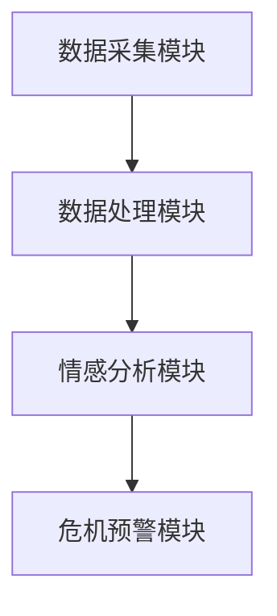

                 


# AI Agent在企业品牌声誉监控与危机预警中的应用

> 关键词：AI Agent，品牌声誉，危机预警，自然语言处理，实时监控，情感分析

> 摘要：本文探讨了AI Agent在企业品牌声誉监控与危机预警中的应用，详细分析了AI Agent的核心概念、算法原理、系统架构设计以及实际项目中的应用场景。通过理论与实践的结合，展示了如何利用AI技术提升企业声誉管理的效率和准确性。

---

## 第一部分：AI Agent与企业品牌声誉监控概述

### 第1章：AI Agent的基本概念与应用背景

#### 1.1 AI Agent的定义与核心原理
- **AI Agent的定义**：AI Agent是指能够感知环境、执行任务并做出决策的智能实体，通常通过机器学习和自然语言处理技术实现。
- **AI Agent的核心功能**：数据采集、分析、推理、决策和执行。
- **AI Agent的应用价值**：提高效率、降低成本、增强决策能力。

#### 1.2 企业品牌声誉监控的重要性
- **品牌声誉的定义**：品牌在消费者心中的形象和信任度。
- **品牌声誉监控的意义**：及时发现负面信息，防止声誉危机。
- **传统监控方法的局限性**：人工成本高、效率低、覆盖面有限。

#### 1.3 AI Agent在品牌声誉监控中的优势
- **实时性**：能够实时采集和分析数据。
- **准确性**：通过算法提高信息处理的准确性。
- **智能化**：能够自动识别潜在风险并触发预警。

---

### 第2章：AI Agent在品牌声誉监控中的核心概念

#### 2.1 品牌声誉监控的核心要素
- **监控对象**：社交媒体、新闻媒体、行业论坛等。
- **监控指标**：情感分析、关键词提取、热度分析。
- **监控周期**：实时监控与历史数据分析。

#### 2.2 AI Agent的核心功能模块
- **数据采集模块**：从各种来源获取数据。
- **数据处理模块**：清洗和预处理数据。
- **情感分析模块**：识别文本的情感倾向。
- **危机预警模块**：根据分析结果触发预警。

#### 2.3 AI Agent与品牌声誉监控的结合模型
- **数据流模型**：数据从采集到处理再到分析的流程。
- **功能模块关系**：各模块之间的协作与依赖。
- **整体架构图（Mermaid）**：
  ```mermaid
  graph TD
      A[数据采集模块] --> B[数据处理模块]
      B --> C[情感分析模块]
      C --> D[危机预警模块]
  ```

---

## 第二部分：算法原理与技术实现

### 第3章：品牌声誉监控的AI Agent系统架构设计

#### 3.1 系统功能模块设计
- **数据采集模块**：使用爬虫技术从社交媒体和新闻网站获取数据。
- **数据预处理模块**：清洗数据，去除噪声。
- **情感分析模块**：使用机器学习模型对文本进行情感分类。
- **危机预警模块**：根据情感分析结果触发预警。

#### 3.2 系统架构设计（Mermaid）


#### 3.3 系统接口设计
- **数据接口**：与其他系统的数据对接。
- **用户接口**：提供给用户查看和管理的功能。

---

## 第三部分：项目实战与案例分析

### 第4章：基于Python的情感分析模型实现

#### 4.1 环境安装
- 安装必要的库：`numpy`、`pandas`、`scikit-learn`、`nltk`。

#### 4.2 核心代码实现
```python
from sklearn.feature_extraction.text import TfidfVectorizer
from sklearn.naive_bayes import MultinomialNB
from sklearn.pipeline import make_pipeline
import pandas as pd

# 数据加载
data = pd.read_csv('data.csv')

# 特征提取
vectorizer = TfidfVectorizer()
X = vectorizer.fit_transform(data['text'])

# 模型训练
model = MultinomialNB()
pipeline = make_pipeline(vectorizer, model)
pipeline.fit(X, data['label'])

# 预测与评估
test_data = pd.read_csv('test.csv')
test_X = vectorizer.transform(test_data['text'])
predicted = pipeline.predict(test_X)
print(predicted)
```

#### 4.3 案例分析
- **案例背景**：某品牌在社交媒体上出现负面评论。
- **数据采集**：获取相关评论数据。
- **情感分析**：识别负面评论并触发预警。
- **结果展示**：生成报告并提出应对策略。

---

## 第四部分：系统优化与扩展

### 第5章：系统优化策略

#### 5.1 系统性能优化
- **数据处理效率**：优化爬虫和数据预处理的速度。
- **模型优化**：使用更复杂的算法如LSTM或BERT提升准确率。

#### 5.2 功能扩展
- **多语言支持**：处理不同语言的文本。
- **实时预警优化**：增加预警的精确性和响应速度。

#### 5.3 注意事项
- 数据隐私问题：确保数据处理符合隐私保护法规。
- 系统稳定性：确保系统在高负载下的稳定性。

---

## 第五部分：总结与展望

### 第6章：总结与未来展望

#### 6.1 核心内容回顾
- AI Agent在品牌声誉监控中的应用价值。
- 关键算法和技术的实现。
- 系统设计与优化策略。

#### 6.2 未来展望
- 结合更多AI技术（如深度学习、知识图谱）提升系统能力。
- 应用场景的扩展：从品牌声誉监控扩展到其他领域。

---

## 作者信息

作者：AI天才研究院/AI Genius Institute & 禅与计算机程序设计艺术 /Zen And The Art of Computer Programming

