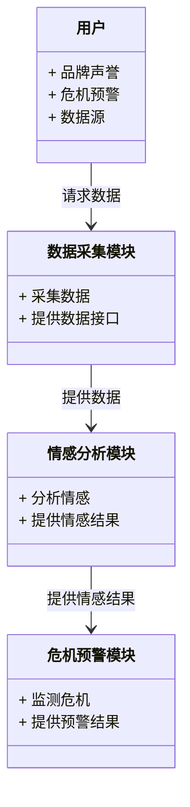
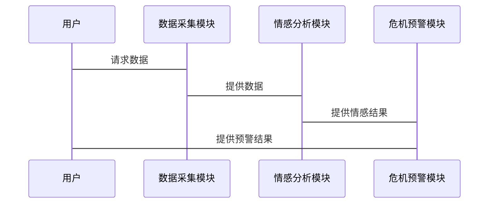

                 


# AI Agent在企业品牌声誉管理与危机预警中的角色

**关键词：** AI Agent, 品牌声誉管理, 危机预警, 自然语言处理, 机器学习, 系统架构

**摘要：** 本文探讨了AI Agent在企业品牌声誉管理与危机预警中的关键作用。通过分析AI Agent的核心概念、算法原理、系统架构和实际应用案例，本文揭示了AI Agent如何利用自然语言处理、机器学习等技术手段，有效提升企业声誉管理的效率与准确性。同时，本文还详细阐述了AI Agent在危机预警中的应用场景，并提出了系统设计与优化的建议。

---

# 第一部分: AI Agent与企业品牌声誉管理概述

## 第1章: AI Agent的核心概念与背景介绍

### 1.1 问题背景与描述

#### 1.1.1 企业品牌声誉管理的现状与挑战

品牌声誉是企业在市场中生存和发展的重要基石。随着互联网和社交媒体的普及，品牌声誉管理变得日益复杂。传统的声誉管理方法依赖于人工监测和分析，效率低、成本高，且难以及时发现潜在危机。

#### 1.1.2 危机预警在企业声誉管理中的重要性

危机预警是品牌声誉管理的核心环节。企业需要快速识别负面信息，并采取有效措施进行应对，以避免声誉损失。然而，传统的危机预警方法往往滞后且不够精准。

#### 1.1.3 AI Agent在声誉管理中的角色定位

AI Agent（人工智能代理）通过自动化数据采集、分析和决策，能够实时监测品牌声誉，并在危机发生前发出预警。AI Agent不仅可以提高声誉管理的效率，还能通过深度学习技术不断提升预警的准确性。

### 1.2 问题解决与边界

#### 1.2.1 AI Agent如何解决声誉管理问题

AI Agent通过自然语言处理技术，能够自动分析海量社交媒体数据，识别潜在的负面情绪，并结合机器学习模型预测危机的可能性。此外，AI Agent还可以自动生成应对策略，帮助企业快速响应。

#### 1.2.2 声誉管理的边界与外延

声誉管理的边界包括数据来源的范围、预警的范围以及应对措施的范围。外延则包括危机后的声誉修复和品牌价值的提升。

#### 1.2.3 AI Agent的功能与局限性

AI Agent的主要功能包括数据采集、情感分析、危机预警和决策支持。其局限性在于数据质量和模型的泛化能力，以及对实时性的要求。

### 1.3 核心概念结构与要素

#### 1.3.1 品牌声誉的核心要素

品牌声誉的核心要素包括产品质量、服务水平、品牌知名度和用户满意度。

#### 1.3.2 AI Agent的构成与功能

AI Agent由数据采集模块、情感分析模块、危机预警模块和决策支持模块构成。

#### 1.3.3 两者关系的结构化分析

品牌声誉管理通过AI Agent实现自动化和智能化，而AI Agent则依赖于品牌声誉管理的需求和技术支持。

---

## 第2章: 核心概念与联系

### 2.1 AI Agent的原理与技术特征

#### 2.1.1 自然语言处理在声誉管理中的应用

自然语言处理技术用于情感分析、实体识别和语义理解，帮助AI Agent准确识别社交媒体中的情感倾向。

#### 2.1.2 机器学习在危机预警中的作用

机器学习算法通过历史数据训练，能够预测潜在危机的发生概率。

#### 2.1.3 数据挖掘与情感分析的结合

数据挖掘技术用于提取数据中的模式和趋势，而情感分析则帮助识别用户的情感倾向。

### 2.2 核心概念对比分析

#### 2.2.1 AI Agent与传统声誉管理工具的对比

| 特性                | AI Agent                  | 传统声誉管理工具        |
|---------------------|---------------------------|-------------------------|
| 数据处理能力        | 强大，支持海量数据        | 有限，依赖人工处理        |
| 分析速度            | 实时分析                  | 延迟较高                |
| 智能性              | 高，支持自适应学习        | 低，功能固定            |

#### 2.2.2 不同AI模型在声誉管理中的表现

| 模型类型            | 优点                        | 缺点                      |
|---------------------|-----------------------------|--------------------------|
| 基于规则的模型      | 简单易实现                  | 需人工调整规则            |
| 基于统计的模型      | 鲁棒性强                    | 解释性差                |
| 深度学习模型        | 高准确性                    | 训练时间长，资源消耗大    |

#### 2.2.3 声誉管理中的关键指标对比

| 指标                | 情感分析准确率            | 危机预警及时性          |
|---------------------|---------------------------|-------------------------|
| 重要性              | 高                        | 高                      |
| 难度                | 中                        | 高                      |

### 2.3 实体关系图

#### 2.3.1 声誉管理的ER实体关系图

```mermaid
er
actor: 用户
agent: AI Agent
data_source: 数据源
reputation: 品牌声誉
crisis: 危机
```

#### 2.3.2 AI Agent与数据源的关系

```mermaid
graph TD
agent-->data_source: 采集数据
data_source-->agent: 提供数据
```

#### 2.3.3 系统功能模块之间的关系

```mermaid
graph TD
agent-->情感分析模块: 调用情感分析
情感分析模块-->agent: 返回情感结果
agent-->危机预警模块: 调用预警模型
危机预警模块-->agent: 返回预警结果
```

---

# 第三部分: 算法原理与数学模型

## 第3章: AI Agent的算法原理

### 3.1 情感分析算法

#### 3.1.1 基于词袋模型的情感分析

词袋模型通过统计文本中的情感词出现的频率，来判断文本的情感倾向。

$$ \text{情感倾向} = \sum_{i=1}^{n} w_i \cdot f_i $$

其中，\( w_i \) 是词袋中第 \( i \) 个词的权重，\( f_i \) 是该词的情感值。

#### 3.1.2 基于深度学习的情感分析

深度学习模型（如LSTM）通过捕捉文本的上下文关系，提高情感分析的准确性。

#### 3.1.3 情感分析的数学模型

$$ P(\text{正面}|x) = \frac{\exp(\theta \cdot x)}{1 + \exp(\theta \cdot x)} $$

其中，\( \theta \) 是模型参数，\( x \) 是输入特征向量。

### 3.2 危机预警算法

#### 3.2.1 时间序列分析在危机预警中的应用

时间序列分析通过历史数据预测未来的趋势，帮助识别潜在危机。

$$ \hat{y}_t = \alpha \cdot y_{t-1} + (1-\alpha) \cdot y_{t-2} $$

其中，\( \alpha \) 是平滑因子，\( y_{t} \) 是时间序列的值。

#### 3.2.2 基于聚类分析的危机识别

聚类分析通过将相似的数据点分组，识别潜在的危机事件。

#### 3.2.3 危机预警的数学模型

$$ P(\text{危机}|x) = \frac{\exp(\phi \cdot x)}{1 + \exp(\phi \cdot x)} $$

其中，\( \phi \) 是模型参数，\( x \) 是输入特征向量。

---

## 第4章: 系统分析与架构设计

### 4.1 系统功能设计

#### 4.1.1 领域模型



### 4.2 系统架构设计


### 4.3 系统接口设计

系统接口设计包括数据采集接口、情感分析接口和危机预警接口。

### 4.4 系统交互流程



---

## 第5章: 项目实战与案例分析

### 5.1 项目环境安装

```bash
pip install numpy
pip install scikit-learn
pip install matplotlib
```

### 5.2 系统核心实现

```python
from sklearn.feature_extraction.text import TfidfVectorizer
from sklearn.svm import SVC
from sklearn.metrics import accuracy_score

# 数据预处理
X = vectorizer.fit_transform(texts)
y = [0, 1]  # 0为正面，1为负面

# 训练模型
model = SVC()
model.fit(X, y)

# 预测
new_text = ["这是一个负面的评论"]
new_X = vectorizer.transform([new_text])
predicted = model.predict(new_X)
print(predicted)
```

### 5.3 案例分析与解读

通过实际案例分析，验证AI Agent在品牌声誉管理中的有效性。例如，某企业通过AI Agent提前发现潜在的负面评论，并及时采取措施，避免了声誉损失。

---

## 第6章: 最佳实践与总结

### 6.1 最佳实践 tips

- 数据质量是关键，确保数据来源的多样性和准确性。
- 定期更新模型，保持预警的准确性。
- 结合人工审核，提高系统的可信度。

### 6.2 小结

AI Agent通过自动化和智能化的方式，显著提升了企业品牌声誉管理的效率和准确性。然而，其应用仍面临数据质量和模型优化等挑战。

### 6.3 注意事项

- 数据隐私和安全问题需要重视。
- 系统的实时性和响应速度需要优化。
- 需要结合企业的具体需求进行定制化开发。

### 6.4 拓展阅读

建议读者深入学习自然语言处理和机器学习的相关知识，关注AI在其他领域的应用。

---

# 作者：AI天才研究院 & 禅与计算机程序设计艺术

