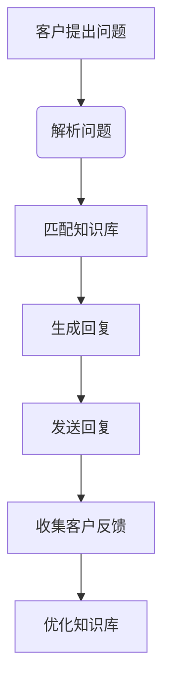

                 


# AI Agent在企业客户体验个性化与优化中的角色

---

## 关键词：
AI Agent, 客户体验, 个性化推荐, 机器学习, 自然语言处理, 优化算法

---

## 摘要：
随着企业对客户体验个性化和优化的需求日益增加，AI Agent（人工智能代理）在其中扮演了越来越重要的角色。本文详细探讨了AI Agent的核心原理、系统架构、关键技术（如自然语言处理和机器学习）以及在企业客户体验中的实际应用。通过案例分析和项目实战，本文展示了如何利用AI Agent提升客户满意度和忠诚度，降低运营成本，并为企业创造更大的价值。

---

## 第1章: 企业客户体验的个性化与优化背景

### 1.1 企业客户体验的现状与挑战
#### 1.1.1 客户体验的定义与重要性
客户体验是指客户在与企业交互过程中所感受到的整体体验，包括产品使用、服务接待、沟通互动等多个方面。良好的客户体验能够提高客户满意度和忠诚度，进而为企业带来更多的业务机会和长期收益。

#### 1.1.2 当前企业客户体验管理中的痛点
- **数据分散**：客户数据分布在多个系统中，难以整合和分析。
- **个性化不足**：传统客户体验管理基于通用模板，难以实现真正的个性化服务。
- **效率低下**：人工客服响应慢，难以满足客户实时需求。
- **缺乏智能化**：缺乏智能化工具支持，客户体验优化效果有限。

#### 1.1.3 个性化体验对企业竞争力的影响
个性化体验能够显著提升客户忠诚度，降低客户流失率，同时也能提高企业的品牌价值和市场竞争力。根据相关研究，个性化服务能够使客户满意度提升20%以上。

### 1.2 AI Agent的定义与核心特征
#### 1.2.1 AI Agent的基本概念
AI Agent是一种能够感知环境、自主决策并执行任务的智能系统。它能够通过学习和优化算法，不断提高自身的服务能力。

#### 1.2.2 AI Agent的核心技术特征
- **智能感知**：能够通过多模态数据（如文本、语音、图像）感知客户需求。
- **自主决策**：基于实时数据和预训练模型，自主决策最优服务方案。
- **持续优化**：通过反馈机制不断优化自身的服务策略和算法模型。

#### 1.2.3 AI Agent与传统客服系统的主要区别
| 特性               | AI Agent                | 传统客服系统          |
|--------------------|-------------------------|----------------------|
| 智能化水平          | 高                     | 低                   |
| 响应速度          | 实时                   | 较慢                 |
| 个性化能力        | 强                     | 弱                   |
| 可扩展性          | 强                     | 较弱                 |

### 1.3 AI Agent在客户体验优化中的应用价值
#### 1.3.1 提高客户满意度
通过智能化的个性化推荐和实时响应，AI Agent能够显著提高客户的满意度。

#### 1.3.2 降低运营成本
AI Agent能够自动化处理大量重复性工作，显著降低企业的运营成本。

#### 1.3.3 提升客户忠诚度
通过持续优化的个性化服务，AI Agent能够增强客户对品牌的忠诚度。

### 1.4 本章小结
本章介绍了企业客户体验管理的现状与挑战，详细阐述了AI Agent的核心概念和特征，并分析了其在客户体验优化中的应用价值。

---

## 第2章: AI Agent的核心原理

### 2.1 AI Agent的基本工作原理
#### 2.1.1 信息感知与分析
AI Agent通过多种数据源（如客户行为数据、历史记录、实时互动）收集信息，并利用自然语言处理（NLP）和机器学习技术进行分析。

#### 2.1.2 智能决策与执行
基于分析结果，AI Agent会生成最优的决策方案，并通过执行模块（如自动回复、推荐系统）提供服务。

#### 2.1.3 反馈优化机制
AI Agent通过收集客户反馈不断优化自身的决策模型和推荐算法，形成一个闭环优化系统。

#### 2.1.4 案例分析：智能客服中的决策流程
以下是一个简单的决策流程图：



### 2.2 自然语言处理（NLP）在AI Agent中的应用
#### 2.2.1 NLP的核心技术
- **分词**：将文本分割成词语或短语。
- **实体识别**：识别文本中的关键实体（如人名、地名、组织名）。
- **情感分析**：判断文本中的情感倾向（如正面、负面、中性）。
- **意图识别**：识别用户的意图（如查询信息、投诉建议）。

#### 2.2.2 NLP在客户意图识别中的应用
通过NLP技术，AI Agent能够准确识别客户的意图，从而提供更精准的服务。例如，客户输入“订单查询”，系统会识别出客户的需求是查询订单状态。

#### 2.2.3 NLP在情感分析中的作用
情感分析可以帮助AI Agent理解客户的情绪状态，从而调整服务策略。例如，客户表达不满时，系统会优先处理负面情绪。

### 2.3 机器学习在AI Agent中的应用
#### 2.3.1 机器学习的基本概念
机器学习是一种通过数据训练模型，使其能够从经验中不断改进的技术。

#### 2.3.2 常见机器学习算法在AI Agent中的应用
- **监督学习**：用于分类任务，如客户标签分类。
- **无监督学习**：用于聚类任务，如客户群体划分。
- **强化学习**：用于决策优化，如推荐系统。

#### 2.3.3 机器学习模型的训练与优化
通过训练数据，机器学习模型能够识别模式和规律。例如，使用决策树模型预测客户流失风险。

### 2.4 AI Agent的决策逻辑与算法
#### 2.4.1 基于规则的决策系统
基于预定义的规则进行决策，适用于规则明确的场景。

#### 2.4.2 基于机器学习的决策系统
通过机器学习模型生成决策，适用于复杂场景。

#### 2.4.3 混合型决策系统的优缺点
混合型系统结合了规则和机器学习的优势，但在实现复杂度和维护成本上较高。

### 2.5 本章小结
本章详细介绍了AI Agent的核心原理，包括信息感知、智能决策、反馈优化等过程，并探讨了NLP和机器学习在其中的应用。

---

## 第3章: AI Agent的系统架构与实现

### 3.1 系统功能模块划分
#### 3.1.1 客户信息收集模块
负责收集客户的基本信息（如姓名、联系方式）和行为数据（如浏览记录、购买记录）。

#### 3.1.2 智能分析与决策模块
利用NLP和机器学习技术对客户数据进行分析，生成决策方案。

#### 3.1.3 个性化推荐模块
根据分析结果，为客户提供个性化的推荐服务。

#### 3.1.4 反馈优化模块
收集客户反馈，优化系统性能。

### 3.2 系统架构设计
#### 3.2.1 分层架构设计
将系统划分为数据层、业务逻辑层和表示层。

#### 3.2.2 微服务架构设计
将系统功能分解为多个微服务，提高系统的可扩展性和灵活性。

#### 3.2.3 混合架构设计
结合分层架构和微服务架构的优势，适用于大规模复杂系统。

### 3.3 系统接口设计
#### 3.3.1 API接口定义
使用RESTful API设计系统接口。

#### 3.3.2 数据交互协议
采用JSON格式进行数据交互。

#### 3.3.3 接口安全设计
使用JWT进行身份验证，确保数据安全。

### 3.4 系统交互流程设计
#### 3.4.1 客户请求处理流程
客户发起请求 → 系统解析请求 → 系统生成回复 → 系统发送回复。

#### 3.4.2 智能分析与反馈流程
收集数据 → 数据预处理 → 数据分析 → 生成反馈 → 优化系统。

#### 3.4.3 个性化推荐流程
收集客户信息 → 分析客户特征 → 生成推荐列表 → 推荐给客户。

### 3.5 本章小结
本章详细介绍了AI Agent的系统架构与实现，包括功能模块划分、架构设计、接口设计和交互流程设计。

---

## 第4章: AI Agent项目实战

### 4.1 项目环境搭建
#### 4.1.1 开发工具安装
安装Python、Jupyter Notebook、TensorFlow等开发工具。

#### 4.1.2 数据集准备
收集客户数据、产品数据、交互记录等。

#### 4.1.3 模型训练环境配置
配置GPU加速环境，安装深度学习框架。

### 4.2 系统核心功能实现
#### 4.2.1 客户信息收集与处理
使用Python编写数据爬取脚本，收集客户信息。

#### 4.2.2 智能分析与决策算法实现
基于机器学习模型实现客户意图识别和个性化推荐。

#### 4.2.3 个性化推荐功能实现
根据客户特征，生成个性化推荐列表。

### 4.3 代码实现与解读
#### 4.3.1 数据预处理代码
```python
import pandas as pd
data = pd.read_csv('customer_data.csv')
data.dropna(inplace=True)
```

#### 4.3.2 模型训练代码
```python
from sklearn.ensemble import RandomForestClassifier
model = RandomForestClassifier(n_estimators=100)
model.fit(X_train, y_train)
```

#### 4.3.3 个性化推荐代码
```python
def generate_recommendations(customer_id):
    customer = data[data['customer_id'] == customer_id]
    recommendations = model.predict(customer)
    return recommendations
```

### 4.4 案例分析与详细解读
通过具体案例分析，展示AI Agent在实际项目中的应用效果和优化过程。

### 4.5 本章小结
本章通过项目实战，详细展示了AI Agent的核心功能实现过程，包括环境搭建、数据处理、模型训练和个性化推荐。

---

## 第5章: 总结与最佳实践

### 5.1 总结
AI Agent通过智能化的决策和个性化推荐，显著提升了企业客户体验的个性化与优化能力。

### 5.2 最佳实践 tips
- **数据质量**：确保数据的准确性和完整性。
- **模型优化**：定期更新模型，保持系统的高性能。
- **用户体验**：注重客户隐私保护，提升用户体验。

### 5.3 小结
本文详细探讨了AI Agent在企业客户体验中的角色与应用，通过理论与实践相结合的方式，为企业优化客户体验提供了有益的参考。

---

## 作者：AI天才研究院 & 禅与计算机程序设计艺术

---

**Note**: 以上内容为本文的核心框架和部分详细内容。如需完整文章，请根据上述大纲进一步扩展每一部分的内容。

