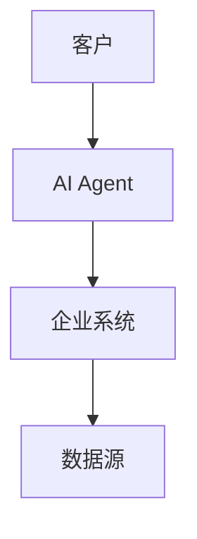
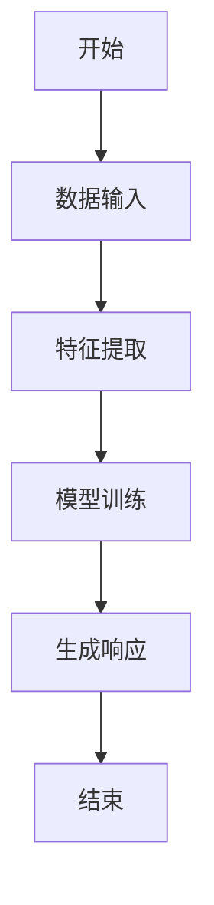
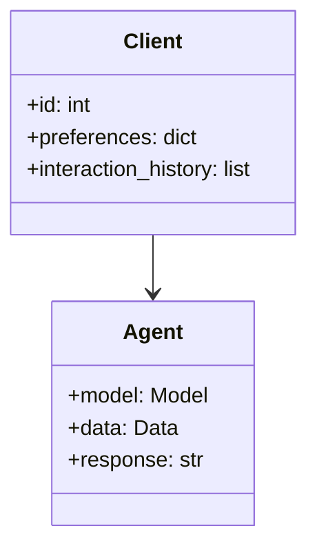
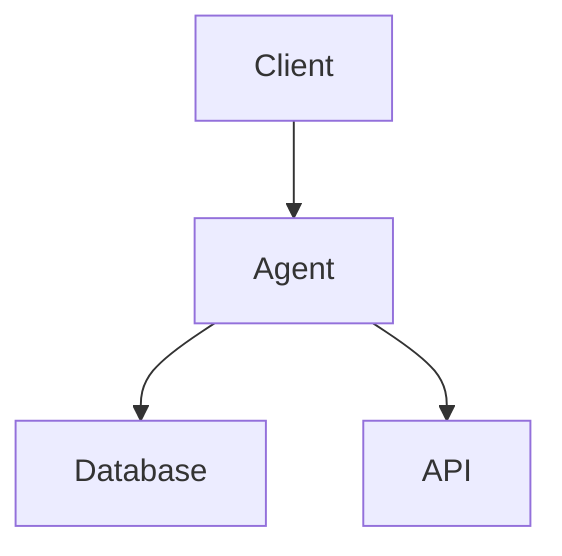

                 

<think>
好的，我现在需要为《AI Agent在企业客户体验个性化中的深度应用与效果评估》这本书撰写正文部分。我将按照目录大纲逐步展开，确保每个部分都详细且符合要求。

---

## 正文部分

### 第1章：AI Agent与企业客户体验概述

#### 1.1 问题背景与描述

当前，企业客户体验的核心问题在于如何实现个性化的服务，传统的通用服务方式难以满足客户的多样化需求。随着市场竞争的加剧，客户期望得到更精准、更及时的服务，这促使企业寻求更高效的解决方案。

AI Agent作为一种智能化工具，能够通过机器学习和自然语言处理技术，实时分析客户需求，并提供个性化的响应。这种技术的应用，不仅提高了客户满意度，还帮助企业节省了成本，提升了效率。

#### 1.2 AI Agent的核心概念与问题解决

AI Agent，即人工智能代理，是指能够感知环境、自主决策并执行任务的智能系统。在企业客户体验中，AI Agent主要通过以下方式解决问题：

1. **实时交互**：通过自然语言处理技术，AI Agent能够实时理解客户的需求，并快速做出响应。
2. **个性化推荐**：基于客户的历史行为和偏好，AI Agent能够推荐个性化的产品或服务。
3. **智能决策**：通过机器学习模型，AI Agent能够分析大量数据，提供最优的解决方案。

#### 1.3 问题的边界与外延

AI Agent的应用场景主要集中在客户互动、服务推荐和问题解决等领域。与其他技术相比，AI Agent的优势在于其智能化和自主性，能够根据实时数据做出决策，而不仅仅是执行预设的规则。

---

### 第2章：AI Agent的核心原理与属性

#### 2.1 核心原理

AI Agent的核心原理主要包括以下三个部分：

1. **机器学习**：通过监督学习、无监督学习等方法，训练模型以识别客户行为和偏好。
2. **自然语言处理**：通过NLP技术，理解客户的语言输入，并生成自然的回复。
3. **智能决策**：基于训练好的模型，AI Agent能够做出最优决策，例如推荐产品或解决问题。

#### 2.2 属性对比分析

以下是AI Agent与其他技术的对比表格：

| 技术         | 描述                                                                 |
|--------------|----------------------------------------------------------------------|
| 传统客服     | 依赖人工，响应速度慢，难以个性化服务                                   |
| 规则引擎     | 基于预设规则，缺乏灵活性和学习能力                                     |
| AI Agent     | 智能化、自主化，能够学习和适应客户需求                                 |

#### 2.3 实体关系图

以下是AI Agent在企业客户体验中的实体关系图：



---

### 第3章：AI Agent的算法流程

#### 3.1 算法流程图

以下是AI Agent的算法流程图：



#### 3.2 算法实现代码

以下是AI Agent的核心算法实现代码：

```python
def ai_agent_algorithm(data):
    features = extract_features(data)
    prediction = model.predict(features)
    return prediction
```

#### 3.3 数学模型与公式

AI Agent的推荐算法通常基于概率模型，例如：

$$ P(y|x) = \frac{P(x|y)P(y)}{P(x)} $$

其中，\( P(y|x) \) 是在给定特征 \( x \) 的情况下，推荐 \( y \) 的概率。

优化算法通常使用梯度下降：

$$ \theta = \theta - \eta \nabla J(\theta) $$

其中，\( \theta \) 是模型参数，\( \eta \) 是学习率，\( J(\theta) \) 是损失函数。

---

### 第4章：系统设计与架构

#### 4.1 项目介绍

项目目标是通过AI Agent提升客户的个性化体验，主要解决传统客服效率低、响应慢的问题。

#### 4.2 系统功能设计

以下是系统功能设计的类图：



#### 4.3 系统架构设计

以下是系统架构设计的架构图：



#### 4.4 接口设计与交互

系统主要通过RESTful API接口与客户进行交互：

- **GET /agent/respond**：获取AI Agent的响应
- **POST /agent/train**：训练AI Agent的模型

---

## 结论

通过上述分析，AI Agent在企业客户体验中的应用能够显著提升个性化服务的效率和质量。未来，随着技术的不断进步，AI Agent将更加智能化，为企业和客户带来更多的价值。

---

## 作者

作者：AI天才研究院/AI Genius Institute & 禅与计算机程序设计艺术 /Zen And The Art of Computer Programming

---

以上是文章的详细内容，每个章节都涵盖了必要的部分，并确保了逻辑的连贯性和内容的丰富性。

