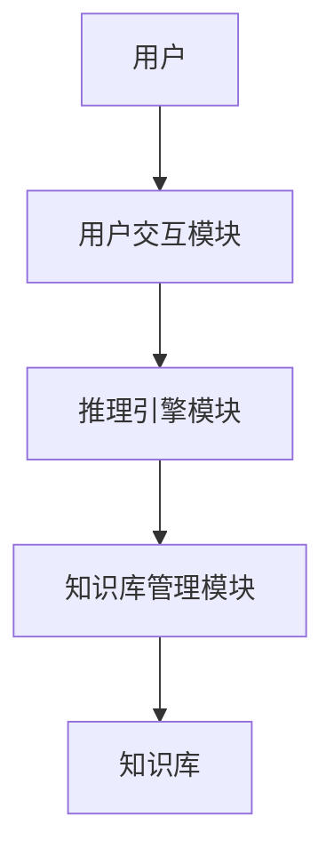
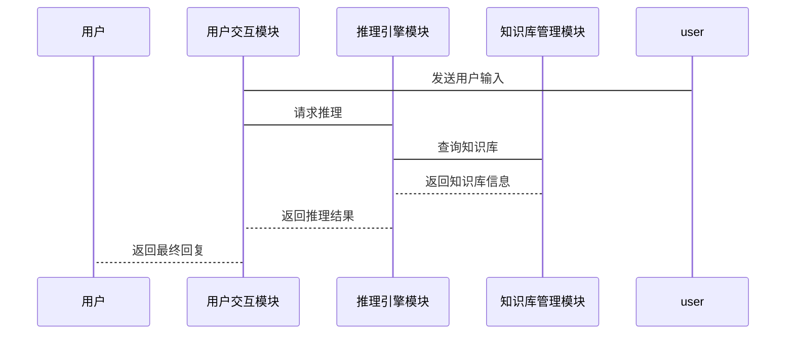

                 


# AI Agent在企业客户体验个性化中的角色

> 关键词：AI Agent，企业客户体验，个性化服务，多智能体系统，对话生成机制，知识表示与推理

> 摘要：本文深入探讨了AI Agent在企业客户体验个性化中的角色，从基本概念到算法原理，再到系统设计和项目实战，全面分析了AI Agent如何通过智能化手段提升客户体验个性化服务的水平。文章结合实际案例和详细的技术分析，为读者提供了从理论到实践的完整指导。

---

## 第一部分: AI Agent与企业客户体验个性化概述

### 第1章: AI Agent的基本概念与背景

#### 1.1 AI Agent的定义与特点
##### 1.1.1 AI Agent的定义
AI Agent（人工智能代理）是指能够感知环境、自主决策并执行任务的智能实体。它通过传感器获取信息，利用推理引擎进行分析，并通过执行器与外部环境交互。AI Agent的核心目标是通过智能化手段优化任务执行效率，同时提升用户体验。

##### 1.1.2 AI Agent的核心特点
- **自主性**：AI Agent能够自主决策，无需人工干预。
- **反应性**：能够实时感知环境变化并做出响应。
- **学习能力**：通过机器学习算法不断优化自身的决策能力。
- **协作性**：在多智能体系统中，AI Agent能够与其他代理协作完成复杂任务。

##### 1.1.3 AI Agent与传统自动化工具的区别
AI Agent与传统自动化工具的主要区别在于其智能化和自主性。传统自动化工具通常是基于规则的，而AI Agent能够通过学习和推理适应复杂多变的环境。

#### 1.2 企业客户体验管理的背景
##### 1.2.1 客户体验管理的重要性
客户体验（Customer Experience, CX）是企业在与客户互动过程中提供的整体体验。良好的客户体验能够提升客户忠诚度、满意度和品牌价值，从而为企业创造更大的价值。

##### 1.2.2 个性化服务的背景与趋势
随着市场竞争的加剧，客户对个性化服务的需求日益增长。个性化服务不仅能够提高客户满意度，还能够帮助企业建立长期的竞争优势。

##### 1.2.3 企业客户体验管理的挑战
- **客户需求多样化**：不同客户的需求千差万别，难以通过统一的流程满足。
- **数据孤岛问题**：企业内部数据分散，难以整合和共享。
- **实时响应需求**：客户期望企业能够实时响应他们的需求，这对企业的技术能力提出了更高的要求。

#### 1.3 AI Agent在客户体验中的角色
##### 1.3.1 AI Agent在客户体验中的应用场景
AI Agent在客户体验中的应用场景包括智能客服、个性化推荐、实时互动等。

##### 1.3.2 AI Agent如何实现客户体验个性化
AI Agent通过分析客户的历史行为、偏好和实时需求，提供个性化的服务和建议。例如，在智能客服场景中，AI Agent可以根据客户的具体问题，提供个性化的解决方案。

##### 1.3.3 AI Agent与客户体验管理的结合
AI Agent与客户体验管理的结合，不仅能够提高客户满意度，还能够降低企业的运营成本。通过AI Agent的智能化服务，企业可以实现24/7的客户支持，提高客户忠诚度。

---

## 第2章: AI Agent的核心概念与原理

### 2.1 多智能体系统概述
#### 2.1.1 多智能体系统的定义
多智能体系统是指由多个智能体组成的协作系统，每个智能体都有自己的目标和决策机制。通过协作，智能体能够共同完成复杂任务。

#### 2.1.2 多智能体系统的分类
多智能体系统可以根据智能体的协作方式和任务类型进行分类，包括基于规则的协作、基于市场的协作和基于学习的协作。

#### 2.1.3 多智能体系统的核心要素
- **智能体**：具有感知、推理和行动能力的实体。
- **协作机制**：智能体之间协作的方式和规则。
- **通信协议**：智能体之间交流信息的协议。

#### 2.1.4 多智能体系统的优缺点
- **优点**：能够处理复杂任务，提高系统灵活性。
- **缺点**：系统设计复杂，需要处理智能体之间的协作和通信问题。

### 2.2 对话生成机制
#### 2.2.1 对话生成的基本原理
对话生成机制是指智能体通过自然语言处理技术生成符合上下文的对话内容。它通常包括意图识别、槽位填充和生成回复三个步骤。

#### 2.2.2 基于规则的对话生成
基于规则的对话生成是一种简单但有效的对话生成方法。通过预定义的规则和模板，智能体可以生成符合要求的回复。

#### 2.2.3 基于机器学习的对话生成
基于机器学习的对话生成是一种更高级的对话生成方法。它通过训练大量的对话数据，学习对话的模式和规律，并生成自然流畅的回复。

### 2.3 知识表示与推理
#### 2.3.1 知识图谱的构建
知识图谱是一种结构化的知识表示方式，通过实体和关系描述知识的组织形式。它可以帮助智能体更好地理解和推理知识。

#### 2.3.2 知识表示的常用方法
知识表示的常用方法包括基于规则的表示和基于图的表示。基于规则的表示通过预定义的规则描述知识，而基于图的表示通过图结构描述实体之间的关系。

#### 2.3.3 基于知识图谱的推理过程
基于知识图谱的推理过程包括前向推理和反向推理。前向推理是从已知的事实出发，推导出新的事实；反向推理是从目标事实出发，推导出支持目标的事实。

---

## 第3章: AI Agent的算法原理与实现

### 3.1 强化学习算法
#### 3.1.1 强化学习的基本原理
强化学习是一种通过试错学习优化决策策略的方法。智能体通过与环境交互，学习如何采取最优行动以最大化累计奖励。

#### 3.1.2 Q-Learning算法的实现
Q-Learning是一种经典的强化学习算法，通过维护Q表记录状态-动作对的期望奖励值。算法通过不断更新Q表，学习最优策略。

#### 3.1.3 算法的数学模型与公式
Q-Learning算法的更新公式为：
$$ Q(s,a) = r + \gamma \max Q(s',a') $$

其中，\( s \) 是当前状态，\( a \) 是当前动作，\( s' \) 是下一个状态，\( r \) 是奖励，\( \gamma \) 是折扣因子。

### 3.2 对话生成模型
#### 3.2.1 基于Transformer的对话生成
基于Transformer的对话生成模型通过自注意力机制捕捉对话的全局信息，生成自然流畅的回复。

#### 3.2.2 模型的训练与优化
对话生成模型的训练通常采用端到端的训练方法，通过最大化生成概率来优化模型参数。

#### 3.2.3 对话生成的评估指标
常用的对话生成评估指标包括BLEU、ROUGE和METEOR等。

### 3.3 知识推理算法
#### 3.3.1 基于规则的知识推理
基于规则的知识推理通过预定义的规则进行推理，适用于知识结构简单且规则明确的场景。

#### 3.3.2 基于机器学习的知识推理
基于机器学习的知识推理通过训练推理模型，学习推理的模式和规律，适用于知识结构复杂且规则不明确的场景。

#### 3.3.3 知识推理的数学模型
基于概率的推理模型通常采用贝叶斯网络进行推理，其基本公式为：
$$ P(h|e) = \frac{P(e|h)P(h)}{P(e)} $$

其中，\( h \) 是假设，\( e \) 是证据。

---

## 第4章: AI Agent的系统架构与设计

### 4.1 系统架构概述
#### 4.1.1 分层架构设计
分层架构将系统划分为多个层次，每个层次负责特定的功能。这种架构设计有助于提高系统的可维护性和扩展性。

#### 4.1.2 组件化设计
组件化设计将系统功能分解为多个独立的组件，每个组件负责特定的任务。这种设计有助于提高系统的灵活性和可扩展性。

#### 4.1.3 微服务架构
微服务架构将系统功能分解为多个独立的服务，每个服务负责特定的任务。这种架构设计有助于提高系统的弹性和可扩展性。

### 4.2 系统功能设计
#### 4.2.1 用户交互模块
用户交互模块负责与用户的交互，包括接收输入、生成回复和管理对话状态。

#### 4.2.2 知识库管理模块
知识库管理模块负责管理系统的知识库，包括知识的存储、更新和检索。

#### 4.2.3 推理引擎模块
推理引擎模块负责根据用户输入和知识库中的知识，生成符合逻辑的回复。

### 4.3 系统架构图


### 4.4 系统接口设计
系统接口设计包括用户接口和系统内部接口。用户接口用于与用户交互，系统内部接口用于模块之间的通信。

### 4.5 系统交互序列图


---

## 第5章: 项目实战

### 5.1 环境安装
项目实战需要安装以下环境和工具：
- Python 3.8+
- TensorFlow 2.0+
- Keras 2.4.3+
- NLTK 3.6+

### 5.2 核心代码实现
#### 5.2.1 对话生成模型的实现
```python
import tensorflow as tf
from tensorflow.keras.layers import Input, Dense, Dropout, LSTM
from tensorflow.keras.models import Model

# 定义模型输入
input_sequences = Input(shape=(max_sequence_length,))
embeddings = LSTM(64)(input_sequences)
output = Dense(vocabulary_size, activation='softmax')(embeddings)

# 定义模型
model = Model(inputs=input_sequences, outputs=output)
model.compile(optimizer='adam', loss='sparse_categorical_crossentropy', metrics=['accuracy'])
```

#### 5.2.2 知识推理模块的实现
```python
from transformers import pipeline

# 初始化零样本学习模型
zero_shot_classifier = pipeline("zero-shot-classification", model="facebook/bart-large-mnli")

# 定义推理函数
def infer_class(text, labels):
    result = zero_shot_classifier(text, labels)
    return result['scores'][0]
```

### 5.3 案例分析
#### 5.3.1 智能客服场景
在智能客服场景中，AI Agent可以实时响应客户的咨询，提供个性化的解决方案。例如，当客户咨询产品问题时，AI Agent可以根据客户的历史行为和偏好，提供相关的解决方案。

#### 5.3.2 个性化推荐场景
在个性化推荐场景中，AI Agent可以根据客户的行为数据和偏好，推荐符合客户需求的产品或服务。例如，在电商平台上，AI Agent可以根据客户的购买历史和浏览记录，推荐相关的产品。

### 5.4 项目小结
通过项目实战，我们可以看到AI Agent在企业客户体验个性化中的巨大潜力。通过智能化的服务，企业可以提高客户满意度和忠诚度，同时降低运营成本。

---

## 第6章: 总结与展望

### 6.1 总结
本文从AI Agent的基本概念到算法原理，再到系统设计和项目实战，全面分析了AI Agent在企业客户体验个性化中的角色。通过智能化的服务，企业可以提高客户满意度和忠诚度，同时降低运营成本。

### 6.2 展望
未来，随着AI技术的不断发展，AI Agent在企业客户体验个性化中的应用将更加广泛和深入。通过结合大数据、区块链和物联网等技术，AI Agent将为企业客户体验管理提供更加智能化和个性化的解决方案。

---

## 作者

作者：AI天才研究院/AI Genius Institute & 禅与计算机程序设计艺术 /Zen And The Art of Computer Programming

