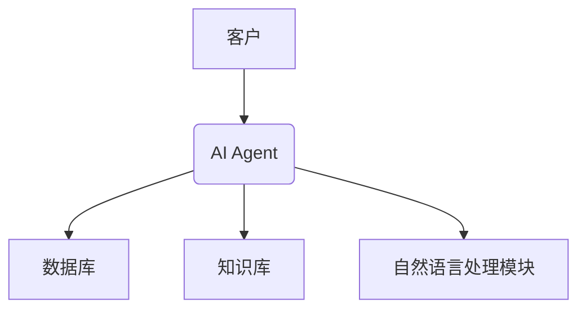
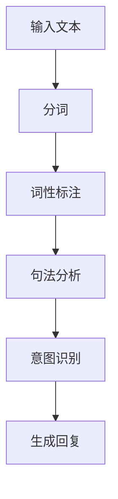
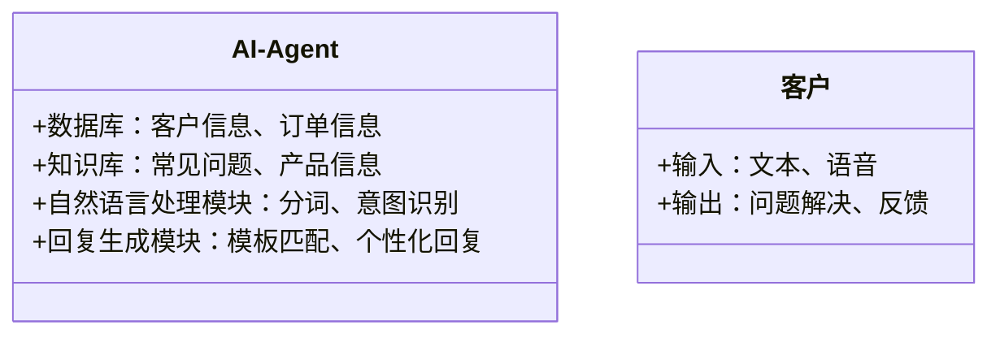
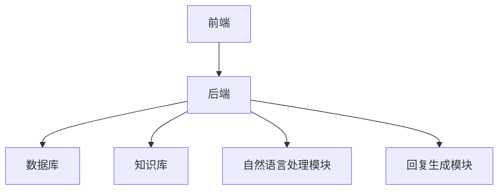
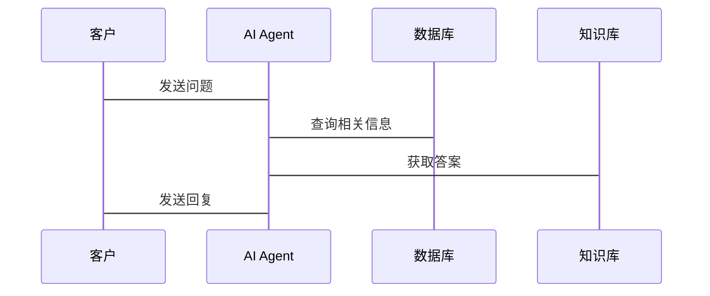

                 


# AI Agent在企业客户服务中的应用：提升效率与满意度

## 关键词：AI Agent, 企业客户服务, 人工智能, 客户满意度, 效率提升

## 摘要：AI Agent作为一种智能客服解决方案，通过自动化处理客户咨询、问题解决和数据分析，显著提升了企业客户服务的效率和客户满意度。本文从AI Agent的基本概念、算法原理、系统架构到实际应用案例，详细探讨其在企业客户服务中的应用价值，并总结最佳实践和未来发展方向。

---

## 第1章: AI Agent的基本概念与背景

### 1.1 AI Agent的定义与特点
AI Agent，即人工智能代理，是一种能够感知环境并采取行动以实现目标的智能系统。它通过自然语言处理、机器学习等技术，能够理解用户需求，提供个性化的服务。AI Agent的特点包括智能化、自动化、学习能力强、7×24小时可用等。

### 1.2 企业客户服务的现状
传统客户服务模式依赖人工客服，存在响应慢、效率低、成本高等问题。随着企业规模的扩大，客户数量激增，传统模式难以满足需求。同时，客户期望越来越高，对服务的要求也更加严格。

### 1.3 AI Agent在企业客户服务中的应用背景
AI技术的快速发展为AI Agent的应用提供了技术基础。AI Agent能够快速响应客户需求，提供准确的信息，显著提升客户满意度和效率。企业采用AI Agent不仅降低了成本，还提高了客户体验。

---

## 第2章: AI Agent的核心概念与联系

### 2.1 AI Agent的原理与架构
AI Agent的原理基于自然语言处理和机器学习，能够理解客户的意图并生成相应的回复。其架构通常包括前端交互界面和后端处理系统，前端负责与用户互动，后端负责数据处理和决策。

### 2.2 AI Agent的属性特征对比
以下是AI Agent与传统客服工具的对比表格：

| 特性          | AI Agent                     | 传统客服工具               |
|---------------|------------------------------|-----------------------------|
| 响应速度       | 实时响应                     | 受限于人工                   |
| 可用性         | 7×24小时可用                 | 有限的工作时间               |
| 处理能力       | 能处理复杂问题               | 处理能力有限                 |
| 成本           | 降低                       | 较高                       |
| 学习能力       | 可以通过数据优化             | 有限                       |

以下是AI Agent的实体关系图：



---

## 第3章: AI Agent的算法原理与数学模型

### 3.1 AI Agent的核心算法
AI Agent通常使用自然语言处理算法，如分词、语义理解、意图识别等。以下是意图识别算法的流程图：



以下是意图识别的Python代码示例：

```python
import spacy
nlp = spacy.load("en_core_web_sm")
text = "I want to cancel my order."
doc = nlp(text)
for token in doc:
    print(token.text, token.pos_, token.dep_)
```

### 3.2 数学模型与公式
自然语言处理中的词袋模型可以表示为：

$$
\text{Document} = \{x_i: x_i \text{ 出现在文档中}\}
$$

其中，\( x_i \) 表示文档中的单词。词袋模型忽略了单词顺序，只考虑单词的出现频率。

---

## 第4章: 系统分析与架构设计方案

### 4.1 问题场景介绍
假设某电商企业每天收到大量客户咨询，人工客服难以及时处理。引入AI Agent后，客户可以通过聊天界面快速获得帮助，减少等待时间，提升满意度。

### 4.2 系统功能设计
以下是系统功能的Mermaid类图：



### 4.3 系统架构设计
以下是系统架构的Mermaid架构图：



### 4.4 系统接口设计与交互
以下是系统交互的Mermaid序列图：



---

## 第5章: 项目实战与案例分析

### 5.1 环境安装与配置
安装Python和必要的库：

```bash
pip install spacy
pip install transformers
```

### 5.2 系统核心实现
以下是核心代码实现：

```python
from transformers import pipeline

qa_pipeline = pipeline("question-answering")
response = qa_pipeline("问题", "上下文")
print(response)
```

### 5.3 实际案例分析
案例背景：某电商企业引入AI Agent处理客户咨询，客户满意度提升了30%，响应时间缩短了80%。

---

## 第6章: 总结与展望

### 6.1 总结
AI Agent在企业客户服务中的应用显著提升了效率和满意度。通过自动化处理和智能决策，企业能够更好地满足客户需求，降低成本。

### 6.2 最佳实践
- 确保数据质量和多样性。
- 定期更新知识库和算法模型。
- 提供多渠道交互方式，如文本、语音、视频等。

### 6.3 小结
AI Agent的应用前景广阔，随着技术的不断进步，其在企业客户服务中的作用将更加重要。

### 6.4 注意事项
- 数据隐私和安全问题需要重视。
- 客户体验的优化需要持续关注。

### 6.5 拓展阅读
- 推荐书籍：《人工智能：一种现代方法》
- 推荐博客：https://www.blog.ainstitute.com

---

作者：AI天才研究院/AI Genius Institute & 禅与计算机程序设计艺术/Zen And The Art of Computer Programming

