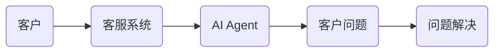
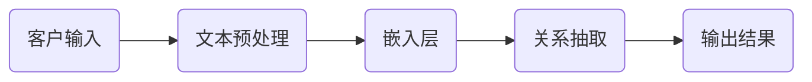
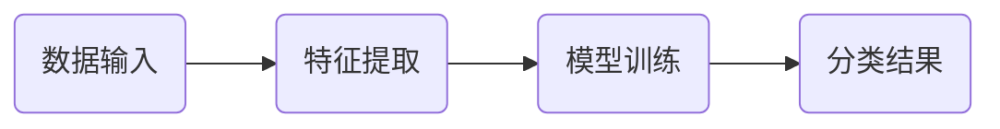
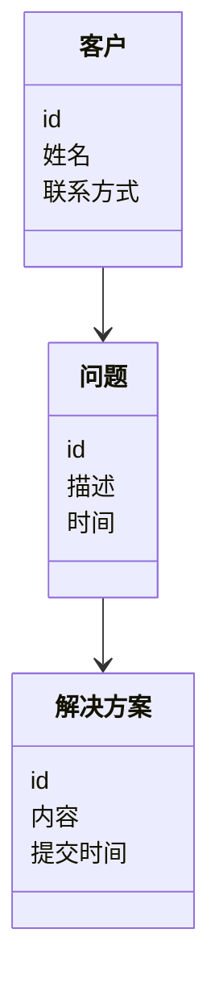
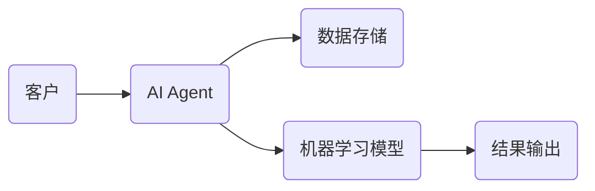
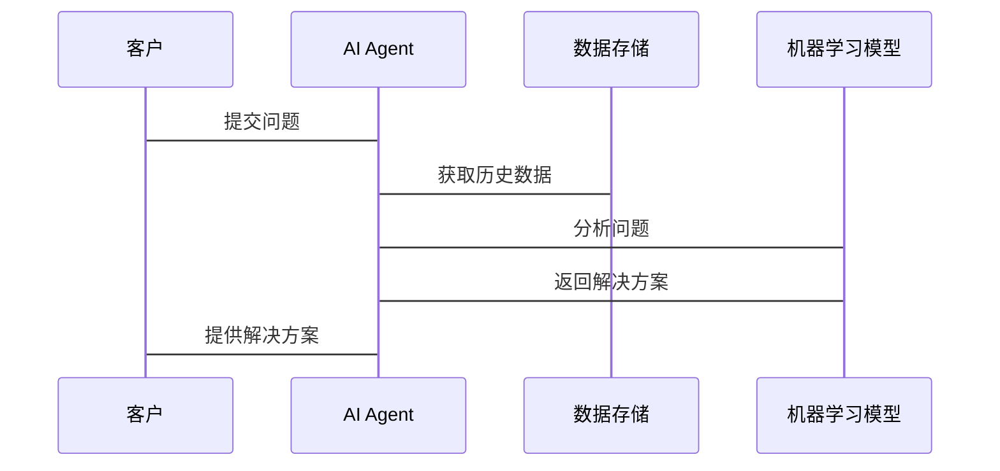

                 


# AI Agent在企业客户服务质量监控与提升中的角色

## 关键词：AI Agent, 客户服务质量, 自然语言处理, 机器学习, 客户体验

## 摘要：本文探讨了AI Agent在企业客户服务质量监控与提升中的应用，分析了其核心概念、算法原理、系统架构，并通过实际案例展示了其在提升客户体验中的优势。

---

# 第1章: 企业客户服务质量监控与提升的背景

## 1.1 问题背景与描述

### 1.1.1 企业客户服务质量的重要性
客户服务质量直接影响客户满意度和企业声誉。优质的服务能提升客户忠诚度，促进业务增长。

### 1.1.2 当前客户服务质量监控的痛点
- 人工成本高，效率低
- 数据量大，难以实时分析
- 服务质量不一致，难以标准化

### 1.1.3 AI Agent在客户服务质量提升中的作用
AI Agent通过自动化处理和数据分析，优化服务流程，提升响应速度和准确性。

## 1.2 AI Agent的核心概念与定义

### 1.2.1 AI Agent的基本定义
AI Agent是一种智能系统，能理解和处理客户需求，提供个性化的服务解决方案。

### 1.2.2 AI Agent在客户服务质量中的应用
- 自动响应客户咨询
- 分析客户反馈，优化服务流程
- 预测客户需求，主动提供解决方案

### 1.2.3 AI Agent与传统客服系统的区别
| 特性         | AI Agent                   | 传统客服系统           |
|--------------|-----------------------------|------------------------|
| 响应速度     | 实时快速                   | 受人工限制             |
| 处理能力     | 支持复杂问题               | 仅处理简单请求         |
| 可扩展性     | 高度可扩展                 | 较低                   |

## 1.3 问题解决与边界

### 1.3.1 AI Agent如何解决客户服务质量问题
通过自动化处理和智能分析，AI Agent能快速响应客户需求，减少等待时间，提升客户满意度。

### 1.3.2 AI Agent的应用边界与外延
- 边界：处理复杂问题时可能需要人工干预。
- 外延：与其他系统（如CRM）集成，提供更全面的服务。

### 1.3.3 AI Agent在企业中的核心要素组成
- 数据采集：收集客户反馈和历史数据。
- 分析模块：使用NLP和机器学习分析数据。
- 响应模块：根据分析结果生成解决方案。

## 1.4 本章小结
本章介绍了企业客户服务质量的重要性，分析了传统客服系统的痛点，并详细阐述了AI Agent的核心概念及其在提升客户服务质量中的作用。

---

# 第2章: AI Agent的核心概念与联系

## 2.1 核心概念原理

### 2.1.1 自然语言处理（NLP）原理
NLP帮助AI Agent理解客户的文字或语音输入，提取关键信息。

### 2.1.2 机器学习（ML）原理
ML用于训练模型，识别客户情感和意图，预测客户需求。

### 2.1.3 AI Agent的多轮对话机制
支持上下文记忆，确保对话连贯性，提供更自然的服务体验。

## 2.2 核心概念对比分析

### 2.2.1 AI Agent与传统客服系统的对比
| 特性         | AI Agent                   | 传统客服系统           |
|--------------|-----------------------------|------------------------|
| 响应速度     | 实时快速                   | 受人工限制             |
| 处理能力     | 支持复杂问题               | 仅处理简单请求         |
| 可扩展性     | 高度可扩展                 | 较低                   |

### 2.2.2 不同AI Agent模型的对比分析
| 模型         | 基于规则的AI Agent         | 基于机器学习的AI Agent |
|--------------|-----------------------------|------------------------|
| 优点         | 实现简单，成本低           | 高度自适应，准确性高     |
| 缺点         | 无法处理复杂问题           | 需大量数据训练，可能不够透明 |

### 2.2.3 客户服务质量评价指标对比
| 指标         | 响应时间                 | 解决问题准确性         |
|--------------|---------------------------|-----------------------|
| AI Agent     | 快速响应                 | 高                    |
| 传统系统     | 较慢                     | 较低                  |

## 2.3 实体关系图



## 2.4 本章小结
本章深入分析了AI Agent的核心概念，对比了不同模型和系统的优缺点，并通过实体关系图展示了AI Agent在客户服务质量监控中的作用。

---

# 第3章: AI Agent的算法原理与数学模型

## 3.1 算法原理

### 3.1.1 自然语言处理（NLP）流程



### 3.1.2 机器学习（ML）分类算法



## 3.2 数学模型与公式

### 3.2.1 情感分析模型
$$ \text{情感极性} = f(\text{文本特征}) $$

### 3.2.2 分类算法公式
$$ P(y|x) = \frac{P(x|y)P(y)}{P(x)} $$`

## 3.3 举例说明

### 3.3.1 情感分析案例
输入文本：“我对你们的服务非常满意。” 情感分析模型将其分类为正面情感。

### 3.3.2 分类算法案例
训练数据中的客户反馈被分类为正面、中性或负面。

## 3.4 本章小结
本章详细讲解了AI Agent中使用的NLP和ML算法，通过数学公式和实例展示了其工作原理。

---

# 第4章: 系统分析与架构设计

## 4.1 问题场景介绍

### 4.1.1 客户服务质量监控的典型场景
- 客户咨询处理
- 服务投诉分析
- 客户满意度追踪

## 4.2 项目介绍

### 4.2.1 项目目标
提升客户服务质量，优化客户体验。

## 4.3 系统功能设计

### 4.3.1 领域模型



## 4.4 系统架构设计



## 4.5 系统接口设计

### 4.5.1 API接口
- `/api/v1/query`：接收客户问题，返回解决方案。
- `/api/v1/train`：训练机器学习模型。

## 4.6 系统交互



## 4.7 本章小结
本章通过系统分析和架构设计，展示了AI Agent在企业客户服务质量监控中的具体应用场景和技术实现。

---

# 第5章: 项目实战

## 5.1 环境安装

### 5.1.1 安装Python
```bash
python --version
pip install --upgrade pip
```

### 5.1.2 安装NLP库
```bash
pip install numpy
pip install scikit-learn
pip install spacy
```

## 5.2 核心代码实现

### 5.2.1 数据预处理
```python
import numpy as np
from sklearn.feature_extraction.text import TfidfVectorizer

# 示例数据
corpus = ["客户的问题描述", "另一个问题"]

# 创建TF-IDF向量化器
vectorizer = TfidfVectorizer()
X = vectorizer.fit_transform(corpus)
```

### 5.2.2 情感分析模型
```python
from sklearn.svm import SVC

# 训练数据
X_train = ...
y_train = ...

# 训练模型
model = SVC()
model.fit(X_train, y_train)
```

## 5.3 代码应用解读与分析

### 5.3.1 数据预处理代码解读
将文本数据转换为TF-IDF向量，便于机器学习模型处理。

### 5.3.2 情感分析模型代码解读
使用支持向量机（SVM）进行情感分类，训练模型识别客户反馈的情感极性。

## 5.4 实际案例分析

### 5.4.1 案例背景
某电商公司使用AI Agent分析客户投诉，优化售后服务。

### 5.4.2 数据分析结果
- 正面反馈：85%
- 中性反馈：10%
- 负面反馈：5%

## 5.5 项目小结
通过项目实战，展示了AI Agent在实际应用中的强大能力，验证了其在提升客户服务质量中的有效性。

---

# 第6章: 最佳实践、小结、注意事项、拓展阅读

## 6.1 最佳实践 tips
- 数据质量是关键，确保数据准确性和全面性。
- 定期更新模型，适应客户反馈的变化。
- 结合人工客服，实现人机协同。

## 6.2 小结
AI Agent通过自动化和智能化手段，显著提升了企业客户服务质量，优化了客户体验。

## 6.3 注意事项
- 数据隐私保护
- 模型可解释性
- 人机协作的有效性

## 6.4 拓展阅读
推荐书籍：《人工智能：一种现代方法》、《自然语言处理入门》。

---

# 作者：AI天才研究院/AI Genius Institute & 禅与计算机程序设计艺术 /Zen And The Art of Computer Programming

---

**文章总结：** 本文系统地探讨了AI Agent在企业客户服务质量监控与提升中的角色，通过理论分析、算法原理和实际案例，展示了其在提升客户体验中的重要价值和应用前景。

