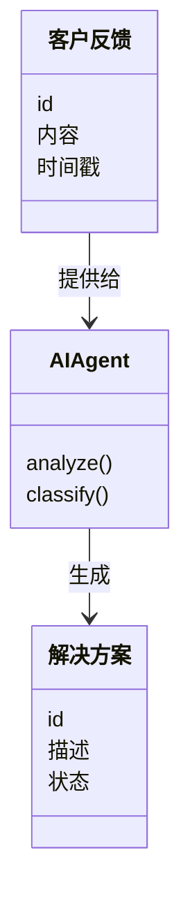
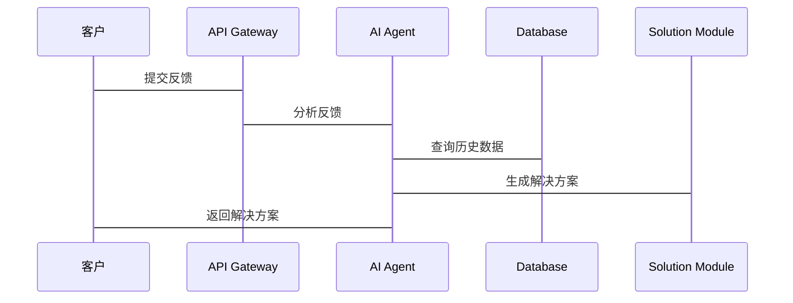

                 


# AI Agent在企业客户服务质量监控与智能升级中的角色

> 关键词：AI Agent, 客户服务质量, 智能升级, 自然语言处理, 机器学习, 客服系统优化, 智能监控系统

> 摘要：本文深入探讨AI Agent在企业客户服务质量监控与智能升级中的角色，分析其如何通过自然语言处理和机器学习技术提升客户服务质量。文章从背景介绍、核心概念、算法原理、系统架构设计、项目实战到最佳实践，全面解析AI Agent的应用场景和实现方法，为企业智能化转型提供理论支持和实践指导。

---

## 第1章: 背景介绍

### 1.1 问题背景

#### 1.1.1 客户服务质量的重要性
在现代商业环境中，客户服务质量直接关系到企业的声誉和客户满意度。高质量的服务能够增强客户忠诚度，促进客户重复购买，从而为企业创造长期价值。然而，随着市场竞争的加剧，客户对服务的要求不断提高，传统的服务质量监控方法已难以满足需求。

#### 1.1.2 传统客户服务质量监控的局限性
传统的客户服务质量监控主要依赖人工记录和分析，存在以下问题：
- 数据采集效率低，难以实时监控。
- 分析结果依赖人工经验，主观性强，缺乏客观性。
- 对大量客户反馈数据的处理能力有限，难以快速响应客户问题。

#### 1.1.3 AI Agent的引入及其优势
AI Agent（人工智能代理）是一种能够感知环境、自主决策并执行任务的智能体。引入AI Agent可以显著提升客户服务质量监控的效率和准确性，具体优势包括：
- 实时监控：能够实时分析客户反馈，快速识别问题。
- 智能分类：通过自然语言处理技术自动分类客户投诉和反馈。
- 预测分析：利用机器学习模型预测客户满意度，提前采取措施。

### 1.2 问题描述

#### 1.2.1 客户服务质量监控的核心问题
客户服务质量监控的核心问题包括：
- 如何高效、准确地收集和分析客户反馈数据。
- 如何快速识别和解决客户问题。
- 如何预测客户满意度并优化服务流程。

#### 1.2.2 AI Agent在客户服务质量监控中的应用场景
AI Agent在客户服务质量监控中的应用场景包括：
- 实时监控客户反馈，自动分类和优先级排序。
- 分析客户情绪，识别潜在投诉。
- 自动生成解决方案，提高客户满意度。

#### 1.2.3 AI Agent与传统客服系统的对比
| 特性 | 传统客服系统 | AI Agent |
|------|---------------|-----------|
| 数据处理能力 | 依赖人工，处理速度慢 | 实时处理，速度快 |
| 决策方式 | 依赖人工经验 | 自主学习，数据驱动 |
| 可扩展性 | 有限 | 高，可处理海量数据 |

### 1.3 问题解决

#### 1.3.1 AI Agent在客户服务质量监控中的解决方案
AI Agent通过以下方式解决客户服务质量监控问题：
- 自然语言处理技术用于分析客户反馈文本。
- 机器学习模型用于预测客户满意度。
- 智能分类算法用于自动分配问题给相关部门。

#### 1.3.2 AI Agent如何实现智能升级
AI Agent通过以下步骤实现智能升级：
1. 数据采集：实时采集客户反馈数据。
2. 数据分析：利用自然语言处理技术分析数据。
3. 智能决策：基于分析结果生成解决方案。
4. 反馈优化：根据执行结果优化后续服务。

#### 1.3.3 AI Agent的核心功能与价值
AI Agent的核心功能包括：
- 自然语言理解：理解客户反馈内容。
- 情感分析：识别客户情绪。
- 自动分类：将客户反馈分类到相应处理渠道。
- 预测分析：预测客户满意度和潜在问题。

### 1.4 边界与外延

#### 1.4.1 AI Agent在客户服务质量监控中的边界
AI Agent在客户服务质量监控中的边界包括：
- 数据范围：仅处理客户反馈数据，不涉及其他业务数据。
- 功能范围：专注于监控和优化，不参与实际服务执行。

#### 1.4.2 AI Agent与其他技术的协同作用
AI Agent需要与以下技术协同作用：
- 自然语言处理：用于文本分析。
- 机器学习：用于预测和分类。
- 数据库：用于存储和管理客户数据。

#### 1.4.3 AI Agent的核心要素组成
AI Agent的核心要素包括：
- 数据源：客户反馈数据。
- 分析模块：自然语言处理和机器学习模型。
- 决策模块：智能分类和预测系统。
- 执行模块：解决方案生成和反馈优化。

---

## 第2章: 核心概念与联系

### 2.1 核心概念原理

#### 2.1.1 AI Agent的核心概念
AI Agent是一个能够感知环境、自主决策并执行任务的智能体。在客户服务质量监控中，AI Agent通过分析客户反馈数据，识别问题并生成解决方案。

#### 2.1.2 核心概念属性对比
| 属性 | 描述 |
|------|------|
| 感知能力 | 能够理解客户反馈内容 |
| 决策能力 | 能够根据数据生成解决方案 |
| 学习能力 | 能够通过反馈优化模型 |

### 2.2 概念结构与核心要素

#### 2.2.1 ER实体关系图
```mermaid
er
  %%{init: 'width 800'}
  title 客户服务质量监控系统ER图

  client
  feedback
  agent

  client --|> feedback: 提供反馈
  feedback --|> agent: 分配给AI Agent
  agent --|> solution: 生成解决方案
```

#### 2.2.2 核心要素关系
客户 -> 提供反馈 -> 反馈数据 -> AI Agent -> 生成解决方案 -> 提升服务质量。

---

## 第3章: 算法原理讲解

### 3.1 算法原理

#### 3.1.1 自然语言处理
自然语言处理（NLP）用于分析客户反馈文本，提取关键词和情感倾向。例如，使用BERT模型进行情感分析。

#### 3.1.2 机器学习
机器学习用于训练分类模型，将客户反馈分类到不同类别（如投诉、建议）。例如，使用支持向量机（SVM）进行分类。

#### 3.1.3 深度学习
深度学习用于训练更复杂的模型，如LSTM，用于处理长文本数据。

### 3.2 算法实现

#### 3.2.1 情感分析算法
使用Python实现情感分析：
```python
import transformers

model_name = "bert-base-uncased"
tokenizer = transformers.BertTokenizer.from_pretrained(model_name)
model = transformers.BertForSequenceClassification.from_pretrained(model_name)
```

#### 3.2.2 分类算法
使用SVM进行分类：
```python
from sklearn import svm

# 假设X为特征向量，y为标签
model = svm.SVC()
model.fit(X, y)
```

#### 3.2.3 数学模型
情感分析的损失函数：
$$ \text{Loss} = -\sum_{i=1}^{n} y_i \log(p_i) + (1 - y_i) \log(1 - p_i) $$
其中，$p_i$是模型预测的概率。

---

## 第4章: 系统分析与架构设计方案

### 4.1 问题场景介绍

#### 4.1.1 客户反馈监控系统
系统需要实时监控客户反馈，识别潜在问题，并生成解决方案。

### 4.2 系统功能设计

#### 4.2.1 领域模型


### 4.3 系统架构设计

#### 4.3.1 系统架构图


### 4.4 系统接口设计

#### 4.4.1 API接口
- 输入接口：客户反馈数据。
- 输出接口：分类结果和解决方案。

#### 4.4.2 交互序列图


---

## 第5章: 项目实战

### 5.1 环境安装

#### 5.1.1 安装Python和相关库
```bash
pip install transformers sklearn
```

### 5.2 系统核心实现源代码

#### 5.2.1 情感分析代码
```python
import transformers

tokenizer = transformers.BertTokenizer.from_pretrained('bert-base-uncased')
model = transformers.BertForSequenceClassification.from_pretrained('bert-base-uncased')
```

#### 5.2.2 分类代码
```python
from sklearn import svm

X = [...]  # 特征向量
y = [...]  # 标签
model = svm.SVC()
model.fit(X, y)
```

### 5.3 代码解读与分析

#### 5.3.1 情感分析解读
模型通过BERT提取文本特征，然后分类器预测情感倾向。

#### 5.3.2 分类解读
SVM模型通过训练数据学习分类边界，将新数据分类到相应类别。

### 5.4 实际案例分析

#### 5.4.1 案例介绍
假设一家电商公司，客户反馈数据包括商品评价和投诉信息。

#### 5.4.2 分析过程
1. 数据预处理：清洗和分词。
2. 情感分析：识别负面评价。
3. 分类：将负面评价分类到不同类别（如物流问题、产品质量问题）。
4. 解决方案：自动生成解决方案，如联系物流部门处理投诉。

### 5.5 项目小结

#### 5.5.1 项目总结
通过AI Agent实现客户反馈监控，显著提高了问题识别和解决效率。

#### 5.5.2 经验总结
- 数据质量对模型性能影响重大。
- 模型需要定期更新以适应反馈数据的变化。

---

## 第6章: 最佳实践、小结、注意事项、拓展阅读

### 6.1 最佳实践 tips
- 数据预处理是关键，确保数据质量和一致性。
- 模型需要定期训练和优化。
- 保持系统可扩展性，方便后续功能扩展。

### 6.2 小结
本文详细介绍了AI Agent在企业客户服务质量监控与智能升级中的角色，从背景介绍到项目实战，全面解析了其应用场景和实现方法。

### 6.3 注意事项
- 注意数据隐私和合规性。
- 确保模型可解释性，方便问题排查。
- 定期监控系统性能，防止故障发生。

### 6.4 拓展阅读
- 推荐阅读《深度学习实战》和《自然语言处理入门》。

---

# 作者：AI天才研究院/AI Genius Institute & 禅与计算机程序设计艺术 /Zen And The Art of Computer Programming

---

本文通过详细分析AI Agent在客户服务质量监控中的应用，展示了其在提升企业服务质量中的巨大潜力。从理论到实践，全面解析了如何利用人工智能技术优化客户服务流程，为企业智能化转型提供了有力支持。

