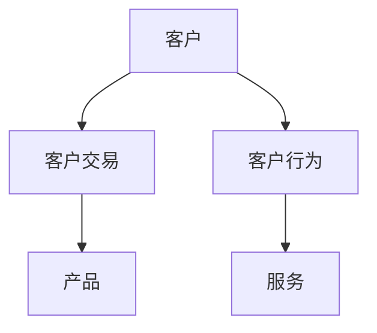
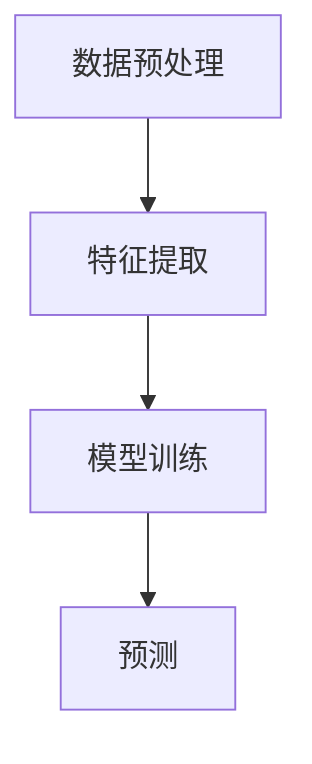
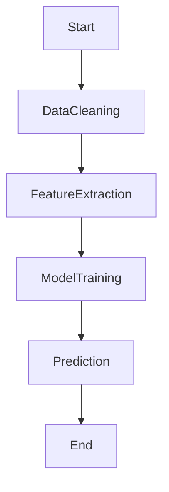
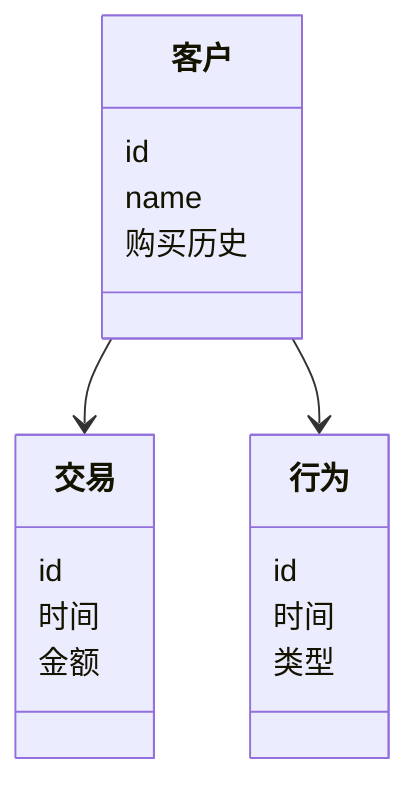
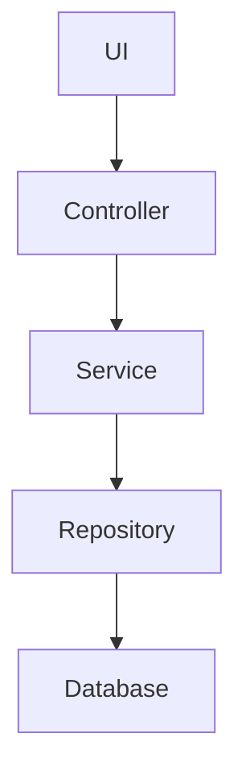

                 


# AI Agent在企业客户流失预警与干预中的应用

**关键词**：AI Agent, 客户流失预警, 机器学习, 数据挖掘, 系统架构设计

**摘要**：本文探讨AI Agent在企业客户流失预警与干预中的应用，从背景、原理到系统设计和项目实战，全面分析解决方案。通过算法和系统架构的详细讲解，结合实际案例，展示如何利用AI技术提升客户留存率。

---

## 第1章 企业客户流失预警与干预的背景介绍

### 1.1 问题背景

#### 1.1.1 企业客户流失的定义与影响
客户流失指的是客户不再与企业进行交易，影响企业收入和声誉。企业需及时预警并干预，以降低流失率。

#### 1.1.2 客户流失对企业经营的影响
客户流失可能导致收入下降、品牌受损，同时获取新客户的成本高于保留老客户。因此，预警和干预至关重要。

#### 1.1.3 传统客户流失预警方法的局限性
传统方法依赖人工分析，存在滞后性和低效性，难以捕捉复杂客户行为模式。

### 1.2 问题描述

#### 1.2.1 客户流失的多维度分析
客户流失受多种因素影响，如产品满意度、服务质量、价格敏感性等，需多维度分析。

#### 1.2.2 数据驱动的客户行为分析
通过数据分析客户行为，识别流失风险，实现精准预测。

#### 1.2.3 企业客户流失预警的复杂性
数据异构性、实时性要求高、预测模型准确性等挑战增加预警难度。

### 1.3 问题解决方法

#### 1.3.1 数据挖掘与机器学习在客户流失预警中的应用
利用数据挖掘提取特征，构建预测模型，识别高风险客户。

#### 1.3.2 AI Agent在客户流失干预中的角色
AI Agent实时监控客户行为，触发干预措施，如个性化推荐和优惠券发放，提升客户满意度和留存率。

#### 1.3.3 综合解决方案的设计思路
整合数据挖掘、机器学习和AI Agent技术，构建实时预警和干预系统，实现智能化客户管理。

### 1.4 边界与外延

#### 1.4.1 客户流失预警的适用范围
适用于B2C和B2B企业，尤其是依赖客户忠诚度的行业，如零售和金融。

#### 1.4.2 相关概念的界定与区分
明确客户流失与客户 churn 的区别，区分客户满意度与客户忠诚度。

#### 1.4.3 解决方案的边界条件
系统仅处理客户流失预警，不涉及产品设计和市场策略。

### 1.5 概念结构与核心要素

#### 1.5.1 核心概念的层次结构
客户流失预警系统由数据采集、特征提取、模型训练、实时监控和干预措施构成。

#### 1.5.2 核心要素的详细描述
- 数据源：客户交易记录、行为日志、反馈调查。
- 特征提取：行为频率、购买间隔、投诉次数等。
- 模型训练：使用逻辑回归、随机森林等算法。
- 实时监控：基于特征的实时评分。
- 干预措施：个性化优惠、定制推荐。

---

## 第2章 AI Agent的核心概念与联系

### 2.1 AI Agent的基本原理

#### 2.1.1 AI Agent的定义与特征
AI Agent是智能体，具备感知环境、自主决策和执行任务能力，能与用户交互。

#### 2.1.2 AI Agent的分类与应用场景
- 分类：基于任务型、学习型等。
- 应用：客户支持、个性化推荐。

#### 2.1.3 AI Agent与传统算法的区别
AI Agent具备自主性和适应性，能动态调整策略。

### 2.2 核心概念的属性特征对比

| 概念       | 定义                               | 属性特征                 |
|------------|------------------------------------|--------------------------|
| AI Agent   | 智能代理，执行任务               | 自主性、学习性、适应性   |
| 机器学习   | 数据驱动模型学习                 | 数据依赖性、可解释性     |

### 2.3 ER实体关系图架构



---

## 第3章 AI Agent在客户流失预警中的算法原理

### 3.1 算法原理概述

#### 3.1.1 算法的选择与优化
选择适合的机器学习算法，如逻辑回归，进行优化和调参。

#### 3.1.2 算法流程图



#### 3.1.3 算法的数学模型与公式
逻辑回归模型：
$$ P(y=1|x) = \frac{1}{1 + e^{-\beta x}} $$

### 3.2 机器学习模型的实现

#### 3.2.1 数据预处理与特征提取
处理缺失值、标准化数据，提取如购买频率等特征。

#### 3.2.2 模型训练与调优
使用逻辑回归，调整参数如学习率和正则化强度。

#### 3.2.3 模型评估与优化
评估准确率和召回率，使用交叉验证优化模型。

### 3.3 算法流程图



---

## 第4章 系统分析与架构设计

### 4.1 问题场景介绍

#### 4.1.1 系统目标
实时预警客户流失，提供干预策略。

### 4.2 系统功能设计

#### 4.2.1 领域模型



### 4.3 系统架构设计

#### 4.3.1 系统架构图



---

## 第5章 项目实战

### 5.1 环境安装

```bash
pip install scikit-learn
```

### 5.2 核心实现

#### 5.2.1 数据预处理

```python
import pandas as pd
data = pd.read_csv('customer_data.csv')
data.dropna(inplace=True)
```

#### 5.2.2 特征提取

```python
from sklearn.preprocessing import StandardScaler
features = data[['purchase_frequency', 'avg_order_value']]
scaler = StandardScaler()
features_scaled = scaler.fit_transform(features)
```

#### 5.2.3 模型训练

```python
from sklearn.linear_model import LogisticRegression
model = LogisticRegression()
model.fit(features_scaled, labels)
```

### 5.3 实际案例分析
分析某客户群体，预测流失概率，制定干预措施。

---

## 第6章 总结与展望

### 6.1 最佳实践 tips
- 数据质量和实时性影响预测精度。
- 模型需持续优化和更新。
- 干预措施应个性化和多样化。

### 6.2 小结
AI Agent在客户流失预警中的应用提升企业客户留存率，通过实时监控和干预，降低流失风险。

### 6.3 注意事项
确保数据隐私和合规性，避免过度干预影响客户体验。

### 6.4 拓展阅读
推荐书籍和文章，深入学习机器学习和AI Agent技术。

---

**作者：AI天才研究院**

