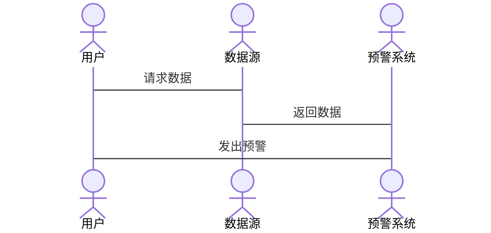

                 


# AI Agent在企业客户流失预警与精准干预中的应用

> 关键词：AI Agent, 客户流失预警, 精准干预, 机器学习, 强化学习, 实时干预系统

> 摘要：本文详细探讨了AI Agent在企业客户流失预警与精准干预中的应用。首先，从客户流失的定义、影响及其分类入手，介绍了AI Agent的基本概念与核心属性。接着，深入分析了基于机器学习的客户流失预测算法和强化学习的实时干预机制。随后，详细讲解了系统架构设计，包括数据采集、特征工程、模型训练与实时干预模块。最后，通过实际案例展示了AI Agent在客户流失预警系统中的实现，并提出了最佳实践建议。

---

# 第一部分: AI Agent与客户流失预警概述

## 第1章: 客户流失问题背景与AI Agent概述

### 1.1 客户流失的定义与影响

客户流失是指企业客户因各种原因停止与企业进行交易的行为。客户流失率是衡量企业客户关系管理（CRM）效率的重要指标，通常以流失客户数占总客户数的比例来衡量。

#### 1.1.1 客户流失的定义
客户流失可以发生在多个场景中，包括：
- **主动流失**：客户主动选择不再与企业合作。
- **被动流失**：客户因企业服务问题或市场变化而被动流失。

客户流失对企业的影响包括：
- **收入下降**：流失客户直接导致收入减少。
- **成本增加**：获取新客户的成本通常高于保留现有客户的成本。
- **品牌声誉受损**：频繁的客户流失可能影响企业的品牌形象。

#### 1.1.2 客户流失对企业的影响
客户流失不仅影响企业的财务表现，还可能导致核心客户的流失，进而影响企业的长期发展。研究表明，客户流失率与企业的市场占有率呈负相关关系。

#### 1.1.3 客户流失的分类与特征
客户流失可以分为以下几类：
- **短期流失**：客户短期内不再进行交易，但可能重新回来。
- **长期流失**：客户永久性地停止与企业合作。

客户流失的特征包括：
- **交易频率下降**：客户购买频率降低。
- **客户满意度下降**：客户对产品或服务的满意度下降。
- **市场竞争加剧**：竞争对手的吸引导致客户流失。

### 1.2 AI Agent的核心概念

AI Agent（人工智能代理）是一种能够感知环境、自主决策并执行任务的智能体。AI Agent在客户流失预警中的应用主要体现在实时数据处理、预测模型构建和干预策略执行等方面。

#### 1.2.1 AI Agent的定义
AI Agent是一种智能系统，能够通过感知环境信息，利用算法和模型进行决策，并通过执行动作来实现目标。AI Agent的核心特征包括：
- **自主性**：能够自主决策。
- **反应性**：能够实时感知环境变化。
- **学习能力**：能够通过数据和经验不断优化性能。

#### 1.2.2 AI Agent的基本属性
AI Agent的基本属性包括：
- **感知能力**：能够从数据中提取有用信息。
- **决策能力**：能够基于数据做出预测和决策。
- **执行能力**：能够根据决策执行相应的操作。

#### 1.2.3 AI Agent与传统算法的区别
AI Agent的核心优势在于其自主性和实时性。与传统算法相比，AI Agent能够根据实时数据动态调整策略，而传统算法通常需要离线训练和固定规则。

---

## 第2章: AI Agent在客户流失预警中的核心原理

### 2.1 基于机器学习的客户流失预测

客户流失预测是通过分析客户的特征和行为数据，利用机器学习算法构建预测模型，从而识别潜在流失客户的过程。

#### 2.1.1 逻辑回归模型
逻辑回归是一种常用的分类算法，适用于二分类问题。其核心公式为：
$$ P(y=1) = \frac{1}{1 + e^{-\beta x}} $$
其中，$x$ 表示输入特征，$\beta$ 表示模型参数。

#### 2.1.2 随机森林模型
随机森林是一种基于树的集成算法，适用于高维数据的分类和回归问题。其核心思想是通过构建多个决策树并进行投票或平均，提高模型的准确性和鲁棒性。

#### 2.1.3 模型选择与评估指标
模型选择的关键在于评估指标的选择。常用的评估指标包括：
- **准确率**：模型正确预测的比例。
- **召回率**：模型正确识别正类的比例。
- **F1分数**：准确率和召回率的调和平均数。

### 2.2 AI Agent的实时干预机制

实时干预系统是基于AI Agent的实时数据处理和快速决策能力，通过实时数据流进行预测，并根据预测结果执行相应的干预操作。

#### 2.2.1 实时数据采集与处理
实时数据采集是AI Agent的核心能力之一。通过实时采集客户行为数据，AI Agent能够快速响应客户的变化。

#### 2.2.2 基于强化学习的干预策略
强化学习是一种通过试错机制优化决策策略的方法。在客户流失预警中，强化学习可以用于动态调整干预策略，以最小化客户流失率。

#### 2.2.3 干预效果的评估与优化
干预效果的评估主要基于客户行为数据的变化，包括客户留存率、客户满意度等指标。优化干预策略的核心在于动态调整干预强度和干预方式。

### 2.3 算法原理的数学模型与公式

#### 2.3.1 逻辑回归模型公式
$$ P(y=1) = \frac{1}{1 + e^{-\beta x}} $$

#### 2.3.2 随机森林算法概述
随机森林算法通过构建多个决策树，并对结果进行投票或平均，从而提高模型的准确性和鲁棒性。

#### 2.3.3 强化学习的基本公式
强化学习的核心公式为：
$$ Q(s, a) = r + \gamma \max_{a'} Q(s', a') $$
其中，$s$ 表示当前状态，$a$ 表示动作，$r$ 表示奖励，$\gamma$ 表示折扣因子。

### 2.4 本章小结

---

## 第3章: 客户流失预警系统架构设计

### 3.1 系统功能模块划分

客户流失预警系统主要包括以下功能模块：
- **数据采集模块**：负责采集客户行为数据。
- **数据预处理模块**：对数据进行清洗和特征提取。
- **模型训练模块**：基于机器学习算法构建预测模型。
- **实时预警模块**：基于实时数据流进行预测并发出预警。

### 3.2 系统架构设计

客户流失预警系统的架构设计通常采用分层架构，包括数据层、服务层和应用层。

#### 3.2.1 分层架构设计
分层架构设计包括：
- **数据层**：负责数据存储和管理。
- **服务层**：负责数据处理和模型训练。
- **应用层**：负责用户交互和预警展示。

#### 3.2.2 微服务架构设计
微服务架构设计包括：
- **数据采集服务**：负责实时数据采集。
- **数据处理服务**：负责数据清洗和特征提取。
- **模型服务**：负责模型训练和预测。
- **预警服务**：负责实时预警和干预。

### 3.3 系统接口设计

系统接口设计包括：
- **数据接口**：用于数据采集和传输。
- **模型接口**：用于模型训练和预测。
- **用户接口**：用于用户交互和预警展示。

### 3.4 系统交互流程图



### 3.5 本章小结

---

## 第4章: 基于AI Agent的客户流失预警系统实现

### 4.1 项目环境搭建

#### 4.1.1 Python环境安装
需要安装以下Python库：
- `pandas`：数据处理库。
- `scikit-learn`：机器学习库。
- `flask`：Web框架。

#### 4.1.2 依赖库安装
安装命令如下：
```bash
pip install pandas scikit-learn flask
```

#### 4.1.3 数据集准备
数据集通常包括客户的基本信息、交易记录和行为数据。

### 4.2 系统核心实现

#### 4.2.1 数据预处理代码
```python
import pandas as pd

data = pd.read_csv('customer_data.csv')
data.dropna(inplace=True)
data[' churn'] = data['churn'].astype(int)
```

#### 4.2.2 模型训练代码
```python
from sklearn.ensemble import RandomForestClassifier

model = RandomForest

