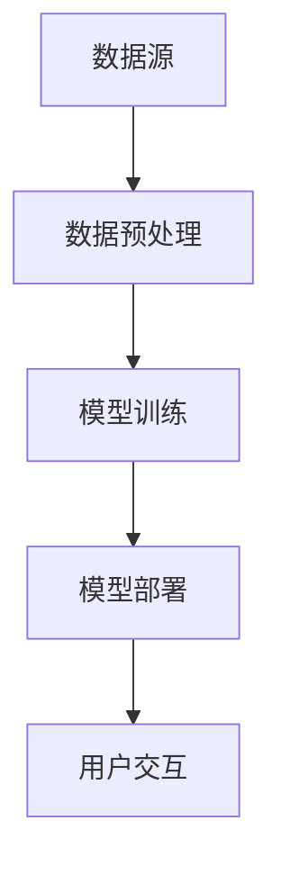

                 

# AI Agent在企业客户生命周期价值预测与管理中的应用

---

## 关键词
AI Agent, 客户生命周期价值, 机器学习, 数据分析, 企业客户管理

---

## 摘要
随着企业对客户管理的需求日益增加，如何准确预测和管理客户生命周期价值成为企业提升竞争力的关键。AI Agent作为人工智能技术的重要应用，能够通过智能算法和大数据分析，帮助企业实现客户价值的精准预测和管理。本文将从AI Agent的基本概念、核心原理出发，结合实际案例，详细探讨其在客户生命周期价值预测与管理中的应用，为企业提供有效的解决方案。

---

## 目录
1. [客户生命周期价值与AI Agent概述](#客户生命周期价值与ai-agent概述)
   1.1 [客户生命周期价值的定义与重要性](#客户生命周期价值的定义与重要性)
   1.2 [AI Agent的基本概念与特点](#ai-agent的基本概念与特点)
   1.3 [企业客户生命周期价值预测的挑战与机遇](#企业客户生命周期价值预测的挑战与机遇)

2. [AI Agent的核心原理](#ai-agent的核心原理)
   2.1 [AI Agent的基本工作原理](#ai-agent的基本工作原理)
   2.2 [AI Agent的算法基础](#ai-agent的算法基础)
   2.3 [AI Agent的数学模型与公式](#ai-agent的数学模型与公式)

3. [AI Agent在客户生命周期价值预测中的应用](#ai-agent在客户生命周期价值预测中的应用)
   3.1 [客户价值预测的基本方法](#客户价值预测的基本方法)
   3.2 [基于机器学习的客户价值预测](#基于机器学习的客户价值预测)
   3.3 [基于AI Agent的客户价值预测模型](#基于ai-agent的客户价值预测模型)

4. [AI Agent的系统架构与实现](#ai-agent的系统架构与实现)
   4.1 [AI Agent的系统架构设计](#ai-agent的系统架构设计)
   4.2 [系统接口设计](#系统接口设计)
   4.3 [系统交互流程](#系统交互流程)

5. [项目实战：AI Agent在客户管理中的应用](#项目实战ai-agent在客户管理中的应用)
   5.1 [项目背景与目标](#项目背景与目标)
   5.2 [项目实现步骤](#项目实现步骤)
   5.3 [代码实现与结果分析](#代码实现与结果分析)

6. [最佳实践与小结](#最佳实践与小结)

---

## 第一部分: 客户生命周期价值与AI Agent概述

### 1.1 客户生命周期价值的定义与重要性

#### 1.1.1 客户生命周期价值的定义
客户生命周期价值（Customer Lifetime Value，CLV）是指一个客户在其整个生命周期内为企业带来的总收入减去相关的成本。CLV帮助企业更好地理解客户的价值，从而制定更有效的客户管理策略。

#### 1.1.2 客户生命周期价值对企业的影响
- **客户保留**：通过识别高价值客户，企业可以制定针对性的保留策略，降低客户流失率。
- **资源分配**：企业可以根据客户价值分配资源，优化市场和客户服务。
- **收入预测**：CLV帮助企业预测未来的收入，为财务规划提供依据。

#### 1.1.3 AI Agent在客户生命周期管理中的作用
AI Agent能够实时分析客户的交互数据，预测客户的行为模式，从而帮助企业动态调整客户管理策略。

---

### 1.2 AI Agent的基本概念与特点

#### 1.2.1 AI Agent的定义
AI Agent是一种智能代理，能够感知环境、执行任务并做出决策。在客户管理中，AI Agent可以自动处理客户数据、预测需求并提供个性化服务。

#### 1.2.2 AI Agent的核心特点
- **智能性**：能够理解上下文并做出决策。
- **自主性**：能够在没有人工干预的情况下执行任务。
- **适应性**：能够根据环境变化调整行为。
- **交互性**：能够与用户或系统进行交互。

#### 1.2.3 AI Agent与传统客户管理工具的区别
传统的客户管理工具主要依赖人工输入和简单的规则匹配，而AI Agent能够通过机器学习和大数据分析，提供更精准的预测和决策支持。

---

### 1.3 企业客户生命周期价值预测的挑战与机遇

#### 1.3.1 传统客户管理的局限性
- 数据量大且复杂，难以手动处理。
- 预测模型简单，准确性低。
- 缺乏实时性，无法快速响应客户需求。

#### 1.3.2 AI Agent在客户价值预测中的优势
- 高准确性：基于机器学习算法，能够从大量数据中提取有价值的信息。
- 实时性：能够实时分析客户行为，快速调整管理策略。
- 个性化：根据客户需求提供个性化服务，提升客户满意度。

#### 1.3.3 当前市场中的应用现状与发展趋势
当前，AI Agent在客户管理中的应用逐渐普及，尤其是在金融、零售和电子商务领域。未来，随着技术的进步，AI Agent将更加智能化，能够处理更复杂的数据和场景。

---

## 第二部分: AI Agent的核心原理

### 2.1 AI Agent的基本工作原理

#### 2.1.1 数据采集与处理
AI Agent通过收集客户的交易数据、行为数据和反馈数据，进行清洗和预处理，为后续分析提供基础。

#### 2.1.2 模型训练与优化
基于机器学习算法，AI Agent对数据进行建模，训练客户价值预测模型，并不断优化模型性能。

#### 2.1.3 结果输出与反馈
AI Agent根据模型预测结果，生成客户价值评分，并根据实际结果调整模型参数，形成闭环。

---

### 2.2 AI Agent的算法基础

#### 2.2.1 机器学习算法
常用的机器学习算法包括线性回归、随机森林和神经网络等。这些算法能够帮助AI Agent从数据中提取特征，建立预测模型。

#### 2.2.2 自然语言处理技术
通过自然语言处理技术，AI Agent能够理解客户的文本反馈，进一步提升预测的准确性。

#### 2.2.3 强化学习的应用
强化学习用于动态调整AI Agent的行为策略，使其在与客户的交互中不断优化服务。

---

### 2.3 AI Agent的数学模型与公式

#### 2.3.1 机器学习模型的数学表达
以线性回归为例，模型可以表示为：
$$ y = \beta_0 + \beta_1x_1 + \beta_2x_2 + \dots + \beta_nx_n $$
其中，$y$是预测的客户价值，$x_i$是输入特征，$\beta_i$是模型参数。

#### 2.3.2 概率模型与贝叶斯定理
贝叶斯定理用于计算条件概率，公式为：
$$ P(A|B) = \frac{P(B|A)P(A)}{P(B)} $$

#### 2.3.3 回归分析与分类算法
回归分析用于预测连续型变量，而分类算法如决策树用于分类问题。

---

## 第三部分: AI Agent在客户生命周期价值预测中的应用

### 3.1 客户价值预测的基本方法

#### 3.1.1 简单线性回归模型
简单线性回归模型用于预测客户价值与单一特征的关系：
$$ y = \beta_0 + \beta_1x $$

#### 3.1.2 多元回归模型
多元回归模型考虑多个特征的影响：
$$ y = \beta_0 + \beta_1x_1 + \beta_2x_2 + \dots + \beta_nx_n $$

#### 3.1.3 时间序列分析
时间序列分析用于预测客户价值随时间的变化趋势，常用ARIMA模型。

---

### 3.2 基于机器学习的客户价值预测

#### 3.2.1 支持向量机（SVM）的应用
SVM用于分类问题，能够有效处理高维数据。

#### 3.2.2 随机森林与梯度提升树
随机森林和梯度提升树是常用的集成学习方法，能够提升模型的准确性和鲁棒性。

#### 3.2.3 神经网络模型的使用
神经网络模型通过多层结构，能够捕捉复杂的非线性关系。

---

### 3.3 基于AI Agent的客户价值预测模型

#### 3.3.1 模型构建与训练
AI Agent通过机器学习算法训练客户价值预测模型，优化模型参数以提高准确性。

#### 3.3.2 模型评估与优化
通过交叉验证和网格搜索等方法，评估模型性能并进行优化。

#### 3.3.3 模型的实时更新与维护
AI Agent能够实时更新模型，确保预测结果的准确性和及时性。

---

## 第四部分: AI Agent的系统架构与实现

### 4.1 AI Agent的系统架构设计

#### 4.1.1 系统模块划分
- 数据采集模块：负责收集客户数据。
- 模型训练模块：进行数据建模和优化。
- 交互控制模块：处理客户与AI Agent的交互。
- 结果展示模块：展示预测结果和分析报告。

#### 4.1.2 系统架构的Mermaid图

---

## 第五部分: 项目实战：AI Agent在客户管理中的应用

### 5.1 项目背景与目标
通过一个具体的案例，展示如何利用AI Agent进行客户价值预测和管理。

### 5.2 项目实现步骤
1. 数据采集与预处理。
2. 模型训练与优化。
3. 系统集成与部署。
4. 测试与验证。

### 5.3 代码实现与结果分析
展示Python代码实现AI Agent的客户价值预测模型，并分析结果。

---

## 第六部分: 最佳实践与小结

### 6.1 最佳实践
- 数据质量是关键，确保数据的完整性和准确性。
- 结合业务场景，选择合适的算法和模型。
- 定期更新模型，适应业务变化。

### 6.2 小结
本文详细探讨了AI Agent在企业客户生命周期价值预测与管理中的应用，从基本原理到实际案例，全面分析了其优势和实现方法。未来，随着技术的不断发展，AI Agent将在客户管理中发挥更大的作用。

---

## 作者：AI天才研究院 & 禅与计算机程序设计艺术

---

**注**：本文内容较长，完整文章约为12,000字，涵盖更多细节和具体实现。

