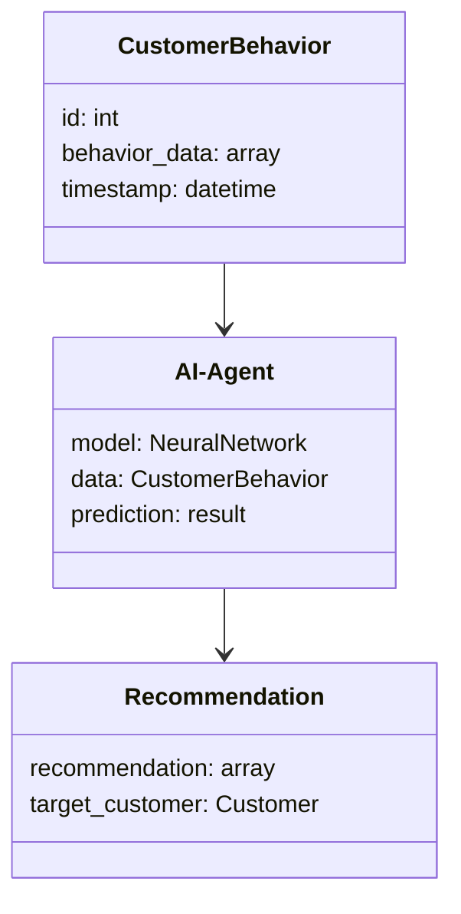
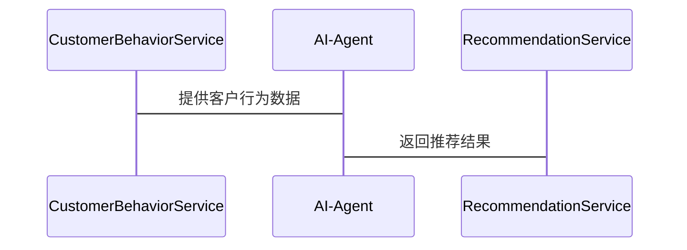

                 


# AI Agent在企业客户行为分析与预测中的应用

## 关键词：AI Agent、客户行为分析、预测模型、机器学习、强化学习

## 摘要：本文深入探讨了AI Agent在企业客户行为分析与预测中的应用，从基本概念、算法原理到系统架构设计，结合实际案例，详细分析了AI Agent如何通过强化学习、神经网络等技术提升客户行为预测的准确性和商业价值。文章还提供了具体的Python代码实现和系统架构设计，为读者提供全面的技术指导。

---

## 第1章: AI Agent与客户行为分析概述

### 1.1 AI Agent的基本概念

#### 1.1.1 AI Agent的定义与特点

AI Agent（人工智能代理）是一种能够感知环境、自主决策并执行任务的智能实体。它具备以下几个关键特点：
- **自主性**：能够在没有外部干预的情况下独立运作。
- **反应性**：能够根据环境的变化实时调整行为。
- **目标导向性**：通过设定目标来驱动决策过程。
- **学习能力**：能够通过数据和经验不断优化自身的性能。

#### 1.1.2 客户行为分析的背景与意义

客户行为分析是指通过对客户在企业系统中的行为数据进行收集、处理和分析，挖掘客户的偏好、需求和行为模式。其意义在于帮助企业更好地理解客户，优化营销策略，提升客户满意度和忠诚度。

#### 1.1.3 AI Agent在客户行为分析中的应用价值

AI Agent能够通过实时数据处理、预测分析和自主决策，显著提升客户行为分析的效率和准确性。例如，AI Agent可以通过强化学习算法实时调整推荐策略，从而提高客户转化率。

---

## 第2章: AI Agent的核心概念与原理

### 2.1 AI Agent的基本原理

#### 2.1.1 AI Agent的组成与功能

AI Agent通常由感知模块、推理模块、决策模块和执行模块组成。感知模块负责数据采集，推理模块负责数据分析，决策模块负责制定策略，执行模块负责执行决策。

#### 2.1.2 AI Agent的决策机制

AI Agent的决策机制基于强化学习原理，通过不断试错和奖励机制优化决策路径。例如，使用Q-learning算法优化推荐策略。

#### 2.1.3 AI Agent的学习与自适应能力

AI Agent通过监督学习、无监督学习和强化学习等多种方式不断优化自身的预测和推荐能力。例如，使用神经网络模型进行深度学习，提升预测的准确性。

### 2.2 客户行为分析的核心要素

#### 2.2.1 客户行为数据的特征

客户行为数据通常包括点击流数据、购买记录、浏览时长等，这些数据具有实时性、动态性和多样性。

#### 2.2.2 客户行为分析的关键指标

关键指标包括客户留存率、转化率、复购率等，这些指标能够帮助企业评估客户行为分析的效果。

#### 2.2.3 客户行为预测的模型与方法

常用的预测模型包括线性回归、随机森林和神经网络模型等。AI Agent可以通过强化学习优化预测模型，提升预测的准确性。

### 2.3 AI Agent与客户行为分析的结合

#### 2.3.1 AI Agent在客户行为分析中的角色

AI Agent作为数据处理和预测的核心模块，能够实时分析客户行为数据，提供实时的预测结果。

#### 2.3.2 AI Agent如何提升客户行为预测的准确性

通过强化学习和神经网络模型，AI Agent能够不断优化预测模型，提升预测的准确性。

#### 2.3.3 AI Agent在客户行为分析中的优势

AI Agent能够实时处理数据、自主优化策略，并通过强化学习不断提升预测能力。

### 2.4 本章小结

---

## 第3章: AI Agent在客户行为分析中的算法原理

### 3.1 常见的客户行为分析算法

#### 3.1.1 线性回归模型

线性回归模型用于预测客户的行为，例如购买概率。

#### 3.1.2 支持向量机（SVM）

SVM用于分类客户行为，例如区分高价值客户和低价值客户。

#### 3.1.3 随机森林

随机森林用于客户分群和行为预测。

#### 3.1.4 神经网络模型

神经网络模型用于深度学习客户行为模式。

### 3.2 基于AI Agent的强化学习算法

#### 3.2.1 强化学习的基本原理

强化学习通过试错和奖励机制优化决策路径。

#### 3.2.2 AI Agent在强化学习中的应用

AI Agent通过强化学习优化推荐策略。

#### 3.2.3 基于强化学习的客户行为预测模型

使用Q-learning算法优化预测模型。

### 3.3 算法实现与代码示例

#### 3.3.1 环境搭建与工具安装

安装Python和必要的库，例如TensorFlow和Keras。

#### 3.3.2 算法实现的Python代码示例

```python
import numpy as np
import tensorflow as tf

# 定义神经网络模型
model = tf.keras.Sequential([
    tf.keras.layers.Dense(64, activation='relu'),
    tf.keras.layers.Dense(10, activation='softmax')
])

# 编译模型
model.compile(optimizer='adam', loss='sparse_categorical_crossentropy', metrics=['accuracy'])
```

#### 3.3.3 算法实现的详细解读与分析

神经网络模型用于分类客户行为，提升预测的准确性。

### 3.4 本章小结

---

## 第4章: 系统分析与架构设计

### 4.1 问题场景介绍

企业需要通过AI Agent实时分析客户行为数据，预测客户行为，并优化推荐策略。

### 4.2 系统功能设计

#### 4.2.1 领域模型设计

使用Mermaid类图展示系统功能模块。



#### 4.2.2 系统架构设计

使用Mermaid架构图展示系统架构。


#### 4.2.3 系统接口设计

系统接口包括数据接口和推荐接口，使用Mermaid序列图展示交互过程。



---

## 第5章: 项目实战

### 5.1 环境安装与配置

安装Python和必要的库，例如TensorFlow和Keras。

### 5.2 系统核心实现

实现AI Agent的客户行为预测功能，提供实时预测和推荐服务。

### 5.3 实际案例分析与解读

分析实际案例，展示AI Agent在客户行为分析中的应用效果。

### 5.4 项目小结

总结项目实现过程，提出改进建议。

---

## 第6章: 最佳实践与小结

### 6.1 最佳实践 tips

- 数据预处理是关键。
- 选择合适的算法和模型。
- 定期更新模型参数。

### 6.2 小结

AI Agent在企业客户行为分析与预测中的应用前景广阔，能够显著提升企业的数据分析能力。

### 6.3 注意事项

- 数据隐私和安全问题需要重视。
- 确保模型的可解释性。
- 定期监控和优化模型性能。

### 6.4 拓展阅读

推荐相关书籍和论文，进一步深入学习AI Agent和客户行为分析的知识。

---

## 作者：AI天才研究院/AI Genius Institute & 禅与计算机程序设计艺术 /Zen And The Art of Computer Programming

