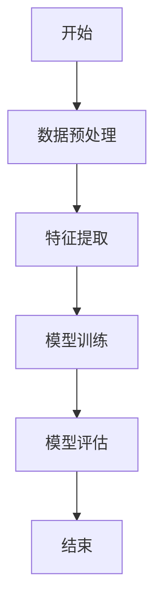
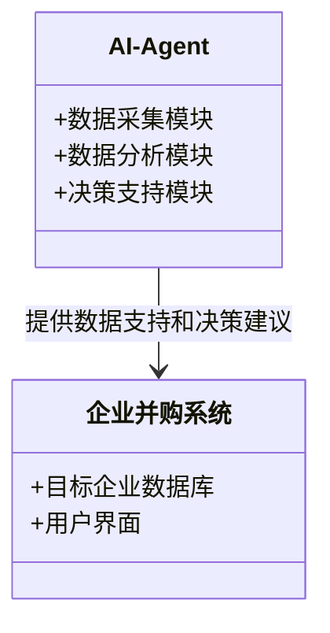

                 


# AI Agent在企业并购分析与尽职调查中的作用

## 关键词：AI Agent，企业并购，尽职调查，数据分析，风险管理

## 摘要：  
在企业并购过程中，AI Agent（人工智能代理）通过自动化数据处理、风险评估和决策支持，显著提高了分析效率和准确性。本文将详细探讨AI Agent在企业并购分析与尽职调查中的应用，涵盖其核心概念、算法原理、系统架构以及实际案例，帮助读者理解并掌握这一前沿技术。

---

## 目录大纲

### 第一章：引言
- 1.1 AI Agent的定义与作用
- 1.2 企业并购的基本概念
- 1.3 AI Agent在企业并购中的应用价值

### 第二章：AI Agent与企业并购的核心概念
- 2.1 AI Agent的核心概念
- 2.2 企业并购的主要流程
- 2.3 AI Agent在并购中的应用场景

### 第三章：AI Agent在企业并购中的算法原理
- 3.1 机器学习算法在AI Agent中的应用
- 3.2 自然语言处理在AI Agent中的应用
- 3.3 算法流程图与代码实现

### 第四章：系统架构与设计
- 4.1 系统功能模块设计
- 4.2 系统架构图与交互流程
- 4.3 系统接口设计

### 第五章：项目实战与案例分析
- 5.1 项目背景与目标
- 5.2 核心代码实现
- 5.3 实际案例分析

### 第六章：结论与展望
- 6.1 全文总结
- 6.2 未来发展趋势
- 6.3 作者寄语

---

## 正文

### 第一章：引言

#### 1.1 AI Agent的定义与作用
AI Agent（人工智能代理）是指能够感知环境、执行任务并做出决策的智能体。它通过数据驱动的方法，帮助用户完成复杂任务，提升效率。AI Agent在企业并购中的作用主要体现在数据处理、风险评估和决策支持等方面。

#### 1.2 企业并购的基本概念
企业并购是指一家企业通过购买或合并另一家企业，以实现战略目标的过程。并购的核心在于评估目标企业的价值、风险和潜在收益。

#### 1.3 AI Agent在企业并购中的应用价值
AI Agent通过自动化数据处理和分析，能够快速生成并购决策所需的关键信息，显著提高并购效率和准确性。

---

### 第二章：AI Agent与企业并购的核心概念

#### 2.1 AI Agent的核心概念
- **定义**：AI Agent是能够感知环境、执行任务的智能体。
- **特点**：数据驱动、自动化、智能化。

#### 2.2 企业并购的主要流程
- **目标筛选**：根据行业、财务状况等筛选潜在并购目标。
- **尽职调查**：对目标企业进行详细调查，评估其价值和风险。
- **估值与谈判**：确定目标企业价值，进行谈判和交易。

#### 2.3 AI Agent在并购中的应用场景
- **数据处理**：自动收集和整理目标企业数据。
- **风险评估**：通过数据分析识别潜在风险。
- **决策支持**：提供数据驱动的决策建议。

---

### 第三章：AI Agent在企业并购中的算法原理

#### 3.1 机器学习算法在AI Agent中的应用
- **监督学习**：用于分类和回归任务，如预测企业价值。
- **无监督学习**：用于聚类和异常检测，识别潜在风险。

#### 3.2 自然语言处理在AI Agent中的应用
- **文本分类**：分析企业文档，识别关键信息。
- **实体识别**：提取企业名称、金额等实体信息。
- **情感分析**：评估市场对目标企业的看法。

#### 3.3 算法流程图与代码实现


```python
# 示例代码：文本分类
from sklearn.feature_extraction.text import TfidfVectorizer
from sklearn.svm import SVC

# 数据预处理
text = "This is a sample text."
vectorizer = TfidfVectorizer()
X = vectorizer.fit_transform([text])

# 模型训练
model = SVC()
model.fit(X, [1])

# 模型预测
new_text = "Another sample text."
X_new = vectorizer.transform([new_text])
print(model.predict(X_new))
```

---

### 第四章：系统架构与设计

#### 4.1 系统功能模块设计
- **数据采集模块**：收集目标企业数据。
- **数据分析模块**：处理和分析数据。
- **决策支持模块**：提供并购建议。

#### 4.2 系统架构图与交互流程


#### 4.3 系统接口设计
- **输入接口**：接收目标企业数据。
- **输出接口**：提供分析结果和决策建议。

---

### 第五章：项目实战与案例分析

#### 5.1 项目背景与目标
- **项目背景**：某企业计划并购一家科技公司。
- **项目目标**：利用AI Agent分析目标企业，评估其价值和风险。

#### 5.2 核心代码实现
```python
import pandas as pd
from sklearn.ensemble import RandomForestClassifier

# 数据加载
data = pd.read_csv("target_company.csv")

# 特征提取
X = data.drop(columns=["label"])
y = data["label"]

# 模型训练
model = RandomForestClassifier()
model.fit(X, y)

# 模型预测
new_data = pd.DataFrame({"feature1": [1], "feature2": [2]})
print(model.predict(new_data))
```

#### 5.3 实际案例分析
通过实际案例分析，验证AI Agent在企业并购中的有效性，展示其在数据处理、风险评估和决策支持中的具体应用。

---

### 第六章：结论与展望

#### 6.1 全文总结
AI Agent通过自动化数据处理和分析，显著提升了企业并购的效率和准确性。

#### 6.2 未来发展趋势
未来，AI Agent将在企业并购中发挥越来越重要的作用，尤其是在复杂数据分析和实时决策支持方面。

#### 6.3 作者寄语
感谢读者的耐心阅读，希望本文能为您提供有价值的信息和启发。

---

## 作者：AI天才研究院 & 禅与计算机程序设计艺术

