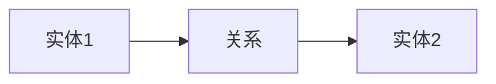
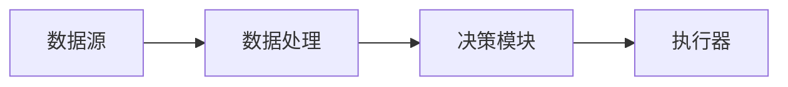

                 


# AI Agent在企业数字化转型中的战略定位与实施路径

> 关键词：AI Agent, 企业数字化转型, 智能体系统, 强化学习, 知识图谱, 系统架构

> 摘要：AI Agent作为人工智能技术的核心应用之一，在企业数字化转型中扮演着越来越重要的角色。本文将深入探讨AI Agent在企业数字化转型中的战略定位，分析其实施路径，并通过具体案例和代码实现，帮助读者理解如何在企业中有效应用AI Agent，推动数字化转型的进程。

---

## 第一部分：AI Agent与企业数字化转型概述

### 第1章：AI Agent的基本概念

#### 1.1 AI Agent的定义与特点

AI Agent（智能体）是一种能够感知环境、自主决策并执行任务的智能系统。其特点包括：

- **自主性**：能够在没有外部干预的情况下自主运行。
- **反应性**：能够实时感知环境并做出反应。
- **目标导向**：基于预设目标或学习目标进行决策。
- **可扩展性**：能够适应不同规模和复杂度的任务。

#### 1.2 企业数字化转型的背景与趋势

数字化转型是指企业利用数字技术改变业务模式、流程、文化，以实现业务创新和竞争优势。AI Agent作为数字化转型的核心技术之一，能够帮助企业实现智能化、自动化和数据驱动的决策。

#### 1.3 AI Agent在企业数字化转型中的作用

- **提升效率**：通过自动化处理重复性任务，提高企业运营效率。
- **数据驱动决策**：利用AI Agent分析海量数据，提供精准的决策支持。
- **增强客户体验**：通过智能化服务提升客户满意度和忠诚度。

---

### 第2章：AI Agent的核心概念与联系

#### 2.1 AI Agent的核心概念

- **多智能体系统（MAS）**：由多个智能体协同工作的系统，适用于复杂任务。
- **单智能体系统（SAS）**：独立完成任务的单一智能体，适用于简单任务。
- **混合智能体系统**：结合MAS和SAS的特点，适用于复杂场景。

#### 2.2 AI Agent的核心要素

- **感知能力**：通过传感器或数据输入感知环境。
- **决策机制**：基于感知信息做出决策。
- **执行能力**：通过执行器或接口完成任务。

#### 2.3 AI Agent与相关概念的联系

- **大数据**：AI Agent依赖于数据进行决策，大数据为其提供了丰富的数据源。
- **云计算**：云计算为AI Agent提供了强大的计算能力和弹性扩展能力。
- **物联网（IoT）**：AI Agent与物联网设备结合，实现智能化的物理世界与数字世界的连接。

---

## 第二部分：AI Agent的算法原理与实现

### 第3章：AI Agent的算法原理

#### 3.1 强化学习（Reinforcement Learning）

强化学习是一种通过试错机制优化决策的算法。AI Agent通过与环境互动，学习最优策略。

- **马尔可夫决策过程（MDP）**：描述智能体在环境中的决策过程。
- **Q-Learning算法**：通过更新Q值表来优化决策策略。

**数学公式：**

状态值函数：
$$ V(s) = \max_{a} Q(s, a) $$

Q-Learning更新公式：
$$ Q(s, a) = r + \gamma \max_{a'} Q(s', a') $$

#### 3.2 知识图谱（Knowledge Graph）

知识图谱是结构化数据的表示方法，AI Agent可以通过知识图谱进行推理和决策。

- **实体与关系**：知识图谱由实体（节点）和关系（边）组成。
- **推理机制**：基于知识图谱进行路径推理和属性推理。

**Mermaid图示：**



---

### 第4章：AI Agent的系统架构设计

#### 4.1 系统设计

- **问题场景**：例如，企业需要通过AI Agent优化供应链管理。
- **功能模块**：
  - 数据采集模块：采集供应链相关数据。
  - 数据处理模块：清洗和预处理数据。
  - 决策模块：基于强化学习算法优化供应链策略。

#### 4.2 系统架构

- **单层架构**：适用于简单任务。
- **多层架构**：适用于复杂任务。
- **分布式架构**：适用于大规模任务。

**Mermaid图示：**



---

## 第三部分：AI Agent的项目实战

### 第5章：AI Agent在供应链管理中的应用

#### 5.1 环境安装

- **Python**：安装Python 3.8及以上版本。
- **库依赖**：安装numpy、pandas、tensorflow、keras。

#### 5.2 核心代码实现

```python
import numpy as np
import tensorflow as tf
from tensorflow.keras import layers

# 定义强化学习模型
class AIAgent:
    def __init__(self, state_space, action_space):
        self.model = self.build_model(state_space, action_space)
    
    def build_model(self, state_space, action_space):
        model = tf.keras.Sequential([
            layers.Dense(64, activation='relu', input_dim=state_space),
            layers.Dense(64, activation='relu'),
            layers.Dense(action_space, activation='linear')
        ])
        model.compile(optimizer='adam', loss='mse')
        return model
    
    def remember(self, state, action, reward, next_state):
        # 简单实现，实际可使用经验回放
        pass
    
    def act(self, state):
        prediction = self.model.predict(np.array([state]))
        return np.argmax(prediction[0])
    
    def train(self, state, action, reward, next_state):
        target = reward + self.model.predict(np.array([next_state]))[0][action]
        self.model.fit(np.array([state]), np.array([target]), epochs=1, verbose=0)
```

#### 5.3 案例分析与实现

- **案例背景**：某企业希望优化供应链库存管理。
- **数据准备**：收集库存、需求、供应商等数据。
- **模型训练**：使用强化学习模型训练AI Agent。
- **结果分析**：评估模型性能，优化供应链策略。

---

## 第四部分：总结与展望

### 第6章：AI Agent在企业数字化转型中的最佳实践

#### 6.1 小结

- AI Agent在企业数字化转型中的作用不可忽视，能够显著提升效率和决策能力。
- 实施AI Agent需要结合企业的实际情况，选择合适的算法和架构。

#### 6.2 注意事项

- 数据质量是AI Agent性能的关键，需确保数据的准确性和完整性。
- 模型的可解释性是企业决策的重要因素，需注重模型的可解释性设计。
- 安全性和隐私保护是AI Agent应用中的重要考量，需采取适当的安全措施。

#### 6.3 拓展阅读

- 推荐阅读《Deep Learning》和《Reinforcement Learning: Theory and Algorithms》。

---

## 作者

作者：AI天才研究院（AI Genius Institute）  
地址：禅与计算机程序设计艺术（Zen And The Art of Computer Programming）

