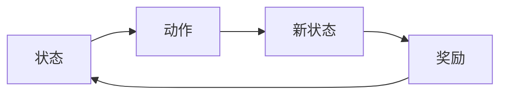
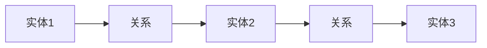
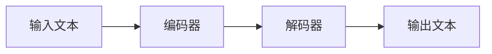

                 

# AI Agent在企业数字化转型中的角色：从战略到执行

## 关键词：企业数字化转型、AI Agent、人工智能、技术架构、业务创新

## 摘要：  
本文深入探讨AI Agent在企业数字化转型中的核心作用，从战略规划到具体执行，分析其在企业智能化转型中的价值和应用。通过理论与实践结合，揭示AI Agent如何助力企业实现业务创新、流程优化和决策优化。

---

# 第1章: AI Agent与企业数字化转型概述

## 1.1 AI Agent的基本概念

### 1.1.1 AI Agent的定义与特征
AI Agent（人工智能代理）是指能够感知环境、自主决策并执行任务的智能系统。其主要特征包括：
- **自主性**：无需人工干预，自主完成任务。
- **反应性**：实时感知环境并做出响应。
- **学习能力**：通过数据和经验不断优化性能。
- **适应性**：能够适应复杂多变的环境。

### 1.1.2 AI Agent的核心功能与能力
AI Agent的核心功能包括：
- **感知**：通过传感器、数据源等获取环境信息。
- **决策**：基于感知信息，利用算法做出最优决策。
- **执行**：通过执行器或系统接口完成具体任务。

### 1.1.3 AI Agent与传统IT系统的主要区别
传统IT系统通常基于规则和流程执行任务，而AI Agent能够：
- **自适应**：根据环境变化动态调整行为。
- **学习优化**：通过机器学习算法不断优化性能。
- **智能决策**：基于上下文信息做出复杂决策。

## 1.2 企业数字化转型的背景与挑战

### 1.2.1 数字化转型的定义与目标
数字化转型是指通过信息技术的深度应用，重构企业业务流程、组织架构和商业模式，以实现业务创新和效率提升。其目标包括：
- 提升业务灵活性和响应速度。
- 优化资源配置，降低成本。
- 提供更智能、更个性化的客户体验。

### 1.2.2 企业数字化转型中的主要挑战
企业在数字化转型过程中面临以下挑战：
- **数据孤岛**：不同系统之间的数据难以有效整合。
- **技术复杂性**：新兴技术（如AI、大数据）的集成难度较高。
- **组织变革**：员工对新技术的接受和适应需要时间。
- **安全风险**：数据隐私和系统安全问题日益突出。

### 1.2.3 AI Agent在数字化转型中的独特价值
AI Agent能够：
- **自动化处理复杂任务**：减少人工干预，提升效率。
- **实时决策支持**：基于实时数据提供精准决策建议。
- **智能化连接**：将企业内外部资源无缝连接，形成智能生态。

## 1.3 AI Agent在企业中的应用场景

### 1.3.1 智能客服与客户关系管理
AI Agent可以通过自然语言处理技术，为客户提供智能化的客服支持，提升客户满意度和忠诚度。

### 1.3.2 业务流程自动化与优化
AI Agent能够自动化处理订单、审批等业务流程，并通过学习优化流程效率。

### 1.3.3 数据驱动的决策支持
AI Agent能够从海量数据中提取洞察，为企业决策提供数据支持。

### 1.3.4 企业知识管理与协作
AI Agent可以作为知识管理的辅助工具，帮助员工快速获取所需信息，提升协作效率。

---

# 第2章: AI Agent的核心原理与技术基础

## 2.1 AI Agent的基本原理

### 2.1.1 AI Agent的感知机制
AI Agent通过传感器、API等获取环境信息，例如：
- **文本信息**：通过NLP技术解析用户输入。
- **数据流**：从数据库或API获取实时数据。

### 2.1.2 AI Agent的决策机制
AI Agent基于感知信息，利用算法做出决策。常用的决策算法包括：
- **规则引擎**：基于预定义的规则进行决策。
- **机器学习模型**：基于训练数据预测最优决策。
- **强化学习**：通过试错优化决策策略。

### 2.1.3 AI Agent的执行机制
AI Agent通过执行器或API将决策结果转化为具体行动，例如：
- **发送邮件**：通过SMTP协议发送通知邮件。
- **更新数据库**：通过SQL语句更新数据。

## 2.2 AI Agent的关键技术

### 2.2.1 自然语言处理（NLP）
NLP技术使AI Agent能够理解并生成自然语言文本，例如：
- **文本分类**：将客户问题分类到特定主题。
- **情感分析**：分析客户反馈的情感倾向。

### 2.2.2 机器学习与深度学习
机器学习技术用于训练AI Agent的学习能力，例如：
- **监督学习**：基于标注数据训练分类模型。
- **无监督学习**：从无标签数据中发现模式。

### 2.2.3 强化学习与决策优化
强化学习用于优化AI Agent的决策策略，例如：
- **Q-Learning算法**：通过试错优化决策。
- **策略梯度方法**：直接优化策略参数。

### 2.2.4 知识图谱与推理引擎
知识图谱用于构建企业知识库，推理引擎用于基于知识图谱进行推理。

## 2.3 AI Agent的算法原理

### 2.3.1 强化学习算法（以Q-Learning为例）

Q-Learning算法的核心思想是通过试错优化Q值表（Q-Table），记录每个状态-动作对的期望奖励。

### 2.3.2 图神经网络在知识图谱中的应用

图神经网络能够处理复杂的实体关系，用于知识图谱的构建与推理。

### 2.3.3 深度学习在自然语言处理中的应用

深度学习模型（如Transformer）能够处理长文本序列，用于NLP任务。

---

# 第3章: AI Agent在企业数字化转型中的战略规划

## 3.1 数字化转型的战略框架

### 3.1.1 数字化转型的阶段划分
数字化转型通常分为三个阶段：
1. **数字化**：实现业务流程的数字化。
2. **智能化**：引入AI技术实现智能化决策。
3. **生态化**：构建智能生态系统。

### 3.1.2 AI Agent在战略规划中的定位
AI Agent是数字化转型的核心驱动力，能够：
- **推动业务创新**：通过智能化决策提升业务价值。
- **优化运营效率**：通过自动化流程降低成本。
- **增强客户体验**：通过智能化服务提升客户满意度。

### 3.1.3 AI Agent驱动的业务模式创新
AI Agent能够推动企业从传统模式向智能服务模式转变，例如：
- **个性化服务**：基于用户行为提供个性化推荐。
- **实时响应**：通过实时数据分析提供快速响应。

## 3.2 AI Agent的战略实施路径

### 3.2.1 从战略到执行的规划方法
- **目标分解**：将战略目标分解为可执行的任务。
- **资源分配**：合理分配技术、人员和预算资源。
- **风险控制**：制定风险应对策略，降低转型风险。

### 3.2.2 AI Agent在企业战略中的角色分配
- **技术团队**：负责AI Agent的技术实现。
- **业务团队**：负责业务流程的设计与优化。
- **管理团队**：负责战略规划与资源分配。

### 3.2.3 AI Agent与企业文化的融合
- **文化转型**：推动企业从传统模式向智能模式转变。
- **员工培训**：提升员工对AI技术的接受度和使用能力。

## 3.3 案例分析: AI Agent在某行业的战略应用

### 3.3.1 行业背景与问题分析
以零售行业为例，传统零售业面临以下问题：
- **客户体验差**：无法提供个性化服务。
- **运营效率低**：人工操作效率低下。
- **数据孤岛**：各部门数据无法有效共享。

### 3.3.2 AI Agent的战略部署与实施
某零售企业引入AI Agent作为智能客服和库存管理工具，实现：
- **智能化客服**：通过NLP技术提供24小时在线客服支持。
- **库存优化**：通过机器学习算法优化库存管理。

### 3.3.3 实施效果与经验总结
- **客户满意度提升**：智能化客服提高了客户满意度。
- **运营成本降低**：自动化流程减少了人工成本。
- **数据驱动决策**：通过数据分析优化业务流程。

---

通过以上章节的详细讲解，我们全面分析了AI Agent在企业数字化转型中的角色和作用。从战略规划到技术实现，AI Agent正在成为企业数字化转型的核心驱动力，推动企业向智能化、生态化方向发展。

