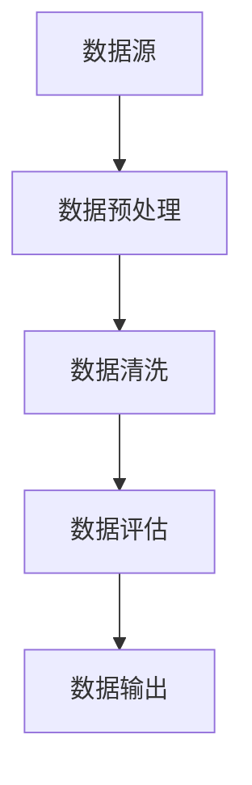
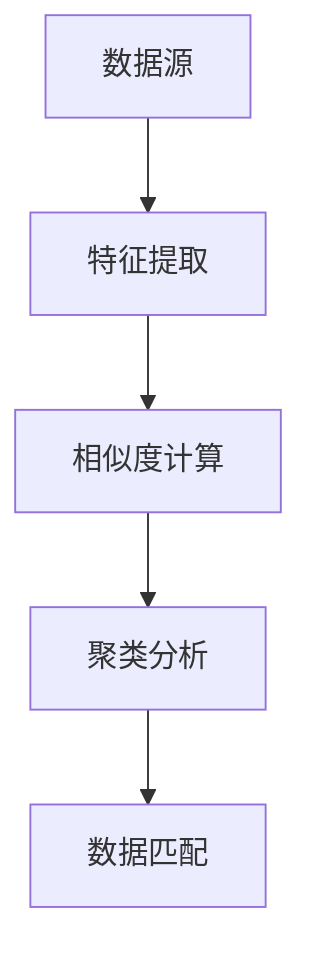
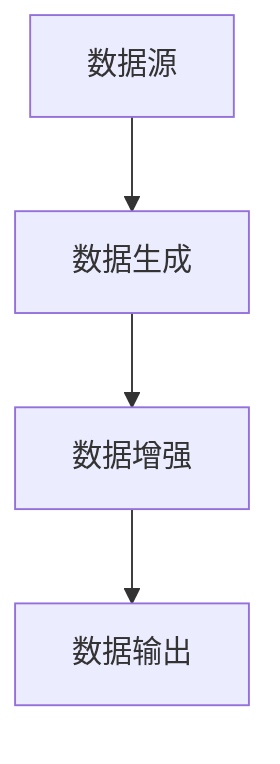
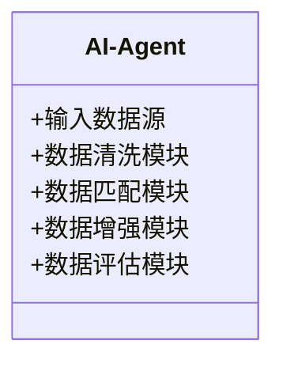
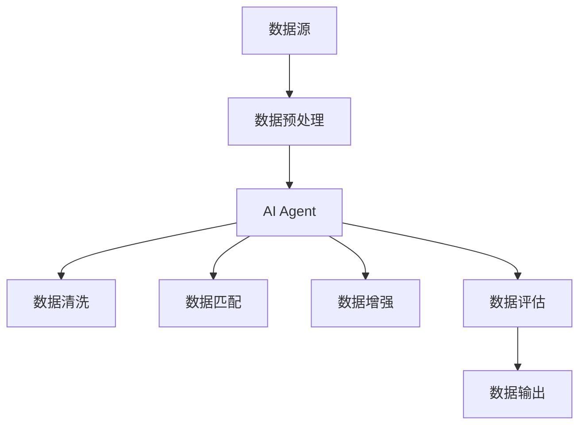

                 


# AI Agent在企业数据质量评估与自动化治理中的应用

---

## 关键词：AI Agent, 数据质量评估, 企业数据治理, 自动化治理, 数据清洗, 数据匹配, 数据增强

---

## 摘要：  
在企业数据管理中，数据质量是确保业务高效运行的关键因素。然而，传统数据治理方法往往依赖人工操作，效率低下且容易出错。AI Agent作为一种智能化工具，能够通过自动化技术解决数据质量评估与治理中的复杂问题。本文将详细探讨AI Agent的核心原理、算法实现、系统架构及实际应用，为企业提供一种高效的数据治理解决方案。

---

## 第一部分：背景介绍与核心概念

### 第1章：数据质量的定义与重要性

#### 1.1 数据质量的定义与重要性
数据质量是指数据的准确性、完整性、一致性、及时性和可追溯性。在企业中，数据是决策的基础，数据质量问题会直接影响企业的经营效率和决策能力。例如，错误的数据可能导致营销策略失误，甚至引发法律风险。

#### 1.2 数据质量评估的传统方法
传统数据治理方法依赖人工检查和规则匹配，这种方法效率低下，且容易受到人为因素的影响。随着企业数据规模的不断扩大，传统方法已无法满足高效数据治理的需求。

#### 1.3 AI Agent在数据治理中的优势
AI Agent（人工智能代理）是一种能够自主执行任务的智能系统。它可以通过机器学习算法自动识别数据中的问题，并提出解决方案。AI Agent的应用能够显著提高数据治理的效率和准确性。

---

### 第2章：AI Agent的基本概念与原理

#### 2.1 AI Agent的定义与特点
AI Agent是一种能够感知环境、自主决策并执行任务的智能系统。与传统软件不同，AI Agent具有以下特点：
- **自主性**：能够在没有人工干预的情况下完成任务。
- **反应性**：能够根据环境变化调整行为。
- **学习能力**：通过机器学习算法不断优化自身性能。

#### 2.2 AI Agent与数据治理的关系
AI Agent可以通过以下方式提升数据治理能力：
- **数据清洗**：自动识别并纠正数据中的错误。
- **数据匹配**：通过模式识别技术匹配数据中的重复项。
- **数据增强**：通过生成算法补充缺失数据。

#### 2.3 AI Agent的核心优势
- **高效性**：AI Agent可以快速处理海量数据。
- **准确性**：通过机器学习算法提高数据识别的准确性。
- **可扩展性**：能够适应企业数据规模的不断扩大。

---

## 第二部分：AI Agent的核心原理与算法实现

### 第3章：AI Agent的算法原理

#### 3.1 数据清洗算法
数据清洗是AI Agent的核心任务之一。以下是数据清洗的典型流程：



数据清洗的实现步骤如下：
1. 数据预处理：去除重复项、处理缺失值。
2. 数据清洗：通过规则匹配和机器学习算法识别错误数据。
3. 数据评估：对清洗后的数据进行质量评估。

代码示例（Python）：
```python
def data_cleaning(data):
    # 去除重复项
    data = data.drop_duplicates()
    # 处理缺失值
    data = data.dropna()
    return data
```

#### 3.2 数据匹配算法
数据匹配是AI Agent的另一个重要任务。以下是数据匹配的典型流程：



数据匹配的实现步骤如下：
1. 特征提取：提取数据中的关键特征。
2. 相似度计算：使用余弦相似度计算数据之间的相似性。
3. 聚类分析：通过聚类算法识别数据中的重复项。

代码示例（Python）：
```python
from sklearn.metrics.pairwise import cosine_similarity

def data_matching(data):
    # 特征提取
    features = data['text'].values
    # 相似度计算
    similarity_matrix = cosine_similarity(features)
    return similarity_matrix
```

#### 3.3 数据增强算法
数据增强是通过生成技术补充缺失数据的一种方法。以下是数据增强的典型流程：



数据增强的实现步骤如下：
1. 数据生成：通过生成对抗网络（GAN）生成新的数据。
2. 数据增强：对生成的数据进行清洗和验证。

代码示例（Python）：
```python
import tensorflow as tf
from tensorflow.keras import layers

def data_enhancement(data):
    # 数据生成
    generator = tf.keras.Sequential([
        layers.Dense(128, activation='relu'),
        layers.Dense(len(data.columns))
    ])
    return generator
```

---

### 第4章：AI Agent的数学模型与公式

#### 4.1 数据相似度计算公式
数据相似度计算是数据匹配的核心步骤。以下是余弦相似度的公式：

$$ \text{余弦相似度} = \frac{\sum_{i=1}^{n} x_i y_i}{\sqrt{\sum_{i=1}^{n} x_i^2} \cdot \sqrt{\sum_{i=1}^{n} y_i^2}} $$

其中，$x$ 和 $y$ 是数据的两个特征向量。

#### 4.2 数据聚类公式
数据聚类是通过将相似的数据分组来识别重复项。以下是K-means聚类的公式：

$$ \text{目标函数} = \sum_{i=1}^{k} \sum_{j=1}^{n_i} (x_j - \mu_i)^2 $$

其中，$k$ 是聚类数，$n_i$ 是第 $i$ 个聚类中的数据点数，$\mu_i$ 是第 $i$ 个聚类的中心点。

---

## 第三部分：系统分析与架构设计

### 第5章：AI Agent的系统架构

#### 5.1 系统功能设计
以下是AI Agent系统的功能模块：



#### 5.2 系统架构设计
以下是AI Agent的系统架构图：



#### 5.3 系统接口设计
以下是AI Agent的系统接口：

- 输入接口：数据源接口
- 输出接口：数据清洗接口、数据匹配接口、数据增强接口
- 数据评估接口：数据质量报告接口

---

## 第四部分：项目实战与案例分析

### 第6章：AI Agent的项目实战

#### 6.1 环境安装与配置
以下是Python环境的安装步骤：
1. 安装Python：`python --version`
2. 安装依赖库：`pip install numpy pandas scikit-learn tensorflow`

#### 6.2 系统核心代码实现

##### 数据清洗模块
```python
def data_cleaning(data):
    # 去除重复项
    data = data.drop_duplicates()
    # 处理缺失值
    data = data.dropna()
    return data
```

##### 数据匹配模块
```python
def data_matching(data):
    # 特征提取
    features = data['text'].values
    # 相似度计算
    similarity_matrix = cosine_similarity(features)
    return similarity_matrix
```

##### 数据增强模块
```python
def data_enhancement(data):
    # 数据生成
    generator = tf.keras.Sequential([
        layers.Dense(128, activation='relu'),
        layers.Dense(len(data.columns))
    ])
    return generator
```

#### 6.3 实际案例分析
以某电商企业的客户数据为例，以下是AI Agent的应用步骤：
1. 数据清洗：去除重复客户记录。
2. 数据匹配：识别重复订单。
3. 数据增强：补充缺失的客户信息。

---

## 第五部分：总结与展望

### 第7章：总结与展望

#### 7.1 小结
本文详细探讨了AI Agent在企业数据质量评估与自动化治理中的应用。通过分析AI Agent的核心原理、算法实现和系统架构，展示了其在数据清洗、数据匹配和数据增强中的优势。

#### 7.2 注意事项
在实际应用中，需要注意以下问题：
1. 数据隐私保护
2. 算法的可解释性
3. 系统的可扩展性

#### 7.3 拓展阅读
推荐以下书籍和资源：
- 《机器学习实战》
- 《深度学习》
- 《数据科学入门》

---

## 作者：AI天才研究院 & 禅与计算机程序设计艺术

