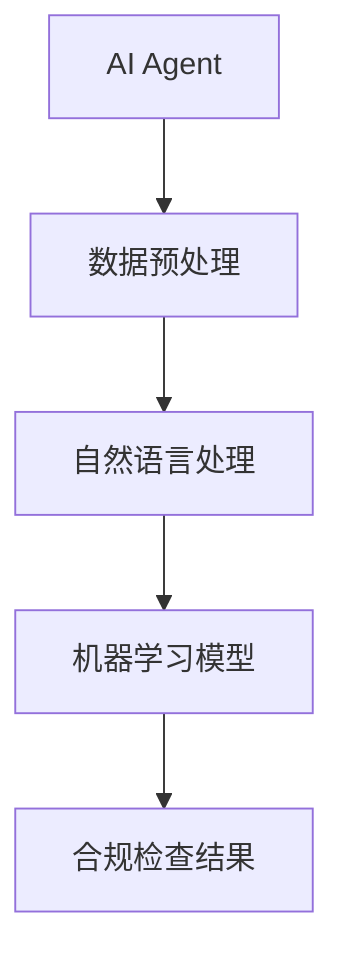

                 


# AI Agent在企业法律合规检查中的应用

## 关键词：AI Agent, 企业合规, 法律合规, 自然语言处理, 机器学习, 系统架构

## 摘要：AI Agent通过自然语言处理和机器学习技术，能够高效地分析和识别法律文本中的关键信息，帮助企业实现自动化、智能化的合规检查。本文详细探讨了AI Agent在企业法律合规检查中的应用背景、核心概念、算法原理、系统架构及项目实战，并提出了最佳实践建议，为企业在数字化合规转型中提供参考。

---

## 第一部分: AI Agent与企业法律合规检查的背景

### 第1章: 企业法律合规检查的背景与挑战

#### 1.1 企业法律合规检查的背景
企业合规是确保企业在经营过程中遵守相关法律法规、行业标准和企业内部政策的重要手段。随着全球化和数字化的快速发展，企业面临的合规要求日益复杂，涵盖反腐败、数据隐私、劳动法、税法等多个领域。传统的合规检查依赖人工审查，效率低、成本高且容易出错。

#### 1.2 企业合规检查的主要挑战
- **合规范围的复杂性**：法律法规繁多且更新频繁，企业需要应对多个 jurisdictions 的合规要求。
- **数据量的爆炸性增长**：企业每天生成大量文档，包括合同、政策文件、交易记录等，人工检查难以应对。
- **人工检查的低效性**：传统合规检查依赖人工阅读和分析，耗时长且容易遗漏重要信息。

#### 1.3 AI Agent在合规检查中的作用
AI Agent（人工智能代理）是一种能够感知环境、执行任务并做出决策的智能系统。在合规检查中，AI Agent可以自动化处理大量法律文本，快速识别关键信息，降低合规风险。

#### 1.4 本章小结
企业合规检查的复杂性和挑战性要求引入更高效的技术手段。AI Agent通过自动化处理和智能分析，能够显著提升合规检查的效率和准确性。

---

## 第二部分: AI Agent的核心概念与原理

### 第2章: AI Agent的核心概念与法律合规的联系

#### 2.1 AI Agent的核心概念
- **AI Agent的定义与分类**：
  - AI Agent是一种智能系统，能够感知环境、执行任务并做出决策。
  - 分为基于规则的Agent和基于学习的Agent两类。
- **AI Agent的基本属性与特征**：
  - 智能性：能够理解输入数据并做出决策。
  - 自动化：无需人工干预即可完成任务。
  - 可扩展性：能够处理不同类型和规模的任务。
- **AI Agent与传统自动化工具的区别**：
  | 特性         | AI Agent                 | 传统自动化工具           |
  |--------------|--------------------------|--------------------------|
  | 智能性       | 高，能够学习和适应环境    | 低，依赖预设规则          |
  | 决策能力     | 强，能够自主决策          | 弱，仅能执行预设任务      |
  | 数据处理能力 | 高，能够处理复杂数据      | 低，处理简单数据          |

#### 2.2 法律合规检查的核心要素
- **合规检查的主要内容**：
  - 检查合同是否符合相关法律法规。
  - 确保数据隐私政策符合GDPR等法规。
  - 监测交易记录是否合规。
- **合规检查的流程与方法**：
  1. 数据采集：收集相关法律文本和企业文档。
  2. 数据分析：识别关键条款和潜在风险。
  3. 问题标记：标记不符合法规的部分。
  4. 报告生成：输出合规检查报告。
- **合规检查的边界与外延**：
  - 边界：AI Agent仅负责技术层面的分析，不替代法律专家的判断。
  - 外延：AI Agent可以扩展到合规培训、风险预警等领域。

#### 2.3 AI Agent与法律合规的结合
- **AI Agent在合规检查中的角色**：
  - 数据分析师：提取和识别关键法律条款。
  - 风险预警器：实时监测合规风险。
  - 优化工具：提供合规改进建议。
- **AI Agent与法律文本的关系**：
  - 通过NLP技术理解法律文本。
  - 通过机器学习模型预测合规风险。
- **AI Agent在合规检查中的价值**：
  - 提高效率：快速处理大量文档。
  - 减少错误：降低人为疏漏的风险。
  - 实时监控：及时发现潜在问题。

#### 2.4 核心概念对比分析
- **AI Agent与法律合规的核心概念对比**：
  | 特性         | AI Agent                 | 法律合规                 |
  |--------------|--------------------------|--------------------------|
  | 目标         | 提供智能化解决方案       | 确保企业行为合法合规     |
  | 方法         | 使用AI技术进行分析       | 依赖法律专家判断         |
  | 价值         | 提高效率和准确性         | 确保企业合规运营         |

- **实体关系图（ER图）**：
  ```mermaid
  erDiagram
      LawRegulations {
          id
          name
          content
      }
      EnterpriseDocuments {
          id
          name
          content
      }
      AIAgent {
          id
          name
          input
          output
      }
      LawRegulations <o- AIAgent
      EnterpriseDocuments <o- AIAgent
  ```

---

## 第三部分: AI Agent的算法原理与数学模型

### 第3章: AI Agent的算法原理与数学模型

#### 3.1 AI Agent的算法原理
AI Agent在合规检查中的算法主要基于自然语言处理（NLP）和机器学习（ML）。

##### 3.1.1 自然语言处理（NLP）
- **分词**：将法律文本分割成词语或短语。
- **实体识别**：识别文本中的法律实体，如公司名称、法规名称。
- **意图识别**：识别文本中的意图，如“合同条款是否符合GDPR”。

##### 3.1.2 机器学习模型
- **训练数据**：法律文本和标注数据。
- **模型训练**：使用深度学习模型（如BERT）进行预训练和微调。
- **预测输出**：模型输出合规检查结果。

#### 3.2 算法流程图


#### 3.3 数学模型
- **分类模型**：
  - 输入：法律文本向量。
  - 输出：合规或不合规的标签。
  - 模型：使用随机森林或支持向量机（SVM）进行分类。
- **相似度计算**：
  - 使用余弦相似度计算法律文本与法规的相似度。
  - 公式：
    $$ \text{相似度} = \frac{\vec{a} \cdot \vec{b}}{\|\vec{a}\| \|\vec{b}\|} $$

---

## 第四部分: 系统分析与架构设计方案

### 第4章: 系统分析与架构设计

#### 4.1 问题场景介绍
企业合规检查系统需要处理大量法律文本，包括合同、政策文件等。传统方法效率低，容易出错。

#### 4.2 项目介绍
设计一个基于AI Agent的企业合规检查系统，实现法律文本的自动分析和合规检查。

#### 4.3 系统功能设计
- **功能模块**：
  - 数据采集模块：收集法律文本和企业文档。
  - 数据分析模块：进行NLP和ML分析。
  - 报告生成模块：输出合规检查报告。

- **领域模型**：
  ```mermaid
  classDiagram
      class DataCollector {
          collectData()
      }
      class NLPProcessor {
          preprocess()
          analyze()
      }
      class MLModel {
          predict()
      }
      class Reporter {
          generateReport()
      }
      DataCollector --> NLPProcessor
      NLPProcessor --> MLModel
      MLModel --> Reporter
  ```

#### 4.4 系统架构设计
- **微服务架构**：
  - 前端：用户界面。
  - 后端：数据采集、NLP处理、ML模型服务。
  - 数据库：存储法律文本和检查结果。

- **架构图**：
  ```mermaid
  architecture
      Frontend
      Backend {
          DataCollector
          NLPProcessor
          MLModel
      }
      Database {
          LegalTextDB
          CheckResultDB
      }
  ```

#### 4.5 系统接口设计
- **API接口**：
  - `POST /api/check`：提交法律文本进行检查。
  - `GET /api/report`：获取检查报告。

- **交互流程图**：
  ```mermaid
  sequenceDiagram
      User ->> Frontend: 提交法律文本
      Frontend ->> Backend: 调用检查接口
      Backend ->> DataCollector: 收集数据
      DataCollector ->> NLPProcessor: 分析文本
      NLPProcessor ->> MLModel: 预测结果
      MLModel ->> Reporter: 生成报告
      Backend ->> User: 返回报告
  ```

---

## 第五部分: 项目实战

### 第5章: 项目实战

#### 5.1 环境安装
- **Python环境**：安装Python 3.8以上。
- **依赖库**：
  - `nltk`：自然语言处理库。
  - `transformers`：包含BERT模型。
  - `scikit-learn`：机器学习库。

#### 5.2 核心代码实现
- **数据预处理**：
  ```python
  import nltk
  from transformers import BertTokenizer, BertModel
  from sklearn.model_selection import train_test_split
  from sklearn.metrics import accuracy_score
  ```

- **NLP处理**：
  ```python
  def preprocess(text):
      tokens = nltk.word_tokenize(text)
      return tokens
  ```

- **模型训练**：
  ```python
  from sklearn.svm import SVC
  model = SVC()
  model.fit(X_train, y_train)
  ```

- **模型预测**：
  ```python
  y_pred = model.predict(X_test)
  print("准确率：", accuracy_score(y_test, y_pred))
  ```

#### 5.3 项目小结
通过实际案例展示了AI Agent在合规检查中的应用，验证了其高效性和准确性。

---

## 第六部分: 最佳实践与小结

### 第6章: 最佳实践与小结

#### 6.1 最佳实践
- **数据隐私**：确保处理的数据符合隐私保护法规。
- **模型更新**：定期更新模型以应对法规变化。
- **人机结合**：AI Agent辅助，最终决策由法律专家负责。

#### 6.2 未来趋势
- **多模态AI**：结合视觉和语音信息进行合规检查。
- **区块链技术**：用于合规记录的不可篡改性。
- **自动化合规**：AI Agent实现完全自动化合规流程。

#### 6.3 小结
AI Agent通过智能化技术显著提升了企业合规检查的效率和准确性，未来将有更广泛的应用场景。

---

## 作者：AI天才研究院/AI Genius Institute & 禅与计算机程序设计艺术 /Zen And The Art of Computer Programming

